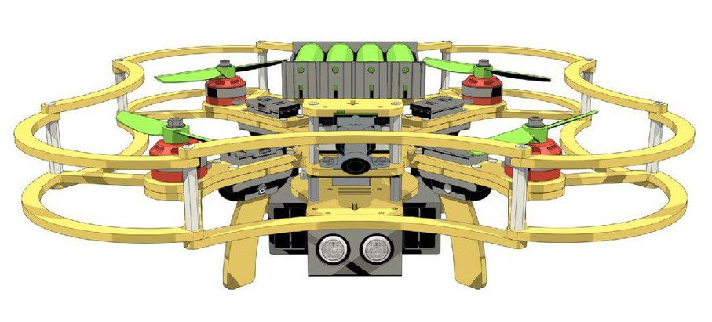

# Клевер Sense

«Клевер» — это учебный конструктор программируемого квадрокоптера, состоящего из популярных открытых компонентов, а также набор необходимой документации и библиотек для работы с ним.

Набор включает в себя полетный контроллер PixHawk с полетным стеком PX4 (APM), Raspberry Pi в качестве управлящего бортового компьютера, модуль камеры для реализации полетов с использованием компьютерного зрения, а также набор различных датчиков и другой периферии.

На базе точно такой же платформы были созданы многие "большие" проекты компании Copter Express, например, дроны для [пиар-акций по автономной доставке пиццы](https://www.youtube.com/watch?v=hmkAoZOtF58) (Самара, Казань); дрон-доставщик кофе в Сколково, мониторинговый дрон с зарядной станцией, дроны-победители на полевых испытаниях "[Робокросс-2016](https://www.youtube.com/watch?v=dGbDaz_VmYU)", "[Робокросс-2017](https://youtu.be/AQnd2CRczbQ)" и другие.

Для того, чтобы научиться программировать автономный дрон "Клевер", воспользуйтесь нижеприведенной документацией.

## Работа с полетным контроллером

* [Полетные режимы](docs/modes.md)

## Настройка микрокомпьютера Raspberry Pi

Raspberry Pi — это один из самых известных одноплатных микрокомпьютеров, использующийся в сотнях проектов по разработке и прототипированию различных автоматизированных систем. Ввиду своей распространенности, простоте настройки и большого ряда доступной периферии этот компьютер отлично подходит для исследований и обучения в области программирования автономных дронов.

* [Общая информация о Raspberry Pi](docs/raspberry.md)
* [Доступ по SSH к Raspberry Pi](docs/ssh.md)
* [Настройка Wi-Fi](docs/wifi.md)

## Сборка

* Подключение PixHawk к Raspberry Pi
* Подключение камеры к Raspberry Pi

## Программирование квадрокоптера

Для управления автономным дроном на полетном стеке PX4 используется протокол MavLink.

* [Работа с симулятором (SITL)](docs/sitl.md)
* [Настройка инструментов для программного управления PX4](docs/setup.md)
* [Полное описание протокола MAVLink](https://pixhawk.ethz.ch/mavlink/)
* [Информация о фреймворке ROS](https://github.com/CopterExpress/clever/blob/master/docs/ros.md)
* [Пакет MAVROS](docs/mavros.md)
* Использование модуля камеры
* Использование ультразвукового дальномера (сонара)
* Использование 4G-модема

## Хакатон Copter Hack 2017

* [Информация](docs/copterhack2017.md)
