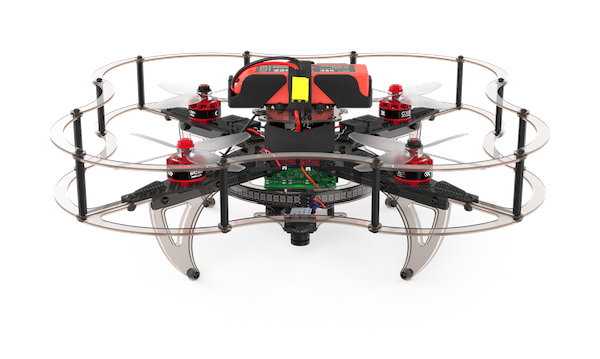

# COEX Clover Drone Kit



Clover is an educational programmable drone kit consisting of an unassembled quadcopter, open source software and documentation. The kit includes Pixracer-compatible autopilot running PX4 firmware, Raspberry Pi 4 as companion computer, a camera for computer vision navigation as well as additional sensors and peripheral devices.

The main documentation is available [on Gitbook](https://clever.coex.tech/).

Official website: <a href="https://coex.tech/clover">coex.tech/clover</a>.

## Video compilation

[](https://youtu.be/u3omgsYC4Fk)

Clover drone is used on a wide range of educational events, including [Copter Hack](https://www.youtube.com/watch?v=xgXheg3TTs4), WorldSkills Drone Operation competition, [Autonomous Vehicles Track of NTI Olympics 2016–2020](https://www.youtube.com/watch?v=E1_ehvJRKxg), Quadro Hack 2019 (National University of Science and Technology MISiS), Russian Robot Olympiad (autonomous flights), and others.

## Raspberry Pi image

Preconfigured image for Raspberry Pi with installed and configured software, ready to fly, is available [in the Releases section](https://github.com/CopterExpress/clever/releases).

[](https://travis-ci.org/CopterExpress/clever)

Image features:

* Raspbian Buster
* [ROS Melodic](http://wiki.ros.org/melodic)
* Configured networking
* OpenCV
* [`mavros`](http://wiki.ros.org/mavros)
* Periphery drivers for ROS ([GPIO](https://clever.coex.tech/en/gpio.html), [LED strip](https://clever.coex.tech/en/leds.html), etc)
* `aruco_pose` package for marker-assisted navigation
* `clover` package for autonomous drone control

API description (in Russian) for autonomous flights is available [on GitBook](https://clever.coex.tech/simple_offboard.html).

## Manual installation

Install ROS Melodic according to the [documentation](http://wiki.ros.org/melodic/Installation), then [create a Catkin workspace](http://wiki.ros.org/catkin/Tutorials/create_a_workspace).

Clone this repo to directory `~/catkin_ws/src/clover`:

```bash
cd ~/catkin_ws/src
git clone https://github.com/CopterExpress/clever.git clover
```

All the required ROS packages (including `mavros` and `opencv`) can be installed using `rosdep`:

```bash
cd ~/catkin_ws/
rosdep install -y --from-paths src --ignore-src
```

Build ROS packages (on memory constrained platforms you might be going to need to use `-j1` key):

```bash
cd ~/catkin_ws
catkin_make -j1
```

To complete `mavros` install you'll need to install `geographiclib` datasets:

```bash
curl https://raw.githubusercontent.com/mavlink/mavros/master/mavros/scripts/install_geographiclib_datasets.sh | sudo bash
```

You may optionally install udev rules to provide `/dev/px4fmu` symlink to your PX4-based flight controller connected over USB. Copy `99-px4fmu.rules` to your `/lib/udev/rules.d` folder:

```bash
cd ~/catkin_ws/src/clover/clover/config
sudo cp 99-px4fmu.rules /lib/udev/rules.d
```

Alternatively you may change the `fcu_url` property in `mavros.launch` file to point to your flight controller device.

## Running

Enable systemd service `roscore` (if not running):

```bash
sudo systemctl enable /home/<username>/catkin_ws/src/clover/builder/assets/roscore.service
sudo systemctl start roscore
```

To start connection to SITL, use:

```bash
roslaunch clover sitl.launch
```

To start connection to the flight controller, use:

```bash
roslaunch clover clvoer.launch
```

> Note that the package is configured to connect to `/dev/px4fmu` by default (see [previous section](#manual-installation)). Install udev rules or specify path to your FCU device in `mavros.launch`.

Also, you can enable and start the systemd service:

```bash
sudo systemctl enable /home/<username>/catkin_ws/src/clover/deploy/clover.service
sudo systemctl start clover
```

## License

While the Clover platform source code is available under the MIT License, note, that the [documentation](docs/) is licensed under the Creative Commons Attribution-NonCommercial-ShareAlike 4.0 International License.
