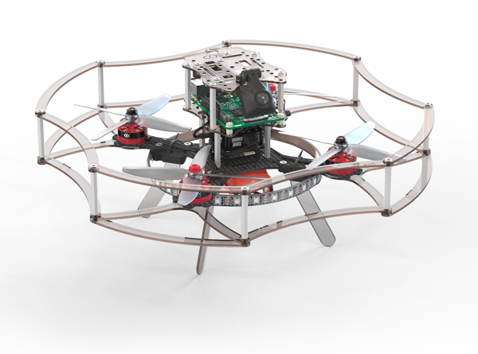

# CLEVER



CLEVER is an educational programmable drone kit consisting of an unassembled quadcopter, open source software and documentation. The kit includes Pixhawk/Pixracer autopilot running PX4 firmware, Raspberry Pi 3 as companion computer, a camera for computer vision navigation as well as additional sensors and peripheral devices.

Copter Express has implemented a large number of different autonomous drone projects using exactly the same platform: [automated pizza delivery](https://www.youtube.com/watch?v=hmkAoZOtF58) in Samara and Kazan, coffee delivery in Skolkovo Innovation Center, [autonomous quadcopter with charging station](https://www.youtube.com/watch?v=RjX6nUqw1mI) for site monitoring and security, winning drones on [Robocross-2016](https://www.youtube.com/watch?v=dGbDaz_VmYU) and [Robocross-2017](https://youtu.be/AQnd2CRczbQ) competitions and many others.

**The main documentation in Russian is available [on our Gitbook](https://clever.copterexpress.com/).**

Use it to learn how to assemble, configure, pilot and program autonomous CLEVER drone.

## Preconfigured RPi 3 image

**Preconfigured image for Raspberry Pi 3 with installed and configured software, ready to fly, is available [in the Releases section](https://github.com/CopterExpress/clever/releases).**

Image includes:

* Raspbian Stretch
* ROS Kinetic
* Configured networking
* OpenCV
* mavros
* CLEVER software bundle for autonomous drone control

API description (in Russian) for autonomous flights is available [on GitBook](https://copterexpress.gitbooks.io/clever/simple_offboard.html).

## Manual installation

Install ROS Kinetic according to the [documentation](http://wiki.ros.org/kinetic/Installation).

Clone repo to directory `/home/pi/catkin_ws/src/clever`:

```bash
cd ~/catkin_ws/src
git clone https://github.com/CopterExpress/clever.git clever
```

Build ROS packages:

```bash
cd ~/catkin_ws
catkin_make -j1
```

Enable systemd service `roscore` (if not enabled):

```bash
sudo systemctl enable /home/pi/catkin_ws/src/clever/deploy/roscore.service
sudo systemctl start roscore
```

Enable systemd service `clever`:

```bash
sudo systemctl enable /home/pi/catkin_ws/src/clever/deploy/clever.service
sudo systemctl start clever
```

### Dependencies

[ROS Kinetic](http://wiki.ros.org/kinetic).

Necessary ROS packages:

* `opencv3`
* `mavros`
* `rosbridge_suite`
* `web_video_server`
* `cv_camera`
* `nodelet`
* `dynamic_reconfigure`
* `bondcpp`, branch `master`
* `roslint`
* `rosserial`
