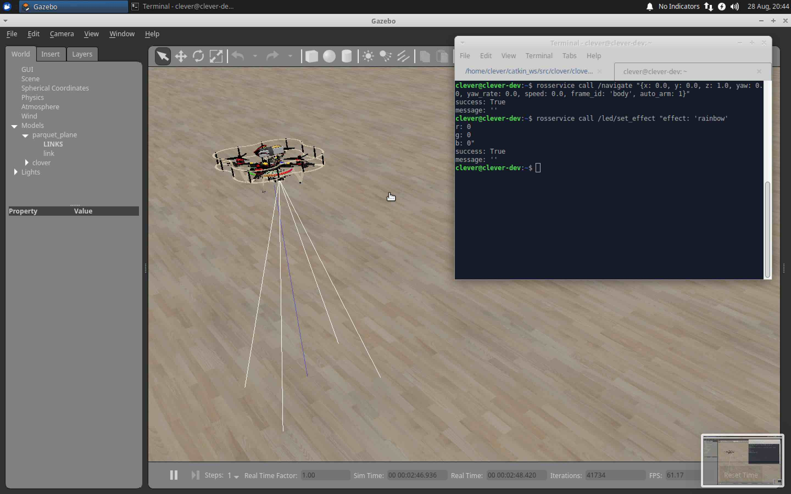

# COEX Clover Drone Kit

<table align=center>
    <tr>
        <td align=center><a href="https://px4.io"></a></td>
        <td align=center><a href="https://www.raspberrypi.org"></a></td>
        <td align=center><a href="https://www.ros.org"></a></td>
    </tr>
</table>

This repository contains documentation, software platform source code and RPi image builder for COEX Clover drone kit.


Clover is a [PX4](https://px4.io)- and [ROS](https://www.ros.org)-powered educational programmable drone kit consisting of an unassembled quadcopter, open source software and documentation. The kit includes Pixracer-compatible autopilot, Raspberry Pi 4 as companion computer, a camera for computer vision navigation as well as additional sensors and peripheral devices.

The main documentation is available at [https://clover.coex.tech](https://clover.coex.tech/). Official website: <a href="https://coex.tech/clover">coex.tech/clover</a>.

## Autonomous flights video

[](https://youtu.be/u3omgsYC4Fk)

Clover drone is used on a wide range of educational events, including [Copter Hack](https://www.youtube.com/watch?v=xgXheg3TTs4), WorldSkills Drone Operation competition, [Autonomous Vehicles Track of NTI Olympics 2016–2020](https://www.youtube.com/watch?v=E1_ehvJRKxg), Quadro Hack 2019 (National University of Science and Technology MISiS), Russian Robot Olympiad (autonomous flights), and others.

## Features

### Prebuilt RPi image

...

### Common robotics software

Prebuilt image for Raspberry Pi includes:

|Software|Description|
|-|-|
|Raspbian Buster||
|[ROS Melodic](http://wiki.ros.org/melodic)|Common robotics framework|
|[OpenCV](https://opencv.org)|Computer vision library|
|[`mavros`](http://wiki.ros.org/mavros)|ROS package for communication with the flight controller|
|Configured networking||
|Periphery drivers for ROS ([GPIO](https://clover.coex.tech/en/gpio.html), [LED strip](https://clover.coex.tech/en/leds.html), etc)||
|`clover`|package for autonomous drone control|
|`aruco_pose`|Package for marker-assisted navigation|

### QGroundControl Wi-Fi bridge

...

### Easy autonomous flights programming

By using `clover` package, taking off, navigating and landing is just:

```python
navigate(x=0, y=0, z=1, frame_id='body', auto_arm=True)  # takeoff and hover 1 m above the ground
```

```python
navigate(x=1, y=0, z=0, frame_id='body')  # fly forward 1 m
```

```
land()
```

See [programming documentation](https://clover.coex.tech) for further information.

### Optical flow positioning


RPi based optical flow....

See [details](https://clover.coex.tech/en/optical_flow.html) in the documentation.

### ArUco markers recognizing


...

See [details](https://clover.coex.tech/en/aruco.html) in the documentation.

### Easy working with peripheral devices

Preinstalled package for the [LED strip](https://clover.coex.tech/en/leds.html) allows high-level control (such as rainbow effect or color fade) as well as individual LED low-level control:

```python
set_effect(r=0, g=100, b=0)  # fill strip with green color
```

```python
set_effect(effect='fade', r=0, g=0, b=255)  # fade to blue color
```

```python
set_effect(effect='rainbow')  # show rainbow
```

Preinstalled [VL53L1X rangefinder driver](https://clover.coex.tech/en/laser.html) passes data to the flight controller automatically and allows the user to get its data:

```python
data = rospy.wait_for_message('rangefinder/range', Range)  # get data from the rangefinder
```

Preinstalled fast Python [GPIO library](https://clover.coex.tech/en/gpio.html).

```python
pi.write(11, 1)  # set signal of pin 11 to high
```

```python
level = pi.read(12)  # read the state of pin 12
```

### Simulator



Clover repository includes three simulation-related repository for Gazebo-based simulation.

Screenshot...

See details in the [documentation](https://clover.coex.tech/en/simulation.html). The simulation environment also available as a virtual machine image.

### Remote control apps

<table>
    <tr>
        <td>
            <a href="https://itunes.apple.com/ru/app/clever-rc/id1396166572?mt=8">
                
            </a>
        </td>
        <td>
            <a href="https://play.google.com/store/apps/details?id=express.copter.cleverrc">
                
            </a>
        </td>
    </tr>
</table>

<!-- <a href="https://itunes.apple.com/ru/app/clever-rc/id1396166572?mt=8"></a><a href="https://play.google.com/store/apps/details?id=express.copter.cleverrc"></a> -->

### Community


Clover is widely used ...

[Telegram chat](tg://resolve?domain=COEXHelpdesk)...

### Free and open source

The Clover software bundle is free, open source, and compatible with any PX4/ROS-based drone.

## Manual installation

For manual package installation and running see [`clover` package documentation](clover/README.md).

## PX4 Dev Summit 2019 talk

[](http://www.youtube.com/watch?v=CTG9E9PbJQ8)

## Other resources

* Official documentation: [https://clover.coex.tech](https://clover.coex.tech).
* ROS Wiki page: [https://wiki.ros.org/Robots/clover](https://wiki.ros.org/Robots/clover).
* ROS Robots page: [https://robots.ros.org/clover](https://robots.ros.org/clover).

## License

While the Clover platform source code is available under the MIT License, note, that the [documentation](docs/) is licensed under the Creative Commons Attribution-NonCommercial-ShareAlike 4.0 International License.
