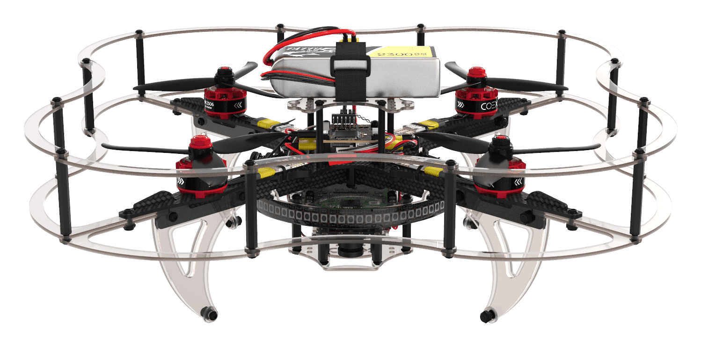

# clover🍀: create autonomous drones easily

Clover is an open source [ROS](https://www.ros.org)-based framework, providing user-friendly tools to control [PX4](https://px4.io)-powered drones. Clover is available as a ROS package, but is shipped mainly as a preconfigured image for Raspberry Pi. Once you've installed Raspberry Pi on your drone and flashed the image to its microSD card, taking the drone up in the air is a matter of minutes.

COEX Clover Drone is an educational programmable drone kit, suited perfectly for running clover software. The kit is shipped unassembled and includes Pixracer-compatible autopilot running PX4 firmware, Raspberry Pi 4 as a companion computer, a camera for computer vision navigation as well as additional sensors and peripheral devices. Batteries included.

The main documentation is available at [https://clover.coex.tech](https://clover.coex.tech/). Official website: [coex.tech/clover](https://coex.tech/clover).

[__Support us on Kickstarter!__](https://www.kickstarter.com/projects/copterexpress/cloverdrone)

## Video compilation

Clover drone is used on a wide range of educational events, including [Copter Hack](https://www.youtube.com/watch?v=xgXheg3TTs4), WorldSkills Drone Operation competition, [Autonomous Vehicles Track of NTI Olympics 2016–2020](https://www.youtube.com/watch?v=E1_ehvJRKxg), Quadro Hack 2019 (National University of Science and Technology MISiS), Russian Robot Olympiad (autonomous flights), and others.

## Raspberry Pi image

Preconfigured image for Raspberry Pi with installed and configured software, ready to fly, is available [in the Releases section](https://github.com/CopterExpress/clover/releases).

Image features:

* Raspbian Buster
* [ROS Noetic](http://wiki.ros.org/noetic)
* Configured networking
* OpenCV
* [`mavros`](http://wiki.ros.org/mavros)
* Periphery drivers for ROS ([GPIO](https://clover.coex.tech/en/gpio.html), [LED strip](https://clover.coex.tech/en/leds.html), etc)
* `aruco_pose` package for marker-assisted navigation
* `clover` package for autonomous drone control

API description for autonomous flights is available [on GitBook](https://clover.coex.tech/en/simple_offboard.html).

For manual package installation and running see [`clover` package documentation](clover/README.md).

## Support

## License

While the Clover platform source code is available under the MIT License, note, that the [documentation](docs/) is licensed under the Creative Commons Attribution-NonCommercial-ShareAlike 4.0 International License.
