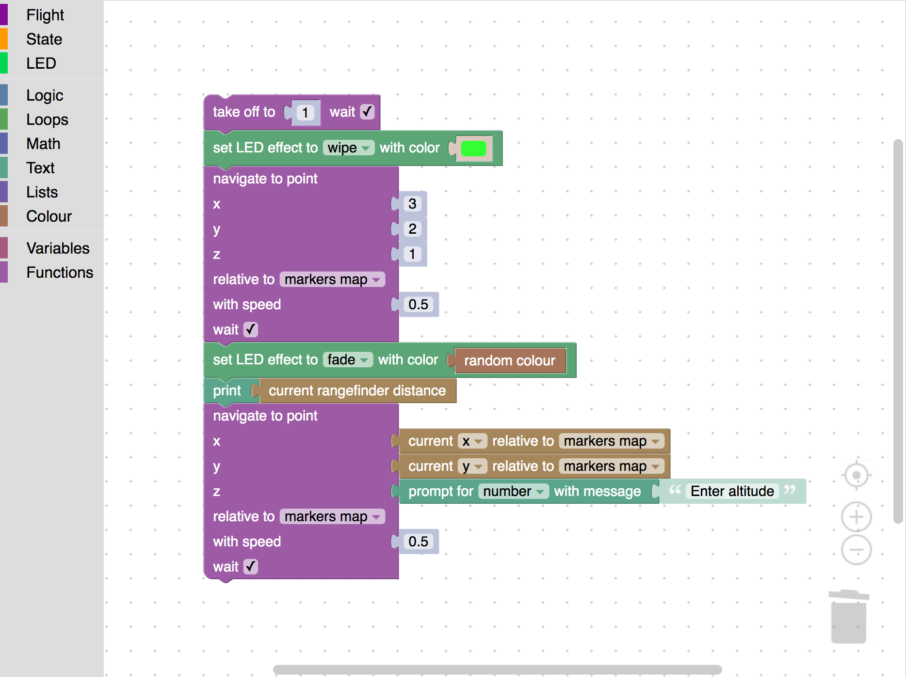

# clover_blocks

Blockly programming support for Clover.



See user documentation at the [main Clover documentation site](https://clover.coex.tech/en/blocks.html).

Internal package documentation is given below.

## Frontend

The frontend files are located in [`www`](./www/) subdirectory. The frontend application uses [`roblib.js`](http://wiki.ros.org/roslibjs) library for communicating with backend node and other ROS resources.

## `clover_blocks` node

`clover_blocks` is the blocks programming backend, implementing all the services and topics needed for running Blockly-generated Python script.

### Services

* `~run` ([*clover_blocks/Run*](srv/Run.srv)) – run Blockly-generated program (in Python).
* `~stop` ([*std_srvs/Trigger*](http://docs.ros.org/melodic/api/std_srvs/html/srv/Trigger.html)) – terminate the running program.
* `~store` ([*clover_blocks/load*](srv/Store.srv)) – store a user program (to `<package_path>/programs` by default).
* `~load` ([*clover_blocks/load*](srv/Load.srv)) – load all the stored programs.

### Parameters

* `~programs_dir` (*string*) – directory for user programs.

Parameters read by frontend:

* `~navigate_tolerance` (*float*) – distance tolerance in meters, used for navigate-like blocks (default: 0.2).
* `~yaw_tolerance` (*float*) – yaw angle tolerance in degrees, used in set_yaw block (default: 20).
* `~sleep_time` (*float*) – duration of sleep in loop cycles, used for navigate-like blocks (default: 0.2).
* `~confirm_run` (*bool*) – enable confirmation to run the program (default: true).

These parameters also can be set as URL GET-parameters, for example:

```
http://<hostname>/clover_blocks/?navigate_tolerance=0.5&sleep_time=0.1
```

### Topics

#### Published

* `~running` ([*std_msgs/Bool*](http://docs.ros.org/melodic/api/std_msgs/html/msg/Bool.html)) – indicates if the program is currently running.
* `~block` ([*std_msgs/String*](http://docs.ros.org/melodic/api/std_msgs/html/msg/String.html)) – current executing block (maximum topic rate is limited).
* `~error` ([*std_msgs/String*](http://docs.ros.org/melodic/api/std_msgs/html/msg/String.html)) – user program errors and exceptions.
* `~prompt` ([*clover_blocks/Prompt*](msg/Prompt.msg)) – user input request (includes random request ID string).

This topic is published from the frontend side:

* `~prompt/<request_id>` ([*std_msgs/String*](http://docs.ros.org/melodic/api/std_msgs/html/msg/String.html)) – user input response.
