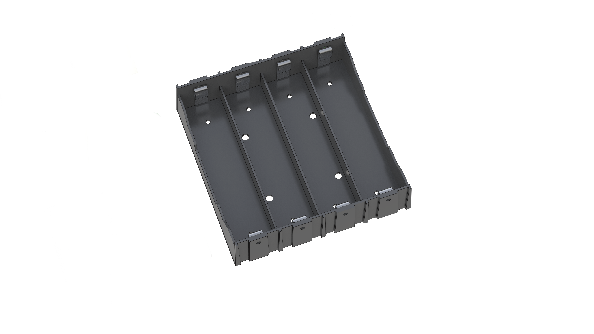
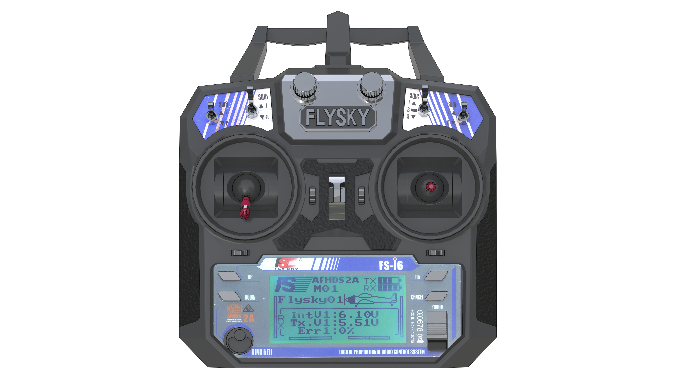
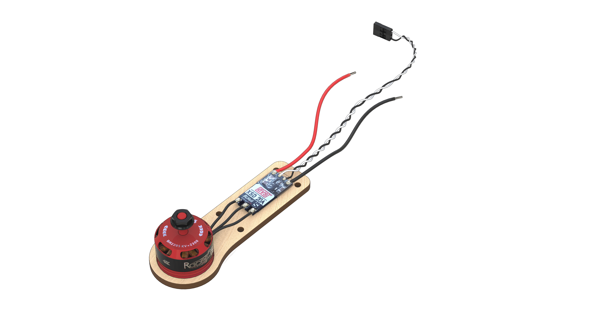
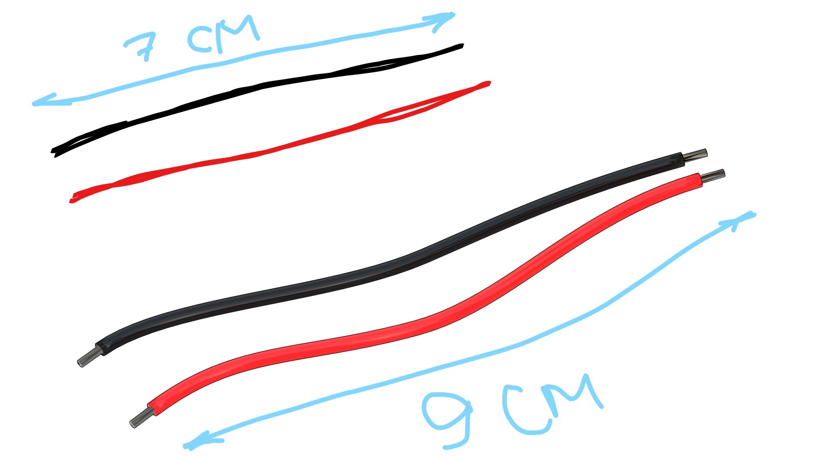
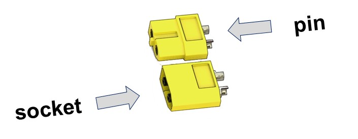

Инструкция по сборке конструктора Клевер 2
==========================================

Состав конструктора
-------------------

* Рама центральная x2.
* Рама дополнительная х4.
* Луч x8.
* Ножки x8.
* Защита для лучей x8.
* Защита пропеллеров x16.
* Защита боковая x16. 
* Пропеллер пластиковый Dalprop 5045 x4.
* Бесколлекторный электродвигатель Racerstar BR2205 2300kV x4.
* Регуляторы хода ESC, DYS XSD20А x4.
* Разъем силовой XT60 pin x1.
* Разъем силовой XT60 socket x1.
* Трехпроводной шлейф “мама-мама” x2.
* Провод медный многожильный с силиконовой изоляцией 14AWG (красный, черный), длина 50 см. 
* Плата распределения питания PDB BeeRotor Power Distribution Board V2.0 x1.
* Аккумуляторная батарея (АКБ) Li-ion 18650 x8.
* Зарядное устройство EFEST Luc V4 Li-lon x1.
* Защитный бокс регуляторов x4.
* Крепление под ножки x8.
* Полетный контроллер PIXHAWK x1.
* Радиоприемник FlySky i6 x1.
* Радиопульт FlySky i6 x1.
* Зарядное устройство EFEST LUC V4 x1.
* Провод Micro USB - USB x1
* Батарейный отсек 18650 li-Ion x1
* Провод медный многожильный с силиконовой изоляцией 18AWG (красный, черный), длина  100 см. 
* Батарейка АА х4
* Джампер, Bind-разъем

#### Крепежные элементы
* Пластиковые стойки 6 мм x28.
* Пластиковые стойки 30 мм x32.
* Винты М3x8 x48.
* Винты М3x12 x24.
* Винты М3x16 x40.
* Гайки Пластиковые x8.
* Гайки Металлические x48.
* Наклейки для отсека АКБ х8 .
* Термоусадка ф15 , .50 см
* Термоусадка ф5, 100 см
* Двухсторонний скотч 3M x16.
* Отвертка x1 (нужна визуализация)
* Изоляционная лента х1
* Ножницы канцелярские х1
* Ремешок для батареи 250 мм х1

Функционал радиопульта Flysky i6
---------------------------
1. Переключатель A (SwA).
2. Переключатель B (SwB).
3. Переключатель С (SwC).
4. Переключатель D (SwD).
5. Левый стик.
6. Правый стик.
7. Левый триммер.
8. Правый триммер.
9. Кнопка Вверх.
10. Кнопка Вниз.
11. Кнопка Ок.
12. Кнопка Отмены.
13. Кнопка BIND KEY.
14. Переключатель питания POWER.
15. ЖК-дисплей.
16. Ручка A (VrA).
17. Ручка B (VrB).

//добавить обозначения 

Дополнительное оборудование
---------------------------
#### Данное оборудование не входит в состав конструктора Клевер 2, но оно необходимо для реализации сборочного процесса 
* Паяльник
* Канифоль/ Флюс (нейтральный)
* Припой
* Фен промышленный
* Плоскогубцы
* Пинцет
* Канцелярский нож
* Мультиметр

//добавить обозначения 

Порядок сборки
--------------

### Установка моторов

* Распаковать моторы. Используя плоскогубцы, укоротить провода на моторах, обрезать половину длины (оставив 25 мм).

Зачистить
* снять 2мм термоизоляции с конца провода не повредив медные жилы.

Скрутить провода.

Залудить
* Нанести флюс на оголенную часть провода. 
* Покрыть припоем, используя пинцет.

#### Закрепить мотор на луче

* Установить мотор на сторону луча с гравировкой.
* Прикрепить моторы к лучам винтами М3х8, используя отвертку.

* Лучи с моторами необходимо расположить согласно схеме. Стрелками указано направление вращения моторов.

//указать стрелками направление вращения на моторах

#### Залудить три контактные площадки регулятора
* Нанести флюс 
* Нанести припой
Чтобы припой аккуратно заполнил всю площадку, необходимо прогреть площадку регулятора. Для этого нужно удерживать жало паяльника на контактной плащадке в течение 2 сек (или больше, если потребуется)

* Повторить данную операцию для оставшихся трех регуляторов

#### Припаять провода моторов к регуляторам
Припаять ранее приготовленные провода моторов к контактным площадкам регуляторов.

* Повторить данную операцию для оставшихся трех регуляторов

### Монтаж разъемов питания

#### Подготовка проводов для разъемов XT60

1. Взять моток красных и черных проводов, промаркированных как 14AWG
2. Отрезать 4 куска провода следующей длины
* Длина 7 см (Для силового разъема XT60 pin) - 1 красный, 1 черный
* Длина 9 см (Для силового разъема XT60 socket) - 1 красный, 1 черный

#### Подготовка разъемов питания XT60 pin и socket
1. Под разъем XT60 pin залудить два силовых провода красный и чёрный 14AWG длиной 7 см.
2. Залудить контактные площадки разъема XT60 pin.
3. Припаять черный провод к “-” контакту разъема.
4. Припаять красный провод к “+” контакту разъема .
5. Нарезать термоусадку ф5 (2 отрезка по 10 мм).
6. Надеть термоусадку ф5 на провода так, чтобы она закрывала контактные площадки проводов с XT60 .
7. Усадить термоусадку феном.

8. Повторить процедуру для разъема XT60 socket.

