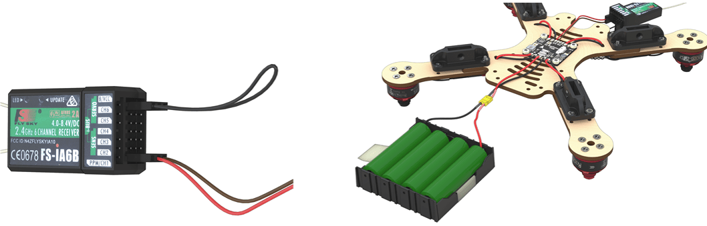

### Сопряжение приемника и пульта
1. Подключить радиоприемник к разъему 5В. В любой разъем, GND внизу. На схеме питание обозначено как 5V

3. Подключить АКБ.
Светодиод на радиоприемнике должен мигать.

#### БЕЗОПАСНОСТЬ при работе с АКБ

#### Включение радиопульта
1. На пульте зажать кнопку BIND KEY.
2. Включить пульт (перещелкнуть POWER, BIND KEY не отпускаем).
3. Ждем синхронизацию.
4. Отсоединить джампер.
5. Светодиод горит непрерывно.

