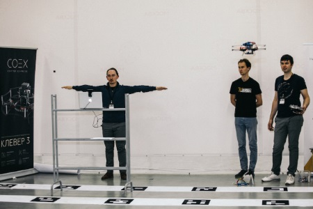

# Copter Hack 2018

Чат хакатона: https://t.me/CopterHack.

Стрим хакатона: https://www.youtube.com/watch?v=nIo5HSqlt6I.

Фотографии с хакатона: https://drive.google.com/open?id=1ozdXol4rhKwhHbsrnfxrp3CqazBRm-3W.

## Лекции

Лекция 1: сборка – https://www.youtube.com/watch?v=gEs-w7BRPM8.

Лекция 2: настройка – https://www.youtube.com/watch?v=sPqSCCmgdG0.

Лекция 3: прошивка PX4 – https://www.youtube.com/watch?v=WFnZAIypgMQ.

Лекция 4: автономные полеты – https://www.youtube.com/watch?v=gD6a7aSEf9M.

## Результаты

Команды-победители:

1. Starshine (Москва) — управление дроном с помощью "умной" перчатки.
2. Alcopter (Москва) — управление дроном с помощью жестов и смены поз.
3. Весёлый коптер (Самара) — бот Vkontakte для управления коптером, рой "Жужи" и "Клевера 3".
4. International Post (Новосибирск) — автоматический разброс листовок с дрона.
5. ЛАМАР (Екатеринбург) — станция автоматической смены аккумулятора квадрокоптера.

