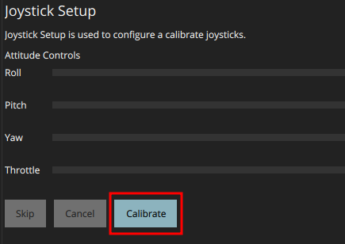
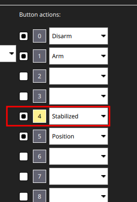

# Multi-copter control with 4G communication

The fourth generation mobile communication is a convenient tool for transmitting and receiving information at high speed. Nowadays, the coverage area of mobile operators allows to connect to the Internet at high speed from almost any point.

> **Hint** To transfer any data from your drone to the ground control station (e.g., QGroundControl) and back, you need to set up your own VPN network.

## Connecting 4G modem to Raspberry Pi

Connect a 4G modem with SIM card to the USB port of your Raspberry Pi.

When connected, some modems recognize in the system as a network card, without any additional settings.

4G modem example: *USB 4G Huawei E3372H*


But some other popular modems, for instance *Quectel EP06*, do not start the internet connection automatic. In this case you should use utilities like `qmi-network` and `udhcpc`. To install this utilities enter the appropriate command line:

```bash
sudo apt install libqmi-utils udhcpc
```

Next to start the internet connection proceed following:

```bash
sudo ip link set wwan0 down
echo 'Y' | sudo tee /sys/class/net/wwan0/qmi/raw_ip
sudo ip link set wwan0 up
sudo qmi-network /dev/cdc-wdm0 start
sudo udhcpc -q -f -i wwan0
```

Reed more about it in [this article](https://docs.sixfab.com/page/setting-up-a-data-connection-over-qmi-interface-using-libqmi).

<!-- markdownlint-disable MD031 -->

> **Hint** To check the internet connection enter the appropriate command line:
> ```bash
> ping -I wwan0 -c 5 8.8.8.8
> ```

<!-- -->

> **Hint** To check the speed of the internet connection you could use the `speedtest` utility:
> ```bash
> sudo apt install speedtest-cli
> speedtest
> ```

<!-- markdownlint-enable MD031 -->

## Connecting Raspberry Pi to the VPN

Create the VPN network keys to connect Raspberry Pi and the ground station.

To connect Raspberry Pi to your network, install the OpenVPN package:

```bash
sudo apt-get install openvpn
```

Move your keys to the `/etc/openvpn/client` directory. For convenience, use the graphical SFTP data transfer interface, for example: WinSCP, FileZilla, etc.

To enable the client mode, you must activate the keys you have transmitted. Keys can be generated in various formats, for example: `.ovpn`, `.conf`. The key or configuration used on your copter should be strictly in `.conf` format.

Initialize the service that uses your keys to connect in client mode:

```bash
sudo systemctl enable openvpn-client@config-name
```

where *config-name* is the name of your configuration file.

If everything is done correctly, every time the system restarts, the service client will automatically connect to your network.

> **Hint** Before starting work, do not forget to set up and enable VPN connection on your PC.

<!-- -->

> **Hint** Alternatively we recommend to use the [ZeroTier](zerotire_vpn.md) VPN-service.

## Copter control via QGroundControl

> **Hint** We suggest using the UDP transfer protocol to control the drone, which provides less delay, at the cost of no guarantee of receiving the package, which is very important during the flight.

Make sure your copter and ground station are connected to your network.

To do this, you can use the command `ip addr`. The result will be a numbered list of the active networks enabled on your device. Note the connection with the prefix *tun* and the IP address you specify; if it is present in your list, your copter is connected to the network.

Set up the GCS connection to your drone using the same protocol that is used for your VPN network. The steps are the same as in the [Wi-Fi connection article](gcs_bridge.md). We recommend using *UDP* due to lower latency.

If you have a connection to your drone, connect some joystick to your PC. You may use an RC transmitter with a USB port, such as FlySky-i6X, Taranis x7, etc., as well as any analog joystick that is recognized by the system.

When the joystick is recognized by the system, the *Joystick* item will appear in the *Vehicle Setup* column. If it is highlighted in red, then calibration is required.

To calibrate the joystick, press the *Calibrate* button in the *Joystick* tab and follow the instructions for the sticks position on the left side of the window.

<div class="image-group">
    
    
</div>

After successful calibration, flight modes must be set up. To do this, switch the required toggle switches several times. During switching, you will see the virtual channels on which the toggle switches operate. One of the channels will be highlighted in the active position.



> **Info** When selecting the joystick, check the number of working channels and its support in QGroundControl (which uses SDL2, so any joystick supported there should be fine). There are joysticks that support only 4 channels, which are not convenient for this type of control.

If changes to stick positions are reflected in the QGroundControl window, all you have to do is apply a parameter that specifies that the drone is controlled by the joystick, not by the RC:

`COM_RC_IN_MODE` - Joystick/No RC Checks

Since mobile communication is not always stable, it is recommended to increase the timeout for control signal loss to 5 seconds.


The drone is ready to fly!

> **Hint** If the copter does not arm when you move the left stick to the bottom right corner, set the Arm/Disarm command to one of the switches.

## Streaming video from the camera to QGroundControl

You can stream video from almost any camera connected to your Raspberry Pi. You will need to install or [build](https://github.com/sfalexrog/gst-rtsp-launch) the *gst-rtsp-launch* package:

```bash
sudo apt update
sudo apt install gst-rtsp-launch
```

To start the transfer of images, you must enter the appropriate command line:

<a id="command_line"></a>

```bash
gst-rtsp-launch "( v4l2src device=/dev/video0 ! video/x-raw,framerate=30/1,width=320,height=240 ! videoconvert ! v4l2h264enc output-io-mode=4 extra-controls=\"encode,frame_level_rate_control_enable=1,h264_profile=4,h264_level=13,video_bitrate=300000,h264_i_frame_period=5;\" ! rtph264pay name=pay0 pt=96 )"
```

This command line contains the parameters of the video stream, such as the source video device, framerate, image height/width, encoding, etc. You can see more examples [in the `gst-rtsp-launch` repository](https://github.com/sfalexrog/gst-rtsp-launch/blob/master/README.md).

> **Info** A Raspberry Pi camera device `/dev/video0` could be used by `clover` systemd service. In this case `gst-rtsp-launch` will not get an access to the device. For stop the `clover` run command `sudo systemctl stop clover`.
> Also you could stream from a USB-camera, for this change the source video device to `/dev/video1`.

Make sure the stream by the address `rtsp://192.168.11.1:8554/video` (the IP-address of your Raspberry Pi could be different) is received and shown in QGroundControl.


## Starting video stream automatically

Create a file and add your video stream [command line](#command_line):

```bash
nano script_name.sh
```

In order to run the file, you have to mark it as executable.

```bash
chmod a+x script_name.sh
```

You can use systemd to launch this script every time on system startup. Create the `qgc_video.service` file in the `/etc/systemd/system` directory:

```bash
sudo nano /etc/systemd/system/qgc_video.service
```

Put the following in this file:

```
[Unit]
Description=VideoStream

[Service]
ExecStart=/bin/bash /home/pi/script_name.sh

[Install]
WantedBy=multi-user.target
```

Enable the script at startup.

```bash
sudo systemctl enable qgc_video.service
```
