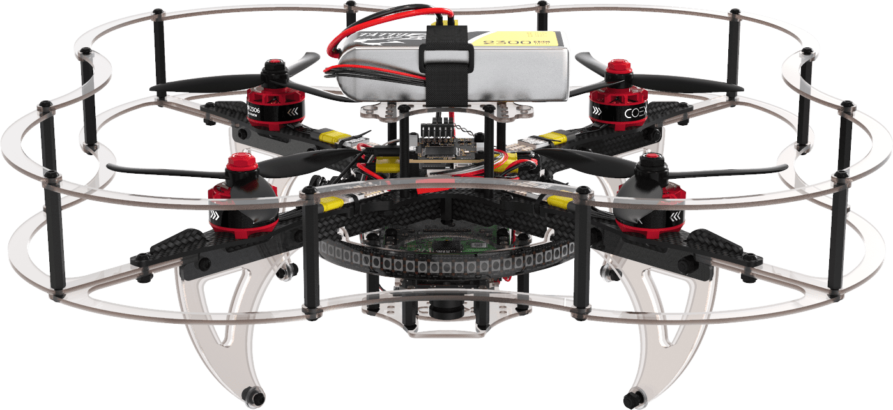

# COEX Clover

**Clover** is an educational kit of a programmable quadcopter that consists of popular open source components, and a set of necessary documentation and libraries for working with it.

The kit includes a [COEX Pix](coex_pix.md) flight controller with the PX4 flight stack, a [Raspberry Pi 4](raspberry.md) as a controlling onboard computer, and a [camera module](camera.md) for performing flights with the use of computer vision, as well as a set of various sensors and other peripherals.

The Clover platform contains a [pre-configured image for Raspberry Pi](image.md) with the full set of required software for working with peripheral devices and [programming autonomous flights](simple_offboard.md). The source code of the platform and of the documentation is open and [available on GitHub](https://github.com/CopterExpress/clover).

If you have studied the documentation but have not found an answer to your question, join our support chat and our specialists will be happy to answer you: [@COEXHelpdesk](tg://resolve?domain=COEXHelpdesk).

We also have a chat for programmers coding for PX4, autonomous navigation indoors, and drone swarms: [@DroneCode](tg://resolve?domain=DroneCode).

You can download [PDF-version](https://clover.coex.tech/clover_en.pdf) of this documentation.
