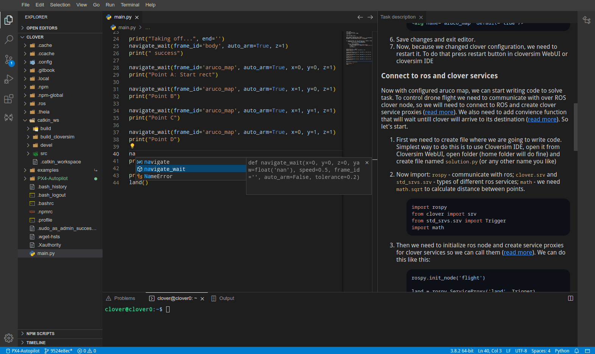

# Advanced Clover 3: The Platform

[CopterHack-2023](copterhack2023.md), team **FTL**.

## Team Information

```cpp
#include "veryInterestingCommandDescription.h"
```

Team members:

- Maxim Ramanouski, [@max8rr8](https://t.me/max8rr8).

Country: Belarus.

## Project Description

Last year at CopterHack 2022, we created a [project](../ru/advanced_clover_simulator.html) that simplified the simulation of Clover, and in 2021, we created a [project](../ru/advanced_clover.html) that simplified the development of products for Clover (IDE and library for writing). The time has come to combine them and achieve unlimited power.

### Project Idea

The idea of the project is to combine CloverIDE and CloverSim (a tool for running Clover simulations). Thus, a platform is planned that allows developing products based on Clover using a simulator and an advanced IDE. The platform will include the following features:

- Add a web interface that allows using CloverSim without touching the command line.
- Work both in the browser (without installing anything) and from CLI.
- Have a course that covers different aspects of clover.
- Simplify installation, especially in WSL.
- Running a simulation on a remote device (more powerful computer or cloud).

### Project videos

Video presentation of the project: [link](https://www.youtube.com/watch?v=T4RU9sfxsSI).

Live presentation at CopterHack: TBD.

CLI demonstration: [link](https://www.youtube.com/watch?v=Ao-ukR58sSQ).

## Installation

Installation process is described in the [project documentation](https://ftl-team.github.io/clover_sim/#/?id=installation).

## Usage

The CloverSim platform offers a seamless workflow for users:

1. Users can effortlessly select or create a workspace and task and
   launch them with ease.

   

2. After launching the simulation, users are presented with CloverSim WebUI that
   provides them with an intuitive way to view their scores and progress,
   control the simulator, and access task descriptions and scoring information.
   From it users can open terminal, gzweb and more importantly they can easily
   access the CloverSim IDE to solve task.

   

3. The IDE provides a full suite of tools and features for writing and
   debugging code. One example is autocompletion to help streamline the
   development process, making it more efficient and effective.

   

4. Users can launch their programs with ease and monitor its progress via
   the GZWeb, CopterStatus, and SimulatorStatus views of the IDE.

   

5. Users can track their progress and scores in real-time and effortlessly
  restart the simulator if necessary. Additionally, different randomization
  seed can be set to check various inputs and outcomes.

We also have video demonstration/tutorial: [link](https://www.youtube.com/watch?v=aPOPHD3M3ZM).

## More features

- Easy installation process.
- Efficient simulation launch, surpassing traditional virtual machines.
- Generation of dynamic Gazebo worlds with randomization based on seed.
- Real-time task completion verification and score presentation.
- Execution with security in isolated containers.
- Multiple project capability without the need for multiple virtual machine images.
- WebUI for ease of use, removing the need to use the command line.
- IDE similar to VSCode with support for C++ and Python, including autocompletion and autoformatting.
- Custom-patched GZWeb with bug fixes and additional features, including the display of the Clover LED strip.
- GZWeb provides a follow-objects feature superior to that of Gazebo.
- IDE includes tools to interact with ROS, such as topic visualization, service calling, and image topic visualization.
- IDE also includes Copter Status, displaying most of the drone's information, including position, camera, and LED strip, in one view.
- IDE integrates with the simulator by providing control from it, viewing task descriptions, and opening GZWeb.

We also have developed a learning course based on CloverSim: [link](https://github.com/FTL-team/CloverSim_course). It currently has the following tasks:

- 1_thesquare - First task of CloverSim course with goal to fly square.
- 2_iseeall - Task that teaches how to interact with camera.
- 3_landmid - Find and land onto randomly positioned object.
- 4_flybyline - Flying along the line.
- 5_posknown - Find position of objects relative to ArUco map.

## More details

At this point, our platform consists of four major parts:

- [CloverSim](https://github.com/FTL-team/clover_sim) - tool that manages simulation.
- [CloverSim Basefs](https://github.com/FTL-team/clover_sim_basefs) - container image that is used in simulator.
- [Clover IDE](https://github.com/FTL-team/cloverIDE) - clover ide tools and theia.
- [CloverSim course](https://github.com/FTL-team/CloverSim_course) - course with tasks based on our platform.

### CloverSim

The simulation architecture is a continuation of work from CopterHack 2022, but while 2022 version was closer to Proof-of-Concept, the updated version is more robust.

There are three major difference in simulator architecture

- Replacement of `systemd-nspawn` with `runc` provides us higher degree of container control and seemingless support of non-systemd systems, for example WSL.
- Migration to squash fs images, which greatly reduced size of installed CloverSim from 13 gigabytes to just 3.5 gigabytes.
- Tasks are now mounted instead of being copied and also build before starting.

Because of the way catkin_make works, it is incredibly slow when new packages are added (whole cmake configuration is rerun for all packages). catkin_make provides a way to build only some packages, but it caches this packages and to reset this cache you need to recompile whole catkin_make. But we have found a solution: `catkin_make -DCATKIN_WHITELIST_PACKAGES="task;CloverSim" --build build_CloverSim` This command, builds only CloverSim and task package in separate build directory, this drastically reduces time that catkin_make takes, and keeps expected behavior of catkin_make without arguments.

There are also differences in tool that launches simulation:

- Client-server architecture allows us to create web UI and run CloverSim on server.
- More robust error handling improves user experience.
- Rewritten in rust, better reliability and development experience.

### CloverSim basefs

Version 2 integrates CloverIDE into system. We also updated clover in simulator to v0.23 and added web terminal. Basefs is now squashed and doesn't require additional installation. It also uses patched(by us) version of gzweb that is more suitable for our use-case:

- Unlike original GZWeb assets can be dynamically loaded, which is required to support dynamically generated tasks.
- It also implements multiple bugfixes for rendering, UI.
- Fixed performance, original gzweb had two constantly running loops that used 200% of cpu. We fixed this by instead using synchronization primitives.
- Clover LED strip is rendered, our gzweb connects to ROS and pulls LED data from there to render LED strip like Gazebo does.
- Users can now follow-objects like in Gazebo better actually.
- Reconnect on disconnect, when simulator is restarted gzweb looses connection and it now can automatically reconnect.

Patched gzweb available there: [FTL-team/gzweb](https://github.com/FTL-team/gzweb).

### CloverIDE

CloverIDE got some updates too:

- We have updated theia and extensions used.
- Better C++ support via clangd.
- Clover IDE tools can now reconnect after simulator restart.
- Copter Status now displays LED strip status.
- Tools ui has better support for different themes.

But the most important change is CloverSim integration, there are new tools (task description, simulator control and gzweb). While gzweb tool is just an iframe (though it's very cool to have it in IDE).

Task description and simulator control are more interesting as they have to interact with both IDE and CloverSim, to maintain different versions support we use quite interesting trick, extension webview after being initialized dynamically loads JavaScript from CloverSim. That provides better integration between two.

### CloverSim course

CloverSim course is a new part of our platform. It uses robust task API of CloverSim to create practical learning course. It currently teaches different aspects of clover development that i encountered during my participation in different contests involving clover. But we are happy to accpet suggestions about other aspects we should teach in out course.

## Conclusion

This project is a final (or maybe there is more?) project of our advanced clover saga. AdvancedClover is a project that is easy to use and greatly improves experience during learning about clover, participating in clover based competitions and development clover based projects. We thank COEX team for their support and look forward to further cooperation.
