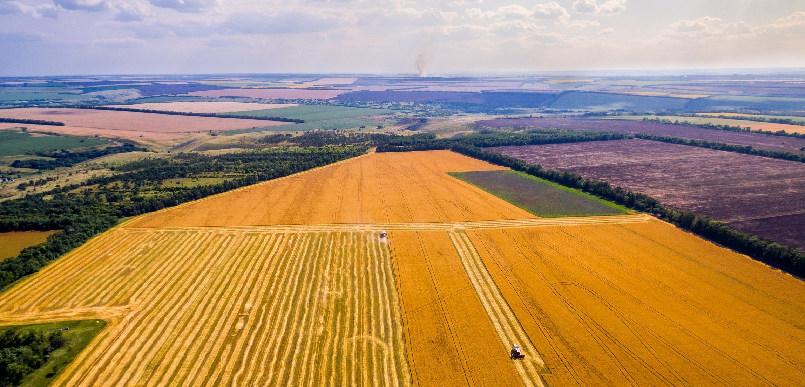
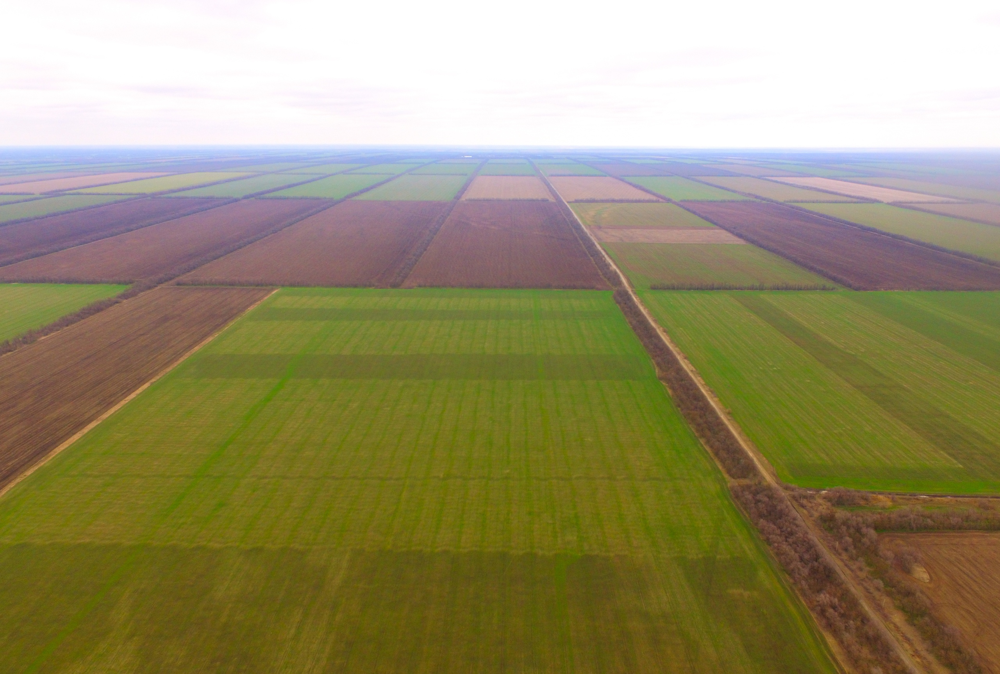

# Recognition of crop types in mass agricultural production

## Introduction

Modern agriculture in many countries is becoming one of the shining examples of the rapid and successful introduction of new technologies. Unmanned aerial vehicles are capable of performing a wide range of tasks, among which monitoring of agricultural land has now become a common tool for increasing the efficiency of agriculture. The goal of my project is to write a code for recognizing crop types in mass agricultural production. In the future, from the recognition results, you can design a map of sown areas.

## Monitoring

In agriculture, monitoring is necessary to obtain information on the state of land and crops. Based on the monitoring results, farmers or specialists can understand whether crops are sprouting normally, whether there is a threat from weeds and/or insects - pests, what is the degree of moisture in individual areas or entire areas, etc.

## Explanation of the code

Import libraries:

```python
import rospy
import cv2
from sensor_msgs.msg import Image
from cv_bridge import CvBridge
import numpy as np
```

Create some variables:

```python
rospy.init_node('computer_vision_sample')

bridge = CvBridge()

color = 'undefined'
shape = 'undefined'
culture = ""
```

To implement computer vision algorithms, it is recommended to use the OpenCV library preinstalled on the Clover image.
Create a subscriber for the topic with the image from the main camera for processing using OpenCV:

```python
def image_colback_color(data):
    global color, shape

    cv_image = bridge.imgmsg_to_cv2(data, 'bgr8') # OpenCV image
    img_hsv = cv2.cvtColor(cv_image, cv2.COLOR_BGR2HSV) #[118:119,158:159]

    #detected color
    #print(img_hsv[0][0])
```

Each culture has its unique shade (wheat is golden, buckwheat is light brown).




We describe color ranges for certain crops:

```python
#wheat
yellow_orange_low = (38, 110, 150)
yellow_orange_high= (52, 110, 150)

#buckwheat
brown_low = (23, 50, 50)
brown_high= (37, 50, 50)

yellow_orange_mask = cv2.inRange(img_hsv, yellow_orange_low, yellow_orange_high)
brown_mask = cv2.inRange(img_hsv, brown_low, brown_high)

if yellow_orange_mask[119][159] == 255:
    shape = shape_recog(yellow_orange_mask)

elif brown_mask[119][159] == 255:
    shape = shape_recog(brown_mask)

else:
    shape = 'undefined'
    color = 'undefined'

if shape == 'brown':
    culture = "greshiha"
if shape == 'yellow_orange':
    culture = "pshenitsa"

image_sub = rospy.Subscriber('main_camera/image_raw', Image, image_colback_color)
```

The script will take up to 100% CPU capacity. To slow down the script artificially, you can use throttling of frames from the camera, for example, at 5 Hz (`main_camera.launch`):

```xml
<node pkg="topic_tools" name="cam_throttle" type="throttle" args="messages main_camera/image_raw 5.0 main_camera/image_raw_throttled"/>
```

The topic for the subscriber, in this case, should be changed for `main_camera/image_raw_throttled`.

```python
print (culture)
while not rospy.is_shutdown():
    print("color: {}".format(color))
    print("shape: {}".format(shape))
    rospy.sleep(0.2)
```

This program will recognize the culture by its shade. We can use more color ranges to improve the accuracy of the recognition so the drone can recognize more crops.

Examples of color ranges for other colors:

```python
red_low1 = (0, 110, 150)
red_high1 = (7, 255, 255)

red_low2 = (172, 110, 150)
red_high2 = (180, 255, 255)

red_orange_low = (8, 110, 150)
red_orange_high = (22, 110, 150)

orange_low = (23, 110, 150)
orange_high = (37, 110, 150)

yellow_orange_low = (38, 110, 150)
yellow_orange_high = (52, 110, 150)

yellow_low = (53, 150, 150)
yellow_high = (67, 255, 255)

yellow_green_low = (68, 150, 150)
yellow_green_high = (82, 255, 255)

green_low = (83, 150, 150)
green_high = (97, 255, 255)

blue_green_low = (98, 150, 150)
blue_green_high = (113, 255, 255)

blue_low = (114, 150, 150)
blue_high = (127, 255, 255)

blue_violet_low = (128, 150, 150)
blue_violet_high = (142, 255, 255)

violet_low = (143, 150, 150)
violet_high = (157, 255, 255)

red_violet_low = (158, 150, 150)
red_violet_hugh = (171, 255, 255)
```

Note that there are two ranges for red because red is at the edges of the HSV color space.
