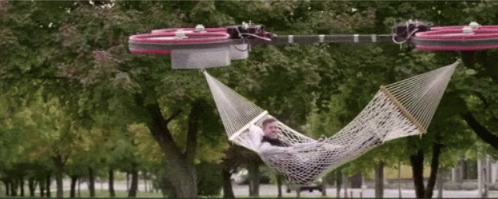
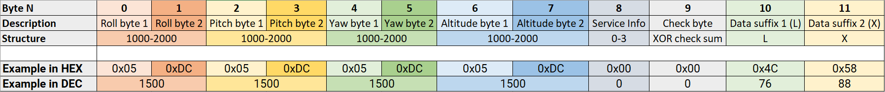
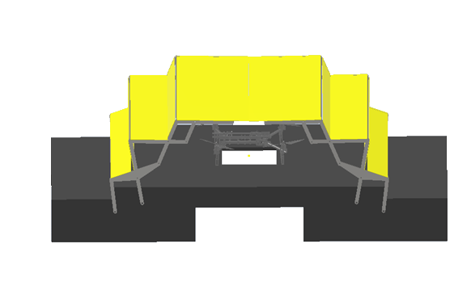

# Autonomous Multirotor Landing System (AMLS)


## The goal is to automatically land a drone on a moving platform

### AMLS Article

In this Article we will describe AMLS project. Namely, AMLS Optical stabilization, GPS holding, GPS following, Altitude holding, Grabbing, Weather protection, Speed measurement and Illumination systems. In addition, we will make clear of how it works and how it was done!

### Our main GitHub repository

https://github.com/XxOinvizioNxX/Liberty-Way

### Developers

- [Pavel Neshumov](mailto:xxoinvizionxx@gmail.com)
- [Andrey Kabalin](mailto:astik452@gmail.com)
- [Vladislav Yasnetsky](mailto:vlad.yasn@gmail.com)



-----------

## Table of contents

- [0. How does it work?](#how-does-it-work)
  - [0.1. A video about our project](#short-video-about-our-project-clickable)
- [1. GPS hold and Flight to waypoints functions](#hold-and-flight-to-waypoints-functions)
  - [1.1. Serial reading](#serial-reading)
  - [1.2. UBlox GPS parsing](#ublox-parsing)
  - [1.3. Set current waypoint](#set-current-waypoint)
  - [1.4. Waypoint edition (To fly to waypoints)](#waypoint-edit-to-fly-to-waypoints)
  - [1.5. Waypoint stabilization](#waypoint-stabilization)
- [2. GPS following](#following)
- [3. Compass](#compass)
- [4. Altitude stabilization (barometer)](#altitude-stabilization-barometer)
- [5. Optical stabilization](#optical-stabilization)
  - [5.1. So difficult and so important](#so-difficult-and-so-important)
  - [5.2. First steps](#first-steps)
  - [5.3. Inverse approach](#inverse-approach)
  - [5.4. Java edition](#java-edition)
  - [5.5. Liberty-Way](#liberty-way)
  - [5.6. Communication with the drone](#communication-with-the-drone)
  - [5.7. Camera gimbal](#camera-gimbal)
- [6. Eitude AMLS Platform](#eitude-amls-platform)
  - [6.1. Grabbing system](#grabbing-system)
  - [6.2. Weather protection system](#weather-protection-system)
  - [6.3. Speed measurement system](#platform-speedometer)
  - [6.4. Illumination system](#platform-light-sensor)
- [7. Conclusion](#conclusion)

-----------

## 0. How does it work? {#how-does-it-work}

The AMLS system consists of two parts:

- The drone

    

- And the platform either mobile (implemented on a vehicle), either stable (pick-up-point)

    

How the system operates:

- Firstly, a drone with a delivery package is far from the platform and it has no visual contact with it. The drone recieves GPS coordinates of a platform by using cellular communication or any other radio channel (The drone has Liberty-Link implemented on it. This module is able to adjust its position, whatever the firmware of the flight controller. The module is installed inside the line between a receiver and a flight controller.
- The drone is moving to received coordinates. The coordinates might be renewed in the process (but not frequently, thus preventing the channel from overloading)
- When the drone is close to the platform but there is still no visual contact, the program runs GPS stabilization. Here the data is being transmitted over the closest radio communication channel of high freqency, so the drone can catch up with the platform.
- Meanwhile, the drone descends (barometers are installed on both, the drone and the platform). Descending goes on untill altitude reaches 1.5-2 meters above the platform.
- While descending and when visual contact with the platform camera is established, the program enables visual (precision) stabilization. And as soon as the drone's tag is within camera's field of view, the algorithm will capture the drone.
- When optical stabilization is enabled, GPS is working as a back up plan (in case something goes wrong, GPS stabilization launches again).
- In order to use optical stabilization the drone is equipped with ArUco tag which can be captured by a camera and by using the closest radio communication channel, the system transmits adjustment data to the drone.
- Along with optical stabilization, the program launches landing algorithm. The algorithm artificially and smoothly reduces the setpoint of height (Z) until it reaches a certain threshold.
- When the drone is approaching on the desirable height, the program enables grabbing system implemented on the platform. Those grips are used to catch and hold the drone in the process of landing and after the drone was caught.
- When the landing is completed, the platform starts maintenance work and in order to protect the drone frome external influences, the program enables weather protection and closes the roof above landing area.
- Landing accomplished!  

### Short video about our project (clickable) {#short-video-about-our-project-clickable}

<iframe width="560" height="315" src="https://www.youtube.com/embed/6qjS-iq6a3k" frameborder="0" allow="accelerometer; autoplay; encrypted-media; gyroscope; picture-in-picture" allowfullscreen></iframe>

## 1. GPS hold and Flight to waypoints functions {#hold-and-flight-to-waypoints-functions}

At the beginning, the drone with the package is far from the platform. Then via cellular communication or another suitable radio channel, platform GPS coordinates are sent to the drone (the Liberty-Link module is installed on the drone, this module is capable of correcting its position, regardless of the firmware of the flight controller. (The module is placed between the receiver (RC) and the flight controller)

GPS module will be built in Liberty-Link, so it would have the ability to maintain the drone's GPS position and follow GPS points.

<iframe width="560" height="315" src="https://www.youtube.com/embed/x364giIt6lc" frameborder="0" allow="accelerometer; autoplay; encrypted-media; gyroscope; picture-in-picture" allowfullscreen></iframe>

GPS-module will be used from the UBlox group (for instance, UBlox Neo-M8). There will be 1 or 3 (to minimize the error) modules.


Modules operate via UART, configured to send data 5 times per second. The Liberty-Link firmware will read data from the modules and calculate the coordinates of the current position.

### 1.1. Serial reading {#serial-reading}

Reading data from a module into a buffer looks like this:

```cpp
// Read data from the GPS module
while (GPS_serial.available() && new_line_found == 0) {
	// Stay in this loop as long as there is serial information from the GPS available
	char read_serial_byte = GPS_serial.read();
	if (read_serial_byte == '$') {
		// Clear the old data from the incoming buffer array if the new byte equals a $ character
		for (message_counter = 0; message_counter <= 99; message_counter++) {
			incoming_message[message_counter] = '-';
		}
		// Reset the message_counter variable because we want to start writing at the begin of the array
		message_counter = 0;
	}
	// If the received byte does not equal a $ character, increase the message_counter variable
	else if (message_counter <= 99)
		message_counter++;

	// Write the new received byte to the new position in the incoming_message array
	incoming_message[message_counter] = read_serial_byte;

	// Every NMEA line ends with a '*'. If this character is detected the new_line_found variable is set to 1
	if (read_serial_byte == '*') new_line_found = 1;
}
```

### 1.2. UBlox GPS parsing {#ublox-parsing}

After that, latitude, longitude, a type of correction (2D, 3D) and the number of satellites are calculated from the filled buffer.
Parsing GPS data of the UBlox protocol looks like this:

```cpp
// If the software has detected a new NMEA line it will check if it's a valid line that can be used
if (new_line_found == 1) {
	// Reset the new_line_found variable for the next line
	new_line_found = 0;
	if (incoming_message[4] == 'L' && incoming_message[5] == 'L' && incoming_message[7] == ',') {
		// When there is no GPS fix or latitude/longitude information available
		// Set some variables to 0 if no valid information is found by the GPS module. This is needed for the GPS loss when flying
		l_lat_gps = 0;
		l_lon_gps = 0;
		lat_gps_previous = 0;
		lon_gps_previous = 0;
		number_used_sats = 0;
	}
	// If the line starts with GA and if there is a GPS fix we can scan the line for the latitude, longitude and number of satellites
	if (incoming_message[4] == 'G' && incoming_message[5] == 'A' && (incoming_message[44] == '1' || incoming_message[44] == '2')) {
		// Filter the minutes for the GGA line multiplied by 10
		lat_gps_actual = ((int)incoming_message[19] - 48) * (long)10000000;
		lat_gps_actual += ((int)incoming_message[20] - 48) * (long)1000000;
		lat_gps_actual += ((int)incoming_message[22] - 48) * (long)100000;
		lat_gps_actual += ((int)incoming_message[23] - 48) * (long)10000;
		lat_gps_actual += ((int)incoming_message[24] - 48) * (long)1000;
		lat_gps_actual += ((int)incoming_message[25] - 48) * (long)100;
		lat_gps_actual += ((int)incoming_message[26] - 48) * (long)10;
		// To convert minutes to degrees we need to divide minutes by 6
		lat_gps_actual /= (long)6;
		// Add multiply degrees by 10
		lat_gps_actual += ((int)incoming_message[17] - 48) * (long)100000000;
		lat_gps_actual += ((int)incoming_message[18] - 48) * (long)10000000;
		// Divide everything by 10
		lat_gps_actual /= 10;

		// Filter minutes for the GGA line multiplied by 10
		lon_gps_actual = ((int)incoming_message[33] - 48) * (long)10000000;
		lon_gps_actual += ((int)incoming_message[34] - 48) * (long)1000000;
		lon_gps_actual += ((int)incoming_message[36] - 48) * (long)100000;
		lon_gps_actual += ((int)incoming_message[37] - 48) * (long)10000;
		lon_gps_actual += ((int)incoming_message[38] - 48) * (long)1000;
		lon_gps_actual += ((int)incoming_message[39] - 48) * (long)100;
		lon_gps_actual += ((int)incoming_message[40] - 48) * (long)10;
		// To convert minutes to degrees we need to divide minutes by 6
		lon_gps_actual /= (long)6;
		// Add multiply degrees by 10
		lon_gps_actual += ((int)incoming_message[30] - 48) * (long)1000000000;
		lon_gps_actual += ((int)incoming_message[31] - 48) * (long)100000000;
		lon_gps_actual += ((int)incoming_message[32] - 48) * (long)10000000;
		// Divide everything by 10
		lon_gps_actual /= 10;

		if (incoming_message[28] == 'N')
			// When flying north of the equator the latitude_north variable will be set to 1
			latitude_north = 1;
		else
			// When flying south of the equator the latitude_north variable will be set to 0
			latitude_north = 0;

		if (incoming_message[42] == 'E')
			// When flying east of the prime meridian the longiude_east variable will be set to 1
			longiude_east = 1;
		else
			// When flying west of the prime meridian the longiude_east variable will be set to 0
			longiude_east = 0;

		// Filter the number of satillites from the GGA line
		number_used_sats = ((int)incoming_message[46] - 48) * (long)10;
		number_used_sats += (int)incoming_message[47] - 48;

		if (lat_gps_previous == 0 && lon_gps_previous == 0) {
			// If this is the first time the GPS code is used
			// Set the lat_gps_previous variable to the lat_gps_actual variable
			lat_gps_previous = lat_gps_actual;
			// Set the lon_gps_previous variable to the lon_gps_actual variable
			lon_gps_previous = lon_gps_actual;
		}

		// Divide the difference between the new and the previous latitudes by 10
		lat_gps_loop_add = (float)(lat_gps_actual - lat_gps_previous) / 10.0;
		// Divide the difference between the new and the previous longitudes by 10
		lon_gps_loop_add = (float)(lon_gps_actual - lon_gps_previous) / 10.0;

		// Set the l_lat_gps variable to the previous latitude value
		l_lat_gps = lat_gps_previous;
		// Set the l_lon_gps variable to the previous longitude value
		l_lon_gps = lon_gps_previous;

		// Remember the new latitude value in the lat_gps_previous variable for the next loop
		lat_gps_previous = lat_gps_actual;
		// Remember the new longitude value in the lat_gps_previous variable for the next loop
		lon_gps_previous = lon_gps_actual;
	}

	// If the line starts with SA and if there is a GPS fix we can scan the line for the fix type (none, 2D or 3D)
	if (incoming_message[4] == 'S' && incoming_message[5] == 'A')
		fix_type = (int)incoming_message[9] - 48;

}
```

### 1.3. Set current waypoint {#set-current-waypoint}

When required data is received the main magic happens. To enable maintaining of the current position it will be enough to set the flag `waypoint_set = 1;` and set current coordinates as a waypoint:

```cpp
l_lat_waypoint = l_lat_gps;
l_lon_waypoint = l_lon_gps;
```

After that, the calculation of the error in the coordinates will begin, correction works with the help of a PD - regulator. For D - component we use rotation memory.

### 1.4. Waypoint edit (To fly to waypoints) {#waypoint-edit-to-fly-to-waypoints}

If you just set the new `l_lat_waypoint` and `l_lon_wayoint`, which are located at a great distance from the drone, the drone will not be able to fly normally and stabilize at these coordinates. For smooth adjustments `l_lat_gps_float_adjust` and `l_lon_gps_float_adjust` can be used. These are `float` variables, changing which will smoothly shift `l_lat_waypoint` and `l_lon_waypoint`.

For example, if in the main loop you will constantly add a certain value to these variables:

```cpp
l_lat_gps_float_adjust += 0.0015;
```

With set waypoint, the drone will move smoothly in the given direction.
In the future, this will be used for the smooth drone's acceleration and deceleration while moving to its destination.

### 1.5. Waypoint stabilization {#waypoint-stabilization}

```cpp
if (waypoint_set == 1) {
	//If the waypoints are stored

	// Adjust l_lat_waypoint
	if (l_lat_gps_float_adjust > 1) {
		l_lat_waypoint++;
		l_lat_gps_float_adjust--;
	}
	if (l_lat_gps_float_adjust < -1) {
		l_lat_waypoint--;
		l_lat_gps_float_adjust++;
	}

	// Adjust l_lon_waypoint
	if (l_lon_gps_float_adjust > 1) {
		l_lon_waypoint++;
		l_lon_gps_float_adjust--;
	}
	if (l_lon_gps_float_adjust < -1) {
		l_lon_waypoint--;
		l_lon_gps_float_adjust++;
	}

	// Calculate the latitude error between waypoint and actual position
	gps_lon_error = l_lon_waypoint - l_lon_gps;
	// Calculate the longitude error between waypoint and actual position
	gps_lat_error = l_lat_gps - l_lat_waypoint;

	// Subtract the current memory position to make room for the new value
	gps_lat_total_avarage -= gps_lat_rotating_mem[gps_rotating_mem_location];
	// Calculate the new change between the actual pressure and the previous measurements
	gps_lat_rotating_mem[gps_rotating_mem_location] = gps_lat_error - gps_lat_error_previous;
	// Add the new value to the long term average value
	gps_lat_total_avarage += gps_lat_rotating_mem[gps_rotating_mem_location];

	// Subtract the current memory position to make room for the new value
	gps_lon_total_avarage -= gps_lon_rotating_mem[gps_rotating_mem_location];
	// Calculate the new change between the actual pressure and the previous measurements
	gps_lon_rotating_mem[gps_rotating_mem_location] = gps_lon_error - gps_lon_error_previous;
	// Add the new value to the long term avarage value
	gps_lon_total_avarage += gps_lon_rotating_mem[gps_rotating_mem_location];

	// Increase the rotating memory location
	gps_rotating_mem_location++;
	if (gps_rotating_mem_location == 35)
		// Start at 0 when the memory location 35 is reached
		gps_rotating_mem_location = 0;

	// Remember the error for the next loop
	gps_lat_error_previous = gps_lat_error;
	gps_lon_error_previous = gps_lon_error;

	//Calculate the GPS pitch and roll corrections as if the nose of the multicopter is facing north.
	//The Proportional part = (float)gps_lat_error * gps_p_gain.
	//The Derivative part = (float)gps_lat_total_avarage * gps_d_gain.
	gps_pitch_adjust_north = (float)gps_lat_error * gps_p_gain + (float)gps_lat_total_avarage * gps_d_gain;
	gps_roll_adjust_north = (float)gps_lon_error * gps_p_gain + (float)gps_lon_total_avarage * gps_d_gain;

	if (!latitude_north)
		// Invert the pitch adjustmet because the quadcopter is flying south of the equator
		gps_pitch_adjust_north *= -1;
	if (!longiude_east)
		// Invert the roll adjustmet because the quadcopter is flying west of the prime meridian
		gps_roll_adjust_north *= -1;

	//Because the correction is calculated as if the nose was facing north, we need to convert it for the current heading.
	gps_roll_adjust = ((float)gps_roll_adjust_north * cos(angle_yaw * 0.017453)) + ((float)gps_pitch_adjust_north * cos((angle_yaw - 90) * 0.017453));
	gps_pitch_adjust = ((float)gps_pitch_adjust_north * cos(angle_yaw * 0.017453)) + ((float)gps_roll_adjust_north * cos((angle_yaw + 90) * 0.017453));

	//Limit the maximum correction to 300. This way we still have the full control of the drone with the pitch and roll sticks on the transmitter.
	if (gps_roll_adjust > 300) gps_roll_adjust = 300;
	if (gps_roll_adjust < -300) gps_roll_adjust = -300;
	if (gps_pitch_adjust > 300) gps_pitch_adjust = 300;
	if (gps_pitch_adjust < -300) gps_pitch_adjust = -300;
}
```

## 2. GPS following {#following}

The main part of stabilization using GPS coordinates was the development of an algorithm for predicting the position of the drone. The simplest idea was to use a mathematical calculation of the next drone's position. This is calculated for the most accurate positioning in relation to the landing platform.

At the beginning we developed a simple algorithm for calculating the coefficient of coordinates' change. The development was done using Python. At the stage of testing this algorithm, the problem of simulating the generation of GPS coordinates arose. To solve this problem, many different resources were used: from open source homemade navigators to trying to use the Google Maps, Yandex Maps or 2GIS APIs.
And only after 3 months, we thought of a simple solution: to change the values with some delta and to visualize using MatPlotLib or PyQtGraph.
Prior to this, all testing of the algorithm was carried out using the PX4 firmware toolkit and the Gazebo drone motion simulator. As a result, many formalities were overcome in terms of communicating with the simulator and increasing performance (click on the picture to see the video).

The result of the GPS prediction (clickable):

<iframe width="560" height="315" src="https://www.youtube.com/embed/Rg-Y_fl4BKQ" frameborder="0" allow="accelerometer; autoplay; encrypted-media; gyroscope; picture-in-picture" allowfullscreen></iframe>

The end result reached a point when the error of the predicted position varies from 0 to 70 centimeters.

-----------

## 3. Compass {#compass}

Before optical stabilization launches (during GPS stabilization process), to calculate the GPS correction vector, you need to know the exact angle from the compass. For this, a compass built into the GPS module is used.

Because during the flight, the roll and pitch angles change and a user needs to correct the values from the compass.
In general, calculating the angle from the compass looks like this:

```cpp
// The compass values change when the roll and pitch angles of the quadcopter change. That's the reason why the x and y values need to be calculated for a virtual horizontal position
// The 0.0174533 value is phi/180 as the functions are in radians in stead of degrees
compass_x_horizontal = (float)compass_x * cos(angle_pitch * -0.0174533) + (float)compass_y * sin(angle_roll * 0.0174533) * sin(angle_pitch * -0.0174533) - (float)compass_z * cos(angle_roll * 0.0174533) * sin(angle_pitch * -0.0174533);
compass_y_horizontal = (float)compass_y * cos(angle_roll * 0.0174533) + (float)compass_z * sin(angle_roll * 0.0174533);

// Now that the horizontal values are known the heading can be calculated. With the following lines of code the heading is calculated in degrees.
// Please note that the atan2 uses radians in stead of degrees. That is why the 180/3.14 is used.
if (compass_y_horizontal < 0)actual_compass_heading = 180 + (180 + ((atan2(compass_y_horizontal, compass_x_horizontal)) * (180 / 3.14)));
else actual_compass_heading = (atan2(compass_y_horizontal, compass_x_horizontal)) * (180 / 3.14);

// Add the declination to the magnetic compass heading to get the geographic north
actual_compass_heading += declination;
// If the compass heading becomes smaller than 0, 360 is added to keep it in the 0-360 degrees range
if (actual_compass_heading < 0) actual_compass_heading += 360;
// If the compass heading becomes larger then 360, 360 is subtracted to keep it in the 0-360 degrees range
else if (actual_compass_heading >= 360) actual_compass_heading -= 360;
```

It is clear that the angle from the compass can also be used to maintain the yaw angle of the drone. With point-to-point flights, this may be realized. But at the moment, there is no urgent need for this, because after the start of optical stabilization, the algorithm is able to correct the drone regardless of its yaw angle. Also, during optical stabilization, the yaw angle is automatically corrected.

-----------

## 4. Altitude stabilization (barometer) {#altitude-stabilization-barometer}

Before optical stabilization launches (during GPS stabilization process), our Liberty-Link module will be able to maintain altitude using a barometer.

The platform, as well as the Liberty-Link, will have MS5611 barometers.


According to the documentation, the height resolution is 10 cm. The algorithm will take the pressure values and by passing it through the PID-controller will stabilize the drone's altitude by changing the Throttle (3rd channel).

Altitude hold test (clickable):

<iframe width="560" height="315" src="https://www.youtube.com/embed/xmvcGeZzEfc" frameborder="0" allow="accelerometer; autoplay; encrypted-media; gyroscope; picture-in-picture" allowfullscreen></iframe>

During the flight along the waypoint, the setpoint of the pressure will decrease in order to increase the altitude (it is safer to fly in a straight line at a high altitude, so the drone would not crash into anything). And during GPS stabilization (when the drone is already close to the platform), the drone will be set with a setpoint of pressure that correlates with ~ 1.5-2m height above the platform.

-----------

## 5. Optical stabilization {#optical-stabilization}

### 5.1. So difficult and so important {#so-difficult-and-so-important}

Optical stabilization is the most important and challenging part of our project. In the current condition it is possible to keep the drone above the platform still only using these algorithms. The current version of the OIS algorithm, along with a description of the usage and making, is available in our main GitHub repository. In the future, GPS stabilization will be added to it.

### 5.2. First steps {#first-steps}

And as we couldn't predict the possibility of accomplishing our task, first of all, we started to think about the solution for the stabilization system. Afterwards, we settled with the stabilization using augmented reality tags. Firstly, it won't take much finances as we do not need GPS or RTK systems and it will be accurate enough to accomplish its purpose.
Our first idea was to attach Raspberry Pi with Liberty_X as it was embodied in COEX Clover and to let Raspberry Pi handle all of the maths.

First optical stabilization prototype test (clickable):

<iframe width="560" height="315" src="https://www.youtube.com/embed/TrrxXOHAqbQ" frameborder="0" allow="accelerometer; autoplay; encrypted-media; gyroscope; picture-in-picture" allowfullscreen></iframe>

But few tests showed that Raspberry Pi computing power is not enough for amount of data needed to stabilize the drone. Furthermore, the idea of installing a Raspberry Pi on each drone is irrational for its own.

Also, we had middling prototypes, for example, attempts to use color markers (circles of different colors), but these ideas did not work well enough.

### 5.3. Inverse approach {#inverse-approach}

Then we came up with the idea of separating drone and stabilization system so the main math will be accomplished on the landing platform with powerful machine.

This was how we ended up with our current optical stabilization algorithm - the camera which is connected to a powerful machine and the machine is attached to the platform. The drone only has 4x4 ArUco tag and its controller.

<iframe width="560" height="315" src="https://www.youtube.com/embed/A2oq6zCebVo" frameborder="0" allow="accelerometer; autoplay; encrypted-media; gyroscope; picture-in-picture" allowfullscreen></iframe>

Then, we came up with using Pose Estimation algorithms from OpenCV library. The first tests showed us that we are on the right track!

Pose Estimation Python (clickable):

<iframe width="560" height="315" src="https://www.youtube.com/embed/kE3UmJZ00so" frameborder="0" allow="accelerometer; autoplay; encrypted-media; gyroscope; picture-in-picture" allowfullscreen></iframe>

But, the algorithms were far from perfect. For example, since the code was written in Python (https://github.com/XxOinvizioNxX/Liberty-X_Point), the performance was not satisfyingly, and there was no suitable threading control either. Therefore, we had to change something.

### 5.4. Java edition {#java-edition}

Having weighed all the pros and cons, it was decided to rewrite all optical stabilization using Java. This is how the first version of Liberty-Way appeared. This time, it was decided to approach the OOP thoroughly, and, after a little tweaking, an excellent stabilization and landing algorithm was obtained.

Landing test on Liberty-Way v.beta_0.0.1 (clickable):

<iframe width="560" height="315" src="https://www.youtube.com/embed/8VAobWPFG8g" frameborder="0" allow="accelerometer; autoplay; encrypted-media; gyroscope; picture-in-picture" allowfullscreen></iframe>

### 5.5. Liberty-Way {#liberty-way}

Then many improvements and bug fixes followed. As a result, Liberty-Way is a cross-platform web sarvar application that is very convenient for configuration and debugging. Also, in the latest versions (beta_1.0.3 - beta_1.1.2) a blackbox feature was introduced (for recording logs), as well as communication with the platform and many other necessary algorithms.

Full description, including all settings, startup, etc. you can find in our GitHub repository: https://github.com/XxOinvizioNxX/Liberty-Way

Video of static stabilization (clickable):

<iframe width="560" height="315" src="https://www.youtube.com/embed/adR38R27MEU" frameborder="0" allow="accelerometer; autoplay; encrypted-media; gyroscope; picture-in-picture" allowfullscreen></iframe>

Liberty-Way can even stabilize a "thrown" drone (clickable):

<iframe width="560" height="315" src="https://www.youtube.com/embed/gAaGQSC-r2g" frameborder="0" allow="accelerometer; autoplay; encrypted-media; gyroscope; picture-in-picture" allowfullscreen></iframe>

There is a small bug in the video with the rotation angle, in the new release it has been fixed!

And, of course, example of how it works in motion (tested with beta_0.0.3 release) (clickable):

<iframe width="560" height="315" src="https://www.youtube.com/embed/8vB-8QIBoJU" frameborder="0" allow="accelerometer; autoplay; encrypted-media; gyroscope; picture-in-picture" allowfullscreen></iframe>

All basic settings are conveniently placed in separate JSON files (settings, PID), which allows a user to quickly change the required parameters without rebuilding the application. In fact, to run the application, you just need to download the latest release, unpack the archive and run it through the launcher corresponding to the preferable OS.

### 5.6. Communication with the drone {#communication-with-the-drone}

The Liberty-Way connects to the Liberty-Link module installed on the drone and adjusts its position by directly controlling four main channels of the remote control. In one cycle (each frame from the camera), 12 bytes of correction data are sent to the module:


Bytes description:

- **Roll bytes** - Roll correction values
- **Pitch bytes** - Pitch correction values
- **Yaw bytes** - Yaw correction values
- **Altitude bytes** - Altitude correction values
- **Service info** - sets the drone state (0 - Nothing to do, 1 - Stabilization, 2 - Landing (command not implemented and will be removed in the future. This is not a real landing, just to tell the drone to start decreasing altitude), 3 - Disable motors)
- **Check byte** - XOR sum of all previous bytes that is compared via transmittion in order to verify the data
- **Data suffix** - unique pair of ASCII symbols that is not represented in the packet in any form and that shows the end of the packet

On the drone side (Liberty-Link module), data reading is performing as follows:

```cpp
while (Telemetry_serial.available()) {
	tdc_receive_buffer[tdc_receive_buffer_counter] = Telemetry_serial.read();
	if (tdc_receive_byte_previous == 'L' && tdc_receive_buffer[tdc_receive_buffer_counter] == 'X') {
		tdc_receive_buffer_counter = 0;
		if (tdc_receive_start_detect >= 2) {
			tdc_check_byte = 0;
			for (tdc_temp_byte = 0; tdc_temp_byte <= 8; tdc_temp_byte++)
				tdc_check_byte ^= tdc_receive_buffer[tdc_temp_byte];
			if (tdc_check_byte == tdc_receive_buffer[9]) {
				direct_roll_control = (uint32_t)tdc_receive_buffer[1] | (uint32_t)tdc_receive_buffer[0] << 8;
				direct_pitch_control = (uint32_t)tdc_receive_buffer[3] | (uint32_t)tdc_receive_buffer[2] << 8;
				direct_yaw_control = (uint32_t)tdc_receive_buffer[5] | (uint32_t)tdc_receive_buffer[4] << 8;
				direct_throttle_control = (uint32_t)tdc_receive_buffer[7] | (uint32_t)tdc_receive_buffer[6] << 8;
				direct_service_info = (uint32_t)tdc_receive_buffer[8];

				if (direct_roll_control > 1100 && direct_roll_control < 1900 &&
					direct_pitch_control > 1100 && direct_pitch_control < 1900 &&
					direct_yaw_control > 1100 && direct_yaw_control < 1900 &&
					direct_throttle_control > 1100 && direct_throttle_control < 1900 &&
					/*flight_mode == 2 &&*/ channel_7 > 1500) {
					tdc_timer = millis();
					tdc_working = 1;
				}
				else
					tdc_working = 0;
			}
			else {
				direct_roll_control = 1500;
				direct_pitch_control = 1500;
				tdc_working = 0;
			}
		} else
			tdc_receive_start_detect++;
	}
	else {
		tdc_receive_byte_previous = tdc_receive_buffer[tdc_receive_buffer_counter];
		tdc_receive_buffer_counter++;
		if (tdc_receive_buffer_counter > 11)tdc_receive_buffer_counter = 0;
	}
}
if (millis() - tdc_timer >= 500) {
	tdc_working = 0;
}
if (tdc_working && direct_service_info == 2 && !return_to_home_step)
	return_to_home_step = 3;
if (!tdc_working)
	return_to_home_step = 0;
if (!tdc_working || direct_service_info < 1) {
	direct_roll_control = 1500;
	direct_pitch_control = 1500;
	direct_yaw_control = 1500;
	direct_throttle_control = 1500;
}
```

As a result, there are 4 variables:

```
direct_roll_control
direct_pitch_control
direct_yaw_control
direct_throttle_control
```

Which are directly added to the data received from the control panel.
Probably, in the future, other data will be added, at least for working with GPS. Stay tuned for updates in our repository.

### 5.7. Camera gimbal {#camera-gimbal}

To operate our system in real conditions, it is required to minimize camera shaking if we don't want to lose the tag on the drone. For that reason, a 3D model of a gimbal for attaching the drone to the platform was developed to stabilize a conventional webcam.

Camera mount:

 

Camera wire fixing (ferrite filter on the wire):

 

Fixing of the "crabs" latches on the suspension substrate:

 

An approximate view of the assembly of the entire suspension mechanism:

 

-----------

## 6. Eitude AMLS Platform {#eitude-amls-platform}

The platform is an interconnected system for landing the drone. The platform was planned to be controlled via the Serial interface, using the G-Code commands: The current platform code can be found in the Eitude GitHub repository: https://github.com/XxOinvizioNxX/Eitude

### 6.1. Grabbing system {#grabbing-system}

As you may know it doesn't matter how good is our stabilization, without grabbing system the drone will crash eventually. Hence we developed a 3D model of a grabbing system with 4 grips that have a hook at the end of each one. This will allow the system to slowly grab the drone while it lands and hold it steady after landing.


### 6.2. Weather protection system {#weather-protection-system}

As for the weather protection, we developed a 3D model to create a roof that will protect the drone from weather conditions while it is on the platform.
The AMLS weather protection system consists of scissor-like mechanisms covered with a canvas, which are located around the edges of the platform.
After a successful landing, the mechanisms on both sides of the platform close and protect the drone from external influences. The roof structure itself makes it light and strong, and the scissor-like mechanisms allow it to simply fold and unfold itself. Moreover, the assembly of such mechanisms will be simple and reliable.




### 6.3. Platform speedometer {#platform-speedometer}

In order to land on a quickly moving platform, it is very useful to know its speed. For now, the platform does not have a GPS module, or any other way to measure absolute speed. Therefore, for a temporary solution to this problem, it was decided to calculate the speed using an accelerometer. For example, MPU6050. The IMU is mounted into the prototype platform through a soft backing and it's covered with a cap to protect it from the wind. The stabilization algorithm (Liberty-Way) sends a request to the platform `L1` to test the speed. A message `S0 L <speed in km / h>` is returned as a response.


Speedometer test (inside the gray circle, lower right parameter (SPD) - speed in km / h) (Clickable):

<iframe width="560" height="315" src="https://www.youtube.com/embed/yvCo6tYjdM0" frameborder="0" allow="accelerometer; autoplay; encrypted-media; gyroscope; picture-in-picture" allowfullscreen></iframe>

To calculate the speed, the acceleration is taken for short time periods, then multiplied with time, which results with the instantaneous speed. Then this speed is constantly added to the previous value:

```cpp
void speed_handler(void) {
	gyro_signalen();

	// Filter accelerations
	acc_x_filtered = (float)acc_x_filtered * ACC_FILTER_KOEFF + (float)acc_x * (1.0 - ACC_FILTER_KOEFF);

	speed = acc_x_filtered;
	// Convert acceleration to G
	speed /= 4096.0;
	// Convert to m/s^2
	speed *= 9.81;
	// Multiply by dt to get instant speed in m/ms
	speed *= (millis() - speed_loop_timer);

	// Reset timer
	speed_loop_timer = millis();

	// Convert to m/s
	speed /= 1000.0;
	// Convert to km/h
	speed *= 3.6;

	// Accumulate instantaneous speed
	speed_accumulator += speed;

	if (!in_move_flag) {
		// If the platform is not moving, reset the speed
		speed_accumulator = speed_accumulator * SPEED_ZEROING_FACTOR;
	}
}
```

Despite having various filters, due to the error, the speed may not "return" to 0, therefore, vibrations are also measured, and if they are less than the certain threshold, it is considered that the platform is at a standstill and the speed gradually resets to zero.

The complete code of the speedometer can be found in the Eitude repository on GitHub: https://github.com/XxOinvizioNxX/Eitude

### 6.4. Platform light sensor {#platform-light-sensor}

As our platform must work in various environmental conditions, and optical stabilization is very demanding on the visibility of the ArUco marker, it is important to have an automatic system for measuring the camera exposure by the level of illumination around it, and turning on additional illumination if there is a lack of lighting. In the long term, it is planned to use specialized sensors, for example, the BH1750, as light sensors.

In the current version of the prototype, 6 LEDs are used as a light sensor and an ADC built into the microcontroller. The stabilization algorithm (Liberty-Way) sends a request `L0` to the platform to check the illumination level. A message `S0 L <luminance>` is returned as a response.


Test for determining the level of illumination using LEDs (clickable):

<iframe width="560" height="315" src="https://www.youtube.com/embed/xQeiA945aRA" frameborder="0" allow="accelerometer; autoplay; encrypted-media; gyroscope; picture-in-picture" allowfullscreen></iframe>

Exposure adjustment and adding additional illumination tests (clickable):

<iframe width="560" height="315" src="https://www.youtube.com/embed/iMORim6zxsg" frameborder="0" allow="accelerometer; autoplay; encrypted-media; gyroscope; picture-in-picture" allowfullscreen></iframe>

-----------

## 7. Conclusion {#conclusion}

At the moment, there is a debugged prototype of optical stabilization, GPS holding, altitude stabilization via barometer, different platform prototypes and a great amount of 3D models eager to be constructed.
The project of the automatical landing of a drone onto a moving platform is not yet complete.

Follow the updates:

- In our repository GitHub: https://github.com/XxOinvizioNxX/Liberty-Way
- On our YouTube channel: https://www.youtube.com/channel/UCqN12Jzy-1eJLkcA32R0jdg

In the future, we plan to do much more new and interesting stuff!


