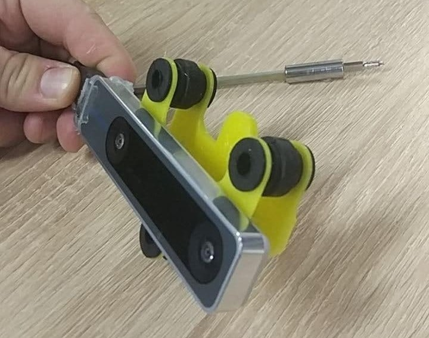

# Drones to fight Corona

[CopterHack-2021](copterhack2021.md)

team: **Drones to fight Corona**

## Team

* Daria Miklashevskaya
[d.miklashevskaya@innopolis.ru](mailto:d.miklashevskaya@innopolis.ru)
* Yuriy Sukhorukov
[y.suhorukov@innopolis.ru](mailto:y.suhorukov@innopolis.ru)

Innopolis University, B17-DS-II, B17-RO-I

## Introduction

The world faces the worst pandemic of XXI century, which affects lives and well-being of millions of citizens. To slow down the spread of the disease and give the healthcare system to react, people are obliged to wear masks, however, people sometimes ignore those rules, which puts lives of others under the threat.

There are laws in place to enforce mask wearing, but there is just not enough cops to monitor the situation in every mall, bus station etc and fine the law-breakers. We want to contribute to the solution of this problem, but instead of punishing people, we want to provide them with mask with our super-friendly and cute drone.

## Custom airframe

Since we do not have the Clover drone, we will use an airframe built and designed by us. Our system is designed to be platform-independent, so it can be installed on almost everything, even VTOL aircrafts.

The main idea is to use truss structure, because it works well against twisting and warping, besides, it can be assembled out of carbon tubes relatively easily.

The main advantage of such a system is that it distributes the impact between beams and effectively dissipates it. Engine mounts, however, are not impact-proof because they are specifically designed to break but save much more expensive and not-readily-available engines. This is why mounts are quickly-replaceable (only 3 screws) and made of cheap PLA plastic.

The space inside the central rhombus is occupied by the on-board equipment: batteries, PX4 flight controller, Jetson Xavier NX / AGX, power electronics, sensory equipment.

As it is shown on this picture, computers can be mounted on the bottom and completely protected by legs and the truss structure from any collision damage. Jetson AGX is marked with arrow. Almost invisible, isn't it?

All sensory equipment, like cameras, rangefinder, etc can be easily mounted on the beams with special bracket connectors. This type of connection provides flexibility because you can fine-tune camera angle or position before tightening screws and fixing it firmly in place, which is especially relevant for tracker-cameras.

We used one T-265 camera for visual odometry and one D-435 depth camera for both video input for neural net and for map-building (collision avoidance). T-265 suffers from "odometry drift" especially when engines are beat-up, which eventually happens after a number of crashes, so we have incorporated dampers to solve this problem.

Finally, the drone with all equipment installed looks like this

## Software

Thus far we discussed things which are specific to our custom airframe. Things we are going to discuss next are applicable for Clover drone as well. Our software is containerized so it can be launched on every platform that supports Docker, be it Windows machine, Linux machine, Jetson or Raspberry Pi.

We have split our drone software into two modules:

* Pipeline, which manages communication with ROS.
* Neural net module, which talks with the pipeline via sockets.

The reason for this is simple - ROS supports only Python 2, and I do not feel like I'm building ROS with Python 3 because it is a bit troublesome. Our neural net, on the other hand, uses Pytorch which is Python 3 only, so the only way to run them both is to use inter-process communication of some sort.

Apart from compatibility issue, such an arrangement allows us to run inference module anywhere we want, e.g. on more powerful desktop PC or even somewhere in the cloud (google collab? Why not!).

This means that we can make our drone lighter by excluding heavy on-board computer and replacing it with something light like Raspberry Pi. Pipeline image is made as lightweight as possible, so it should be runnable even on really weak computers.

More detailed instructions on how to build and run our software are available in our [Gitlab repo](https://gitlab.com/k0t1k/thegreateye/-/tree/master).

## Neural net [^1]

We use 3rd version of YoLo neural network, pretrained on custom dataset for 50 epochs.

It runs 10-15 FPS on Jetson NX, which is enough for our task

## Exploration and collision avoidance

To make our drone useful and to operate it safely, we should somehow make the drone aware of its current position and surrounding objects. There are two ways we can solve this problem

* Use pre-built map as a ground truth and then calculate the position with e.g. Particle Filter
* Build map on-the-fly, while avoiding collisions and moving towards the goal

The second approach is more robust, because it does not rely on any external map, which can be erroneous or just missing and hence we opted for it.

We use a path planner, described in [^2]. In this paper Receding
Horizon Next-Best-View Planner is presented, which uses Rapidly-exploring Random trees to navigate and explore the environment. It yields the following results, here is the occupancy map and the corresponding tunnel as it is seen by human being:

  
  

The algorithm is lightweight, so even the small computer like Latte Panda can run it with high enough frequency, and since it is CPU-bound, it will not compete for resources with the neural net, which is almost entirely GPU-bound.

## Mask release

Detecting people without masks is cool, no doubt.

But we want not only to detect them but to give him a mask as well, so, we have built this system that can give a mask to person.

  
  

This device looks like a regular firearm mag, and functions exactly in the same way. Masks can be loaded into containers made out of 20ml syringe barrels.

This device needs further engineering because current iterations are too fragile and unreliable, probably the best solution will be to use linear actuator and push the "casing" out of the action, like in actual firearm.

## 3D models

All the 3D models used to build this cute drone can be found in our [gdrive](https://drive.google.com/drive/folders/1tR5ePX24_i9tpllOPMcnZIUfse89c1YI?usp=sharing).

## Final thoughts

We all hope that Corona crisis will soon be over, and when it will be finally over, our drones will be still useful. We can deliver some small objects, like cosmetics or shaving blades to the customers' door, the task that currently is done by a human courier. This service (with shaving blades), when a guy comes and brings a new set of shaving blades every week is very popular in US and UK, so why not try to automate it.

This is an MVP, so some improvements are to be done. For example, payload refill and battery swaps are done manually for now, but this task should be automated. Actually, some work is already done in this direction:

Drone lands on a landing platform with special hooks which will connect to four metallic contacts (highlighted) and charge the battery. In future we want to change battery, not just charge it, but the mechanism is very complex and requires making custom batteries and battery mounts, also, it constraints placement of cameras, payload and so on.

For the general-purpose delivery drone, the working principle and hardware will remain the same, but software (neural net detector) will need an update.

Stay safe folks!

## References

[^1]: Massagué Respall, Victor & Devitt, Dmitry & Fedorenko, Roman. (2020). Unmanned Aerial Vehicle Path Planning for Exploration Mapping. 1-6. 10.1109/NIR50484.2020.9290232.
[^2]: Nisarg Pethani & Harshal Vora. (2020) https://github.com/NisargPethani/Face-Mask-Detection-using-YOLO-v3
