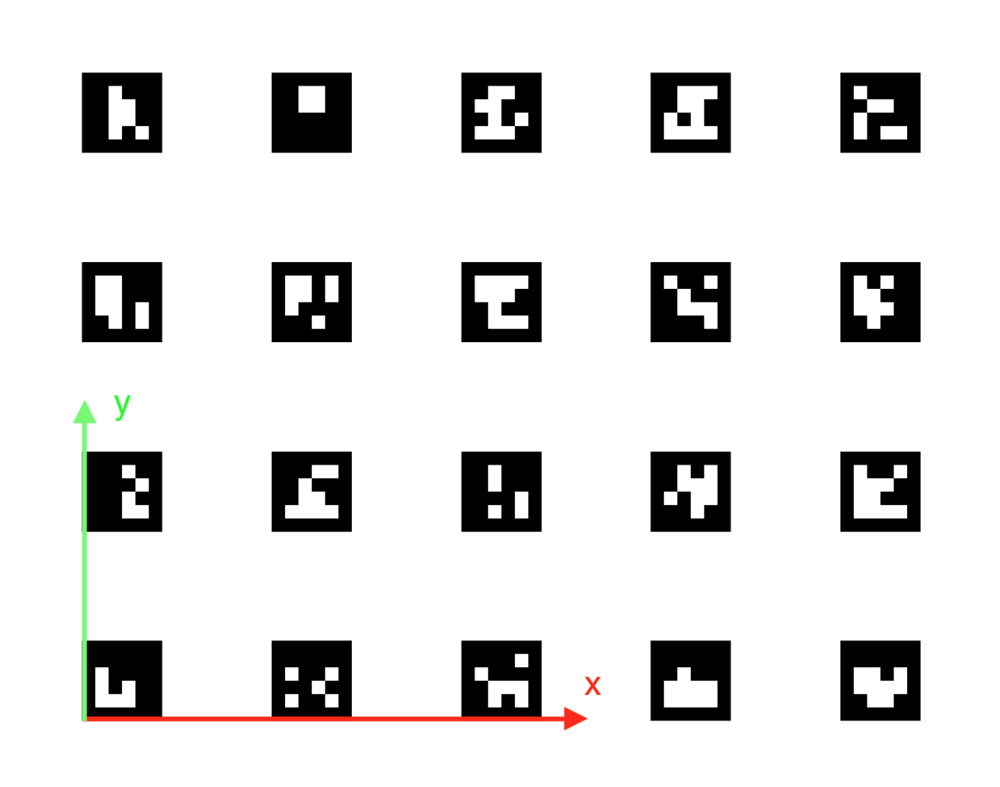

# Navigation using ArUco markers

> **Note** Documentation for the versions [of image](microsd_images.md), starting with **0.15**. For earlier versions, see [documentation for version **0.14**](https://github.com/CopterExpress/clever/blob/v0.14/docs/ru/aruco.md).

[ArUco-Markers](https://docs.opencv.org/3.2.0/d5/dae/tutorial_aruco_detection.html) is a popular technology for positioning
robotic systems using computer vision.

Examples of ArUco markers:


> **Hint** Use the most matte paper for printing visual markers. Glossy paper may glitter in the light, severely deteriorating the quality of recognition.

For rapid generation of markers for printing, you may use an online tool: http://chev.me/arucogen/.

## aruco\_pose

The `aruco_pose` module allows restoring the position of the copter relative to the map of ArUco markers and communicating it to the flight controller using the [Vision Position Estimation](https://dev.px4.io/en/ros/external_position_estimation.html) mechanism.

If the source of the copter position by the markers is available, the option appears for precise autonomous indoor navigation by the positions using the [simple_offboard](simple_offboard.md) module.

### Turning on

Make sure that in the clever launch file \(`~/catkin_ws/src/clever/clever/launch/clever.launch`\), the start of aruco\_pose and [computer vision cameras](camera.md) is turned on:

```xml
<arg name="main_camera" default="true"/>
```

```xml
<arg name="aruco" default="true"/>
```

After the launch-file is edited, restart package `clever`:

```(bash)
sudo systemctl restart clever
```

### Calibrating the ArUco marker map

An automatically generated [ArUco-board](https://docs.opencv.org/trunk/db/da9/tutorial_aruco_board_detection.html) may be used as a map of marks.

The map of marks is adjusted using file `~/catkin_ws/src/clever/clever/launch/aruco.launch`. To use ArUco-board, enter its parameters:

```xml
<node pkg="nodelet" type="nodelet" name="aruco_pose" args="load aruco_pose/aruco_pose nodelet_manager">
    <param name="frame_id" value="aruco_map_raw"/>
    <!-- the type of the marker field -->
    <param name="type" value="gridboard"/>

    <!-- the number of markets along x -->
    <param name="markers_x" value="1"/>

    <!-- the number of markers along y -->
    <param name="markers_y" value="6"/>

    <!-- ID of the first marker (left top) -->
    <param name="first_marker" value="240"/>

    <!-- the length of the marker side in meters -->
    <param name="markers_side" value="0.3362"/>

    <!-- distance between the murders -->
    <param name="markers_sep" value="0.46"/>
</node>
```

The vertical and horizontal distance between the markers may be set separately:

```xml
<!-- the horizontal distance between the markers -->
<param name="markers_sep_x" value="0.97"/>

<!-- the vertical distance between the marker -->
<param name="markers_sep_y" value="1.435"/>
```

If a map with a custom order of marker IDs is used, parameter `marker_ids` may be used:

```xml
<rosparam param="marker_ids">[5, 7, 9, 11, 13, 15]</rosparam>
```

The markers are numbered from the top left corner of the field.

For monitoring the map that is currently used by the copter for navigation, one can watch the content of topic `aruco_pose/map_image`. In a browser, it may be viewed with [web\_video\_server](web_video_server.md) by following the link [http://192.168.11.1:8080/snapshot?topic=/aruco\_pose/map\_image](http://192.168.11.1:8080/snapshot?topic=/aruco_pose/map_image):


When flying, make sure that the markers glued to the floor correspond to the map.

In topic `aruco_pose/debug` \([http://192.168.11.1:8080/snapshot?topic=/aruco\_pose/debug](http://192.168.11.1:8080/snapshot?topic=/aruco_pose/debug)\) the current result of markers recognitions is available:

TODO

### The system of coordinates

According to [agreement](http://www.ros.org/reps/rep-0103.html), the standard ENU system of coordinates is used in the marker field:

* x — rightward \(conditional East\);
* y — forward \(conditional North\);
* z — upward.

_Note_: the definition above is provided for a situation when the marker field is on the floor.

First, the zero is the bottom left point of the marker field. The yaw angle is considered zero when the copter is faced rightward\(along the x-axis\).



### Configuring the flight controller

Correct Vision Position Estimation requires making sure \(via [QGroundControl](gcs_bridge.md)\) that:

* **For Pixhawk**: Firmware with LPE \(local position estimator\) is installed. For Pixhawk [download firmware `px4fmu-v2_lpe.px4`](https://github.com/PX4/Firmware/releases).

  **For Pixracer**: parameter `SYS_MC_EST_GROUP` should be set to`local_position_estimator, attitude_estimator_q`.

  > **Note** After changing the value of parameter `SYS_MC_EST_GROUP` restart the flight controller.
* In parameter `LPE_FUSION` **only** flags `vision position`, `land detector` are enabled. The final value _20_.
* Compass disabled: `ATT_W_MAG` = 0
* Complimentary filter external heading weight: `ATT_W_EXT_HDG` = 0.5
* Orientation by yaw by vision enabled: `ATT_EXT_HDG_M` = 2 `MOCAP`.
* VPE settings: `LPE_VIS_DELAY` = 0 sec, `LPE_VIS_XY` = 0.1 m, `LPE_VIS_Z` = 0.15 m.
* Recommended settings for land detector:
  * `COM_DISARM_LAND` = 1 s
  * `LNDMC_ROT_MAX` = 45 deg
  * `LNDMC_THR_RANGE` = 0.5
  * `LNDMC_Z_VEL_MAX` = 1 m/s

<!--
For the ease of configuring, you may use a ready settings file for [Clever 2](https://github.com/CopterExpress/clever/blob/master/docs/assets/Clever2LPE_160118.params) or for [Clever 3](https://github.com/CopterExpress/clever/blob/master/docs/assets/Clever3_LPE_020218.params) and upload it to the controller using menu Tools - Load from file in tab Parameters in QGroundControl.


-->

### Flight

A properly configured copter starts holding position by VPE \(in [modes](modes.md) `POSCTL` or `OFFBOARD`\) automatically.

For [autonomous flights](simple_offboard.md) do you will be able to use functions `navigate`, `set_position`, `set_velocity`. For flying to specific coordinates of the marker field, use frame `aruco_map`:

```python
# First, the copter has to take off to see the map of marks
# and for frame aruco_map to appear:
navigate(0, 0, 2, frame_id='body', speed=0.5, auto_arm=True) #  take off to the altitude of 2 meters

time.sleep(5)

# Flying to coordinate 2:2 of the marker field at the altitude of 2 meters
navigate(2, 2, 2, speed=1, frame_id='aruco_map')  #  flying to coordinate 2:2 at the altitude of 3 meters
```

See [other functions](simple_offboard.md) simple_offboard.

### Location of markers on the ceiling


To navigate by the markers placed on the ceiling, you need to set the main camera facing up and [set the corresponding frame of the camera](camera_frame.md).

To set the map of markers in a "turned over" system of coordinates, change parameter `aruco_orientation` in  file `~/catkin_ws/src/clever/clever/aruco.launch`:

```xml
<param name="aruco_orientation" value="map_upside_down"/>
```

When this parameter is set, frame aruco\_map will also be "turned over". Thus, to fly at the altitude of 2 meters below the ceiling, argument `z` should be set to 2:

```python
navigate(x=1, y=2, z=1.1, speed=0.5, frame_id='aruco_map')
