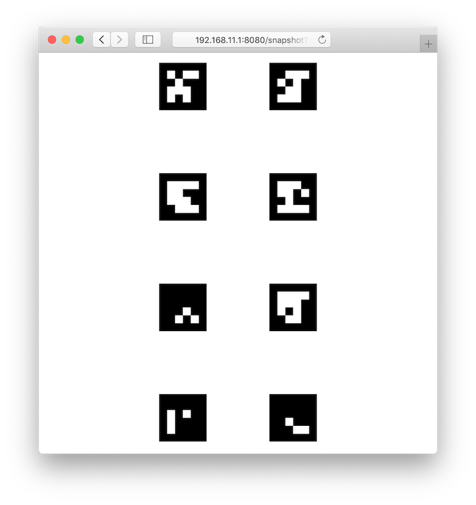
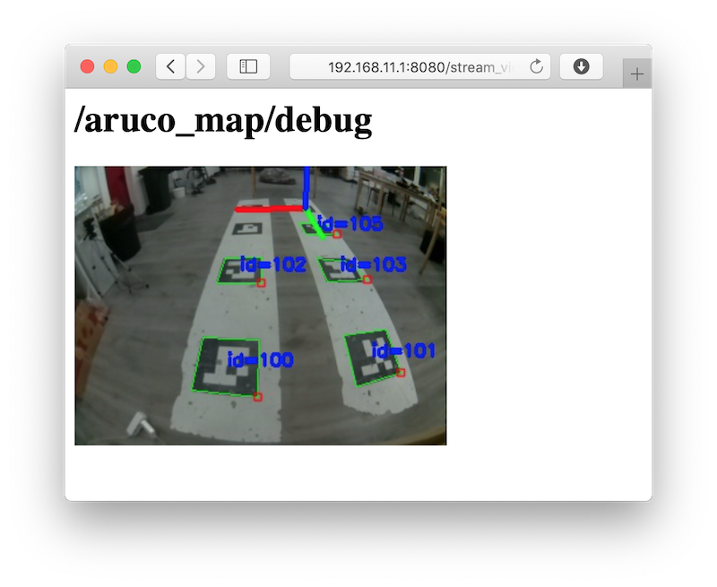
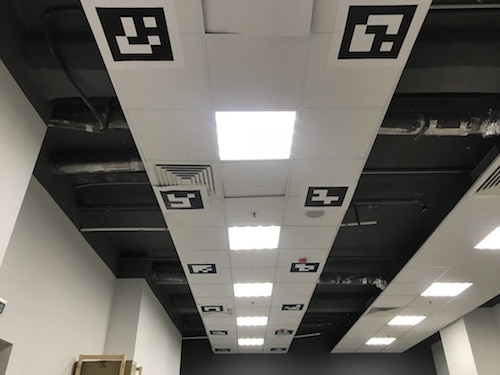

# Map-based navigation with ArUco markers

> **Note** The following applies to [image versions](image.md) **0.22** and up. Older documentation is still available for [for version **0.20**](https://github.com/CopterExpress/clover/blob/v0.20/docs/en/aruco_map.md).

<!-- -->

> **Info** Marker detection requires the camera module to be correctly plugged in and [configured](camera_setup.md).

<!-- -->

> **Hint** We recommend using our [custom PX4 firmware](firmware.md).

`aruco_map` module detects whole ArUco-based maps. Map-based navigation is possible using vision position estimate (VPE).

## Configuration

Set the `aruco` argument in `~/catkin_ws/src/clover/clover/launch/clover.launch` to `true`:

```xml
<arg name="aruco" default="true"/>
```

In order to enable map detection set `aruco_map` and `aruco_detect` arguments to `true` in `~/catkin_ws/src/clover/clover/launch/aruco.launch`:

```xml
<arg name="aruco_detect" default="true"/>
<arg name="aruco_map" default="true"/>
```

Set `aruco_vpe` to `true` to publish detected camera position to the flight controller as VPE data:

```xml
<arg name="aruco_vpe" default="true"/>
```

## Marker map definition

Map is defined in a text file; each line has the following format:

```
marker_id marker_size x y z z_angle y_angle x_angle
```

`N_angle` is the angle of rotation along the `N` axis in radians.

Map files are located at the `~/catkin_ws/src/clover/aruco_pose/map` directory. Map file name is defined in the `map` argument:

```xml
<arg name="map" default="map.txt"/>
```

Some map examples are provided in [the directory](https://github.com/CopterExpress/clover/tree/master/aruco_pose/map).

Grid maps may be generated using the `genmap.py` script:

```bash
rosrun aruco_pose genmap.py length x y dist_x dist_y first -o test_map.txt
```

`length` is the size of each marker, `x` is the marker count along the *x* axis, `y` is the marker count along the *y* axis, `dist_x` is the distance between the centers of adjacent markers along the *x* axis, `dist_y` is the distance between the centers of the *y* axis, `first` is the ID of the first marker (top left marker, unless `--bottom-left` is specified), `test_map.txt` is the name of the generated map file. The optional `--bottom-left` parameter changes the numbering of markers, making the bottom left marker the first one.

Usage example:

```bash
rosrun aruco_pose genmap.py 0.33 2 4 1 1 0 -o test_map.txt
```

Additional information on the utility can be obtained using `-h` key: `rosrun aruco_pose genmap.py -h`.

<!-- You can also use the [online map editor](arucogenmap.md) to create ArUco maps. -->

### Checking the map

The currently active map is posted in the `/aruco_map/image` ROS topic. It can be viewed using [web_video_server](web_video_server.md) by opening the following link: http://192.168.11.1:8080/snapshot?topic=/aruco_map/image



Current estimated pose (relative to the detected map) is published in the `aruco_map/pose` ROS topic. If the VPE is disabled, the `aruco_map` [TF frame](frames.md) is created; otherwise, the `aruco_map_detected` frame is created instead. Visualization for the current map is also posted in the `aruco_map/visualization` ROS topic; it may be visualized in [rviz](rviz.md).

An easy to understand detected map visualization is posted in the `aruco_map/debug` ROS topic (live view is available on http://192.168.11.1:8080/stream_viewer?topic=/aruco_map/debug):



## Coordinate system

The marker map adheres to the [ROS coordinate system convention](http://www.ros.org/reps/rep-0103.html), using the <abbr title="East-North-Up">ENU</abbr> coordinate system:

* the **<font color=red>x</font>** axis points to the right side of the map;
* the **<font color=green>y</font>** axis points to the top side of the map;
* the **<font color=blue>z</font>** axis points outwards from the plane of the marker


## VPE setup

In order to enable vision position estimation you should use the following [PX4 parameters](px4_parameters.md).

If you're using **LPE** (`SYS_MC_EST_GROUP` parameter is set to `local_position_estimator,attitude_estimator_q`):

* `LPE_FUSION` should have `vision position` and `land detector` flags set. We suggest unsetting the `baro` flag for indoor flights.
* External heading (yaw) weight: `ATT_W_EXT_HDG` = 0.5.
* External heading (yaw) mode: `ATT_EXT_HDG_M` = 1 (`Vision`).
* Vision position standard deviations: `LPE_VIS_XY` = 0.1 m, `LPE_VIS_Z` = 0.1 m.
* `LPE_VIS_DELAY` = 0 sec.

<!-- * Compass should not be fused: `ATT_W_MAG` = 0 -->

If you're using **EKF2** estimator (`SYS_MC_EST_GROUP` parameter is set to `ekf2`), make sure the following is set:

* `EKF2_AID_MASK` should have `vision position fusion` and `vision yaw fusion` flags set.
* Vision angle observations noise: `EKF2_EVA_NOISE` = 0.1 rad.
* Vision position observations noise: `EKF2_EVP_NOISE` = 0.1 m.
* `EKF2_EV_DELAY` = 0.

> **Hint** We recommend using **LPE** for marker-based navigation.

You may use [the `selfcheck.py` utility](selfcheck.md) to check your settings.

> **Hint** In order to use LPE with the Pixhawk v1 hardware you should download the [`px4fmu-v2_lpe.px4` firmware](firmware.md)

## Flight

If the setup is done correctly, the drone will hold its position in `POSCTL` and `OFFBOARD` [flight modes](modes.md) automatically.

You will also be able to use `navigate`, `set_position` and `set_velocity` ROS services for [autonomous flights](simple_offboard.md). In order to fly to a specific coordinate within the ArUco map you should use the `aruco_map` frame:

```python
# Takeoff should be performed in the "body" frame; "aruco_map" frame will appear as soon as the drone detects the marker field
navigate(x=0, y=0, z=2, frame_id='body', speed=0.5, auto_arm=True) # Takeoff and hover 2 metres above the ground

time.sleep(5)

# Fly to the (2, 2) point on the marker field while being 2 metres above it
navigate(x=2, y=2, z=2, speed=1, frame_id='aruco_map')
```

### Using a specific marker frame

Starting with the [image](image.md) version 0.18, the drone also can fly relative to a marker in the map, even if it is not currently visible. Like with [single-marker navigation](aruco_marker.md#working-with-detected-markers), this works by setting the frame_id parameter to aruco_ID, where ID is the desired marker number.

The following code will move the drone to the point 1 meter above the center of marker 5:

```python
navigate(frame_id='aruco_5', x=0, y=0, z=1)
```

## Additional settings

If the drone's position is not stable when VPE is used, try increasing the *P* term in the velocity PID regulator: increase the `MPC_XY_VEL_P` and `MPC_Z_VEL_P` parameters.

If the drone's altitude is not stable, try increasing the `MPC_Z_VEL_P` parameter and adjusting hover thrust via `MPC_THR_HOVER`.

## Placing markers on the ceiling



In order to navigate using markers on the ceiling, mount the onboard camera so that it points up and [adjust the camera frame accordingly](camera_setup.md).

You should also set the `placement` parameter to `ceiling` in `~/catkin_ws/src/clover/clover/launch/aruco.launch`:

```xml
<arg name="placement" default="ceiling"/>
```

With such a camera orientation the [Optical Flow](optical_flow.md) technology cannot work, so it should be disabled in the `~/catkin_ws/src/clover/clover/launch/clover.launch` file:

```xml
<arg name="optical_flow" default="false"/>
```

Such setup will flip the `aruco_map` frame (making its **<font color=blue>z</font>** axis point downward). Thus, in order to fly 2 metres below ceiling, the `z` argument for the `navigate` service should be set to 2:

```python
navigate(x=1, y=1.1, z=2, speed=0.5, frame_id='aruco_map')
```
