Clover 2 construction kit assembly instruction
============================================

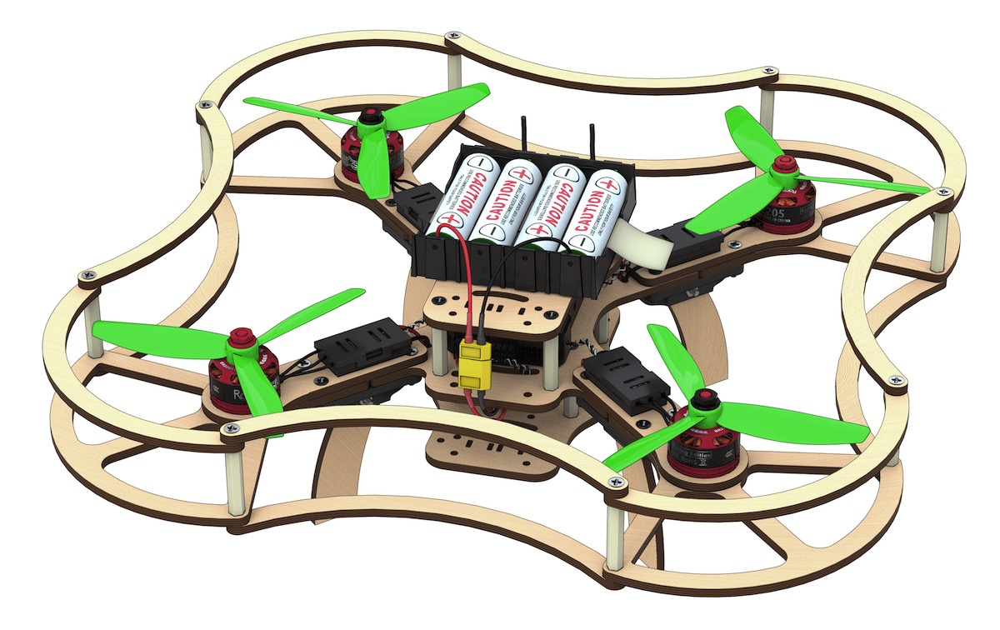

## The constructor kit contents

* Central frame ×2.
* Additional frame ×4.
* Motor mount ×8.
* Legs x8.
* Motor mount guard ×8.
* Propeller guard ×16.
* Side guard ×16.
* Dalprop 5045 plastic propeller ×4.
* Racerstar BR2205 2300kV brushless motor ×4.
* Speed controllers ESC, DYS XSD20A ×4.
* Power controller XT60 pin ×1.
* Power connector XT60 socket ×1.
* Three-wire female-female flat cable ×2.
* Multicore silicone insulated copper wire 14AWG (red, black), 50 cm long
* Power distribution board PDB BeeRotor Power Distribution Board V2.0 ×1.
* Li-ion rechargeable battery (battery) 18650 ×8.
* EFEST Luc V4 Li-lon Charger ×1.
* Protective case for regulators ×4.
* Legs attachment ×8.
* Pixhawk flight controller ×1.
* FlySky i6 radio receiver ×1.
* FlySky i6 radio transmitter ×1.
* EFEST LUC V4 Charger ×1.
* Micro USB to USB Cable ×1
* Battery compartment 18650 Li-ion ×1
* Wire copper multicore silicone insulated cable 18AWG (red, black), 100 cm long
* AA battery ×4
* Jumper, Bind-plug

### Fasteners

* 6 mm plastic legs ×28.
* 30 mm plastic legs ×32.
* M3x8 screws ×48.
* M3x12 screws ×24.
* M3x16 screws ×40.
* Plastic nuts ×8.
* Metal nuts ×48.
* Stickers for the battery compartment ×8.
* Thermal contraction tube ⌀15, .50 cm
* Thermal contraction tube ⌀5, 100 cm
* Double-sided 3M adhesive tape ×16.
* Screwdriver ×1 (visualization needed)
* Insulation tape ×1
* Scissors ×1
* Strap for the battery 250 mm ×1

## Flysky i6 transmitter

1. Switch A (SwA).
2. Switch B (SwB).
3. Switch (SwC).
4. Switch D (SwD).
5. Left stick.
6. Right stick.
7. Left trimmer.
8. Right trimmer.
9. Up button.
10. Down button.
11. OK button.
12. Cancel button.
13. BIND KEY button.
14. POWER switch.
15. LCD.
16. Handle A (VrA).
17. Handle B (VrB).

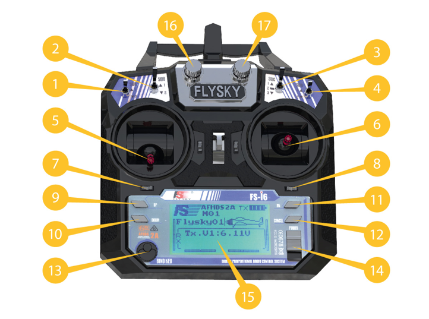

## Additional equipment

### This equipment is not part of the Clover 2 constructor kit, but it is required for the assembly process

1. Soldering iron
2. Colophony/ Flux (neutral)
3. Solder
4. Hot air gun
5. Pliers
6. Pincers
7. Stationery knife
8. Multimeter

[Soldering safety](tb.md)

## Assembly order

### Installation of motors

* Unpack the motors. Using pliers, shorten the wires on the motors by cutting half their length (leaving about 25 mm).

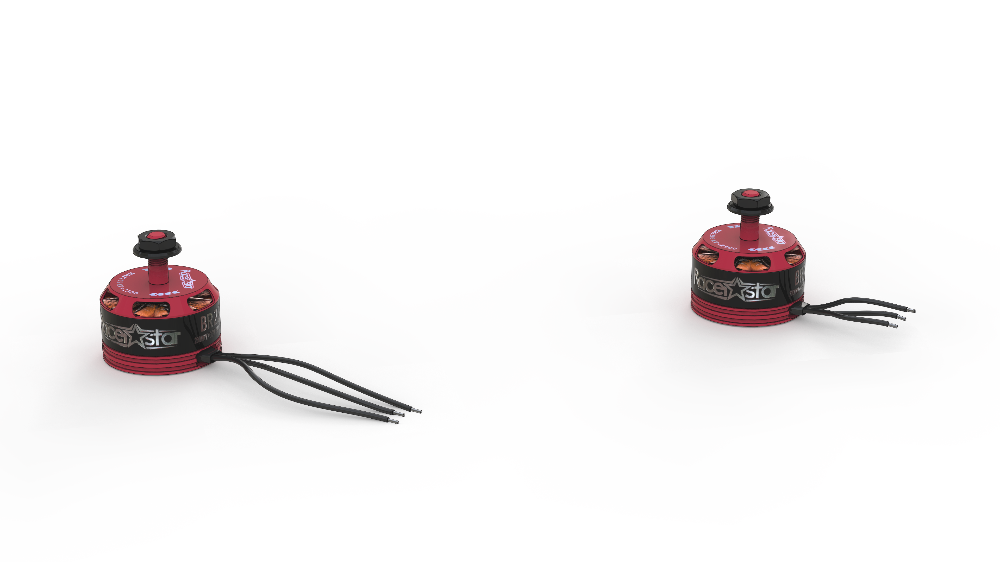

Strip

* remove 2 mm of insulation from the ends of the wire without damaging the copper strands.

Twist the wires.

Tin wires

* Apply flux to the exposed part of the wire.
* Cover the solder using tweezers.

#### Fix the motor on the mount

* Install the motor on the engraved side of the mount.
* Attach the motors to the mounts with M3x8 screws using a screwdriver.

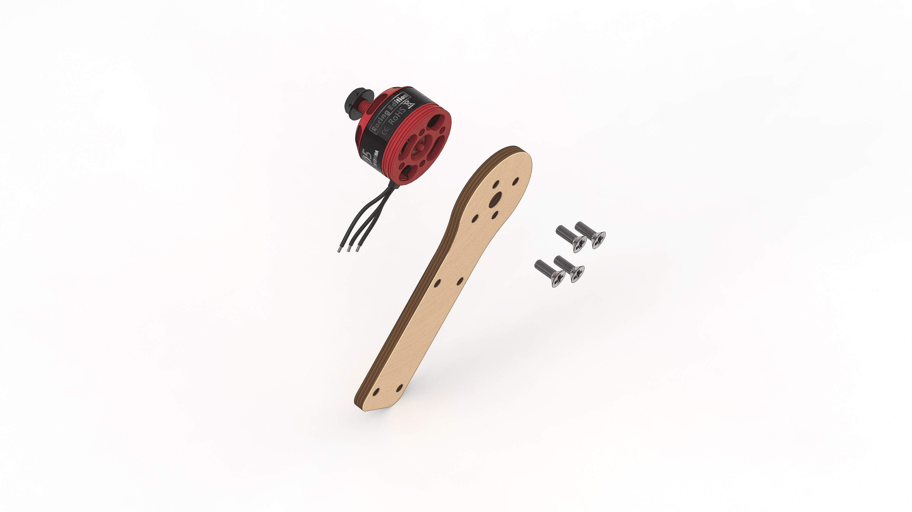

* Mounts with motors should be arranged according to the diagram. The arrows indicate the direction of motor rotation direction.

### Tin three contact pads of the speed controller

* Apply flux
* Apply solder

By warming up the contact pads of the controller, the tin will evenly fill the entire pad. To do so, apply heat by holding the soldering iron on the contact pads for 2 sencods (or more if needed).

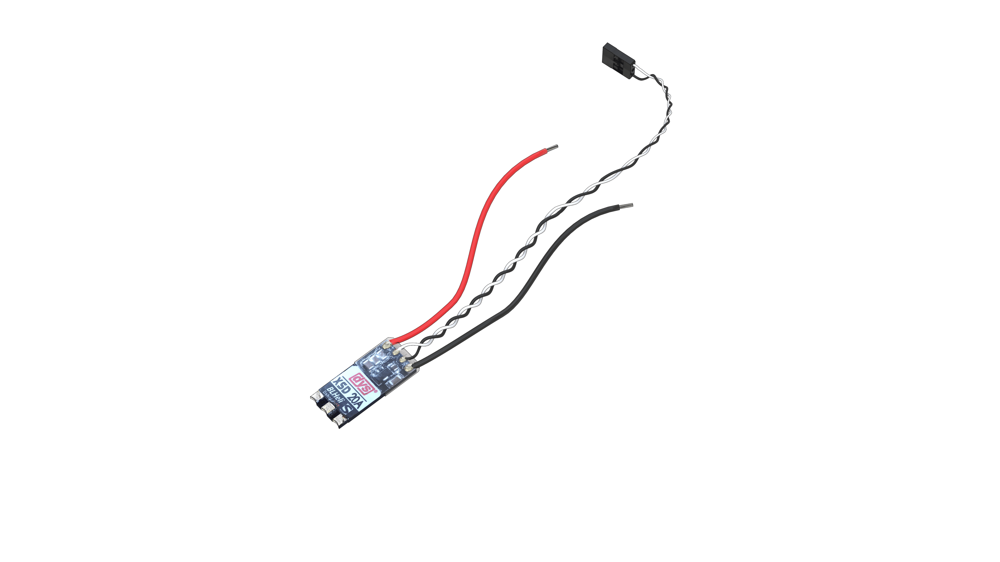

* Repeat this operation for the remaining three ESC

### Solder the wires of the motors to the ESC

Solder the prepared wires of the motors to the pads of the controllers.

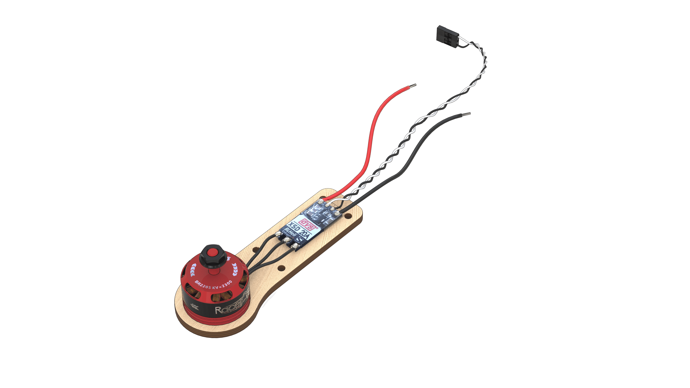

* Repeat this operation for the remaining three ESC

### Power connectors installation

#### Preparing wires for XT60 power connectors

1. Take a bundle of red and black wires marked 14AWG
2. Cut 4 pieces of wire of the following lengths

* Length 7 cm (XT60 pin power connector) - 1 red, 1 black
* Length 9 cm (XT60 socket power connector) - 1 red, 1 black

#### Preparing XT60 pin and XT60 socket high-power connectors

[Article about high-power connectors and their designations](connectortypes.md)

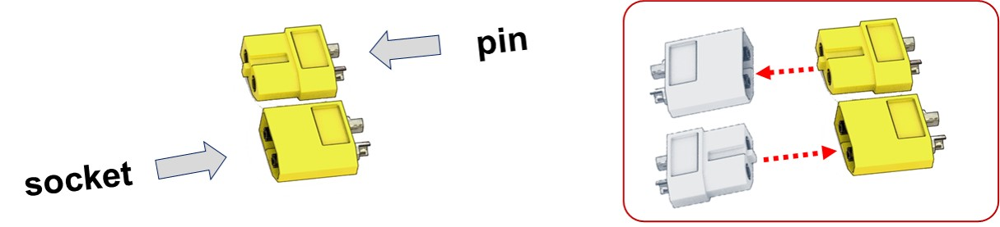

1. Tin two red and black 14AWG 7 cm long power wires for the XT60 pin connector.
2. Tin contact pads of the XT60 pin connector.
3. Solder the black wire to the “-” contact of the connector.
4. Solder the red wire to the “+” contact of the connector.
5. Cut ⌀5 heat-shrink tubing (2 sections × 10 mm).
6. Slip the ⌀5 heat-shrink tubing tube on the wires so that they cover the contact pads of the wires from XT60.
7. Shrink the heat-shrink tubing with a hot air gun. 
8. Repeat the procedure for XT60 socket connector.

#### Preparation of the 5V power connectors for the control circuit

1. Trim/pull out all pins from one of the connectors. Disconnect it.
2. Using an utility knife, pry the retainer off on the remaining connector to release the 3rd wire.
3. Remove the 3rd (orange) wire from the connector, since it is not needed.
4. The length of the remaining black and red wires should be of 10 – 12 cm.

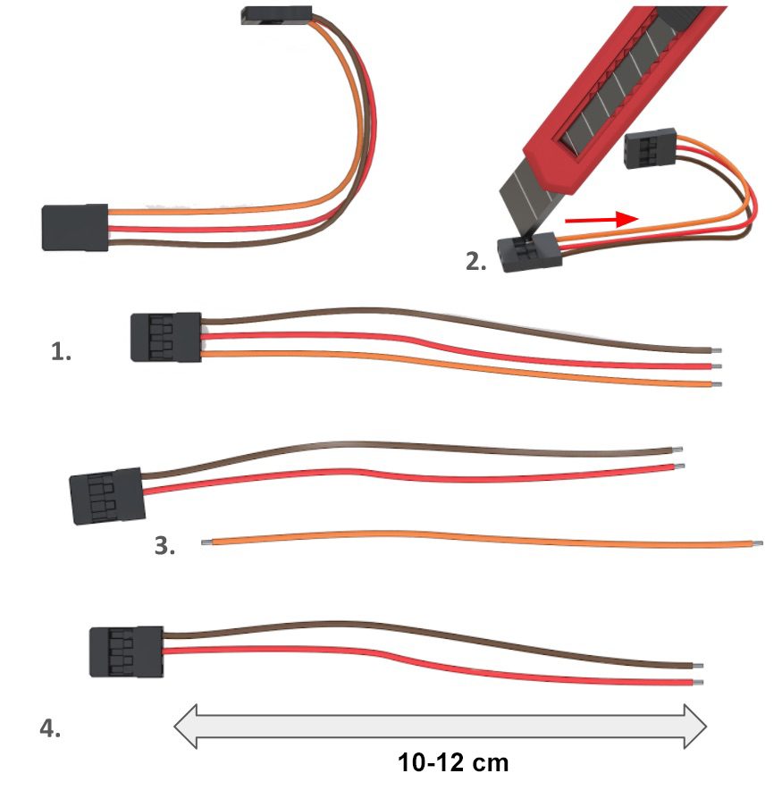

### Installation of the power distribution board

#### Pre-soldering check

[Article about continuity test](test_connection.md)

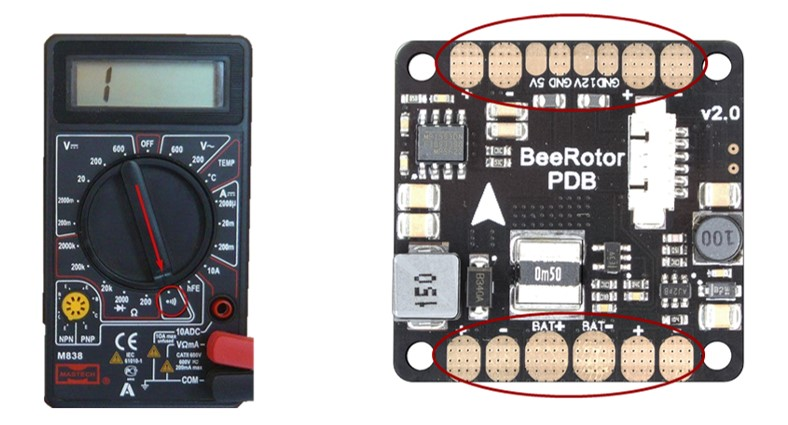

Check OPEN CONDITION of the following circuits (the multimeter does not beep):

* “BAT+” and “BAT-”
* “12V” and “GND”
* “5V” and “GND”

Check CLOSED CONDITION of the following circuits (the multimeter beeps):

* “BAT-” with every contact marked “-” and “GND”
* “BAT+”, with every contact marked “+”

### Tin the contact pads of the power board

1. [Tin*](tinning.md) the contact pads of the power board.
2. Using a multimeter, check absence of short-circuits on the PCB (check continuity).

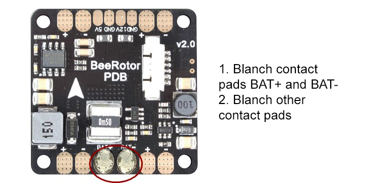

By warming up the contact pads of the controller, the tin will evenly fill the entire pad. To do so, apply heat by holding the soldering iron on the contact pads for 2 sencods (or more if needed).

#### Soldering the XT60 high power connector

Solder the connector for battery, taking into account the polarity on the contact pads.

IMPORTANT NOTE about polarity

* the red wire is “+”
* the black wire is “-”

#### Soldering of the power connector for the 5V control circuit

Solder the 5V connector, taking into account the polarity on the contact pads.
(in the picture: the red wire is “+”)

### Installation of the battery compartment

#### Preparation of jumpers (3 pcs.)

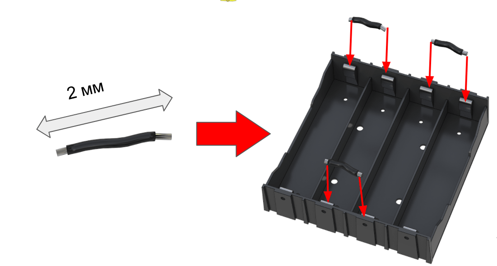

* Cut off 2 cm of high-power wire.
* Strip on both ends.
* Tin.
* Make 3 jumpers.
* Solder the jumpers according to the diagram.
* Check for continuity with a multimeter. If necessary, clean with sand paper.

#### Preparation of the battery compartment

* Conforming to the polarity, glue the sticker with markings inside the battery compartment.
* Stick a strip of adhesive tape to the bottom of the compartment.

### Installation of the power distribution board

* Fix the power board to the frame with M3x8 screws and plastic nuts. 
    > **IMPORTANT** The white arrow on the BeeRotor board points towards the fore cutout.
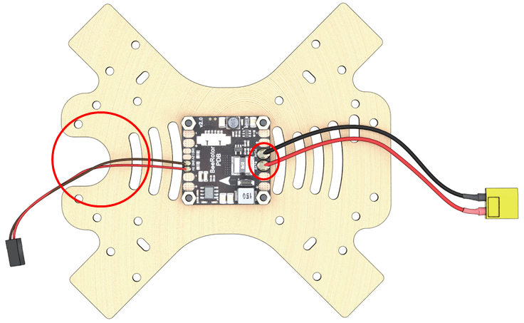

#### Installation of elements

1. Install the nuts into plastic holders. 
2. Fix the motor mounts to the frame with M3x16 screws.
    * The mounts are installed above the frame.
    * Plastic holders are installed beneath the frame. 
3. Arrangement of motors. Check arrangement of the motors (the motors with black nuts should be in the top left and lower right corners). 
4. Put the power wires of the ESC through the holes. 

#### Soldering the high-power circuit board

Solder the high-power wires of the ESC to the power supply board observing polarity.

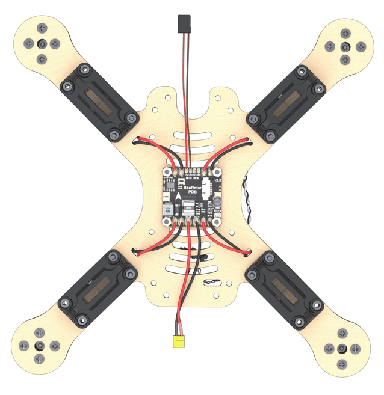

IMPORTANT NOTE about polarity

* the red wire is “+”
* the black wire is “-”

### Pairing the receiver and transmitter

1. Connect the radio receiver to the 5V connector. In any connector the GND is in the bottom. In the diagram, the power is labeled 5V 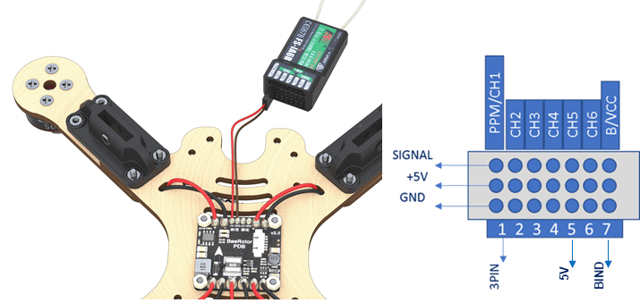
2. Connect the battery. The LED on the radio receiver should be flashing. ![Connecting the battery]

#### SAFETY when working with the battery

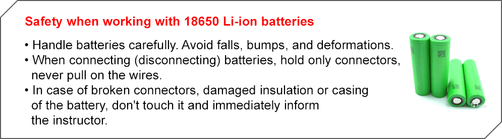

#### Enabling the transmitter

1. Insert the jumper into B/VCC of the radio receiver (short "ground" and "signal")
2. On the transmitter, hold down the BIND KEY button.
3. Power up the transmitter (flip the POWER switch, do not release BIND KEY).
4. Connect the battery to the drone.
5. Wait for synchronization.
6. Disconnect the jumper.
7. The LED will remain ON continuously.

[Radio equipment troubleshooting manual](radioerrors.md)

### Checking the motors direction of rotation

1. Apply stickers to the 18650 batteries.
2. Install the 18650 batteries into the compartment observing polarity. 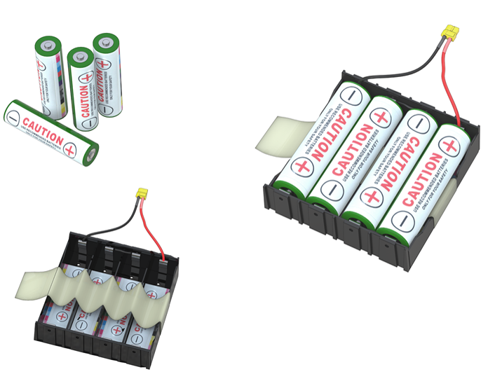
3. Check that the 5V power plug is connected to the receiver according to the circuit diagram.
4. Connect the motor ESC to channel 3, marked as CH3 on the receiver as on the circuit diagram. 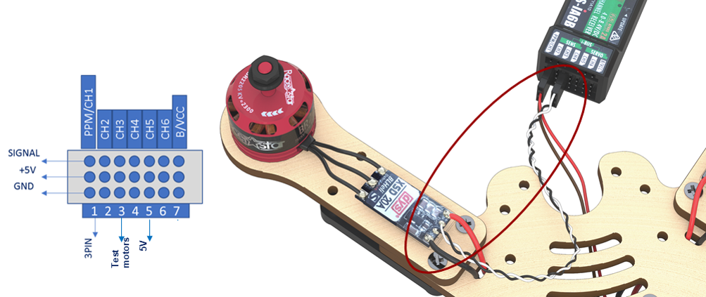
5. Connect external power (battery).
6. Turn the transmitter ON.
7. Using the left stick, set throttle to 10 %.
8. Check the motor direction of rotation according to the scheme. 
9. If you have to change the rotation direction, swap any two phase wires of the motor (needs resoldering). 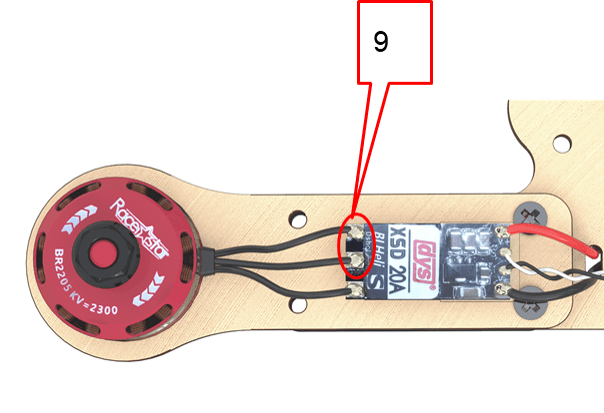

### Installation of the radio receiver

1. Install the 30 mm plastic legs on the frame with M3x8 screws.
2. Pass the 5V power connector through the slit. 
3. Attach the receiver to the bottom of the additional frame using double-sided adhesive tape and following the orientation of the engraved arrow. The antennas are to be pointing forward. 
4. Install the 3-wire flat cable into the PPM / CH1 channel. 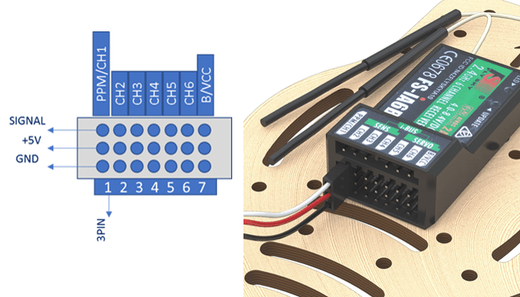
5. Pass them through the slit to the 5 V connector.
6. Screw the bottom an additional frame to the legs on the central frame with M3x8 screws. 
    > **IMPORTANT** The directions of the arrows on the power supply board and the additional frame should coincide

### Installation of the flight controller

#### Turn the assembly upside down

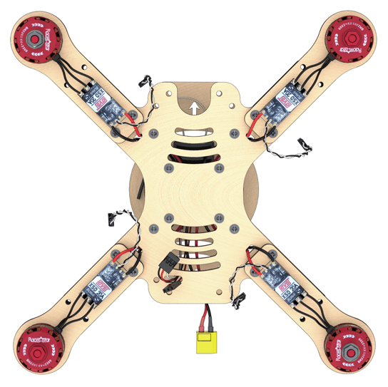

#### Installation of the Pixhawk flight controller

1. Stick the two-sided adhesive tape in the corners of the flight controller. 
    > **IMPORTANT** When the motors rotate, vibrations occur, which affect sensors of the Pixhawk flight controller. To avoid this effect, the number of double-sided tape layers
should be increased up to 4 – 5.
2. Install the flight controller in the center of the frame. 
    > **IMPORTANT** The arrows on the frame and Pixhawk should point in the same direction

#### Connecting the flight controller according to the circuit diagram

1. Connect PPM (three-wire flat cable) to the RCIN port
2. Motors to MAIN OUT ports 1,2,3,4, according to the circuit diagram
3. Power by PDB (5V/VCC) to any port except for SB (SBUS)

 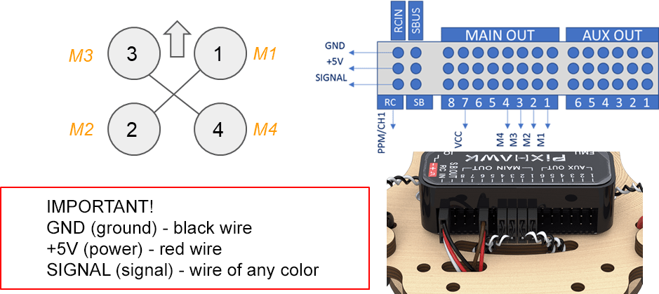

### ESC assembly

1. Stick the double-sided adhesive tape to the base of the ESC protective case 
2. Put the ESCs into protective cases. Fasten the assembly to the motor mounts of the frame. 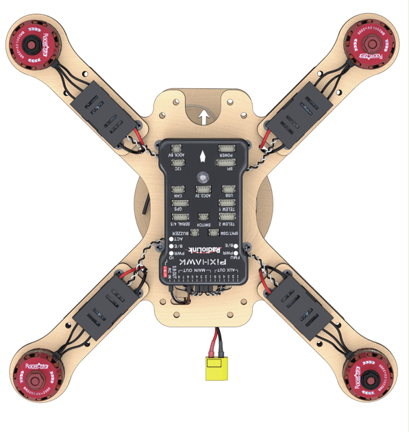

### Installation of guard

1. Attach the lower guard with M3x16 screw to the motor mounts of the frame. 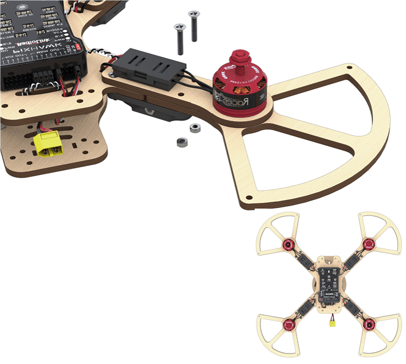
2. Attach the feet to the plastic holders with M3x16 screws. 
3. Attach the 30 mm long legs to the holes of the lower guard with M3x12 screw. 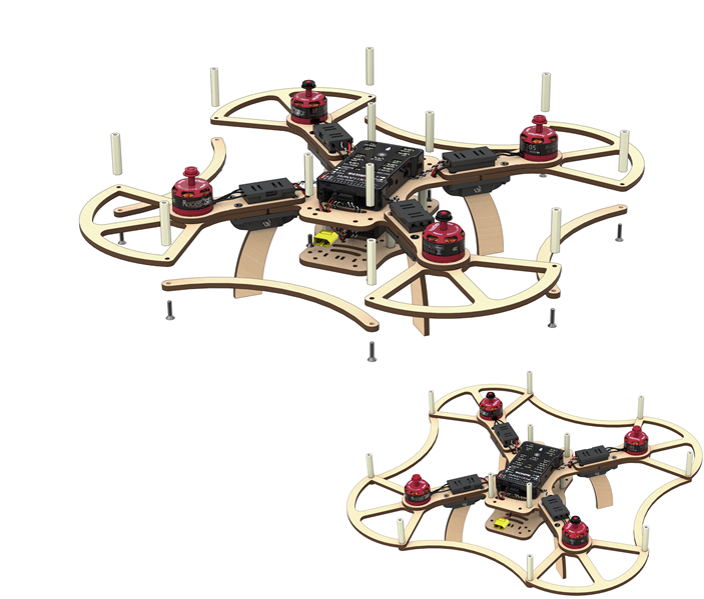
4. Attach the top guard with M3x12 screws. 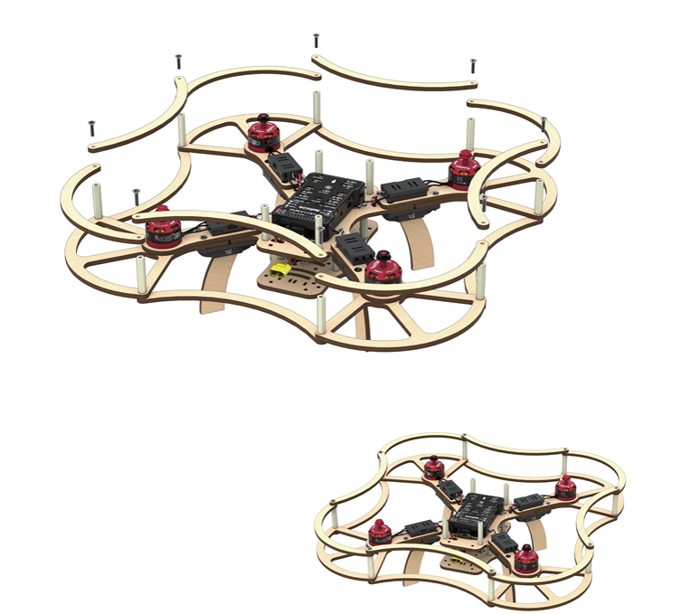

### Installation of the battery compartment

Requires the following components:

* M3x12 screws (4 pcs)
* M3 nuts (4 pcs)
* Additional frame (1 pc)
* Battery compartment (1 pc)

1. Attach the battery compartment on top of the additional frame with M3x12 screws and nuts. 
2. Attach the top additional frame to the legs with M3x8 screws. 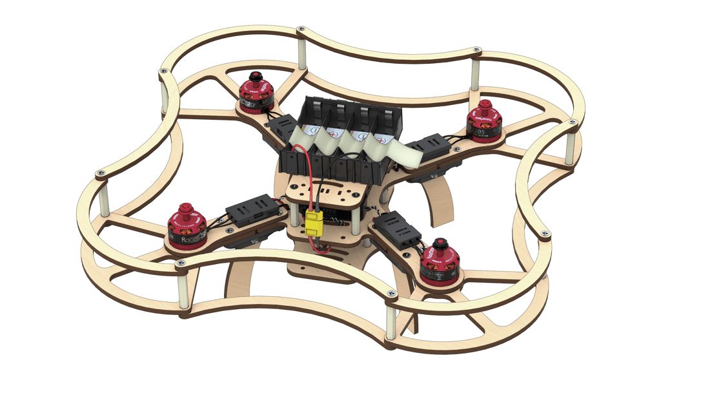
3. Install the battery into the battery compartment.

### Installation of antennas

1. Attach antennas on double-sided adhesive tape or duct tape, and put the antennae into the front holes of the top additional frame.

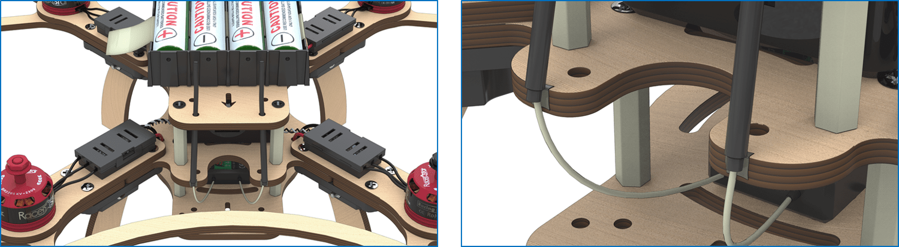

The drone is ready for configuration!

## Safety notes for assembly and configuration

1. Remove the propellers.“All ground operations are to be performed with propellers removed. Propellers are to be installed on the motors before the flight only.”
2. Disconnect the battery. Keep the power off. “Assembly, configuration, and maintenance should be performed with power disconnected. Connect power only for testing electronic components of the drone. After testing, power is to be disconnected before other works.”
3. Call for help. “If you experience problem when working with the drone, contact the instructor or the teacher, do not try to solve the problem yourself.”

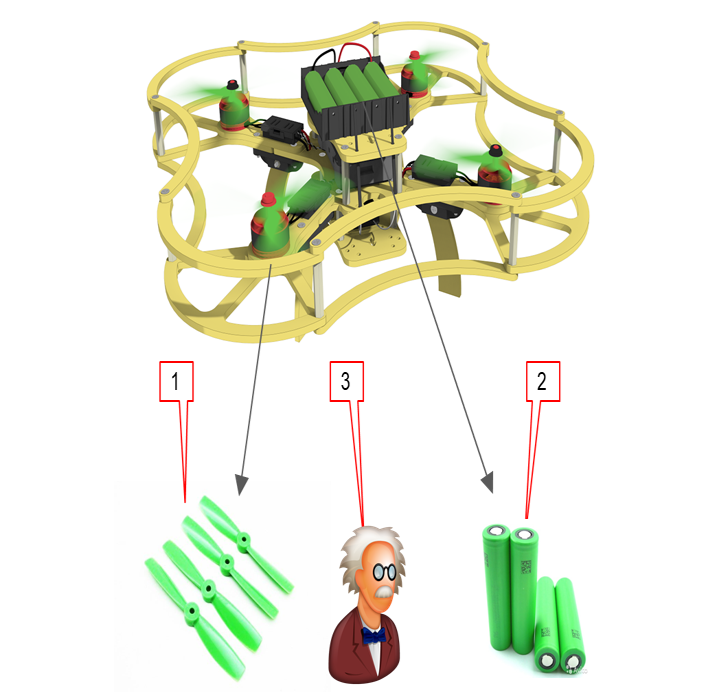

## Security when working with 18650 Li-ion batteries

1. Handle batteries carefully. Avoid falls, bumps, and deformations.
2. When connecting (disconnecting) batteries, hold only the connectors, never pull or tug the wires.
3. If you see open connectors, violation of insulation or battery compartment integrity, do not touch it, and immediately inform the instructor or teacher.

See article [safety precautions when soldering and during drone flight operation](safety.md)
