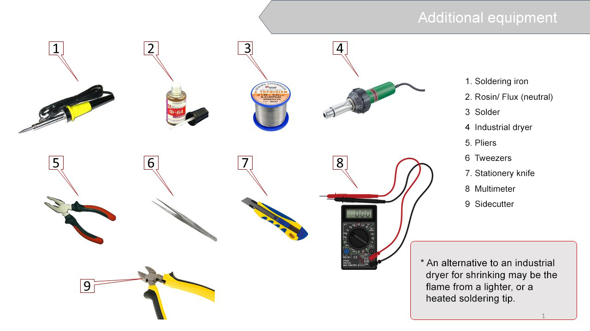
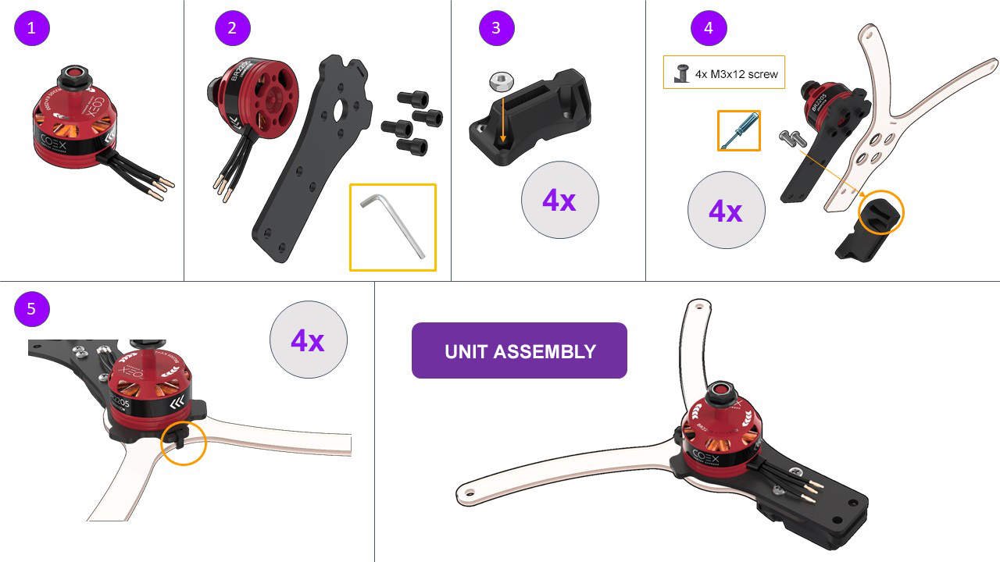
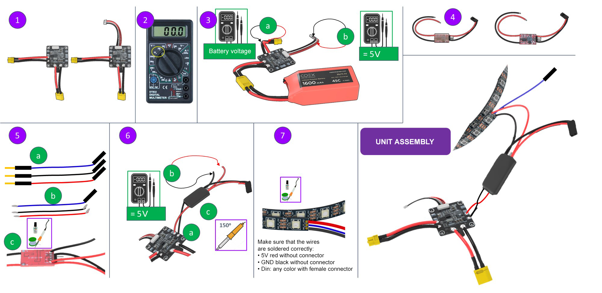
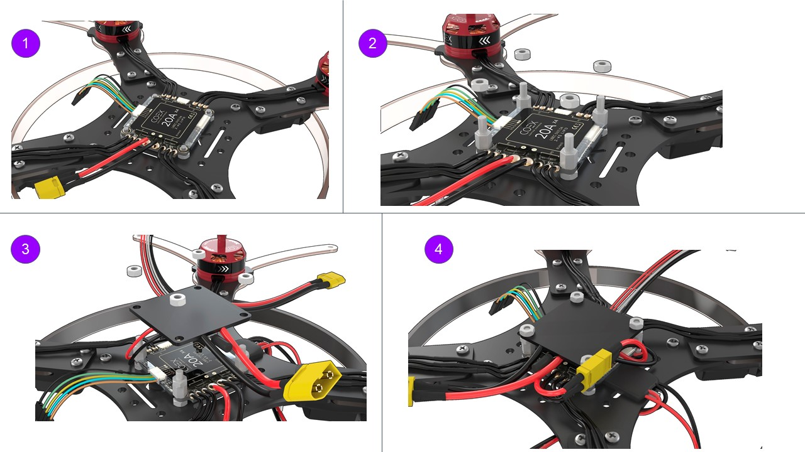
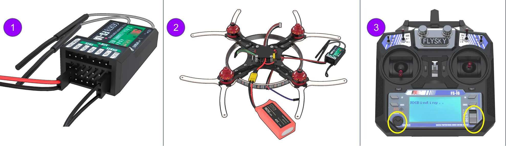
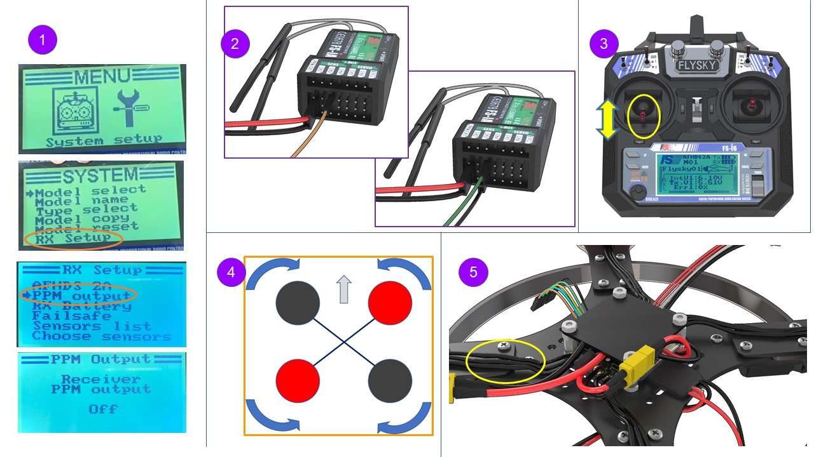
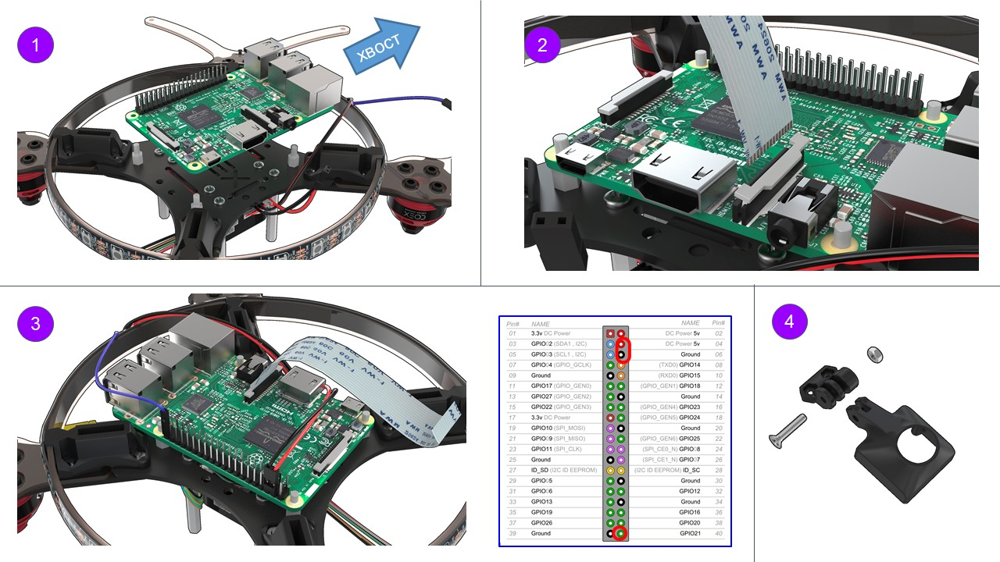
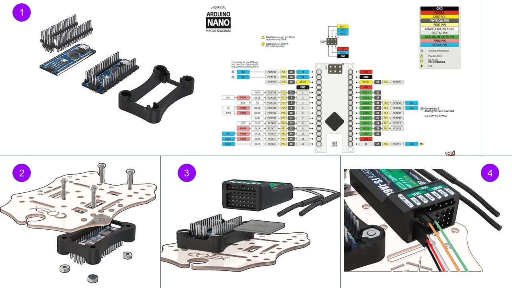
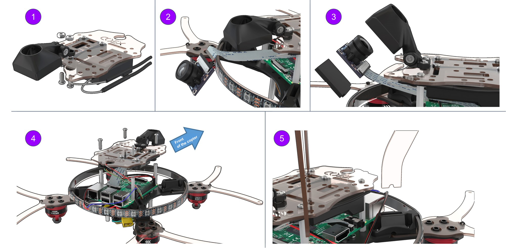

# Assembly of Clover 3

This manual discusses the assembly of the COEX Clover 3 kit with a 4 in 1 EDC circuit-board.

> **Caution** Before using soldering equipment, be sure to read the [safety precautions when soldering](tb.md).

<!--
## The drone kit contents

TODO
-->

## Additional equipment

## Conventional symbols

## Motor installation

1. Unpack the motors.
2. Attach a motor to the motor mount with M3x6 hex screws (the shortest screws supplied with the motors).

    A hex wrench is included.

3. Insert M3 nuts (4 pcs) into the plastic holder.

    The choice is yours to use a long screw or pliers.

4. Secure the motor mount, the lower motor mount guard and the holder with M3x12 screws, using a Phillips screwdriver.
5. Using a clamp connect the motor mount and its bottom guard.

    Cut the remaining part of the clamp (cable tie) with scissors.

    

## Frame elements installation

1. Insert the M3 plastic nuts (4 pcs) for mounting the PDB on the frame with M3x8 screws.
2. Install 6 mm legs (4 pcs) for attaching the Raspberry Pi to the frame with M3x8 screws.
3. Attach the assembled unit to the frame with M3x16 screws, complying with the layout.
4. Install the frame for the LED strip, using the slots in the leg holders.

## BEC voltage converter installation(to be soldered and tested)

1. Unpack the power board and install the power ribbon cable.
2. Switch the multimeter in the DC voltage measurement mode (20V or 200V range).
3. Check the correct functioning of the power board by connecting the battery.
    * Voltage measurements are to be made between black and red wires.
    * Output voltage at the XT30 connector should be equal to the battery voltage (10 V to 12.6 V).
    * The output voltage at the power ribbon cable should be between 4.9 V to 5.3 V.
4. Unpack the voltage converter and remove the transparent insulation.
5. Solder two additional wires to the BEC
    * Take 3 male-female wires from the kit (red, black, and any color)
    * The red and black wires [are to be tinned](tinning.md) on both ends using tweezers. The blue wire is to be tinned from the side of the MALE connector.

        To tin means:
        * Apply flux to the exposed part of the wire.
        * Cover with tin.

    * Solder the red and the black wires to BEC:

            BLACK -> OUT-
            RED -> OUT+

6. Check BEC functioning.
    * Solder the BEC to the power board:

            BLACK -> -
            RED -> +

    * Connect the battery and check the voltage at the wires soldered to BEC (from step 5).

        5 V - great, everything is working properly!

        more than 10 V - disconnect the power and move the yellow jumper to the other tweezers.

        0 V - not soldered properly.
    * If the BEC outputs 5 V, isolate the soldered connection with a black heat-shrink tubing.
7. LED strip installation

    * Solder the wires from BEC (from step 5) to the LED strip.
    * Remove the silicone layer on the strip (make an incision with a knife and tear).
    * [Tin](tinning.md) the contacts of the LED strip.

            Red -> +5V
            Black -> GND
            Blue -> Din

## 4 in 1 ESC board and the PDB power-board installation

1. Install the 4 in 1 ESC circuit-board as shown in the picture.

    Connect the phase wires of the motors with ESCs wires.

2. Attach the ESC board with 6 mm legs (4 pcs.).

    Screw M3 plastic nuts (4 PCs.) to the legs.

3. Install the PDB power distribution board as shown in the picture (the XT60 connector should point to the tail of the drone).
4. Connect the wires of the PCB power supply board and ESC XT30 board.

 

## Pairing the receiver and transmitter

1. Connect the 5V wire from BEC to the connector of the receiver.

    Insert the BIND connector into the rightmost B/VCC port.

2. Connect the battery. The indicator on the receiver should flash rapidly (reset mode).
3. Press and hold the BIND button on the remote, and switch the remote on.

    The RXBinding process will be displayed on the remote.

4. After pairing (additional lines will be displayed on the remote):
    * Remove the BIND connector from the receiver.
    * Disconnect the battery.

> **Hint** If the remote cannot be powered on, or is blocked, see
article [remote faults](radioerrors.md).

## Checking the directions of motors rotation

1. Turn the transmitter ON

    Make sure PPM in the RX Setup menu is disabled ([section "No communications with the flight controller"](radioerrors.md))

    In point 3, select “RX setup” > “PPM OUTPUT” > “Off”.

    Save changes (hold pressed the “CANCEL” button).

2. Connect the S1 orange wire from the ESC board to CH3 on the receiver. Connect external power.
3. Using the left stick, set throttle to 10 %.
4. Check the motor rotation direction according to the scheme. Repeat for each motor. Thus, it will be clear which motor is controlled.
5. If you have to change the rotation direction, swap any two phase wires of the motor (needs re-connection).

## Installation and connection of the Pixracer flight controller

1. Install the Pixracer flight controller on double-sided 3M adhesive tape (2 – 3 layers).
    The flight controller may also be removed from the housing and firmly mounted on the M3x6 leg.

2. Install 40 mm legs using M3x8 screws.

    Connect the POWER connector.

3. Connect ESCs as shown in the picture.

    More [about connecting 4 in 1 ESCs](4in1.md).

4. Connect the ribbon cable from the radio receiver to the RCIN connector in Pixracer.

## Raspberry installation

1. Turn the drone upside down.

    Install the Raspberry on the legs using Raspberry mounting holes.

    USB connectors should point to the tail of the drone.

2. Installation of the ribbon cable for the camera:
    * lift the latch;
    * connect the ribbon cable;
    * close the latch.
3. Connecting Raspberry to power supply:

        5V -> pin 04 (DC power 5 V)
        GND -> pin 06 (Ground)
        Connecting the LED strip pin 40 (GPIO21)

4. Assembling the mount for the RPi camera.

    Use an M3x16 screw and an M3 nut

## Arduino and FlySky radio receiver installation

1. Solder Arduino Nano micro-controller pins to its board.
2. Install the micro-controller into a special mount, and attach to the lower deck using M3x16 screws (4 pcs).
3. Using double-sided tape, attach the receiver as shown in the picture.
4. Connect the ribbon cable from the radio receiver to Pixracer as shown in the picture.

        white -> PPM
        red -> 5V
        black -> GND
        orange, green -> currently not used. They are set to the unused pins of the radio receiver.

## RPi camera installation

1. Attach the mount for the RPi camera assembly to the lower deck with M3x12 screws (2 pcs.)
2. Connect the ribbon cable to the RPi camera.
3. Install the camera into the mount, secure it with M2 self-tappers.
4. Attach Raspberry with 30 mm legs (4 pcs.).

    Attach the lower deck assembly to the rack with M3x8 screws (4 pcs.)

5. Install the legs into the mounts (4 pcs).

## Installation of the remaining structural elements

1. Install the bottom guard using M3x12 screws (8 units) and the 30 mm legs (8 pcs).
2. Install the top guard using M3x12 screws (8 pcs).
3. Insert the strap into the upper deck for attaching the battery.

    Secure the upper deck with M3x8 screws (4 pcs.)

## USB connectors installation

1. Connect Pixracer to Raspberry using the micro USB - USB cable.
2. Connect Arduino to Raspberry using the micro USB - USB cable.

.

Read more about connection in [article](connection.md).
