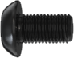
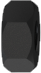
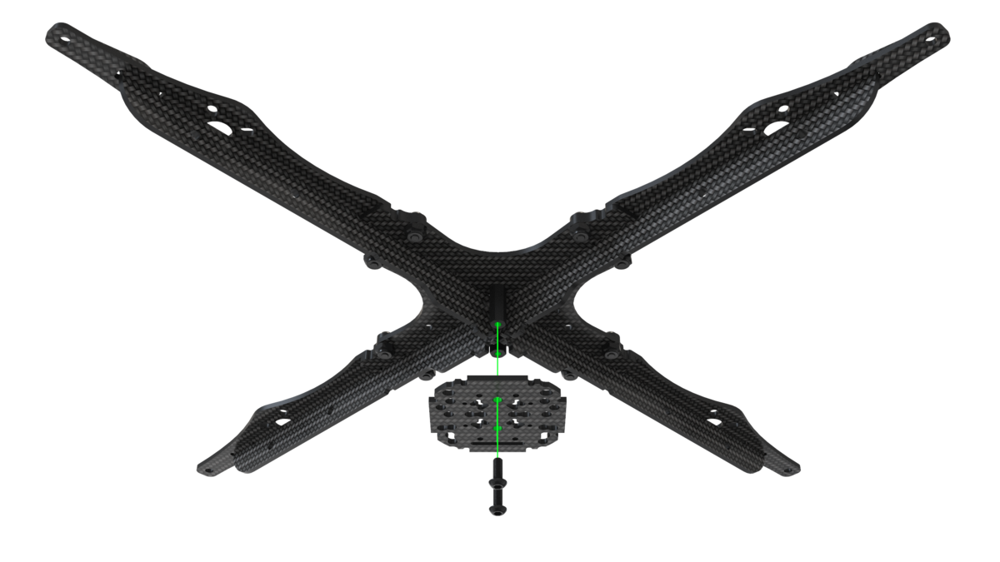
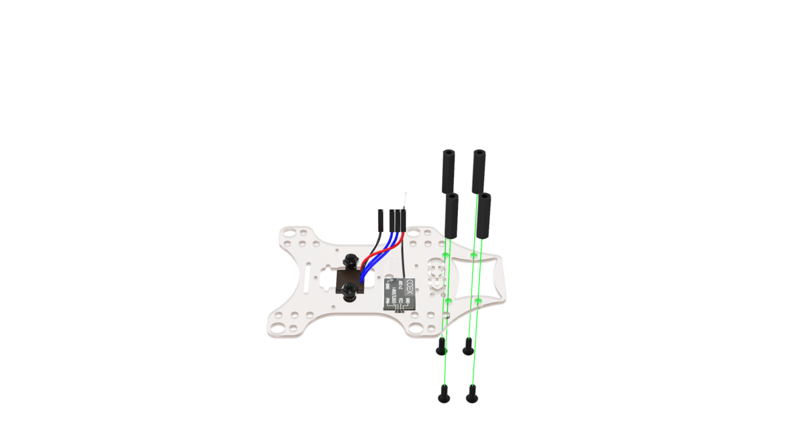

# Clover 4.2 assembly

Dimensional drawing – [clover-4.2.pdf](https://github.com/CopterExpress/clover/raw/master/docs/assets/dimensional-drawing/clover-4.2.pdf).

## Fasteners size

> **Hint** During assembly, screws and racks of various sizes are used, using fasteners of the wrong size can damage the copter.

<table class="type_table">
    <tr>
        <td></td>
        <td>Screw M3x10</td>
        <td></td>
        <td>Aluminium rack 40 mm</td>
    </tr>
    <tr>
        <td></td>
        <td>Screw M3x8</td>
        <td></td>
        <td>Aluminium rack 15 mm</td>
    </tr>
    <tr>
        <td></td>
        <td>Screw M3x5</td>
        <td></td>
        <td>Nylon rack 40 mm</td>
    </tr>
    <tr>
        <td></td>
        <td>Screw M2x5</td>
        <td></td>
        <td>Nylon rack 30 mm</td>
    </tr>
    <tr>
        <td></td>
        <td> Nut M3 (self-locking)</td>
        <td></td>
        <td>Nylon rack 20 mm</td>
    </tr>
    <tr>
        <td></td>
        <td> Nut M3 (nylon)</td>
        <td></td>
        <td>Nylon rack 15 mm</td>
    </tr>
    <tr>
        <td></td>
        <td>Damper rack</td>
        <td></td>
        <td> Nylon rack 6 mm</td>
    </tr>
</table>

## Frame Assembly

1. Align the 4 beams with the center deck, fix them with the M3x8 screws and nuts with a nylon insert.

    

        
        
    

2. Install 2 aluminum 15mm posts on the center holes in the main deck and fix them with the M3x8 screws.

    

3. Install the stiffener hook into the groove in the beam.

    

4. Press the stiffeners onto the main deck.

    

5. Tighten the stiffeners with a small carbon deck.

    

6. Install 4 6mm nylon posts and fix them with the M3x5 screws.

    

## Installing motors

1. When installing motors, pay attention to the rotation scheme of the motors. The rotation marking on the motors must match the rotation pattern.

    

2. Mount the motor on the corresponding holes in the beam using **M3x5 screws**.

    

        
        
    

> **Caution** Make sure that the motors are secured with M3x5 screws, otherwise a short circuit between the windings may occur.

## Installing ESC and PDB

1. Connect the speed controllers (ESC) to the motors using the MR30 connectors and fasten them to the beams using clamps.

    

        
        
    

2. Install the power distribution board (PDB) on the pre-mounted racks and secure it with 6mm racks. The power distribution board must be installed so that the power connection cable points toward the tail of the aircraft.

    

3. Connect the power outputs of the speed controllers to the power distribution board.

    

## Installing Flight Controller

Clover 4 drone kit allows you to install various flight controllers, for example [COEX Pix](coex_pix.md) and Pixracer.

> **Caution** During installation the flight controller, pay attention to the arrow located on the board, it should be directed to the copter bow.

### COEX Pix

> **Hint** Before installing the damper struts, screw 2 layers of nylon nuts, for a stronger fix or bite off the excess thread using side cutters.

Install the damper struts, fix COEX Pix on them with nylon nuts.

### Pixracer

1. Place the small deck on the racks and secure it with nylon nuts.

    

2. Glue 3-4 layers of double-sided tape, glue it in the center of the small deck and install Pixracer on top.

    

## Connect Flight Controller

1. Connect the speed controllers to the flight controller in accordance with the diagram.

    

2. Connect the power cable to the power distribution board(PDB) and the corresponding connector on the flight controller.

    

3. Install 40mm aluminum racks on the M3x10 screws.

    
    

## Installing Raspberry Pi

1. Install the 20 mm racks on the main deck, fix them with the M3x8 screws.

    

        
        
    

2. On a mounting deck, install M2.5x6 mm racks and M3x30 mm racks, fasten them with the M2.5x4 and M3x10 bolts, respectively.

    

3. Install the assembled mounting deck on the main deck and fix with the M3x8 screws.

    

4. Install the Raspberry Pi circuit board and fix with M2.5x4 bolts.

    

5. On the capture deck, install the rangefinder using self-locking nuts and M3x8 screws, and glue the radio using double-sided tape.

    

6. Install 4 20 mm racks and fix them with the M3x8 screws.

    

7. Install the camera on the small mounting deck and fix it with 2 M2x5 self-tapping screws in the upper left and lower right corners.

    

8. Install the camera module on the capture deck and fix with the M3x8 screws.

    

9. Install the assembled pickup deck and fix with the M3x8 screws.

    

10. Connect to the Raspberry Pi rangefinder and power cable.

    

11. Connect the camera cable to Raspberry Pi.

    

## Installing LED strip and legs

1. Assemble the hoop for the LED strip by combining the lock on the ends.

    

2. Stick the LED strip on the hoop, for better fastening, pull it with 3-4 clamps.

    

3. Install the legs on the stiffening plate using self-locking nuts and M3x8 screws using only the extreme mounting holes. From below, between the plates of the legs, install a damper silicone ring.

    

4. Bend the legs back and install a hoop with LED strip in a special groove on them so that the connection cables exit from the tail side of the copter.

    

5. Behind fasten the legs with self-locking nuts and M3x10 screws.

    

6. Connect the LED strip power (red, black cables) to the short JST connector on the PDB.

    

7. Connect the signal output of the LED strip (white cable) to Raspberry Ri, to pin *GPIO21*.

    

## Installing guard

1. Assemble the lower level of guard with 40mm racks and M3x10 screws.

    

2. Assemble the top level of protection with the M3x10 screws.

    

3. Install the mounting deck and fix it with M3x8 bolts.

    

4. Establish protection and fix on beams by means of self-locking nuts and M3x10 screws.

    

## Flight preparation

1. Install the battery strap and connect the flight controller to the Raspberry Pi using a USB cable.

    

        
        
    

2. Install the propellers in accordance with the [directional diagram of the motors](#prop_rotation).

    

3. Install the battery.

    

> **Success** The drone is assembled, then perform [setup](setup.md).
