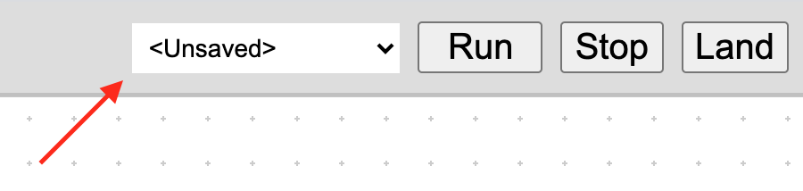

# Blocks programming for Clover


Visual blocks programming feature has been added to the [RPi image](image.md), starting with the version **0.21**. Blocks programming is implemented using [Google Blockly](https://developers.google.com/blockly) platform. Blocks programming integration can lower the entry barrier to a minimum.

## Configuration

For correct work of the blocks programming, `blocks` argument in the Clover launch-file (`~/catkin_ws/src/clover/clover/launch/clover.launch`) [should be equal to](cli.md#editing) `true`:

```xml
<arg name="blocks" default="true"/>
```

## Running

To run Clover's blocks programming interface, [connect to Clover's Wi-Fi](wifi.md) and go to web-page http://192.168.11.1/clover_blocks/ or click the link *Blocks programming* at the [main page](wifi.md#web-interface).

The page looks as follows:


Assemble your program using blocks in the menu at the left and then click *Run* button for running. You can also view generated Python-code, switching to *Python* tab.

The *Stop* button stops the program. Clicking *Land* button also stops the program and lands the drone.

## Storing and loading



To store the program, open the menu at the top right, select *Save* item and input your program's name. The name should contain only Latin characters, hyphen, underline and dot characters. All your stored programs are available at the same menu.

Your programs are stored as XML-files in the `/catkin_ws/src/clover/clover_blocks/programs/` directory of the SD-card.

> **Note** Note also example programs, available at the same menu.

## Blocks

The set of blocks is somewhat similar to the set of ROS-services of [Clover's autonomous flights API](simple_offboard.md). This section contains descriptions of some of them.

Clover's blocks are separated into 4 categories:

* <span style="padding:2px;color:white;background:#9d5ca6">Flight</span> – autonomous flight related commands.
* <span style="padding:2px;color:white;background:#ff9b00">State</span> – blocks for obtaining the drone state parameters.
* <span style="padding:2px;color:white;background:#01d754">LED</span> – blocks for controlling [LED strip](leds.md).
* <span style="padding:2px;color:white;background:#5b97cc">GPIO</span> – blocks for working with [GPIO pins](gpio.md).

The rest of categories contains standard Blockly's blocks.

### take_off


Take off to specified altitude in meters. The altitude may be an arbitrary block, that returns a number.

The `wait` flag specifies, if the drone should wait until take off is complete, before executing the next block.

### navigate


Navigate to specified point. Coordinates are specified in meters.

The `wait` flag specifies, if the drone should wait until navigation is complete, before executing the next block.

#### *Relative to* field {#relative_to}

This block allows to specify the [coordinate frame](frames.md) of the target point:

* *body* – coordinates, relative to the drone: *forward*, *left*, *up*.
* *markers map* – coordinates, relative to the [map of ArUco-markers](aruco_map.md).
* *marker* – coordinates, relative to an [ArUco-marker](aruco_marker.md); marker's ID input fields appears.
* *last navigate target* – coordinates, relative to the last specified navigate point.
* *map* – drone's local coordinate system, linked with the point of its initialization.
* *global* – global coordinates system (latitude and longitude) and relative altitude.
* *global, WGS 84 alt.* – global coordinates system and [WGS 84](https://en.wikipedia.org/wiki/WGS_84) altitude.

### land


Land the drone.

The `wait` flag specifies, if the drone should wait until landing is complete, before executing the next block.

### wait


Wait specified time period in seconds. The time period may be an arbitrary block, that returns a number.

### wait_arrival


Wait, until the drone reaches [navigate](#navigate)-block's target point.

### get_position


The block returns current position, velocity or yaw angle of the drone relative to the specified [coordinate frame](#relative_to).

### set_effect


The block allows to set animations to LED strip, similarly to [`set_effect`](leds.md#set_effect) ROS-service.

Example of using the block with a random color (colors-related blocks are located in *Colour* category):


### Work with GPIO {#GPIO}

<span style="padding:2px;color:white;background:#5b97cc">GPIO</span> category contains blocks for working with GPIO. Note, that for correct work of these blocks, `pigpiod` daemon should be running:

```bash
sudo systemctl enable pigpiod.service
sudo systemctl start pigpiod.service
```

See details on GPIO in the [appropriate article](gpio.md).
