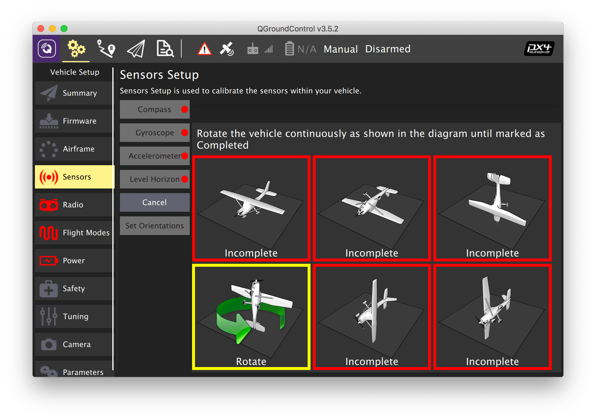
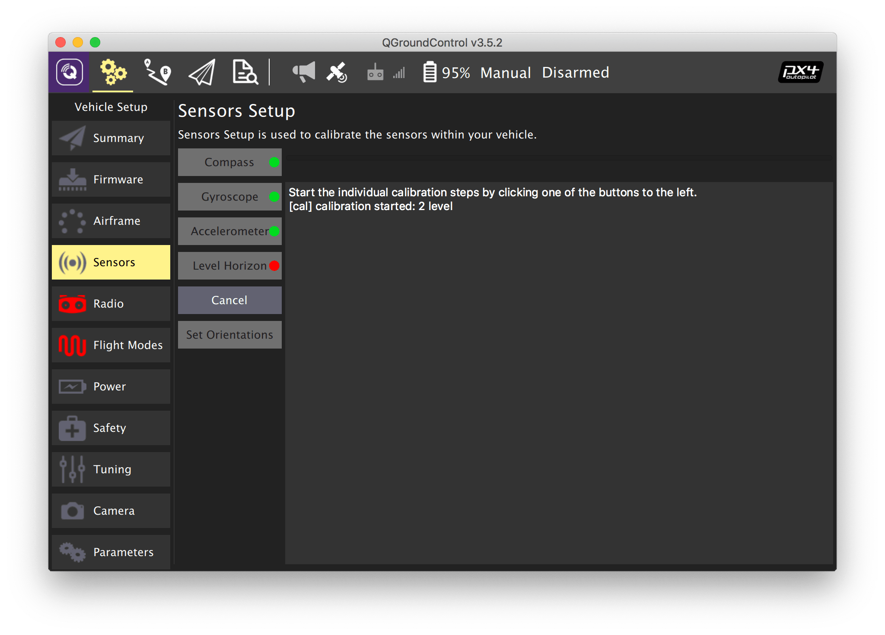

# Sensor calibration

In order to perform the sensor calibration, select the *Vehicle Setup* tab and choose the *Sensors* menu.

> **Caution** If you use the flight controller [*COEX Pix*](coex_pix.md), and it's installed with servo pins faced backwards, all *Autopilot Orientation* columns must specify `ROTATION_ROLL_180_YAW_90`, otherwise the flight controller will not correctly perceive the tilt and rotation of the copter.

## Compass

1. Select the *Compass* submenu
2. Choose the flight controller orientation (*ROTATION_NONE* if the arrow on the flight controller is aligned with the arrow on the frame).
3. Press *OK*.
4. Put the drone in one of the orientations marked by the red outline and wait for the appropriate outline to turn yellow.
5. Spin the drone as required until the outline turns green. Do this for all orientations.

Read more in the PX4 docs: https://docs.px4.io/v1.9.0/en/config/compass.html.

## Gyroscope

1. Select the *Gyroscope* submenu.
2. Place the drone on a flat, horizontal surface.
3. Press *OK*.
4. Wait for the calibration to finish.s

> **Warning** The drone should stay completely still during the calibration.

Read more in the PX4 docs: https://docs.px4.io/v1.9.0/en/config/gyroscope.html.

## Accelerometer

1. Select the *Accelerometer* submenu.
2. Choose the flight controller orientation (*ROTATION_NONE* if the arrow on the flight controller is aligned with the arrow on the frame).
3. Put the drone in one of the orientations marked by the red outline and wait for the appropriate outline to turn yellow.
4. Hold the drone in this orientation until the outline turns green. Do this for all orientations.

Read more in the PX4 docs: https://docs.px4.io/v1.9.0/en/config/accelerometer.html.

## Level horizon

1. Select the *Level Horizon* submenu.
2. Choose the flight controller orientation (*ROTATION_NONE* if the arrow on the flight controller is aligned with the arrow on the frame).
3. Place the drone on a flat, horizontal surface.
4. Press *OK*.
5. Wait for the calibration to finish.

Read more in the PX4 docs: https://docs.px4.io/v1.9.0/en/config/level_horizon_calibration.html.

**Next**: [RC setup](radio.md).
