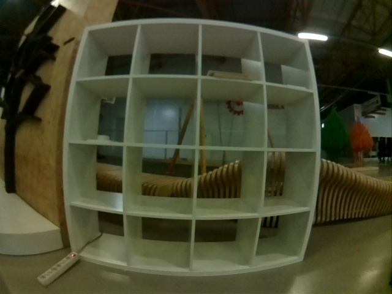
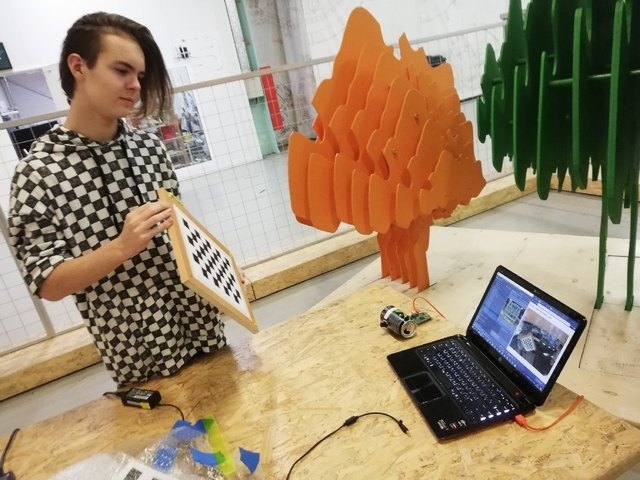
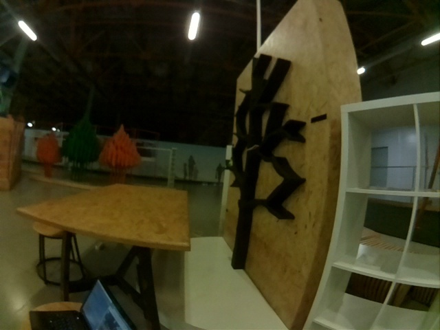
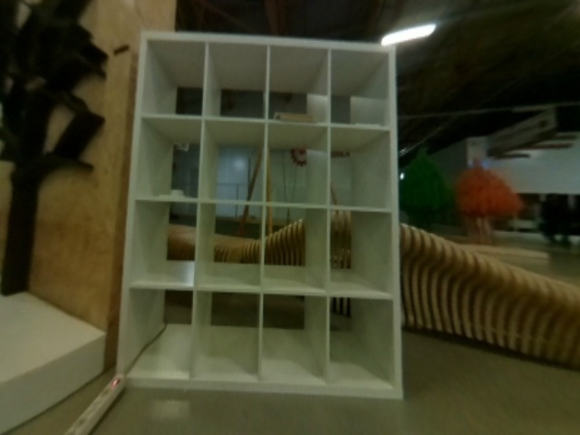
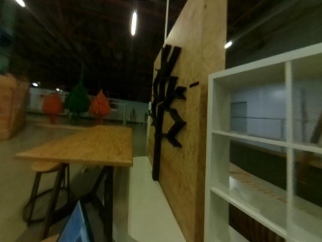
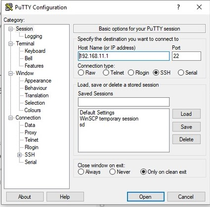
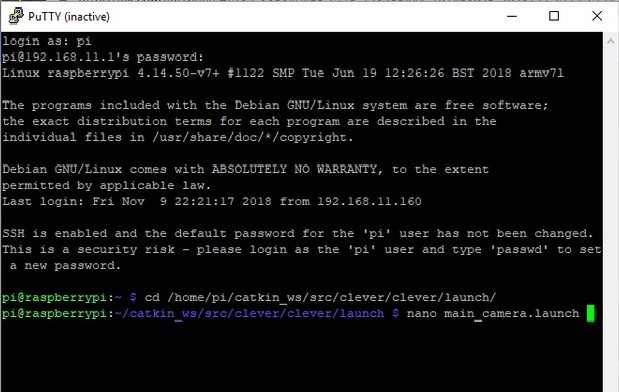
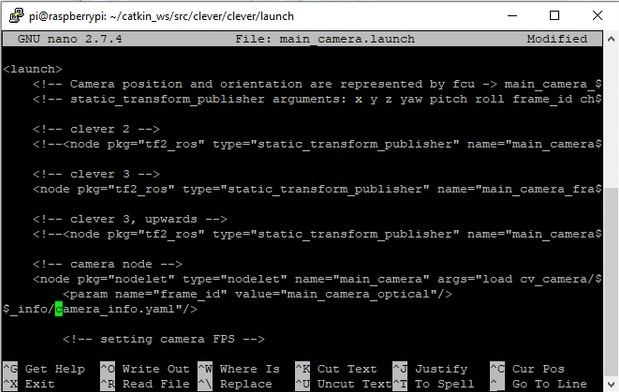

# Camera calibration

Computer vision is becoming more and more widespread. Often, computer vision algorithms are not precise and obtain distorted images from the camera, which is especially true for fisheye cameras.



> The image is "rounded" closer to the edge.

Any computer vision algorithm will perceive the picture incorrectly. To remove such distortion, the camera that receives the image is to be calibrated in accordance with its own peculiarities.

## Script installation

First, you have to install the necessary libraries:

```
pip install numpy
pip install opencv-python
pip install glob
pip install pyyaml
pip install urllib.request
```

Then download the script from the repository:

```(bash)
git clone https://github.com/tinderad/clever_cam_calibration.git
```

Go to the downloaded folder and install the script:

```(bash)
cd clever_cam_calibration
sudo python setup.py build
sudo python setup.py install
```

If you are using Windows, download the archive from the [repository](https://github.com/tinderad/clever_cam_calibration/archive/master.zip), unzip it and install:

```(bash)
cd path\to\archive\clever_cam_calibration\
python setup.py build
python setup.py install
```

> path\to\archive – path to unpacked archive.

## Preparing for calibration

You will have to prepare a calibration target. It looks like a chessboard. The file is available for downloading [here](https://www.oreilly.com/library/view/learning-opencv-3/9781491937983/assets/lcv3_ac01.png).
Glue a printed target to any solid surface. Count the number of intersections on the board lengthwise and widthwise, measure the size of a cell (mm).


Turn on Clover and connect to its Wi-Fi.

> Navigate to 192.168.11.1:8080 and check whether the computer receives images from the image_raw topic.

## Calibration

Run script ***calibrate_cam***:

**Windows:**

 ```(bash)
>path\to\python\Scripts\calibrate_cam.exe
```

> path\to\Python – path to the Python folder

**Linux:**

```(bash)
>calibrate_cam
```

Specify board parameters:

```(bash)
>calibrate_cam
Chessboard width: # Intersections widthwise
Chessboard height: # Intersections heightwise
Square size: # Length of cell edge (mm)
Saving mode (YES - on): # Save mode
```

> Save mode: if enabled, all received pictures will be saved in the current folder.

The script will start running:

```
Calibration started!
Commands:
help, catch (key: Enter), delete, restart, stop, finish
```

To calibrate the camera, make at least 25 photos of the chessboard at various angles.



To make a photo, enter command ***catch***.

```(bash)
>catch
```

The program will inform you about the calibration status.

```(bash)
...
Chessboard not found, now 0 (25 required)
>  # Enter
---
Image added, now 1 (25 required)
```

> Instead of entering command ***catch*** each time, you can just press ***Enter*** (enter a blank line).

After you have made a sufficient number of images, enter command ***finish***.

```(bash)
...
>finish
Calibration successful!
```

### Calibration by the existing images

If you already have images, you can calibrate the camera by them with the help of script ***calibrate_cam_ex***.

```(bash)
>calibrate_cam_ex
```

Specify target characteristics and the path to the folder with images:

```(bash)
>calibrate_cam_ex
Chessboard width: # Intersections widthwise
Chessboard height: # Intersections heightwise
Square size: # Length of cell edge (mm)
Path: # Path to the folder with images
```

Apart from that, this script works similarly to ***calibrate_cam***.

The program will process all received pictures, and create file ***camera_info.yaml*** in the current folder. Using this file, you can equalize distortions in the images obtained from this camera.

> If you change the resolution of the received image, you will have to re-calibrate the camera.

## Correcting distortions

Function ***get_undistorted_image(cv2_image, camera_info)*** is responsible for obtaining a corrected image:

* ***cv2_image***: An image encoded into a cv2 array.
* ***camera_info***: The path to the calibration file.¬

The function returns a cv2 array, into which the corrected image is coded.

> If you are using a fisheye camera provided with Clover, for processing images with resolution 320x240 or 640x480, you can use the existing calibration settings. To do this, pass parameters ***clever_cam_calibration.clevercamcalib.CLEVER_FISHEYE_CAM_320*** or ***clever_cam_calibration.clevercamcalib.CLEVER_FISHEYE_CAM_640*** as argument ***camera_info***, respectively.

## Examples of operation

Source images:




Corrected images:





## An example of usage

**Processing image stream from the camera**.

This program receives images from the camera on Clover and displays them on the screen in corrected for, using the existing calibration file.

```python
import clevercamcalib.clevercamcalib as ccc
import cv2
import urllib.request
import numpy as np
while True:
	req = urllib.request.urlopen('http://192.168.11.1:8080/snapshot?topic=/main_camera/image_raw')
    arr = np.asarray(bytearray(req.read()), dtype=np.uint8)
    image = cv2.imdecode(arr, -1)
    undistorted_img = ccc.get_undistorted_image(image, ccc.CLEVER_FISHEYE_CAM_640)
    cv2.imshow("undistort", undistorted_img)
    cv2.waitKey(33)
cv2.destroyAllWindows()
```

## The usage for ArUco

To apply the calibration parameters to the ArUco navigation system, move the calibration .yaml file to Raspberry Pi of Clover, and initialize it.

> Don't forget to connect to Wi-Fi of Clover.

The SFTP protocol is used for transferring the file. This example, WinSCP program is used.

Connect to Raspberry Pi via SFTP:

> Password: ***raspberry***


Press “Enter”. Go to ***/home/pi/catkin_ws/src/clever/clever/camera_info/***, and copy the calibration .yaml file to this folder:


Now we have to select this file in ArUco configuration. Connection via SSH is used for this purpose. This example, PuTTY program is used.

Connect to Raspberry Pi via SSH:



Log in with username ***pi*** and password ***raspberry***, go to directory ***/home/pi/catkin_ws/src/clever/clever/launch*** and start editing configuration ***main_camera.launch***:



In line ***camera node***, change parameter ***camera_info*** to ***camera_info.yaml***:



> Don't forget to change camera resolution.
