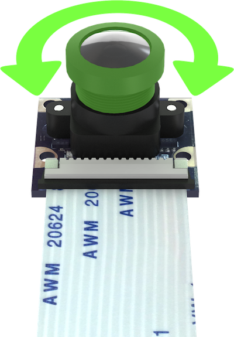

# Camera setup

> **Note** The following applies to [image version](image.md) **0.15** and up. See [previous version of the article](https://github.com/CopterExpress/clover/blob/v0.14/docs/ru/camera_frame.md) (Russian only) for older images.

Computer vision modules (like [ArUco markers](aruco.md) and [Optical Flow](optical_flow.md)) require adjusting the camera focus and set up camera position and orientation relative to the drone body.

## Focusing the camera lens

In order to focus the camera lens, do the following:



1. Open the live camera stream in your browser using [web_video_server](web_video_server.md).
2. Rotate the lens to adjust the image. Make sure the objects that are 2-3 m from the camera are in focus.

|Focused image|Unfocused image|
|-|-|
|||

## Setting the camera position {#frame}

Position and orientation of the main camera is [set in the](cli.md#editing) `~/catkin_ws/src/clever/clever/launch/main_camera.launch` file:

```xml
<node pkg="tf2_ros" type="static_transform_publisher" name="main_camera_frame" args="0 0 -0.07 -1.5707963 0 3.1415926 base_link main_camera_optical"/>
```

This line describes how the camera is positioned relative to the drone body. Technically, it creates a static transform between the `base_link` frame ( which [corresponds to the flight controller housing](frames.md)) and the camera (`main_camera_optical`) in the following format:

```txt
shift_x shift_y shift_z yaw_angle pitch_angle roll_angle
```

Camera frame (that is, [frame of reference](frames.md)) is aligned as follows:

* **<font color=red>x</font>** points to the right side of the image;
* **<font color=green>y</font>** points to the bottom of the image;
* **<font color=blue>z</font>** points away from the camera matrix plane.

Shifts are set in meters, angles are in radians. You can check the transform for correctness using [rviz](rviz.md).

## Presets for Clover

The presets for usual camera orientations are available in the `main_camera.launch` file. The images should help you choose the one that is right for you: the first one is how your drone will be displayed in [rviz](rviz.md), the second is how the camera is actually mounted on the drone.

### 1. Camera faces downward, cable goes backward

```xml
<node pkg="tf2_ros" type="static_transform_publisher" name="main_camera_frame" args="0.05 0 -0.07 -1.5707963 0 3.1415926 base_link main_camera_optical"/>
```


### 2. Camera faces downward, cable goes forward

```xml
<node pkg="tf2_ros" type="static_transform_publisher" name="main_camera_frame" args="0.05 0 -0.07 1.5707963 0 3.1415926 base_link main_camera_optical"/>
```


### 3. Camera faces upward, cable goes backward

```xml
<node pkg="tf2_ros" type="static_transform_publisher" name="main_camera_frame" args="0.05 0 0.07 1.5707963 0 0 base_link main_camera_optical"/>
```


### 4. Camera faces upward, cable goes forward

```xml
<node pkg="tf2_ros" type="static_transform_publisher" name="main_camera_frame" args="0.05 0 0.07 -1.5707963 0 0 base_link main_camera_optical"/>
```


> **Hint** The [`selfcheck.py` utility](selfcheck.md) will describe your current camera setup in a human-readable fashion. Be sure to check whether this description corresponds to your actual camera position.
