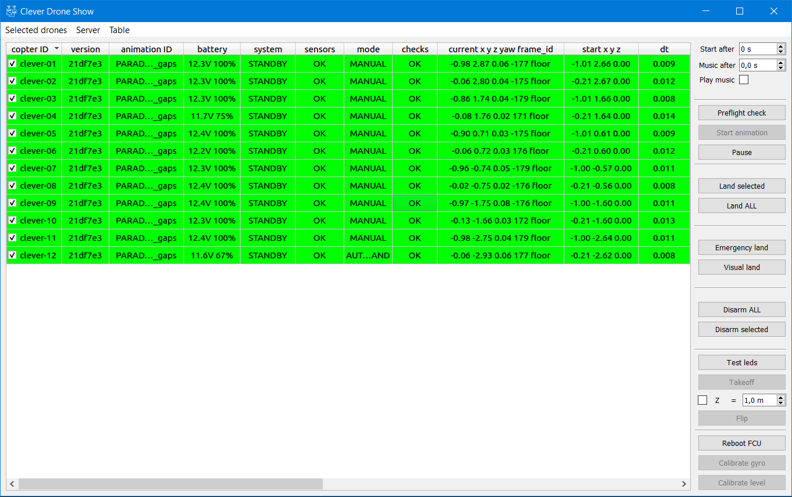
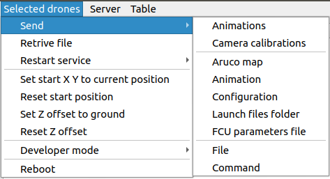
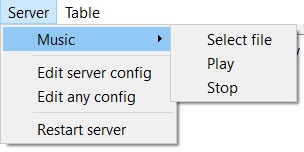
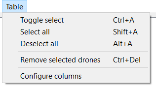
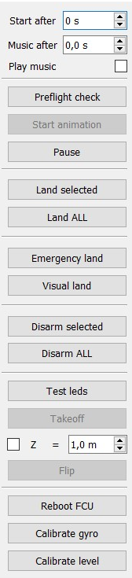
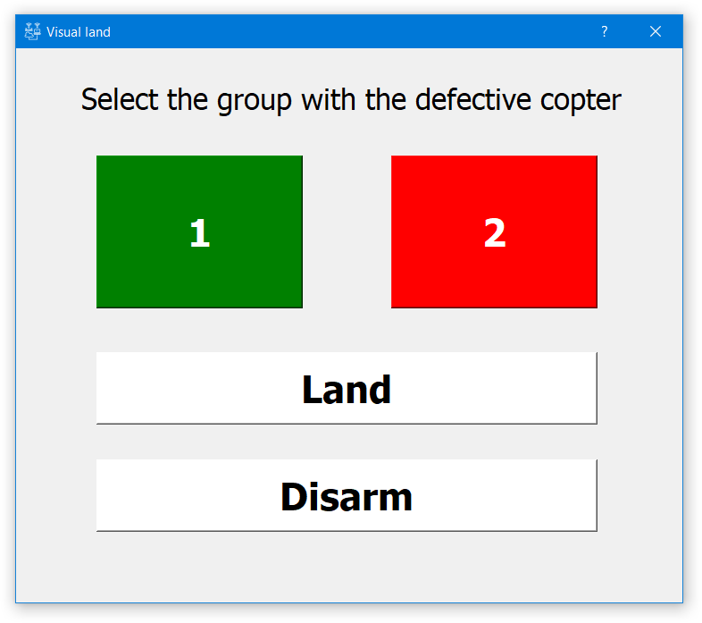
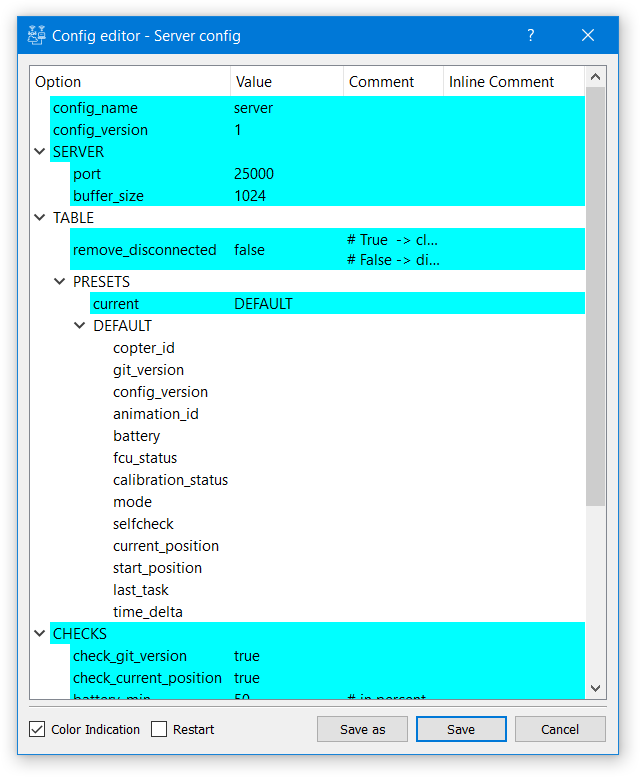
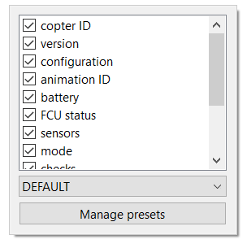
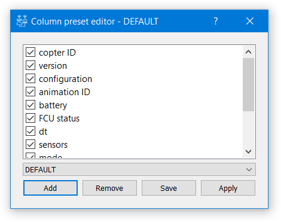

# Server

Application for creating and running shows, configuring drones, animation and music.

* [Installation and startup](start-tutorial.md#server-installation-and-startup)
* [Interface](#server-interface)
* [Setup](#server-setup)
* [Additional operations](#additional-operations-and-windows)

## Server Interface

The server has a visual graphical interface for user-friendly interaction.

### Copter status table

When a client connects to the server for the first time, a line is added to the table to display the client state, containing only the client name (`copter ID`). If the clients are configured to transmit telemetry automatically, the data in the table will be updated regularly. It is also possible to request telemetry of selected clients using the [Preflight check](#control) button .

Rows can be sorted in ascending or descending order by clicking on the header of any of the columns.

Columns can be swapped and their width can be changed: all changes are saved in the server configuration file when the server is shut down properly. Right-clicking on the table header will open a context menu with [built-in configurator](#column-preset-editor), where you can hide or display the columns, change their order, load a certain set of settings. When you start the server, the last used settings will be loaded and applied.

The cells of the table are highlighted:

* *in yellow*, if the required value is missing
* *in red*, if the data in the cell has not passed the check
* *in green*, if the data in the cell has passed the check

The copter is considered **ready for animation playback** when all cells in a row are checked and highlighted in green.

The copter is considered **ready to fly** if all cells in the row except `animation ID` and `dt` are checked and highlighted in green.

#### Table columns

* `copter ID` - the client name. Can be configured on the client side. Displayed immediately when the client is connected. Next to each Copter ID there is a checkbox - Copters whose ID is marked with a positive checkbox (tick) are considered *selected*. Cells in this column are always pass the check.
  * By double-clicking on this field you can enter a new `copter ID` of the client and rename it. As a name, combinations of Latin letters, digits and dashes (A-Z, a-z, 0-9, '-') not longer than 63 characters are permitted. The dash cannot be the first character.
* `version` - a hash code of the current git version of the client. Cells in this column are checked when [check_git_version](#checks-section) is enabled (value `true`) in the server settings. A cell in this column passes the check if the hash code of the git version of the given client and the server match (if the server is not located in the git repository, the check is passed out automatically).
* `configuration` -  a user-defined version of the client configuration. Cells in this column are always pass the check.
  * Cells of this column supports *drag-and-drop*. When you drag and drop a cell to any third-party application that supports files (e.g. "Explorer"), the client configuration file will be copied to the specified location. When a cell is dragged to another cell, the configuration file will be copied from one cell to another. When a file is dragged to a cell, it will be written to the client as a configuration (subject to validation). When the configuration is transferred to the client, the `PRIVATE` section will not be sent.
* `animation ID` - an internal name of the animation file loaded by the client. A cell in this column does not pass the check if there is no animation (value `No animation`). In other cases, if a cell is not empty, it will be checked. **Warning!** Check if the names of the animation files correspond to the copters before starting.
* `battery` - a value of voltage on the copter battery in volts and charge in percent according to the flight controller. A cell in this column passes the check if the battery charge value is higher than [battery_percentage_min](#checks-section) specified in the server settings. In other cases, if a cell is not empty, it does not pass the check.
* `system` - a flight controller status. A cell in this column passes the check if its value is `STANDBY`. In other cases, if a cell is not empty, it does not pass the check.
* `sensors` - calibration status of the flight controller compass, accelerometer and gyroscope. A cell in this column passes the check if its value is `OK`.  In other cases, if a cell is not empty, it does not pass the check.
* `mode` - flight controller mode. A cell in this column does not pass the check if its value `NO_FCU` or contains `CMODE`. In other cases, if a cell is not empty, it passes the chseck.
* `checks`  - copter self-test state. A cell in this column passes the check if its value is `OK`. In other cases, if a cell is not empty, it does not pass the check.
  * Double-clicking on a cell if there are errors will show a dialog box with full detailed information about all errors.
* `current x y z yaw frame_id` - current copter position with the coordinate system name. The cell is automatically passes the check if [check_current_position](#checks-section) is set to `false`. Otherwise, a cell in this column does not pass the check if its value is `NO_POS` or contains `nan`. Otherwise, if a cell is not empty, it passes the check.
* `start x y z action delay` - start position of the copter for playback of the animation, the first action during playback of the animation and the time after which the first action will be performed after the start of the animation. A cell in this column does not pass the check if its value `NO_POS`, the distance between the current and the starting position of the copter is greater than [start_pos_delta_max](#checks-section) or the client's animation module generates an error when processing the animation and checking that all points of the animation are above ground level.  Otherwise, if a cell is not empty, it passes the check.
* `dt` - the delay between the time on the server and the client in seconds, including network latency. A cell in this column passes the check if its value is less than [time_delta_max](#checks-section) specified in the server configuration. In other cases, if a cell is not empty, it does not pass the check. If the values are too high, it signals that there is no time synchronization between the copter and the client.

### Menu

#### Selected drones section

This section contains several utilities to send various data and commands to *selected* clients.
>**Warning!** Do not use these commands during the flight of copters!

* `Send` subsection

  `<clever-show>` - location of the `clever-show` software on the client.

  `<clover_dir>` - location of `clover` ROS package on the client.

  * `Animations` - sends animation files, which were exported by the Blender addon, to selected copters. In the dialog box, you must select a *folder* containing the animation files. Each animation file will be sent to the client with the name corresponding to the file name without an extension. On the client, the file will be saved as `<clever-show>/drone/animation.csv`.

  * `Camera calibrations` - sends yaml files of camera calibration for `clover` service.  In the dialog box, select *folder*, containing configuration files with extension `.yaml`. Each calibration file will be sent to the client with the name (copter ID) corresponding to the file name without extension. On the client, the file will be saved as `<clover_dir>/camera_info/calibration.yaml`. **Warning!** An existing calibration file on the copter will be overwritten.

  ---

  * `Aruco map` - sends *single* ArUco marker map file to all selected clients. In the dialog box, select *one* card file in the specified format. File on client will be overwritten and saved as `<clover_dir>/.../aruco_pose/map/animation_map.txt`. Once the file is received and written, the client will automatically restart the `clover` service. In order to resume flight functions and to receive some telemetry values *it is necessary to wait* some time until the service is fully started.

  * `Animation` - sends *a single* animation file to all selected clients. In the dialog box you need to select *one* animation file. On the client, the file will be saved as `<clever-show>/drone/animation.csv`. This is a useful feature to quickly test multiple drones when used in combination with `Set start X Y to current position`.

  * `Configuration` - sends *a single* client configuration file to all selected clients. In the dialog box you need to select *one* configuration file in the set format. The configuration file may be incomplete, in this case only the parameters specified in the file will be overwritten. **Warning!** It is not recommended to use this action for mass overwriting of `copter ID`, except for the `/hostname` value. **Warning!** DO NOT send the server configuration file to clients.

  * `Launch files folder` - sends `.launch` files of `clover` service configuration. In the dialog box, select *folder*, which contains configuration files with extension `.launch` and `.yaml`. All files with this extension will be sent *to each* of the clients in the directory `<clover_dir>/launch`. **Warning!** Existing configuration files on copters will be overwritten, but files not sent by the server will not be deleted or modified.

  * `FCU parameters file` - sends and records *single* flight controller (FCU) configuration file to all selected clients. In the dialog box you need to select the *one* parameter file in the set format. The parameters on the flight controller will be overwritten.

  ---

  * `File` - sends *one* any file to all selected clients. In the dialog box, select *one* file. Then, specify the path, where this file will be saved to the clients (not including the file name).

  * `Command` - sends and executes any terminal command on all selected clients. In the dialog box, you need to enter the required command. The commands *may* use `sudo` rights.

---

* `Retrive file` - downloads any file from clients to the selected directory in the server file system. If more than one client was selected during the download, its ID will be added to the file name from each client. In the dialog box, first enter the path to the required file on the client.  Then, in the dialog box, specify the path, where this file will be saved on the server.

---

* `Restart Service` subsection

  

  * `chrony` - restarts the `chrony` time synchronization service on selected clients. Use it for manual synchronization if time between server and clients is not synchronized.
  * `clever` - restarts the `clover` service on selected clients. In order to resume flight functions and to get some telemetry values *it is necessary to wait* some time until the service is fully started.
  * `clever-show` - restarts `clever-show` service on selected clients. During the restart the clients will be disconnected.

---

* `Set start X Y to current position` - sets the animation start point of the selected clients to the values of the current X Y position.

* `Reset start position` -sets the starting point of the animation of the selected clients to `0.0`, `0.0`.

* `Set Z offfset to ground` - sets individual Z offset on each of the selected clients to a value equal to the current Z coordinate position. It can be used to equalize the common height of the copter flight.
* `Reset Z offfset` -  sets its individual Z offset on each of the selected clients to `0`.

---

* `Developer mode` subsection:  **Warning!** Use these actions with great caution.
* `Update clever-show git` - updates the `clever-show` repository folder on selected clients. The client configuration files *will not be overwritten*. **Warning!** For the changes to take effect, the `clever-show` service needs to be restarted*.

---

* `Reboot` - fully reboots the flight controller and the onboard computer on the selected copters. During the restart, clients will be disconnected.

#### Server section

* `Music` subsection

  

  * `Select music file` - loads the selected music file for further manual playback or after a certain time after the start of the animation. Supported extensions: `.mp3` and`.wav`.
  * `Play music` - plays the loaded music.
  * `Stop music` - stops the music playback.

---

* `Edit server config`  - opens [built-in configuration file editor](#config-editor) with the current server configuration for editing. The checkbox `Restart` is available - if checked, the server will be restarted when the configuration is saved. **Warning!** The changed configuration parameters will be applied to the server only after its restart (manual or automatic).

* `Edit any config` - opens [built-in configuration file editor](#config-editor) and allows you to choose in the file system any configuration file with  `.ini`  extension for editing, or open a configuration specification file to create a configuration file based on it.

---

* `Restart server` - completely restarts the server. **Warning!** After the restart the server will no longer be connected to the console it was originally started from, if the server was originally started from the console.

#### Table section

* `Toggle select` (`Ctrl+A`) - selects all copters or deselects all copters. If not all copters are selected in the table, then *selects all* copters. Otherwise (if all the copters have been selected) *deselects* all the copters.
* `Select all` - selects all copters in the table.
* `Deselect all` - deselects all copters in the table.

---

* `Remove selected drones` - removes selected copters from the table. **Warning!** In case the client was connected, the disconnection will be performed. If the client deleted in this manner was functioning properly, it will be reconnected as soon as possible.

---

* `Configure columns` - opens the [built-in configurator](#column-preset-editor) of table column presets.

### Commands sidepanel

#### Control

This section of commands is intended for high-level control of the drone swarm.

* `Start after` spinbox - sets the delay time for synchronous start of animation by copters after pressing the 'Start animation' button. It is recommended to use values greater than zero for busy, interfered or pinged networks.
* `Music after` spinbox - sets the delay time for starting music after pressing the `Start animation` button.
* `Play music` checkbox - determines whether the music will be played when the animation starts.
* `Preflight check` button - all selected clients perform self-diagnostics and preflight check. The results, along with other client parameters, will be displayed in the table as the data arrives. This button is necessary if automatic transmission of telemetry is not configured on the client.
* `Start animation`button - sends the start time of the animation to all selected copters based on the time specified in the `Start after` spinbox. All selected copters start synchronous playback of the animation after pressing this button and after the time specified in the `Start after` spinbox. After the animation is finished, all copters will land. The button is active only if all copters are ready for playback of the animation. When clicked, an additional confirmation is requested.
* `Pause/Resume` button - pauses and resumes flight tasks. After each press, the button changes the state to the opposite.
  * `Pause` state - pauses the task queue of all selected copters: any flight task is paused. It is recommended to use in emergency situations to detect a malfunctioning copter. **Warning!** This command does NOT interrupt the flight of the copter to a specified point (e.g.: elements of takeoff, landing; following to the initial animation point, etc.).
  * `Resume` state - all selected copters *synchronously* will continue executing their task queues (for example, animation playback).

#### Emergency Interception Tools

* `Land selected` Button - all the selected copters stop their flight tasks, clear the task queue and immediately switch to AUTO.LAND landing mode. **Use it as one of the interception tools in case of emergency.**
* `Land ALL`button - ALL the copters stop their flight tasks, clear the task queue and immediately switch to AUTO.LAND landing mode.  **Use it as one of the interception tools in case of emergency.**
* `Emergency land` button - all the selected copters stop their flight tasks, clear the task queue and immediately switch to emergency landing mode - all the motors are powered with small throttle, which decreases to zero after a certain time.  **Use it as one of the interception tools in case of emergency.**
* `Visual-land` button - opens [dialog box](#visual-land) of the malfunctioning copters visual landing module.
* `Disarm selected` button - all the selected copters stop performing their flight tasks, clear the task queue and immediately turn off the motors. This may cause the copters to fall down and get damaged.
* `Disarm ALL` button - ALL the copters stop performing their flight tasks, clear the task queue and immediately turn off the motors. This may cause the copters to fall down and get damaged.  **Use as the last resort in extreme cases as an interception tool.**

#### Test commands

This section contains commands to directly control the copters in order to check them.

* `Test leds` button - all the selected copters perform two-second animation (running dots) with LED strip (white color). The command is *safe* and can be used to check the operation of LED strips, quality and delay of connection to the server or to find out if the copter and its `copter ID` in the table match.
* `Takeoff` button - all the selected copters take off vertically, and then hover over the takeoff point. The button is active only * if all selected copters are ready to fly. ** Warning!** Use it carefully, follow the safety procedures. Do not use it while performing other flight functions!
  * `Z`checkbox - if the checkbox is active, the copter will take off to the specified `z` value. Otherwise, the copters will use their default values specified in their configurations, and the takeoff will be performed relative to the current height.
  * `Z` spinbox - sets the `z` coordinate value of takeoff of the copters, in meters. Active only when the `Z` checkbox is enabled.
* `Flip` button - all the selected copters **make a flip** - a 360 degree flip around one of the *horizontal* axes. **Warning!** Use with care, follow the safety procedure. **Warning!** To execute a flip, the copter must have a minimum height of more than 2m. **Warning!** Do not use during other flight functions!

This section contains commands that are executed directly on the copter flight controller.

* `Reboot FCU` button - restarts flight controllers of all selected copters. You can use it to update the rotation of the copter when it is determined only by the inertial copter system, e.g. when flying through the Pozyx positioning system or using Optical Flow. To resume flight functions and get some telemetry values *you need to wait* some time before rebooting the flight controller.
* `Calibrate gyro` button - switches flight controllers of all selected copters to the gyroscope calibration mode. **Warning!** The copters must be stationary during the calibration.
* `Calibrate gyro` button - switches flight controllers of all selected copters to the gyroscope calibration mode.  **Warning!** The copters must be stationary during the calibration.

## Server configuration

### Configuration file

The server configuration is created according to the [specification](https://github.com/CopterExpress/clever-show/blob/master/server/config/spec/configspec_server.ini), you can see the default values for any parameter after the `default` keyword. All changes are saved in the `server.ini` configuration file in the `clever-show/server/config` folder.

Server configuration editing is available via `Config editor` GUI module through menu `Server -> Edit server configuration`.

The default configuration is fully functional and does not require changes to quickly start the server.

### Parameter description

#### Root section

* `config_name` - Arbitrary line, the name of the configuration file for ease of storage and to quick distinction of one configuration file from another.
* `config_version` - Arbitrary fractional number, configuration file version for ease of storage and quick distinction of one configuration file from another.

#### SERVER section

In this section, you can set the parameters of the server network communications. The following options are available:

* `port` -TCP port that will accept incoming connections from clients. When using broadcast, this port will be automatically configured at the client. *It is recommended to change the default value for security reasons* (any five+ digit number if other software does not use the selected port).
* `buffer_size` - buffer size during data transfer. *No changes are recommended. It is recommended to use the same value for the server and clients.*

#### CHECKS section

In this section, you specify the parameters of copter checks which are being performed on the server side. The following options are available:

* `check_git_version` - Whether there will be a check of conformity of git versions of the client and a server for indication in cells of the `version` column.
* `check_current_position` - Whether the current copter coordinates will be checked for errors in cells of the `current x y zaw frame_id` column.
* `battery_percentage_min` - Minimal battery charge of the copter, allowed for takeoff. Specified *in percent* (fractional value from 0 to 100). A value in the `battery` column less than the specified one will not pass the check in the `battery` column.
* `start_pos_delta_max` - Maximum distance between the current position of the copter and its point of takeoff in the animation file, allowable for takeoff. It is specified *in meters* (fractional value from 0 to `inf`).  A distance greater than the specified one will not pass the check in `start x y z` column. T It is allowed to use the string `inf` for any valid distance.
* `time_delta_max` - Maximal  time (including network delay) difference (absolute value) between server and client, allowable for takeoff. Specified *in seconds* (fractional value from 0 to `inf`). A difference greater than the specified one will not pass the check in the `dt` column.

#### BROADCAST section

The server can use UDP broadcast to send clients actual information about the server configuration. Thus, it is possible to automatically connect clients to the server without the need for additional manual configuration. In this section the parameters of this mechanism are defined:

* `send` - whether or not broadcasts will be used for data transmission (if `False` value, broadcasts will NOT be sent). Use `False` in case of increased security requirements, network overload or inability to broadcast (due to firewall or network configuration).
* `listen` - whether the server will listen to the broadcast port in order to automatically shut down to avoid having multiple servers on the same network.
* `port` - UDP port on which to send messages. *It is recommended to change the default value for security reasons.* **Warning!** When changing this option, clients will NOT be able to receive autoconfiguration messages before changing (manually) the corresponding parameter in the client configuration to the same value.
* `delay` - The frequency (in seconds, fractional value) at which broadcast messages will be sent. Increase delay to reduce network load. Reduce the delay to reduce the response and connection time when clients start up for the first time.

#### NTP section

In addition to time synchronization (with millisecond precision) using the chrony package, there is an alternative - the ability to use external (in the presence of a local network connection to the Internet) or intranet NTP-servers. **Warning!** For proper system operation, both **the server and the clients** must use a single method of time synchronization (set of parameters in this section). This section is fully unified for both server and clients.

* `use` - determines whether time synchronization using NTP will be used. (if `False`, the local OS time will be used (synchronized automatically when using chrony). *It is recommended to use chrony instead of NTP*.
* `host` - host name or IP address of the NTP server (local or remote)
* `port` - port used by the NTP server

#### TABLE section

* `remove_disconnected` - Defines the behavior when the connection to the client is terminated. If `True`, all information about the client *will be deleted* both from internal memory and *from the table*. *This may lead to 'jumps' of the table when clients are disconnected.* When `False` is set, disconnected clients *will not be* deleted from the table, but will be displayed with the cell highlighted in red in the `copter ID` column. All data will be saved. When a client is reconnected, it will be associated with the same row in the table, and the cell with the value of `copter ID` will be green again.

##### PRESETS subsection

It is not recommended to change this section manually - you can interact with the table to edit these parameters or using the built-in table configuration dialog.

* `current` - Name of the currently selected set of table columns settings
* `<preset_name>`
  * `<column_name>` - the value is a list ( through ",") of the boolean value (whether the column is displayed in the table) and an integer number greater than 0 (column width in pixels).

## Additional operations and windows

### Visual land

Visual Emergency Landing Module, designed for quick search by the operator of a visually malfunctioning copter using the binary search method. All copters must be equipped with LED strip for proper usage.

#### Interface

When you click the `Visual land` button, all copters are divided into two equal groups arranged in the order shown in the table. The first half of the copters lights the LED strip green, the second half lights it red. At pressing the green or red button the group corresponding to the color of the pressed button is selected. The copters of the selected color are again divided into two halves, and each half lights the LED strip with green and red color respectively. The other copters turn off the LED strip.

By pressing the buttons corresponding to the color of the group where the malfunctioning copter is located, you can determine its number and perform an emergency landing within a logarithmic number of steps relative to the number of copters, which is much faster than going through the copters one by one.

At any step you can land or turn off the motors of all copters with LED strip on by pressing the `Land` or `Disarm` button.

### Config editor

Built-in configuration editor allows you to open and intuitively edit server and client configuration files, as well as third-party configuration files in `.ini` format. The editor can be invoked using the context menu in the copter table in the server, from the server menu, or it can be launched as a separate application.

The value of each column can be edited by double-clicking on it.

The `Option` column values (names of sections and options) cannot be repeated within the same tree level - the names of sections and options will be automatically changed with the addition of numbering when names are repeated.

For `Value` column values (actual option values) the corresponding built-in value editor will be used (for integer, fractional and boolean values). Values of arrays of any type will also be displayed as tree elements. Each of these values can be edited, moved, deleted and added independently.

When editing a option without a value you can specify a value `<list>` or as a list in the form of `[1, 2, 3]` or `(1, 2, 3)` - this automatically converts the value into a list.

The configuration file is displayed as a tree in the editor. Each "line" in the view is a section or a configuration option. Sections of the configuration can be minimized. Each line can be moved using drag-n-drop to change the order of parameters and the structure of the partitions (it is possible to drag-n-drop a line *to* a configuration section to move another section or option into it). If you hold down the `alt` key while dragging, the option or section will be copied.

* `Color Indication` checkbox turns on or off the color indication of line status:
  * *Blue* - This option *were not present* in the configuration file when it was loaded and its value was taken from the configuration specification. Changing this option will add it to the current configuration file.
  * *Turquoise* - This option is located in the configuration file, but its value is the same as the default value in the configuration specification.
  * *Yellow* - The value of this option was changed by the user in the current editing session.
  * *Green* - This option was added during the current editing session.
  * *Red* - This option was excluded from the configuration during the current editing session. It will not be saved in the configuration.
* `Restart` checkbox - available only when editing server or client configurations. Automatically restarts the server or client after saving the configuration.
* `Save as` button - Allows you to save a copy of the configuration file to your computer. In the dialog box, select the location and file name. **Warning!** Configuration *will not be* checked for specification compliance!
* `Save` button - Saves the configuration file. Before saving, the file will be checked for compliance with the current configuration specification. If errors occur, a detailed report on them will be displayed and you will be prompted to continue editing. When saving a configuration generated from the specification, you will be offered to choose a new path to save the file.
* `Cancel` button - Cancels the changes made to the configuration and closes the configuration editor dialog box.

#### Context menu and configuration editor commands

* `Duplicate` (`Shift+D`) - makes a copy of an option or a section (with all the options it contains). Numbering will be added to the option or section name to avoid repeating names.
* `Toggle exclude` (`Alt+Del`) - excludes an option or a section from the configuration. The option or section *not* will be deleted, but *not* will be written when you save it. Repeatedly applying this command to already excluded options or sections will return them to normal state.
* `Remove from config` (`Del`) - *removes* an option or a section from the configuration. **Warning!** This action is irreversible!
* `Clear item value` (`Shift+R`) -  *clears* the  *value*  of an option or of all the section options (if used on a section). It also resets the option value type, and it will be restored from the next text input when editing the value. **Warning!** This action is irreversible!
* `Reset value to default` (`Ctrl+R`) - brings to the default value (from the configuration specification) the value of the option or all the options of the section (if used on the section). It also resets the option value type, and it will be restored from the next text input when editing the value. **Warning!** This action is irreversible!
  * `Reset all changes` (`Alt+R`) - restores an option or all the options of the section (if used on the section) to its original state. **Warning!** This action is irreversible!
* `Add option` (`Shift+A`) - adds an option with an empty value, the first editing of the value will determine its type.
* `Add section`(`Ctrl+A`) - adds section.

### Column preset editor

Allows you to edit, delete and add presets for column display in the table.

The window of the table column editor has two appearances:

#### Context menu

Can be opened by right-clicking on a table header.

* `Column list` By drag-and-drop, you can change the order of columns. The changes will be applied instantly and automatically saved to the server configuration.
* `Drop-down preset list` - Allows to load and automatically apply any of the preset recorded in the server configuration file.
* `Manage presets button` -  opens a preset editing dialog box (see below).

#### Dialog box

Can be opened from the server context menu or from the server menu in the `Table` section.

* `Column list` - By using checkboxes you can hide or display columns in the table. By drag-and-drop, the column order can be changed. *The changes will only be applied or saved after `Save` or `Apply` .* buttons are pressed.
* `Drop-down preset list` -  Allows you to select any of the presets recorded in the configuration file for editing.
  * `<Add new> item` - Creates a new preset. In the appeared dialog box, enter a name for the preset. The new preset will be based on the default preset (`DEFAULT`).
* `Add` button - Creates a new preset. In the appeared dialog box, enter a name for the preset. The new preset will be based on the default preset (`DEFAULT`).
* `Remove` button - Removes a selected preset. **Warning!** This action is irreversible!
* `Save` button - Saves the preset in the configuration file.
* `Apply` button -  Saves the preset in the configuration file and applies it to the table.
