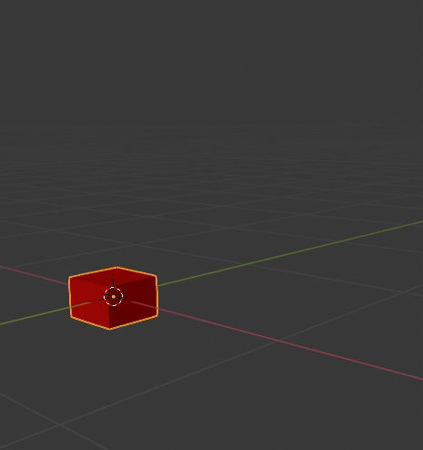

# Quick start with Clever 4 quad

## Equipment list

`clever-show` is a software suite to operate multiple quadrocopters over a network. The following equipment is required for full operation:

* One or more of Clover 4 quadcopters based on [clover](https://github.com/CopterExpress/clover) software.
* A computer with Ubuntu 18.04 operating system to control quadrocopters using the server application.
* Wifi router operating at 2.4 GHz, or at 5.8 GHz if this frequency is supported by wifi modules of copters and a PC.

## Software preparation

Copter show operation software consists of 2 main parts - server application and client part, which is provided as an image for Raspberry Pi.

The latest image version at the moment: [v0.4-alpha.3](https://github.com/CopterExpress/clever-show/releases/tag/v0.4-alpha.3).

Download [image for Raspberry Pi](https://github.com/CopterExpress/clever-show/releases/download/v0.4-alpha.3/clever-show_v0.4-alpha.3.img.zip) and [source code](https://github.com/CopterExpress/clever-show/archive/v0.4-alpha.3.zip) to your computer. Extract the source code to a convenient directory.

> The server application and the copter image must be the same version for them to work together properly.

## Router setup

To operate one or more copters, you need to connect copters and the server to the same wireless network. It requires a separate wifi router with a known SSID and password.

## Client installation and startup

* Flash the image to a microSD card using [Etcher](https://www.balena.io/etcher/).
* Insert the microSD card into Raspberry Pi on the copter and turn it on. Wait until the network `clever-show-XXXX` appears.
* Connect to the copter network using the password `cloverwifi`.
* Connect to Raspberry Pi on your copter via SSH using the static IP `192.168.11.1`, username `pi` and password `raspberry`.

```bash
ssh pi@192.168.11.1
```

* After connection, run the client configuration script `client-setup` with the specified parameters - wireless access point name (`SSID`), access point password (`password`), copter name (`copter name`). The copter will switch to the wifi client mode of the specified access point and configure the `clever-show` client to autorun on Raspberry Pi.

```bash
sudo client-setup <SSID> <password> <copter name>
```

* Now when you run the server application, the configured copters will appear as rows in the table. You can also connect to Raspberry Pi on the copter by its name with the addition of .local via `ssh` in the network specified when setting up wifi, for example `ssh pi@clover-1.local`, password `raspberry`.

**Detailed documentation on client configuration located [here](client.md).**

## Server installation and startup

* Install [chrony](https://chrony.tuxfamily.org/index.html) on your computer to synchronize time with the copters:

```bash
sudo apt install chrony
```

* Set the required Python packages using the command (ran from the source directory)

```bash
cd
pip3 install -r server/requirements.txt
```

* Connect to the wifi network of the router where your copters are connected.
* Copy [chrony settings file](../../examples/chrony/server.conf) into `/etc/chrony/chrony.conf`. If your network ip address does not start with `192.168.`, correct the address after the word "allow" (on line 7) in the copied settings file. Restart `chrony` service.

```bash
sudo systemctl restart chrony
```

* Go to the server directory from the directory with the source code and start the server

```bash
cd clever-show/server
python3 server.py
```

* After a while, the copters with the configured image will connect to the server and will be displayed as rows in the table.

**Detailed documentation on configuring the server side can be found [here](server.md).**

## Copter preparation

Further instructions are written for copters assembled according to [assembly instructions](../assemble_4_2.md). The flight controller of the copter should be pre-configured and calibrated according to [configuration instructions](../setup.md):

* Initial setup
* Sensor calibration
* RC setup
* Flight modes

Before proceeding with the software setup, make sure that the copter is controlled from the remote control with the `Stabilized` mode.

Turn on your copter and run the server application on your computer. Wait until the copter is connected to the server and its telemetry is displayed in a table.

### Positioning check

For autonomous animation playback, all copters must have a configured positioning system. The `clever-show` image for the copter is set by default to fly with the `optical flow`: a laser rangefinder should be installed on the copter and the camera should be tilted backwards by the plume. This positioning system is suitable for demonstration flight of one copter or for synchronous flight of several copters using the same indoor animation.

Before checking the autonomous takeoff, perform an automatic check of the copter configuration according to [article](../selfcheck.md).

Make sure that the copter holds the position autonomously: mark the checkbox near the name of the copter and press the "Takeoff" button in the right panel of the server interface. The copter should take off at the height specified in the `takeoff_height` parameter of the "FLIGHT" section in the [client configuration](https://github.com/CopterExpress/clever-show/blob/master/drone/config/spec/configspec_client.ini). By default, this height is 1 meter. If the copter takes off and holds a position at 1 meter height, the check is passed. Put the copter on the ground by pressing the `Land` or `Land All` button. **Warning!** For your safety it is recommended to perform a test of autonomous takeoff with the remote control turned on and ability to intercept the copter into the manual mode.

You can configure the copter to utilize a different positioning system. The following [positioning systems](../programming.md#positioning) are officially supported:

* [optical flow](../optical_flow.md).
* [ArUco](../aruco.md).
* [GPS](../gps.md).

>**Detailed information about working with and setting up positioning systems can be found [here](positioning.md)**

### LED Strip Operation Check

The LED strip should be connected to the GPIO 21 Raspberry Pi pin and have no more than 60 LEDs in order to work with the default `clever-show` image. Check the functioning of the LED strip by selecting the desired copter in the table and pressing the button `Test leads` - the strip on the copter should blink white twice.

You can find a description of setup and operation of the LED strip in `clover` [documentation](../leds.md) .

### Time synchronization

Time synchronization between all copters involved in the animation and the server is very important for correct playback of the animation. The more precisely the time is synchronized, the more coordinated the flight of the copter group will be. It is recommended to use [chrony](https://chrony.tuxfamily.org) service as a time synchronization tool. The process of installation and setup of this service for the server PC is described [above](#server-installation-and-startup), this service is already installed in the `clever-show` image.

After the first copter connection to the server, the `chrony` service on the copter is automatically configured to connect to the ip address of the server and rebooted. However, the `chrony` service in the server may stop sending packets of time synchronization when the wifi network changes and the time between the copters and the server will stop being synchronized. The difference between the time from the copter and the server time is displayed in the `dt` column of the server table. Normal time difference should be **no more than 0.1 second** (about 0.01 second), but it may be more due to network latency when transmitting telemetry from the copter. If the time difference is greater than 0.1 second it is recommended to restart the `chrony` service with the command from the top menu of the server `Selected drones -> Restart service -> chrony`. This command restarts the service `chrony` on the server (you will need to enter the user password) and on the copters.

## Animation preparation and execution

By default [basic](https://github.com/CopterExpress/clever-show/blob/master/examples/animations/basic/basic.csv) animation is already uploaded to the client:



The red line is x axis, the green line is y axis. The cube in the animation moves in a positive direction along the x axis. The animation playback module will draw the copter along the points specified in the animation file relative to the coordinate system specified in the `frame_id` option in the FLIGHT [client configuration](https://github.com/CopterExpress/clever-show/blob/master/drone/config/spec/configspec_client.ini) (`map` by default). The copter will start the motors before takeoff and turn them off after landing. The moments of takeoff and landing of the copter are determined automatically.

Information about the current position of the copter is displayed in the `current x y zaw frame_id` column of the server table. Information about the starting point of the animation and the takeoff time is displayed in the `start x y z yaw action delay` column. For the first check of the animation it is important that the coordinates in these columns match. If not, the easiest way to solve this problem is to reboot the copter and wait for it to load.

Check the playback of the animation by pressing the `Start animation` button: the first two seconds the copter will change the color of the tape, then it will start the motors, take off 1 meter upwards, then it will fly 1 meter to the right and will start going downwards. After touching the ground in the animation, the copter will switch to the landing mode, shut down the motors, and continue to change the color of the LED strip until the animation is finished.

The result of the animation should look like this (up to the accuracy of PID tuning):


**The detailed information on the animation module is located [here](animation.md).**
