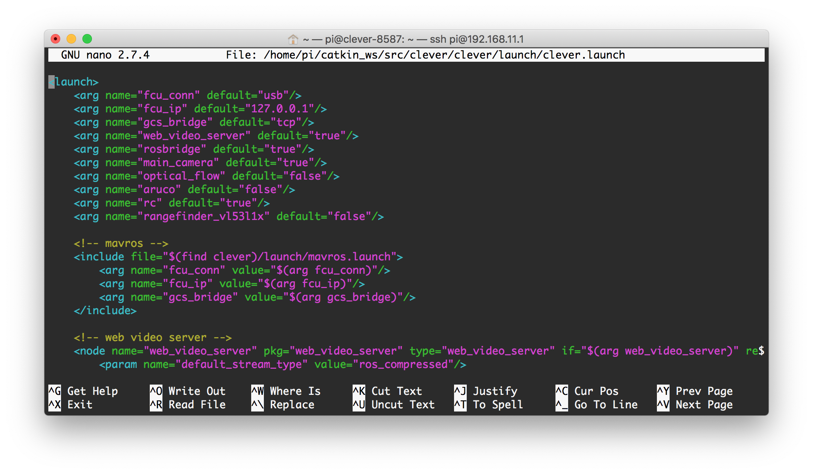

# Command line interface

The Raspberry Pi OS, Raspbian, uses CLI as its primary user interface (which is common for Linux-based operating systems). You can use [a secure shell connection](ssh.md) to access the command line.

## Basic commands

> **Hint** Double-tapping the `Tab ↹` key autocompletes the command or its argument. This is known as "tab completion".

Show the contents of the current directory:

```bash
ls
```

Change current (working) directory:

```bash
cd catkin_ws/src/clover/clover/launch
```

Go one directory level up:

```bash
cd ..
```

Print path to the current directory:

```bash
pwd
```

Print contents of the `file.py` file:

```bash
cat file.py
```

Run `file.py` as a Python script:

```bash
python3 file.py
```

Reboot Raspberry Pi:

```bash
sudo reboot
```

You can terminate currently running (foreground) program by pressing `Ctrl`+`C`.

Read more about the Linux command line in the Raspberry Pi documentation: https://www.raspberrypi.org/documentation/linux/usage/commands.md.

## Editing files {#editing}

You can use **nano** to edit files on the Raspberry Pi. It is one of the more user-friendly console-based text editor.

1. Use the following command to edit or create a file:

   ```bash
   nano path/to/file
   ```

   For example:

   ```bash
   nano ~/catkin_ws/src/clover/clover/launch/clover.launch
   ```

   
2. Edit the file.
3. Press `Ctrl`+`X`, `Y`, `Enter` to save your file and exit.
4. Restart the `clover` service if you've changed .launch files:

   ```bash
   sudo systemctl restart clover
   ```

You may also use other editors like **vim** if you prefer.

## Resetting changes

For resetting all the changes in Clover package related files (`launch`-files), use git:

```bash
cd ~/catkin_ws/src/clover
git checkout .
sudo systemctl restart clover
```
