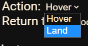

# The Clover Rescue Project

[CopterHack-2022](copterhack2022.md), Clover Rescue Team - When something went wrong.

## Team information

### The list of team members

* Кирилл Лещинский, [@k_leshchinskiy](https://t.me/k_leshchinskiy) - TeamLead.
* Кузнецов Михаил, [@fletchling_dev](https://t.me/fletchling_dev) - Software Developer.
* Даниил Валишин, [@Astel_1](https://t.me/Astel_1) - Tech Specialist/Python programmer.
* Роман Сибирцев, [@r_sibirtsev](https://t.me/r_sibirtsev) - Hardware engineer/tester.

## Project description

### Table of contents

* [Idea](#idea)
* [How it works](#hiw)
* [Required hardware](#rh)
* [Operating Instructions](#oi)
* [Installation instructions](#ii)
* [Work example/functions](#functions)
* [Settings](#settings)
* [Mobile version](#mobile)
* [Bots](#bots)
* [Our plans for the future](#plans)

## Project Idea {#idea}

The idea of this project came immediately, it lies on the surface. A system that makes situations where pilots cannot find their flown away drone or stop it at full speed flying into a wall, a thing of the past, is something that pilots have been missing for a long time. The key feature of our software is that users can manage their Clover from anywhere in the world, this software replaces FTP and SSH (users can upload the code to their drone and run it directly from our site). Also, if radio communication with the Clover is lost, it can be returned to the user's or takeoff location with just one click. Moreover, the user can monitor the status in realtime, as well as location, camera data, and airborne position data of the drone. There are also functions that can be useful in emergency situations, such as landing, hovering and disarming the drone remotely from our website. A mobile version of the site with full functionality is also available!

[Presentation video](https://youtu.be/4bvOu0h3YU0)

[Functional review video](https://youtu.be/jjeBh1ch4Xo)

[Link to the website](https://48c5-94-29-124-254.eu.ngrok.io)


## How It Works {#hiw}

Links to repositories:

* https://github.com/DevMBS/CRTClient
* https://github.com/DevMBS/CRTClover

The first repository is the main server that users and their drones connect to. This server provides communication and control of the drone through a user-friendly interface.
The second repository represents the server that runs on the drone and connects to the main server. This server reads and transmits telemetry to the main server (which is displayed as a 3-D visualization). It also takes commands from the user and executes them.
The Socket.IO library is used to transfer data between the client, server and drone.
After connecting the client and the drone to the server, they are added to a unique room with their UID, and already in it they exchange data.
You can learn more about how it works by visiting the repositories.

## Required Hardware {#rh}

All you need is COEX Clover 3/4, Raspberry Pi 3/4, USB WIFI Modem and RPi Camera!

## Operating Instructions {#oi}

Firstly, users need to register on our website.


After registration the main control panel and installation instructions open.

## Installation Instructions {#ii}

First, you need to connect to your Clover via SSH and paste the command indicated in the instructions that opened (if it is not open, you can open it by clicking on the "Instructions" button). The command looks like that:

```bash
wget https://48c5-94-29-124-254.eu.ngrok.io/assets/installers/install.sh && sudo chmod 777 ./install.sh && ./install.sh #UID
```

When the software is installed, the server will automatically start. After installation, you can forget about manually launching the software, it will automatically start and connect to the main server after turning on the Clover!

## Work Example, Functions {#functions}


On the website there are several commands for controlling the drone. “Get photo” allows you to get an image from the drone camera. The “Land” button lands the drone. The "Return" command returns drone to the operator, according to GPS coordinates (this requires a stable connection of the drone with 10 or more satellites). "Hover" makes the drone hover in the air. "Disarm" instantly disables the drone's motors, so you need to be careful with this command. The “Choose Code” and “Upload & Run” buttons allow users to select a code written in Python, upload it to the drone and run it. Also, users will see output of their code and all its errors. There is also interactive map with markers, blue marker the is location of the user, purple marker is the location of his drone. Also, as you can see, there is a real-time visualization of the Clover’s airborne position, as well as its altitude and the average voltage between the battery cells.

## Settings {#settings}


In the settings users can set speed and altitude of the return.


Users can choose an action after return (hover or land).



...And the place where the drone will return (User coordinates or takeoff coordinates).


Users can also set the period for automatically receiving photos from the drone.


At the top of the website is the status of your drone (Disconnected/Connected, disarmed, Connected, in flight).


## Mobile Version {#mobile}

The mobile version of the site has absolutely the same functionality (swipe to the right/left to move between control panels).


## Bots on the social networks and messengers {#bots}

Bots on the social networks is an example of what you can do based on our project. They have the main functionality of our website and The Clover Rescue Team is still working on their features.


[VK Bot Repository](https://github.com/Astel2022/CRTVkbot)

[Link to the bot](https://vk.com/rescueclover)

[Demonstration video of the bot](https://youtu.be/N3oFobVCmx4)

## Our plans for the future {#plans}

We do not plan to stop and want to continue the development. Here is a list of what will be added.

1. Built-in code editor.
2. More drone control bots in social networks and messengers.
3. Socket API will be written so users can create their applications in different programming languages based on our app.
4. Drone swarm controls.
