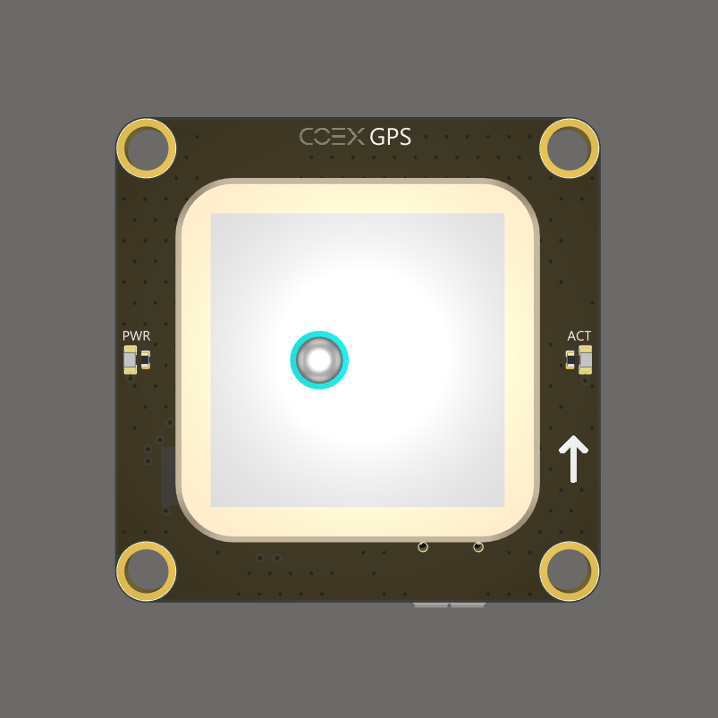
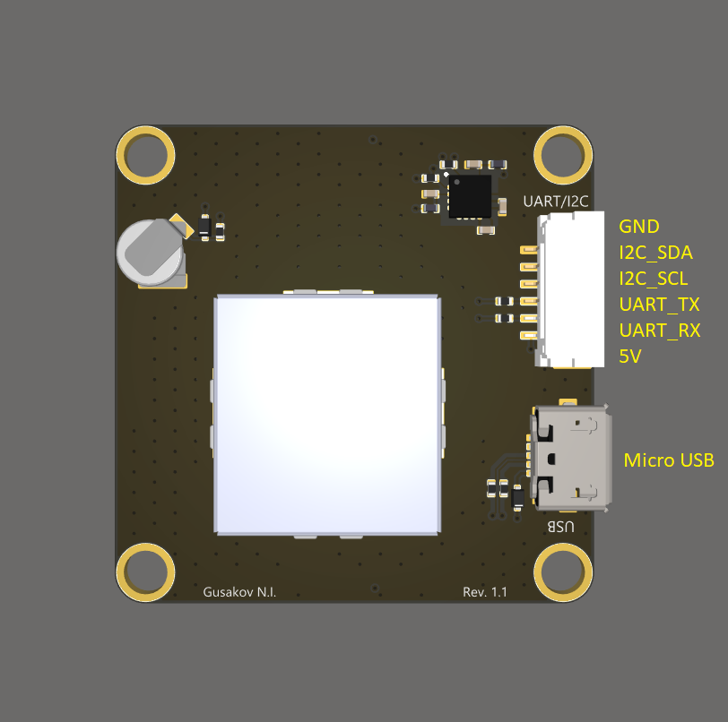

# COEX GPS

The GNSS receiver **COEX GPS** is compatible with the [COEX Pix](coex_pix.md) flight controller. This receiver comes with a COEX Clover Drone Kit.

> **Hint** The source files of the COEX GPS board are [published](https://github.com/CopterExpress/hardware/tree/master/COEX%20GPS) under the CC BY-NC-SA license.

## Port pinouts

### Top view

### Bottom view

