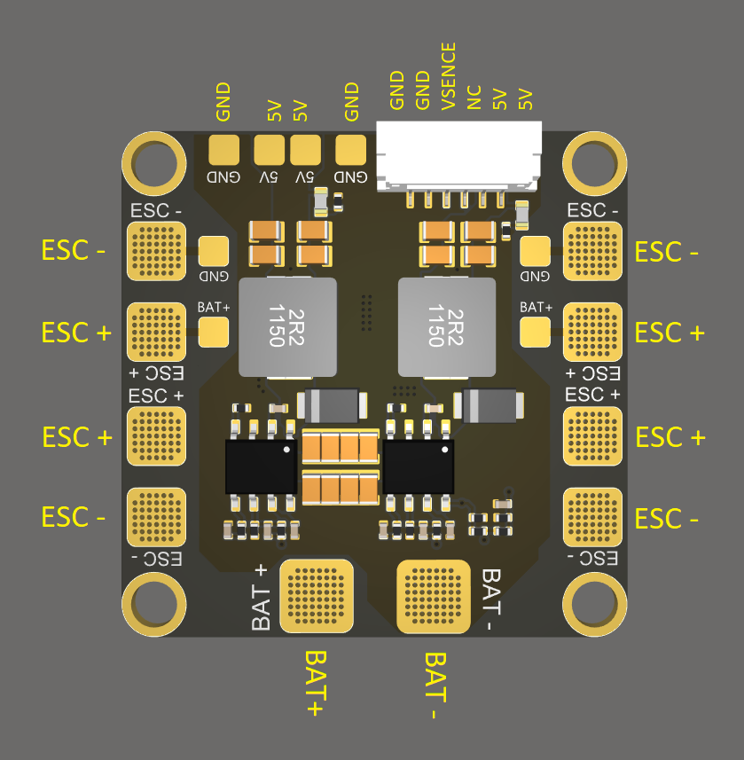
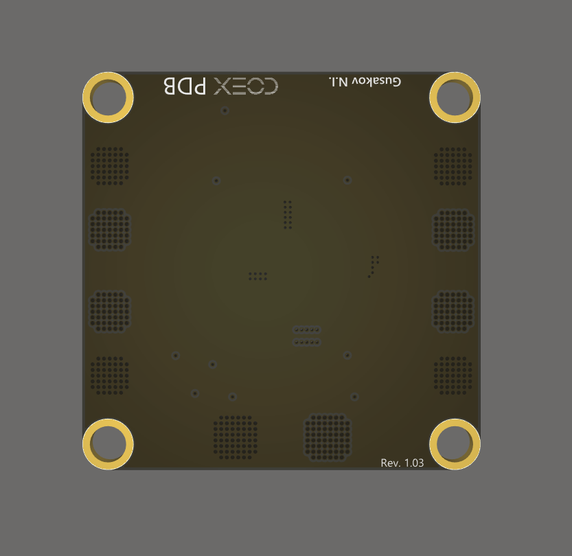

# COEX PDB

**COEX PDB** is the power distribution board used in [Clover 4 Drone kit](assemble_4_2.md).

Board size: 35x35 mm.

> **Hint** The source files of the COEX PDB board are [published](https://github.com/CopterExpress/hardware/tree/master/COEX%20PDB) under the CC BY-NC-SA license.

## Port pinouts

### Top view

### Bottom view

