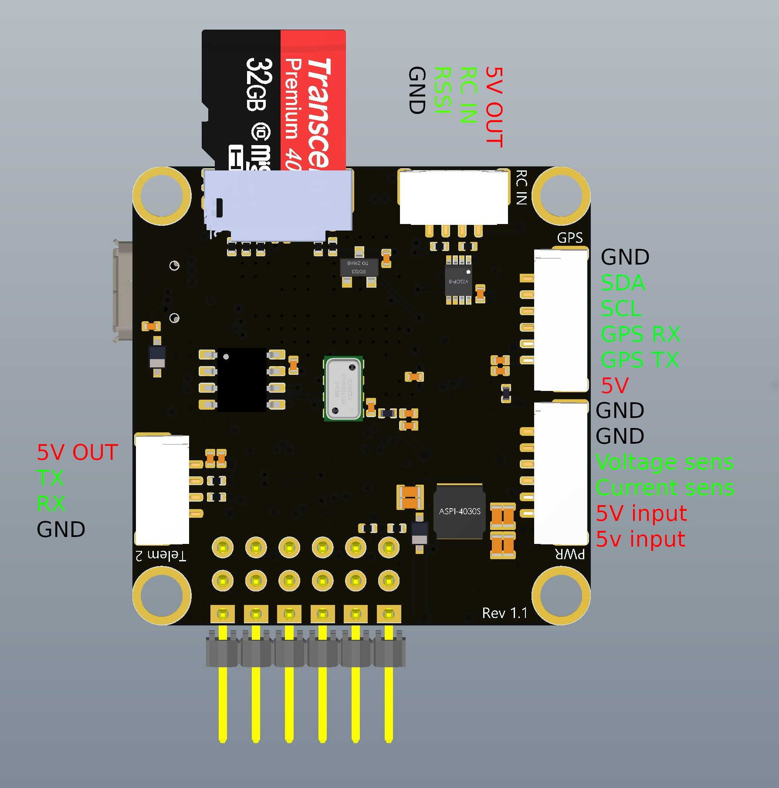
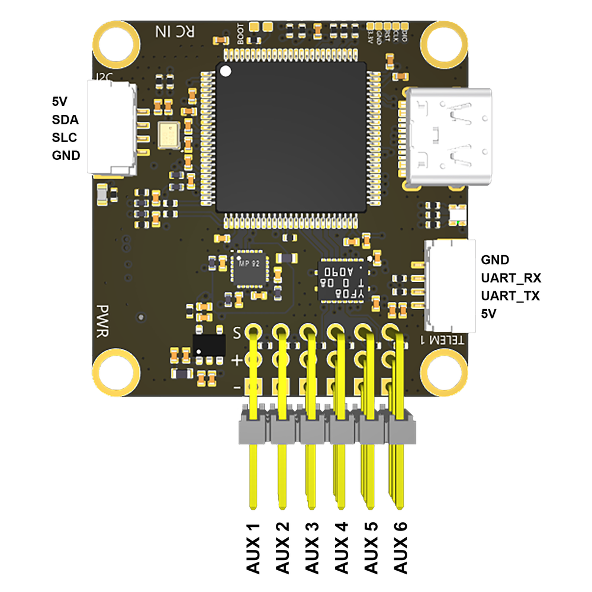

# COEX Pix

The **COEX Pix** flight controller is a modified [Pixracer](https://docs.px4.io/v1.9.0/en/flight_controller/pixracer.html) FCU. It is a part of the **Clover 4** quadrotor kit.

> **Hint** The source files of the COEX Pix flight controller are [published](https://github.com/CopterExpress/hardware/tree/master/COEX%20Pix) under the CC BY-NC-SA license.

## Revision 1.1

### Physical specs

* Board size: 35x35 mm.
* Mounting hole pattern: standard 30.5 mm.
* Mounting hole diameter: 3.2 mm.
* Board mass: 9 g.
* Operating temperature range: -5..+65 ºC.
* Input voltage: 4.8..5.5 V.

### Key features

* Main System-on-Chip: *STM32F427VIT6*.
* FRAM chip: *FM25V02A*
* Built-in sensors:
  * *MPU9250* 9DOF accelerometer/gyroscope/magnetometer.
  * *MS5607* barometer.

### Ports

* *TELEM 1* (JST-GH 4 pin) – telemetry port 1, UART.
* *TELEM 2* (JST-GH 4 pin) – telemetry port 2, UART.
* *GPS* (JST-GH 6 pin) – GNSS (UART) and external compass (I2C) port.
* *I2C* (JST-GH 4 pin) – I2C port for supported devices (shares lanes with *GPS* port).
* *PWR* (JST-GH 6 pin) – port for PDB connection (COEX PDB or compatible), with two power lanes, two ground lanes, and voltage and current sensor inputs.
* *RC IN* (JST-GH 4 pin) – RC input port with RSSI pin. Supports PPM and S.BUS protocols.
* Micro USB port for PC connection (USB 2.0/1.1).
* MicroSD slot (supports up to 32gb microSD cards).
* 6 servo outputs for ESCs and other peripherals.

### Port pinouts

> **Note** On rev. 1.0 boards *RC IN* port and microSD slot are switched. Pinout for the *RC IN* port is the same on these boards.

### Mounting suggestions

**Important**: The board is meant to be installed with a non-standard orientation (roll 180º, yaw 90º) on the Clover airframe. Therefore, the `SENS_BOARD_ROT` PX4 parameter should be set to `ROLL 180, YAW 90`.

### Usage notes

In order to reduce magnetic interference from the PDB and power cables you should mount the FCU as far away from these parts as possible. You should have at least 15 mm clearance from high-power parts.

You may want to disable internal compass if you're using an external GNSS+compass module.

If your drone does not have a protective cover for the FCU, you should place a piece of foam over the barometer.

The FCU has power passthrough from the *PWR* input to the servo rail. Supplying additional power to the servo rail is not recommended if the *PWR* input is used. Powering the FCU from USB and *PWR*/*AUX* inputs is acceptable.

### Board specifics

The board utilizes low-noise DC-DC converters, voltage inputs have LC and ferrite filters.

## Revision 1.2

### Innovations

* Replaced USB Micro-B connector with USB Type-C connector.
* Changed the slot for microSD cards to a deeper one.
* Changed pin assignments on the I2C connector.
* Added ferrite filters in the power circuit.

### Port pinouts

