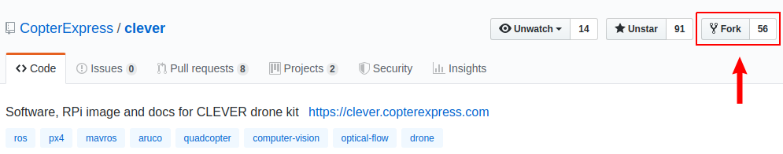
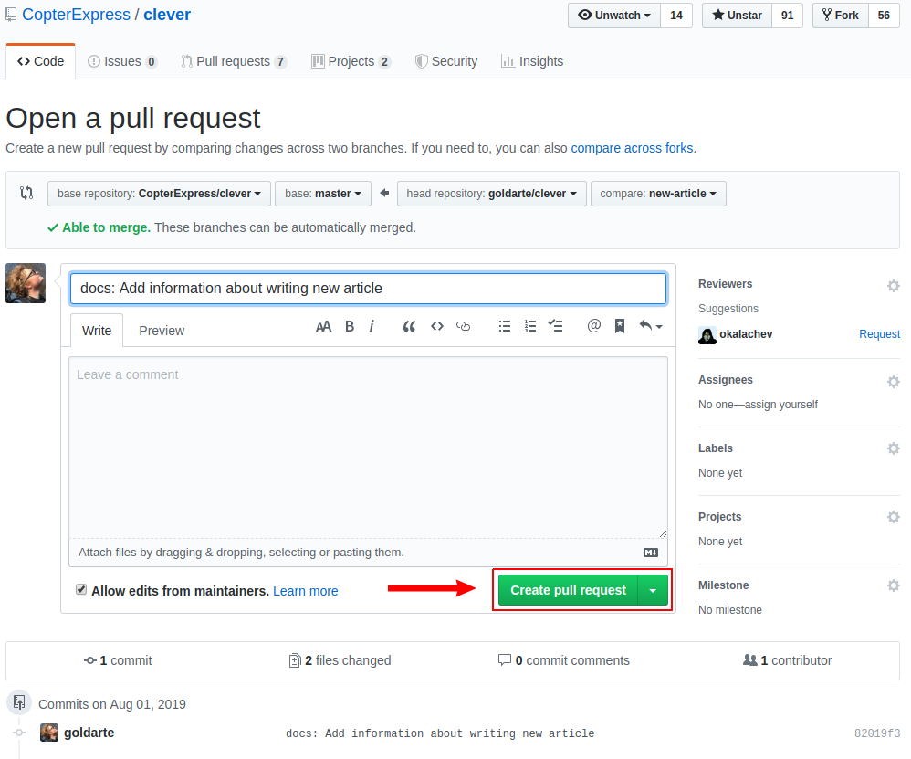

# Contribution to Clever

Clever is mostly an [open source](https://en.wikipedia.org/wiki/Open-source_software) and [open hardware](https://en.wikipedia.org/wiki/Open-source_hardware) project aimed at lowering the entry threshold to development of the projects related to flying robotics. You can contribute to the project by offering fixes and improvements for Clever documentation and software.

> **Note** To offer changes to Clever documentation or SW, you should have an account at [GitHub](https://github.com).

## Markdown

All Clever documentation is written in the widespread [Markdown](https://en.wikipedia.org/wiki/Markdown) format. There are many Markdown guides on the Internet.

In Russian: https://guides.hexlet.io/markdown/.

In English: https://www.markdownguide.org/getting-started, https://github.com/adam-p/markdown-here/wiki/Markdown-Cheatsheet.

For the ease of editing texts, you may use text editors with Markdown support: [Typora](https://typora.io), [Dillinger](https://dillinger.io/) (web), [VSCode](https://code.visualstudio.com) with the [Markdown Editor plugin](https://marketplace.visualstudio.com/items?itemName=MadsKristensen.MarkdownEditor).

We also recommend using the [Code Spell Checker](https://marketplace.visualstudio.com/items?itemName=streetsidesoftware.code-spell-checker) VScode plugin.

For a local build of a static documentation website, use the [`gitbook-cli`](https://github.com/GitbookIO/gitbook-cli) utility.

## Fixing documentation errors

If you have found an error in the documentation or if you want to improve it, use the **Pull Request** mechanism.

1. Find a file with the article you want in the repository – https://github.com/CopterExpress/clever/tree/master/docs.
2. Click "Edit".

    

3. Make the necessary changes.
4. Click "Propose file change".
5. Describe the change you have made, and click "Create a Pull Request".
6. Wait for your changes to be approved :)

More information about Pull Requests is available [at GitHub](https://help.github.com/articles/about-pull-requests/) (English) or in [GIT documentation](https://git-scm.com/book/ru/v2/GitHub-contributing-to_projects) (Russian).

## Contributing a new article

> **Note** If you've made your own project based on Clever, you can add an article about it to the "Clever-based projects" section.

Prepare your article and send it as a pull request to the [Clever repository](https://github.com/CopterExpress/clever).

1. Fork the Clever repository:

    

2. Check out the freshly-forked repository on your computer:

    ```bash
    git clone https://github.com/<USERNAME>/clever.git
    ```

3. Open the directory with the source code checkout and create a new branch for your article (for example, `new-article`):

    ```bash
    git checkout -b new-article
    ```

4. Write a new article in the [Markdown](https://en.wikipedia.org/wiki/Markdown) format and save it in the `docs/ru` or `docs/en` folder (for example, `docs/en/new_article.md`).
5. Place additional visual assets in the `docs/assets` folder and add them to your article.
6. Add a link to your article to the appropriate section in the `SUMMARY.md` file (in the same folder as in the fourth step):

    ```markdown
    ...
    * Supplementary materials
      * [COEX Pix](coex_pix.md)
      * [Contribution guidelines](contributing.md)
      * [New article](new_article.md)
      * [RC troubleshooting](radioerrors.md)
      * [Flashing ESCs](esc_firmware.md)
    ...
    ```

7. Commit your changes locally:

    ```bash
    git add docs/
    git commit -m "Add new article for Clever"
    ```

8. Upload your branch to your forked repository on GitHub:

    ```bash
    git push -u origin new-article
    ```

9. Open your repository on GitHub and send a `pull request` from your branch to Clever:

    

    

10. Wait for the review, be ready to make changes if needed.
11. Look at your new and useful article at https://clever.coex.tech !
