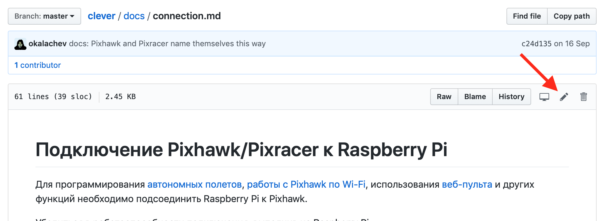

# Contribution to Clever

Clever is mostly an [open source](https://ru.wikipedia.org/wiki/Open_source) and [open hardware](https://ru.wikipedia.org/wiki/open_hardware) project aimed at lowering the entry threshold to development of the projects related to flying robotics. You can contribute to the project by offering fixes and improvements for Clever documentation and software.

> **Note** To offer changes to Clever documentation or SW, you should have an account at [GitHub](https://github.com).

## Markdown

All Clever documentation is written in the widespread [Markdown] format (https://ru.wikipedia.org/wiki/Markdown). There are many guides on it on the Internet.

In Russian: https://guides.hexlet.io/markdown/.

In English: https://www.markdownguide.org/getting-started, https://github.com/adam-p/markdown-here/wiki/Markdown-Cheatsheet.

For the ease of editing texts, you may use text editors with markdown support [Typora](https://typora.io), [Dillinger](https://dillinger.io/) (web), [VSCode](https://code.visualstudio.com) with the [Markdown Editor]plugin (https://marketplace.visualstudio.com/items?itemName=MadsKristensen.MarkdownEditor).

For a local build of a static documentation website, use the [`gitbook-cli`] utility (https://github.com/GitbookIO/gitbook-cli).

## Correcting errors in the documents

If you have found an error in the documents, or if you want to improve it, use the Pull Request mechanism.

1. Find a file with the article you want in the repository – https://github.com/CopterExpress/clever/tree/master/docs.
2. Click "Edit".

    

3. Make the necessary changes.
4. Click "Propose file change".
5. Describe the change you have made, and click "Create a Pull Request".
6. Wait for your changes to be approved :)

More information about Pull Requests is available [at GitHub](https://help.github.com/articles/about-pull-requests/) (English) or in [GIT documentation](https://git-scm.com/book/ru/v2/GitHub-contributing-to_projects) (Russian).

<!--
## Adding a new article

TODO
-->

## Your project with Clever

If you have implemented your own interesting project using clever, you can add an article about it in section "Clever-based projects".

<!-- TODO -->