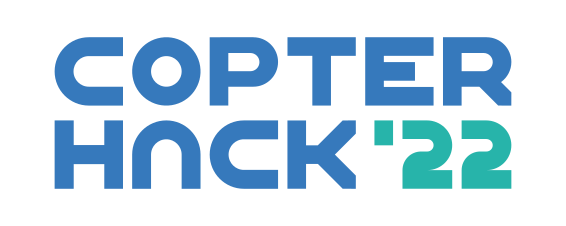
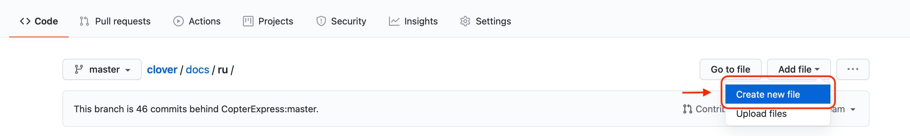

# CopterHack 2022



CopterHack 2022 is an international open-source projects competition on aerial robotics. The mainstream of the CopterHack 2022 is team competition with a free choice of the project topic. In addition, this year we organized a second category, company cases. The competition’s main language is English.

You can see the articles of the CopterHack 2021 finalist teams by the link [CopterHack 2021](copterhack2021.md).

The proposed projects have to be open-source and be compatible with the Clover quadcopter platform. Teams will work on their projects throughout the competition, bringing them closer to the state of the finished product. Industry experts will assist the participants through lectures and regular feedback.

## Projects of the contest's participants {#participants}

|Place|Team|Project|Points|
|:-:|-|-|-|
||🇰🇬 Alatoo University Team|[Облачная платформа для симулятора Клевера](https://github.com/pteacher/clover/blob/clover_simulator/docs/ru/clover-development-studio.md)||
||🇧🇾 FTL|[Advanced Clover 2](https://github.com/FTL-team/clover/blob/FTL-advancedClover2/docs/ru/advanced_clover_simulator.md)||
||🇷🇺 Stereo|[Neural obstacle avoidance](https://github.com/den250400/clover/blob/neural-obstacle-avoidance/docs/en/neural-obstacle-avoidance.md)||
||🇷🇺 Space clowns|[Copter For Space](https://github.com/slavikyd/clover/blob/patch-3/docs/ru/c4s.md)||
||🇷🇺 R.S.|[Drone Hawk](https://github.com/slavaroot/clover/blob/droneHawkSecurity/docs/ru/drone-hawk-security.md)||
||🇲🇾 Moopt|[IoT Water Monitoring & Optimization](https://github.com/kafechew/clover/blob/master/docs/en/moopt-uav.md)||
||🇧🇷 Atena - Grupo SEMEAR|[Swarm in Blocks](https://github.com/Grupo-SEMEAR-USP/clover/blob/Swarm_in_Blocks/docs/en/swarm_in_blocks.md)||
||🇷🇺 Clevertron|[Clevertron](https://github.com/Daniel-drone/clover/blob/Clevertron-1/docs/ru/clevertron.md)||
||🇷🇺 Clover Rescue Team|[Rescue Clover](https://github.com/DevMBS/clover/blob/CloverRescueTeam/docs/ru/clover-rescue-team.md)||
||🇵🇱 Edgenoon|[Neural and vision-based landing method](https://github.com/edgenoon-ai/clover/blob/neural_vision_based_landing_method/docs/en/neural_vision_based_landing_method.md)||
||🇷🇺 CopterCat|[CopterCat](https://github.com/matveylapin/clover/blob/CopterCat/docs/ru/сopter_сat.md)||
||🇷🇺 Дрой Ронов|[Clover Swarm](https://github.com/stinger000/clever/blob/clover_swarm_request/docs/ru/clover-swarm.md)||
||🇩🇪 Inondro|[Inondro Pix](https://github.com/Inondro/clover/blob/inondro-pix/docs/en/inondro_copterhack22_pix.md)||
||🇮🇳 DJS Phoenix|[Autonomous valet parking drone assistance](https://github.com/DJSPhoenix/clover/blob/DJSPhoenix-Ikshana/docs/en/djs_phoenix_ikshana.md)||
||🇷🇺 SPECTRE|[SPECTRE](https://github.com/alakhmenev/clover/blob/spectre_team/docs/ru/spectre_team.md)||
||🇷🇺 SolidEye|[Разработка лидара без движущихся частей](https://github.com/feanorgg/clover/blob/solideye/docs/ru/solid_eye.md)||
||🇰🇬 AI_U_CLOVER|[AIU_CLOVER](https://github.com/zhibekm/clover/blob/zhibekm-patch-1/docs/en/aiu-article.md)||
||🇷🇺 С305|[Система мониторинга воздуха](https://github.com/Ruslan2288/clover/blob/master/docs/ru/air_monitor.md)| |
|✕|🇻🇳 Dragon&Tanker|[Dragon&Tanker](https://github.com/uml4/clover/blob/drone_observe_autonomous_car/docs/en/dragon_and_tanker_team.md)||
|✕|🇷🇺 V-NAV|[Visual Navigation](https://github.com/v-nav/clover/blob/v-nav_article/docs/ru/v-nav.md)||
|✕|🇷🇺 Джедаи 1581|[Ретранслятор на базе Клевера](https://github.com/JJNIK/clover/blob/patch-1/docs/ru/1581.md)||
|✕|🇷🇺 Lucky flight|[Swarm of Improved Clover](https://github.com/bessiaka/clover/blob/Lucky-flight/docs/ru/lucky_flight.md)||
|✕|🇺🇸 EnviroFleet|[EnviroFleet](https://github.com/gueyman/clover/blob/envirofleet/docs/en/enviro_fleet.md)||
|✕|🇷🇺 Бизнес-гуси|[Drone Rover Climbing System](https://github.com/HexaHEX/clover/blob/CopterHack2022_Business_Geese-1/docs/ru/business_geese.md)||
|✕|🇷🇺 fuall|[Доставка дронами](https://github.com/Silly4s/clover/blob/master/docs/ru/dostavka.md)||
|✕|🇷🇺 Scout_Drone|[Создание поисково-спасательного беспилотного летательного аппарата](https://github.com/MustafaNatur/clover/blob/Scout_Drone.md/docs/ru/scout_drone.md)| |

✕ – teams which haven't qualified for the Final.

## Company case competition

Teams are welcome to dive into the development of the following company cases:

1. Develop the Pixhawk FMUv6U flight controller board with the dimensions 55x40 mm and the compatibility of a Raspberry Pi CM 4 installation.
2. Cloud platform for the [Clover simulator](https://clover.coex.tech/ru/simulation.html) similar as to/based on [ROS Development Studio](https://app.theconstructsim.com/).

The list of cases may be expanded in future.

## CopterHack 2022 stages

The qualifying and project development stages will be held in an online format. The final round will be in a hybrid mode (offline + online). The competition involves monthly updates from the teams with regular feedback from the Jury. All teams have to prepare a final video and presentation about the project's results to participate in the final stage.

1. Qualifying stage. Applications are welcome due October 31, 2021.
2. Projects development stage. This stage includes monthly updates and mentorship of participants, starts at June 10, 2021, and continuous until February 28, 2022.
3. All participating teams should shoot the final video to proceed to the final round. Final videos have to be submitted from March 1 up to March 31, 2022.
4. The final round. Projects presentation at April 9–10, 2022.

## Conditions and criteria for evaluating the final result

General project requirements:

1. Open-source.
2. Compatibility with the Clover platform.

Criteria for judging the jury at the final:

1. Readiness and the article (max. 10 points): the degree of readiness of the project; an accessible and understandable description of the project in the article; a link to the code with comments, diagrams, drawings. It should be possible to reproduce the project and get the result according to the article.
2. Amount of work done (max. 6 points): the amount of work done by the team in the framework of CopterHack 2022, its complexity, and the technical level.
3. Usefulness for Clover (max. 6 points): the relevance to the Clover and PX4 platform application in practice, the potential level of demand from other Clover users.
4. Presentation at the final (max. 3 points): quality and entertainment of the final presentation; completeness of the project coverage; demonstration; answers to the jury's questions.

## Prize fund

The mainstream of the CopterHack 2022 involves the following prizes from COEX based on the results of the jury's evaluation of projects at the final round:

* 1st place: $3000 (USD).
* 2nd place: $2000 (USD).
* 3rd place: $1000 (USD).
* 4th place: $500 (USD).
* 5th place: $500 (USD).

The competition partners can reward the teams according to additional criteria identified due to the evaluation of projects during the final round.

The company case competition provides a prize of $2500 (USD) from COEX for further project development for the best teams in each cases.

## How to apply?

> **Note** To apply, you should have an account on [GitHub](https://github.com).

Prepare your application and send it as a Draft Pull Request to [Clover repository](https://github.com/CopterExpress/clover)

1. Fork the Clover repository:

    

2. On the web page of your fork, go to the `docs/en` section and create a new file in the [Markdown](http://en.wikipedia.org/wiki/Markdown) format:

    

3. Enter the title of your article. For example, `new-article.md`

    

4. Fill out your application by the recommended template:

   ```markdown
   # Project name
   
   [CopterHack-2022](copterhack2022.md), team **Team name**.
   
   ## Team information
   
   The list of team members:
   
   (Describe the team: full name, contacts (e-mail/Telegram username), role in the team).
   
   * Alexander Sokolov, @aleksandrsokolov111, engineer.
   * Elena Smirnova, @elenasmirnova111, programmer.
   
   ## Project description
   
   ### Project idea
   
   Briefly describe the idea and stage of the project.
   
   ### The potential outcomes
   
   Describe how you see the project result.
   
   ### Using Clover platform
   
   Describe how the Clover platform will be used in your project.
   
   ### Additional information at the request of participants
   
   For example, information about the team's experience working on projects, attach a link to articles, videos.
   ```

5. Go to the bottom of the page and create a new branch with the title of your article:

    

    > **Note** Don't commit changes directly to the `master` branch, create a new branch.

6. If necessary, place additional visual assets in the `docs/assets` folder and add them to your article.

7. Send a Draft Pull Request from your branch to Clover:

    

8. In the Pull Request comments, you will be given feedback on the application. On the contest page, in the section "Projects of the contest participants", a link to your application in your fork will be published.

9. Note the *Checks* block at the bottom, a check mark should appear in the *Documentation* field. If a cross appeared, click *Details* link to see the list of issues in you article found by markdownlint. If you need to change added files, edit them in you branch – changes will appear in the Pull Request automatically. **Do not open a new Pull Request for the same application**.

10. During the contest, you will work on this document, bringing it closer to the state of the finished article. By the end of the contest, you will publish your article, which will be the result of your work in CopterHack 2022.

As soon as the link to the application is added to this page in the section "Projects of the contest's participants", your team has become an official participant of the CopterHack 2022!

Contest participants will be added to the special Telegram group, where one can send the project's updates and get feedback from the Jury. For all participating teams, COEX will provide a 50% discount on the Clover drone kit.

> **Info** There are no restrictions on the age, education, and number of people in the team.

---

For all questions: [CopterHack 2022](https://t.me/CopterHack).
