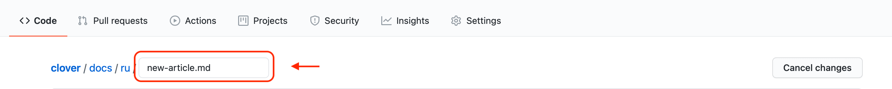

# CopterHack 2023


CopterHack 2023 is an international open-source projects competition on aerial robotics. The main direction of the CopterHack is team competition with a free choice of the project topic. The competition’s official language is English.

To learn more about the articles of the CopterHack finalist teams follow the links [CopterHack 2021](copterhack2021.md), [CopterHack 2022](copterhack2022.md).

The proposed projects are supposed to be open-source and be compatible with the Clover quadcopter platform. Teams-participants are supposed to work on their projects throughout the competition, bringing them closer to the state of the finished product while being assisted by industry experts through lectures and regular feedback.

Final of the CopterHack 2022 was held on May 27, 2023. The winner team was the team 🇷🇺 **[Clover Cloud Platform](clover-cloud-platform.md)**.

## Full stream of the final

<iframe width="560" height="315" src="https://www.youtube.com/embed/Hdl6Sah7nkE" frameborder="0" allow="accelerometer; autoplay; encrypted-media; gyroscope; picture-in-picture" allowfullscreen></iframe>

## Projects of the contest's participants {#participants}

|Place|Team|Project|Points|
|:-:|-|-|-|
|1|🇷🇺 Clover Cloud Team|[Clover Cloud Platform](clover-cloud-platform.md)|21.7|
|2|🇧🇾 FTL|[Advanced Clover 2](advanced_clover_simulator_platform.md)|21|
|3|🇨🇦 Clover with Motion Capture System|[Clover with Motion Capture System](mocap_clover.md)|20.5|
|4|🇧🇷 Atena|[Swarm in Blocks 2](swarm_in_blocks_2.md)|20.3|
|5|🇷🇺 C305|[Система радио-навигации](../ru/nav-beacon.html)|17.5|
|6|🇮🇳 DJS PHOENIX|[Autonomous Racing Drone](djs_phoenix_chetak.md)|14.6|
|7|🇷🇺 Lyceum №128|[Network of Clover charging stations](liceu128.md)|13.7|
|✕|🇰🇬 Zavarka|[Система обмена грузами с помощью конвейера](https://github.com/aiurobotics/clover/blob/conveyance/docs/ru/conveyance.md)||
|✕|🇷🇺 FSOTM|[Drone Interceptor](https://github.com/deadln/clover/blob/interceptor/docs/ru/interceptor.md)||
|✕|🇰🇬 Homelesses|[Trash Collector](https://github.com/Isa-jesus/clover/blob/trash-collector/docs/ru/show_maker.md)||
|✕|🇷🇺 Digital otters|[Digital otters](https://github.com/Mentalsupernova/clover_cool/blob/new-article.md/docs/ru/new-article.md)||
|✕|🇷🇺 Light Flight|[Сопровождение БПЛА при посадке](https://github.com/SirSerow/clover_inertial_ns/blob/inertial-1/Description.md)||
|✕|🇰🇬 LiveSavers|[LiveSavers](https://github.com/Sarvar00/clover/blob/livesavers/docs/ru/livesaver.md)||
|✕|🇷🇺 XenCOM|[Bound by fate](https://github.com/xenkek/clover/blob/xenkek-patch-1/docs/ru/bound_by_fate.md)||
|✕|🇷🇺 Ava_Clover|[DoubleClover](https://github.com/bessiaka/clover/blob/Ava_Clover/docs/ru/soosocta.md)||
|✕|🇷🇺 TPU_1|[Совместная транспортировка груза](https://github.com/shamoleg/clover/blob/tpu_1/docs/ru/tpu_1.md)||
|✕|🇷🇺 TPU_2|[Алгоритм полета сквозь лесную местность](https://github.com/shamoleg/clover/blob/tpu_2/docs/ru/tpu_2.md)|&nbsp;|

See all points by criteria in the [full table](https://docs.google.com/spreadsheets/d/1qTpW8zFVdSEGnbtOvMgQD6DcYwu8URFt1RKOCeUaOe8).

## CopterHack 2023 stages

The qualifying and project development stages will be held in an online format, however, the final round will be in a hybrid mode (offline + online). The competition involves monthly updates from the teams with regular feedback from the jury. All teams are required to prepare a final video and presentation on the project's results to participate in the final stage.

1. Qualifying stage. Applications are accepted on the deadline date until October 31, 2022.
2. Projects development stage. This stage includes monthly updates and mentorship of participants. Starting date - November 1, 2022. Deadline date - February 28, 2023.
3. All teams-participants are required to make the final video to proceed to the final round. Final videos are required to be uploaded until March 31, 2023.
4. The final round. Projects presentation takes place April 23, 2023.

## Conditions and criteria for evaluation the final result

General project requirements:

1. Open-source.
2. Compatibility with the Clover platform.

Judging criteria for the jury at the final:

1. Readiness and the article (max. 10 points): the degree of readiness of the project; an accessible and understandable description of the project in the article; a link to the code with comments, diagrams, drawings. It should be possible to reproduce the project and get the result according to the article.
2. Amount of work done (max. 6 points): the amount of work done by the team in the framework within of CopterHack, its complexity, and the technical level.
3. Usefulness for Clover (max. 6 points): the relevance to the Clover and PX4 platform application in practice, the potential level of demand from other Clover users.
4. Presentation at the final (max. 3 points): quality and entertainment points of the final presentation; completeness of the project coverage; demonstration; answers to the jury's questions.

## Prize fund

Basing on the results of the evaluation of projects at the final round, the jury will select the winners with the following prizes.

* 1st place: $3000 (USD).
* 2nd place: $2000 (USD).
* 3rd place: $1000 (USD).
* 4th place: $500 (USD).
* 5th place: $500 (USD).

The competition partners can reward the teams according to additional criteria identified during the evaluation of projects during the final round.

## How to apply?

> **Note** In order to be able to apply, you must have an account on [GitHub](https://github.com).

Prepare your application and send it as a Draft Pull Request to [Clover repository](https://github.com/CopterExpress/clover)

1. Fork the Clover repository:

    

2. On the web page of your fork, go to the `docs/en` section and create a new file in the [Markdown](http://en.wikipedia.org/wiki/Markdown) format:

    

3. Enter the title of your article. For example, `new-article.md`

    

4. Fill in your application by the recommended template:

   ```markdown
   # Project name
   
   [CopterHack-2023](copterhack2023.md), team **Team name**.
   
   ## Team information
   
   The list of team members:
   
   (Describe the team: full name, contacts (Telegram username), role in the team).
   
   * Alexander Sokolov, @aleksandrsokolov111, engineer.
   * Elena Smirnova, @elenasmirnova111, programmer.
   
   ## Project description
   
   ### Project idea
   
   Briefly describe the idea and stage of the project.
   
   ### The potential outcomes
   
   Describe how you see the project result.
   
   ### Using Clover platform
   
   Describe how the Clover platform will be used in your project.
   
   ### Additional information at the request of participants
   
   For example, information about the team's experience while working on projects, attach a link to articles, videos.
   ```

5. Go to the bottom of the page and create a new branch with the title of your article:

    

    > **Note** Don't commit changes directly to the `master` branch, create a new branch.

6. If necessary, place additional visual assets in the `docs/assets` folder and add them to your article.

7. Send a Draft Pull Request from your branch to Clover:

    

8. In the Pull Request comments, you will be given feedback on the application.

9. Please note, in the *Checks* block the *Documentation* field should contain a tick, id cross appeared, click *Details* link to see the list of issues in you article found by markdownlint. If you need to change added files, edit them in you branch – changes will appear in the Pull Request automatically. **Do not open a new Pull Request for the same application**.

10. During the contest, you will work on this document, bringing it closer to the finished state. By the end of the contest you are expected to publish your article which is supposed to be the result of your work in CopterHack.

Teams-participants are supposed to be added to the special Telegram group, where one can send the project's updates and get feedback from the Jury. For all participating teams, COEX will provide a 40% discount on the Clover drone kit.

> **Info** There are no restrictions on the age, education, and number of people in a team.

## CopterHack 2023 projects’ papers contest

Our participants have been engaged in advanced projects in the field of aerial robotics for already two years. This year we are planning to launch a new type of contest stimulating participants to present the research results running within the whole contest, at high -level international conferences as well as to publish them in Russian and international magazines in thematic areas.

Original articles are accepted in following nominations:

* $2000 (USD) for an article in a magazine of first quartile (Q1), indexed in Scopus, Web of Science.
* $1000 (USD) for an article in a magazine, indexed in Scopus, Web of Science.
* $500 (USD) for an article, published in Compendium (Conference Proceedings), indexed in Scopus, Web of Science.

> **Note** [Easy way to find quartiles for journals in Web of Science and Scopus](https://www.texpedi.com/2021/07/how-to-find-journal-quartile.html).

Requirements:

1. The article is required to reflect the results of the project, developed within CopterHack 2023.
2. The article is required to be accepted for publication by the moment of application for the Contest.
3. It is required to indicate in the acknowledgement area that work is accomplished within the Contest.

**Applications deadline**: December 10, 2023. The application for the contest should be submitted through the [Google Form](https://docs.google.com/forms/d/e/1FAIpQLSf52x0CTur-wUCG2URwY-p85gEUBUvgC0mPVNot0RHVjqcLZA/viewform).

**Results announcement**: December 24, 2023.

---

For all questions: [CopterHack in Telegram](https://t.me/CopterHack).

> **Info** Please contact [Oleg Ponfilenok in Telegram](https://t.me/ponfilenok) if you are interested in becoming the contest's partner or jury member.
