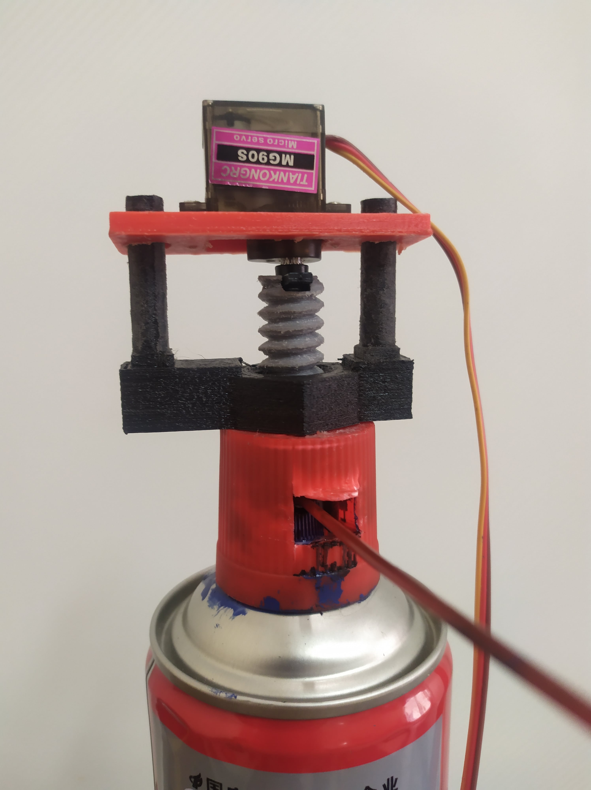

# D-drone Copter Hack 2021 by AT Makers

[CopterHack-2021](copterhack2021.md), team **AT Makers**.


## Intro

People strive to teach artificial intelligence everything they can do themselves. We are taught to draw from childhood. And why not teach the drone to draw? At the moment, copters and graffiti are gaining popularity. So we decided to combine them.

## Models and assembly


To complete the project you need to have in stock:

- spray paint
- clover 4 kit
- servo MG90S
- 3D printer
- spray can extension straw
- velcro
- 4 long screws and nuts M4 or M3
- 2-4 short self-tapping screws M4 or M3.

[Download](https://github.com/PerizatKurmanbaeva/D-drone/tree/master/details) and 3D-print details:

- holder
- screw
- rack_holder_with_nut
- rack x2
- servo_holder.

**Spray holder.** The spray holder is attached to the deck with 4 screws and nuts. To fasten the can to the holder, we used a tape with velcro. With 4 nuts and screws, we fix the drone's upper deck with spray holder.

Holder weight: 90g.


If the diameter of the can is less than the diameter of the holder, we use the part in the form of an arc, with the size of the difference between them. This helps us to fix the spray can firmly.

**Pressing mechanism.** To push the valve, we will use a screw drive with a fixed nut. A bar with holes will be attached to the servo, which will include the racks attached to the nut. This helps the servo to move only on one axis, up and down. We also modeled the cap for the spray can button, since the surface of the nozzle is uneven.




## Before launching

### Configuring the servo scripts

Before starting the copter, you need to download [servo.py](https://github.com/PerizatKurmanbaeva/D-drone/blob/master/examples/servo.py) and move it to RPi. You can simply copy and paste using the clipboard. Or copy it using the scp command. For instance:

```bash
scp servo.py pi@192.168.11.1:/home/pi
```

Then run the following commands remotely on the Raspberry Pi:

```bash
sudo pigpiod
python servo.py
```

### Configuring the Web interface

Download this [repository](https://github.com/PerizatKurmanbaeva/visual_ddrone) in .zip format. Copy to RPi and unpack using the following commands:

```bash
scp visual_ddrone-master.zip pi@192.168.11.1:/home/pi
cd catkin_ws/src/clover/clover/www
unzip /home/pi/visual_ddrone-master.zip .
mv visual_ddrone-master ddrone
```

Now to open the web interface, click on the link [http://192.168.11.1/clover/drone](http://192.168.11.1/clover/drone).

## Web interface

Our drone is launched via [website](https://perizatkurmanbaeva.github.io/visual_ddrone). The web interface allows you to draw and encode what you draw in G-code. The coordinate data will be transmitted for further processing and execution by the copter.


We pick the web interface to control the copter because it is easier for the user.


## Flights

<iframe width="560" height="315" src="https://www.youtube.com/embed/ErtioCj5iMw" frameborder="0" allow="accelerometer; autoplay; clipboard-write; encrypted-media; gyroscope; picture-in-picture" allowfullscreen></iframe>

## Special Thanks

Project was created with financial support of International Ala-Too University.


