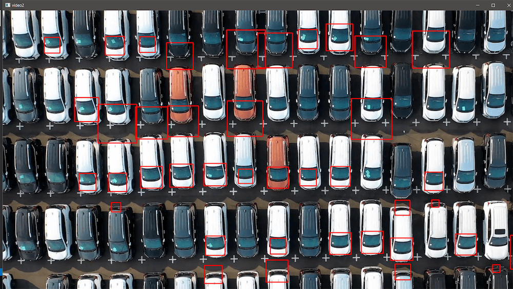

# Ikshana — Autonomous valet parking drone assistance

[CopterHack-2022](copterhack2022.md), team **DJS Phoenix**.

## Team information

We are the DJS Phoenix, the official drone team of Dwarkadas. J. Sanghvi College of Engineering.

The list of team members:

* Shubham Mehta, shubhamdmehta3257@gmail.com, Team Lead.
* Akhilesh Sadalgekar, akhilesh.sadalgekar01@gmail.com, Mechanical.
* Aman Bhatt, aman.bhatt0001@gmail.com, Mechanical.
* Manan Dedhia,manandedhia2001@gmail.com, Mechanical.
* Harshal Warde, harshal.warde@gmail.com, Mechanical.
* Karan Pandit, karandpandit26@gmail.com, Mechanical.
* Soham P Dalvi, dalvisoham710@gmail.com, Mechanical.
* Khushi Sanghvi, khushisanghvi940@gmail.com, Programming.
* Ankit Sawant, ankitsawant26@gmail.com, Electronics.
* Shubh Jatin Pokarne, shubhpokarne91@gmail.com, Electronics.
* Parth Sawjiyani, sawjiyaniparth@gmail.com, Marketing.

## Project description

Ikshana is a fully autonomous drone that operates in a parking lot. It scans for available parking places and then guide drivers by directing them to an optimal unoccupied parking location using LED Blinkers.

### Project idea

We came up with the concept of using drones to search for parking spots, this alleviates the problem of having to do it manually which is tedious and time consuming. It will help us save time and effort.

The driver will be able to see our drone, which will lead the vehicle to the parking location.

The drone's arms include programmable LEDs. By blinking in a relay pattern, these LEDs will direct you down the path, whether to turn right, left, continue or stop.

The drone is equipped with sensors to maintain a safe distance in all direction and avoid obstacles.

### The potential outcomes

#### Problem

Getting around parking lots can be annoying at times and finding a vacant spot in the parking lot is a time-consuming and difficult task.

#### Solution

Ikshana will help the driver reach an ideal parking spot. With the help of Machine Learning and ROS it will be able to find spaces for vehicle parking.

Such a system is really helpful in parking lots as it avoids hassles and commotion while also reducing labor, being more efficient and time saving.

By the end of the project, we expect a DIY drone that has autonomous functionality and it is eligible to perform the given task efficiently.

### Using Clover platform

The COEX Clover platform is used for simulating and implementing OpenCV, ROS for the drone. It helps us integrate ROS with our Raspberry Pi.

### Additional information at the request of participants

After two years after the COVID-19 epidemic, there is a good opportunity for the team to reunite. Previously, we spent the most of our time in our workshop.

However, we learn to work online through various online platforms. Although procuring parts was time-consuming because very few suppliers were prepared to ship their items, and even after placing orders, delivery of those parts might take months. So, finally, we are able to collaborate and solve difficulties in a timely manner. This journey of Copterhack'22 will be full of new insights and experiences.

## To find out more about our project visit the link below

https://djs-phoenix.gitbook.io/ikshana/.
