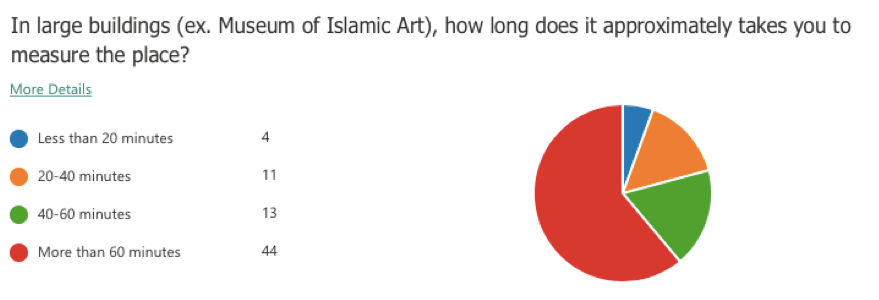
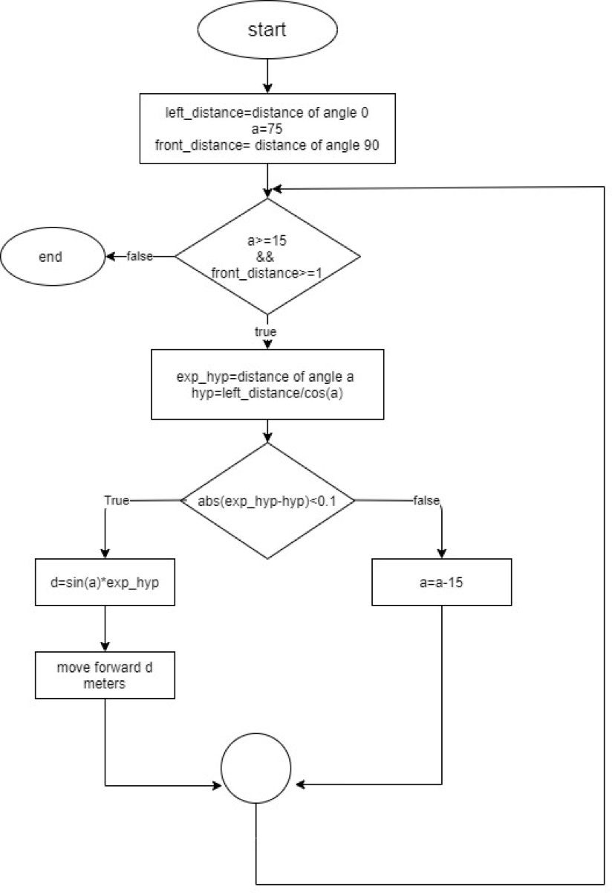
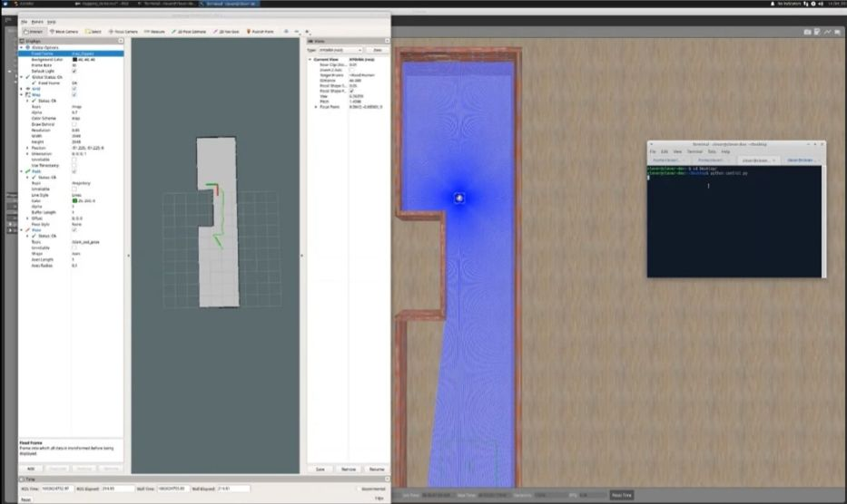
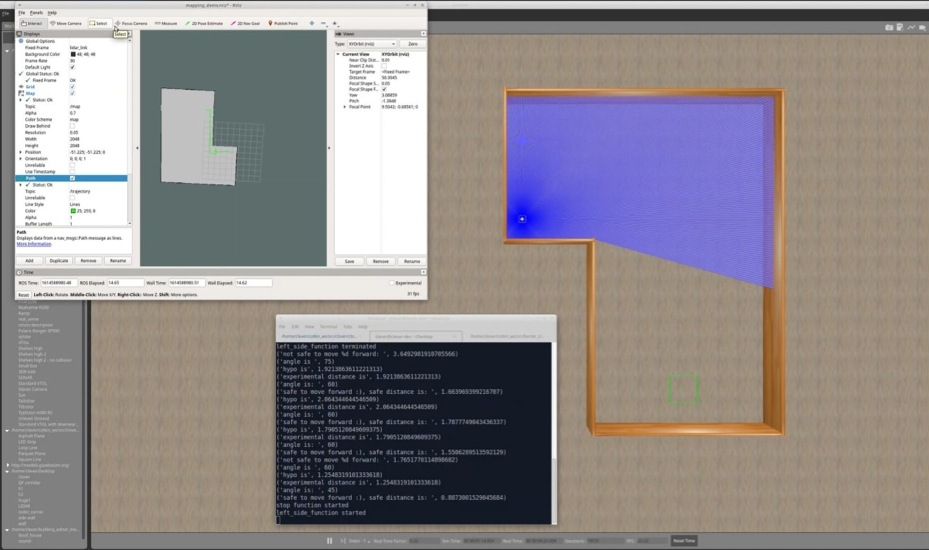
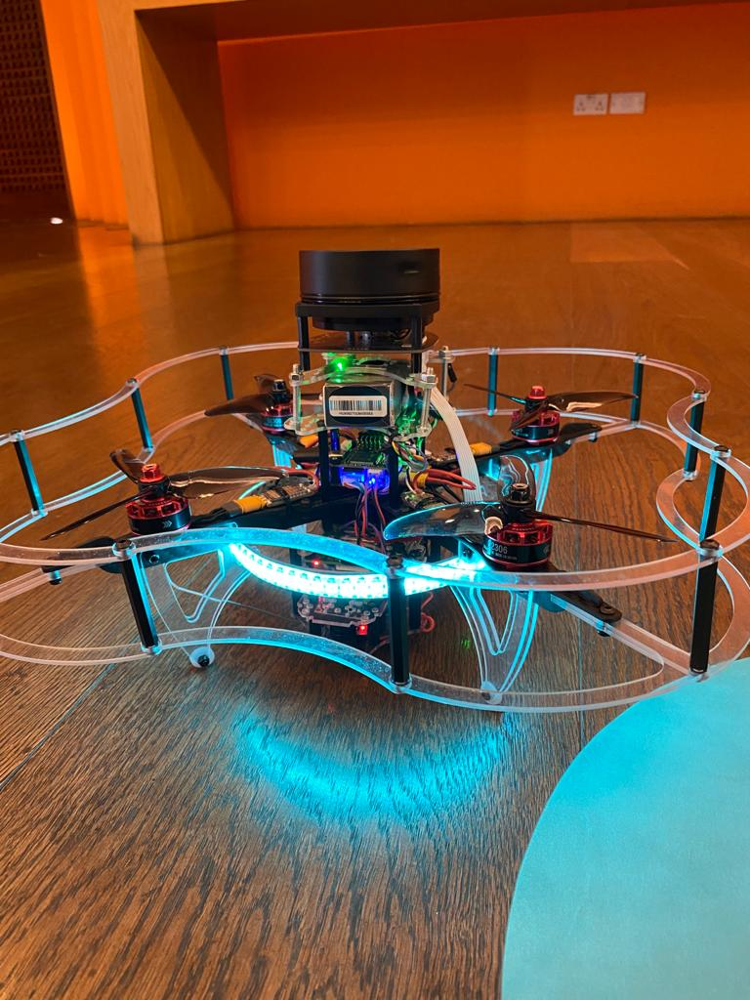

# DroMap: The Indoor Mapping Drone

[CopterHack-2021](copterhack2021.md), team: **DroMap**. E-mail: [officialdromap@gmail.com](mailto:officialdromap@gmail.com).

Team:

* Shouq AlQahtani
* Ameena AlMansouri
* Noof AlMarri

## Abstract

In the modern era, the world is witnessing a magnificent development in the field of architecture and interior design. Due to architectural development, the current measuring tools such as metal tapes and leaser meters became insufficient for assisting both architects and interior designers in taking the measurements for buildings and facilities. Because the accuracy of obtained readings depends on the professionalism of the users and the nature of these tools is unidirectional, the measurement taking process becomes less efficient in terms of time and labor. Since drones have played an essential role in revolutionizing the world of science and automation due to their use in a huge number of daily life applications, an introduction of indoor drones in the field of mapping and architecture is indispensable. Hence, the DroMap project proposes an autonomous indoor drone that can navigate autonomously and create a map of the indoor environment along the way. For the aforementioned purpose, a LiDAR sensor is used to collect data of the indoor place which is sent to a host computer. Afterward, simultaneous localization and mapping algorithm utilizes these data to pave the way for creating a 2-dimensional map. This autonomous indoor mapping drone system is not prone to inefficiency and human errors like in manual mapping and has the potential to take indoor mapping to the next level in the near future.

## Motivation

### Problem Statement

Architects lives are constantly in danger due to the nature of their work as they are supposed to enter buildings without knowing their structure, these dangers could potentially threaten their lives and can lead to many issues. According to [^1], there are 1.2 deaths per 100,000 architects and that job is ranked 19th among the most dangerous jobs in the United States. One example of a fatal accident is the accident of Bruno Travalja which happened in 2016, this architect fell from the 48th floor of a building while taking measurements. In addition to being dangerous, the process of mapping an indoor environment is time-consuming, especially in transferring the raw measurements into a 2-dimensional map [^2]. Therefore, the need for robot assistance in mapping and measurement taking processes reaches the peak. Autonomous indoor mapping using drones or robots is considered an important tool where the drone can reach different places which are inaccessible to humans due to space constraints or security reasons [^3].

The use of robots has increased dramatically within the past decade due to their enormous potential in both civil and architectural applications. Specifically, in designing and building robots for mapping enclosed buildings. Even though most of the works were implemented on unmanned ground vehicles (UGV), the current experimental use of unmanned Ground vehicles for indoor mapping suffers from a few shortcomings. Particularly, most implementations suffer from low performance regarding time consumption and have difficulty accessing narrow places. Since UGVs have limitations in terms of time consumption and navigation rigidity, in the DroMap project we decided to use drones as a replacement for UGVs to map indoor sites. This is because drones are unique in their ability to traverse any 3D interior space without any restrictive concerns regarding space architecture. Additionally, since these vehicles are not required to remain on the ground, aerial vehicles can fully explore the extent of the indoor space, regardless of their interiors. Furthermore, unmanned aerial vehicles can access difficult to reach areas.

A questionnaire was conducted for this project to study the need for an indoor mapping drone which involved 72 architects and interior designers. The following question was asked to have an estimate of the time taken by the targeted category for taking the measurements of a large building. According to the survey results, 61% of the sample consume more than 60 minutes to measure a large building. This shows that the measurement taking process is time-consuming.



#### Technical Challenges

* The positioning system calculates the odometry data based on the laser scanner poses. This might misestimate the drone’s position with respect to the surroundings.
* The LiDAR readings could be infinite if the distance between the LiDAR and the surrounding walls exceeds the LiDAR range.
* The communication between the Raspberry Pi and the PC relies heavily on Wi-Fi. Therefore, any loss in the Wi-Fi signal would terminate the communication between the drone and PC.

#### Non-technical Challenges

<!-- markdownlint-disable MD044 -->

* The indoor environment could be full of obstacles, which impedes path planning process.
* The mirrors, windows, and glass doors may affect the accuracy of the map as they are not detected correctly by the laser pulses.

<!-- markdownlint-disable MD044 -->

### Project Significance

Measuring a room or a full building along with transforming the collected data to a full map is time-consuming and requires massive effort. DroMap helps architects and interior designers to measure and generate a fully constructed 2D map with less time and effort. To help us understand the problem better, we conducted a survey to assess the need for an indoor mapping drone. This project will provide a great advantage for architects and interior designers as it would save time and effort in the map construction process. In addition, it will assure great cooperation from both the computer and architecture fields.

Generally, the process of mapping an indoor environment is composed of two phases; the first phase is the measurement taking phase and the second phase is the map drawing phase. However, the project introduces another way to create a map that is faster and requires less effort; as the measurements of the surroundings will be taken by the system once it is activated and processed by Simultaneous Localization and Mapping algorithms (SLAM) for building and updating maps as well as positions of an unknown environment in robotics in real-time. According to the survey, 94% of the sample agreed that it would be useful to have a robotic based measuring tool. Therefore, the proposed solution will successfully assist architects and interior designers in mapping indoor areas.


Based on the conducted survey, accuracy is the most important characteristic to be satisfied with the project. The below figure demonstrates that 48 of the sample sizes care about having high accuracy. Moreover, the second most important feature to be reached is having a short scanning time, which highlights the importance of the project.


Furthermore, since the project employs multiple concepts related to indoor robots and indoor data processing, it can be extended to assist other fields in Qatar rather than the architecture field only. For example, this project could be a great step towards training drones to handle different tasks related to search and rescue such as entering buildings on fire or finding a missing person in indoor places. This will serve to develop more technologies to process the indoor data in various environments and conditions, also to develop drones that are capable to operate in indoor areas with different functionalities.

## Proposed solution

DroMap project consists mainly of two major components: the drone and the drone add-on. The drone is responsible for the physical movement of the entire system. The drone add-ons consist of necessary sensors for mapping, path planning, and mounting equipment such as Raspberry Pi 4, RPLiDAR A1M8, Sonar, and range finder. The Raspberry Pi collects the data from the sensors. While the data is being collected by the Raspberry Pi, the Hector SLAM will process these data in real-time to formulate 2-dimensional maps. After that, the map will be sent wirelessly to a remote PC and visualized through RVIZ software tool.


### Hardware/software to be used

#### Hardware selection

##### COEX Clover Drone kit

Clover is a complete STEM educational programmable drone kit which includes unassembled quadcopter with four propellers and open-source software.

* Limitless possibilities of a fully programmable drone (Open Source).
* Drone can operate stably without GPS.
* The Clover platform exploits the ROS framework.
* Made especially for Indoor flights.

##### Slamtec RPLiDAR A1M8

LiDAR is low cost 2D 360° 12m scanning sensor.

* Omnidirectional Laser Range Scanner 360°.
* Compatible with ROS.
* Very high sampling Rate 8k times, Considered as one of the Highest in the Current LiDAR industry.
* Ideal for indoor Navigation and Localization using UAVS.

##### Raspberry Pi 4 Model B

Raspberry Pi is a single-board computer which is used as a companion computer.

* Low energy consumption.
* Connect the drone over Wi-Fi.
* Responsible for flight autonomy.
* Access and issue commands to peripherals.

##### VL53L1X RangeFinder Sensor

Laser Ranging Sensor Module Rangefinder. One of the smallest time-of-flight 940 nm laser VCSEL. Measuring absolute range up to 4 meters.

* The Range Finder Optical Ranging sensor is an integrated sensor with embedded infrared, eye-safe laser, advanced filters and high-speed photon detection arrays.
* Range finder Supports 400cm sensing range, suitable for many applications.

#### Software selection

##### Robot Operating System (ROS)

A framework which runs on Linux operating system, and will be used as a firmware to control and monitor the system.

##### COEX Virtual Machine

A Linux operating system that has a pre-installed ROS along with some necessary dependencies and packages in addition to a pre-configured Gazebo environment.

##### Gazebo

The simulation tool that will be used to test and try different mapping and automation approaches.

##### Visual Studio Code

A text editor to write python scripts to program the drone.

##### RVIZ

A visualization tool to visualize the LiDAR readings.

##### QGroundControl

QGroundControl supports full flight control and mission planning for any MAVLink enabled drone.

## Implementation

The implementation divided into two parts. The first part is to work on the simulation software, and the second part is to work on the physical hardware components. The simulation software helped us to have an estimation of how the system will work in the physical world. Through the simulation software, we were able to identify some implementation challenges and finding solutions for them. In addition, the simulation software gave us the opportunity to process the sensors data and test the sensors before testing them physically, which speeded up the process of working on the physical components and testing them. Moreover, it was found that the results obtained from the simulated components and the physical components were close to each other. In this section, we demonstrate the progress that happened in both the physical and the virtual worlds.

### The Simulation Software

#### The Mapping algorithm

The Hector SLAM algorithm was selected in this project due to its high efficiency in mapping indoor environments, its ability to work with drones efficiently, and its facility to be integrated with the selected LiDAR sensor. Moreover, it consumes less power in handling some cases where the indoor environment is dynamic, and the obstacles are moving [^4]. Hector SLAM is an algorithm that is used widely in mapping unknown indoor environments. The algorithm is LiDAR-based, and it uses the Gaussian Newton equation to construct accurate maps from the laser scanner data [^5]. Moreover, this algorithm does not use any odometry data to estimate the robot’s position with respect to its surroundings. Instead, the algorithm utilizes the difference in the laser scanner locations to calculate the odometry [^6]. This feature qualifies the Hector SLAM algorithm to work optimally with the unmanned aerial vehicles given that in most of the cases, the odometry data is calculated from processing the wheels motion and that is not the case with UAVs. In addition, the algorithm provides an accurate estimation of the robot’s position with respect to its surroundings.

#### The Exploration Algorithm

The method used in this project to explore the indoor sites is selected to be the wall following algorithm due to its effectiveness and simplicity. The implementation of that algorithm can be summarized into three main functions which are: `left_side()` , `move_forward()`, and `take_stop_action()` which are represented in a while loop as following:

> **Note** The implementation of the wall following algorithm highly depends on the LiDAR used in the simulator which is Hokuyo laser scanner with 360 rotation angle and 720 readings per 32ms. However, the physical LiDAR used is RPLiDAR A1M8 which provides 360 readings per rotation.

```python
while(1):
    left_side()
    move_forward()
    take_stop_action()
```

```python
left_side()
```

This function uses the LiDAR readings that are pointing exactly to the west of the drone, it measures how far the drone is from the left wall, then adjust the drone to it such that the drone is approximately 0.7 m away from the left wall. The reason of using 0.7 meters is because the drone has higher error that expected. Therefore, a while loop is used to ensure that the drone is far enough from the wall.

```python
move_forward()
```

This function was implemented to safely move the drone forward without hitting a wall, or without skipping an outer corner.  The logic behind this algorithm is that it uses the concept of the right angle, and multiple readings which correspond to different angles to measure the safe distances. The bellow flow chat demonstrates the logic of that algorithm in details.



When the function ends, the drone will either stop after an inner corner, or an outer corner.

```python
take_stop_action()
```

This function handles two different situations:

* The first situation is that the drone may stop when it faces an inner corner, this can be detected by measuring the distance from the front wall, then compare the current distance of the left LiDAR reading with the previously recorded one, if the comparison showed that there is a small difference between these two readings, then this means that the drone must rotate to the right and continue its path.
* The second situation is that the drone may stop when it detects an outer corner, the logic is exactly like the first situation except, that the drone must be away from the front wall (with distance greater than 1.5 meter). In addition, the difference between the current left LiDAR reading, and the previously recorded reading must be greater than 0.5 m. If this is the case, then the drone has stopped because of an outer corner. Therefore, the drone must rotate to the left and continue its path.

The following video illustrates a ROS Simulation test on Wall Following Algorithm:

<iframe width="560" height="315" src="https://www.youtube.com/embed/HgLHC0D76f8" frameborder="0" allow="accelerometer; autoplay; encrypted-media; gyroscope; picture-in-picture" allowfullscreen></iframe>

#### Testing


The above figure demonstrates the drone exploring a maze autonomously while constructing a 2D map in real-time. The terminal shows the safe distances to move forward, these distancing where calculated using the aforementioned flowchart.

The following figures show a constructed 2D map of different environments.





The following video demonstrates an autonomous maze exploration with Hector SLAM responsible for constructing a 2D map:

<iframe width="560" height="315" src="https://www.youtube.com/embed/fxshlaoCnEc" frameborder="0" allow="accelerometer; autoplay; encrypted-media; gyroscope; picture-in-picture" allowfullscreen></iframe>

### The physical hardware

This section illustrates the progress done regarding the hardware components. The first step done was to establish a Wi-Fi communication between the Raspberry Pi and the remote PC. The second step was to install the hector SLAM and robot Localization packages in the Raspberry Pi to visualize the maps remotely.

#### Initial Setup

The drone is assembled and configured correctly to accomplish the autonomous mapping mission. The RPliDAR A1M8 and all other necessary sensors are mounted on the drone as shown in the figure bellow.



To set up the drone ready for mapping, the raspberry pi image created by COEX was installed on the micro-SD card. COEX Raspberry Pi image, COEX pixracer image and COEX virtual machine were selected as they contain all the necessary tools and packages to work efficiently with clover platform. The installed platform is based on Raspbian operating system and ROS. After flashing the image on the SD, the next step is to connect clover to Wi-Fi.

#### Network Setup

The drone produces a map of an unknown indoor environment by sending data received from the sensors to a remote pc. The transmission takes place over a wireless channel to get a map in real-time. One of the essentials for DroMap is to setup the connection between the drone and the remote PC. In DroMap Project ROS network must satisfy the listed below requirements:

1. There must be a full bidirectional communication between all the nodes.
2. Every component in the network must advertise its name.
3. In ROS network one of the components must be declared as the ROS master. Specifically, the ROS master is the drone (Clover-6064).
4. All ROS packages needed in the project, must use the ROS master.

All these requirements are fulfilled in our design.

#### Required packages

After the installation of ROS, the drone was ready to install RPLidar ROS package and Hector SLAM. These packages are installed by cloning them in a catkin workspace src folder. Then build them by running catkin build. The following commands were entered in the terminal show the process of installing RPLidar package and hector SLAM in raspberry pi. The `rplidar_ros` package is responsible for retrieving the RPLidar data and hector SLAM package is responsible for building maps. `rplidar_ros` and `hector_slam` packages ware installed from GitHub.

#### Testing

The testing phase was divided into several stages in order to test the sensor and the SLAM algorithm in several closed places. This makes it possible to identify obstacles and risks that may face us in the future.

We did several of the following elementary tests:

* Firstly, we flew the drone to obtain maps using Hector Mapping with the remote control.
* Secondly, we have moved to the automation stage of implementing the codes applied in the simulator.
* Finally, From here we did some tests, for example, the drone flies to the wall, and then lands after getting a wall reading. And tests are still going on for a fully automatic flight.

## References

[^1]: “The 20 deadliest jobs in America, ranked,” CBS News. https://www.cbsnews.com/pictures/the-20-deadliest-jobs-in-america-ranked/4/.
[^2]: A. Kovalchenko, “How To Carry Out a Survey and Site Measure,” 2012. https://essenziale-hd.com/2012/10/28/how-to-carry-out-a-survey-and-site-measure/.
[^3]: D. Hähnel, W. Burgard, and S. Thurn, “Learning compact 3D models of indoor and outdoor environments with a mobile robot,” Rob. Auton. Syst., vol. 44, no. 1, pp. 15–27, 2003, doi: 10.1016/S0921-8890(03)00007-1.
[^4]: M. Eliwa, A. Adham, I. Sami, and M. Eldeeb, “A critical comparison between Fast and Hector SLAM algorithms,” / REST J. Emerg. trends Model. Manuf., vol. 3, no. 2, pp. 44–49, 2017, [Online]. Available: www.restpublisher.com/journals/jemm.
[^5]: J. M. Santos, D. Portugal, and R. P. Rocha, “An evaluation of 2D SLAM techniques available in Robot Operating System,” 2013 IEEE Int. Symp. Safety, Secur. Rescue Robot. SSRR 2013, 2013, doi: 10.1109/SSRR.2013.6719348.
[^6]: H. Gossett, “Building an Autonomous Indoor Drone System,” University of Mississippi, 2018.
