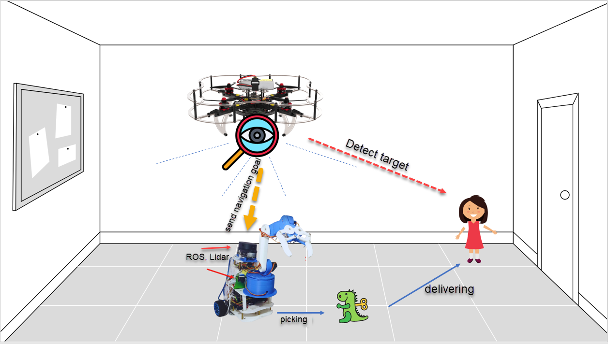

# Dragon&Tanker

[CopterHack-2022](copterhack2022.md), team **Dragon&Tanker**.

## Team information

The list of team members:

(Describe the team: full name, contacts (e-mail/Telegram username), role in the team).

* Trinh Phuoc Thuan, thuantp2@fe.edu.vn, engineer.
* Tran Minh Hoang, tranminhhoang211105@gmail.com, programmer.
* Vo Duc Hieu, voduchieu42@gmail.com, programmer.
* Bui Son, bhhson@gmail.com, programmer.

## Project description

### Project idea

Briefly describe the idea and stage of the project.

We will build a product which has a drone and an autonomous car for spying or delivering things 

### The potential outcomes

Describe how you see the project result.

We have already finish the robot car and can build the map for it to autonomous move with ROS Navigation, SLAM 

We will try to build some  function to make a communication between the robot car and Clover Drone. The Clover will observe robot car path, if there is any obstacle on the way of robot in the map, Clover will inform to robot car to create a new path.

### Using Clover platform

Describe how the Clover platform will be used in your project.

The clover will detect the target and send navigation to car robot in the ground where we already knew the map. For the unseen map, we will use robot to control Clover to discover if the car robot can move to that terrain or not.

### Additional information at the request of participants

For example, information about the team's experience working on projects, attach a link to articles, videos.

We are a STEM club in FPT School in VietNam.
Here is some products we have done
 https://www.youtube.com/watch?v=PGMazPDON34
https://www.youtube.com/watch?v=re1Jlx3aYe4
