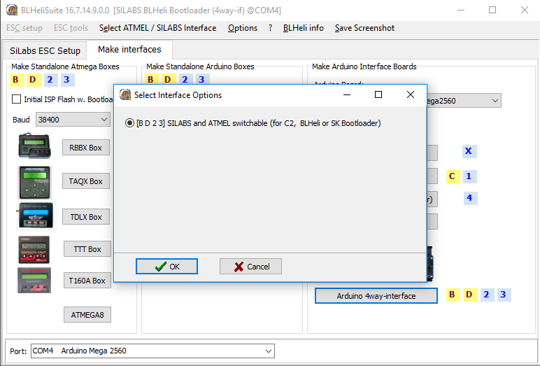

# Flashing ESCs using BLHeliSuite

A good article that explains the principle of ESCs \(Electric speed controller\) operation: [http://www.avmodels.ru/engines/electric/esc.html](http://www.avmodels.ru/engines/electric/esc.html)

## Why reflash?

Sometimes, it is necessary to change one of ESC parameters, such as the direction of motor rotation, the minimum and the maximum duty cycle of the PPM signal at ESC input, the volume of audio signals emitted by the motor, or the time after which the ESC should start reminding that it is engaged.

## An application for flashing ESCs

For flashing various ESC, the [BLHeliSuite](https://github.com/4712/BLHeliSuite) application is used  \(for Windows\).

To start the \(BLHeliSuite.exe\) application, unpack archives BLHeliAtmelHEX.zip and BLHeliSilabsHEX.zip into the folder with the application.

## A programming unit for flashing ESCs

To flash an ESC, you need a programming unit that can handle an ESC controller via the 1-wire protocol. One of the ways of obtaining the programming unit - is flashing special firmware to an Arduino device. BLHeliSuite contains a tool for creating interfaces for programming units.

Creating a programming unit on the example of Arduino Mega.

1. Start BLHeliSuite and select the Make interfaces tab.

   

2. Connect the Arduino to a computer, if necessary, check the number of the COM port to which the circuit board is connected, in the Device Manager.

3. Click on Arduino 4way-interface in tab Make Arduino Interface Boards, and select the firmware file. After the file is selected, the flashing of the controller will start.

   
   
   

4. After flashing the Arduino, return to tap Silabs ESC Setup and connect to Arduino, having selected the 4way-if interface of the programming device and the Arduino COM port.

   
   

## Connecting ESCs to Arduino

For flashing or readjusting ESCs, connect signal ports (usually white) of ESCs to Arduino ports, after checking in the manual (see the figure below), which ports are used for connecting to ESCs. You should also connect GND of Arduino with the ground of one of the ESCs (usually black). The ESCs should be connected to power, and, if electric motors are connected to ESCs, **they should not have propellers**.

In the case of Arduino Mega, signal ports of the ECSs are connected to ports D43-D49 and D51.

## Changing ESC settings

To download information about firmware version and ESC settings, click on Check.

The main parameters that we are interested in are:

* Motor Direction \(Normal or Reversed\) - sets motor rotation direction. Convenient, if you do not wish to reconnect an incorrectly connected motor.
* PPM Min and Max Throttle - sets the minimum and the maximum throttle signal
* Startup Beep Volume - set the signal volume on startup. In firmware16.65, an ability to change the startup melody has been added. More information is available [here] (https://github.com/cleanflight/blheli-multishot/releases). For example, you can set the Imperial March from the Star Wars or the main theme from the Game of the Thrones as the startup melody
* Beacon Volume - sets the volume of the detecting signal. When the motors have not been rotating for some time, and the ESC is not used, it starts reminding about itself by motor squeaks.
* Beacon Delay - sets the duration of inactivity, after which the detecting signal is enabled. During development, it may become boring, therefore it may be set to infinity.

The leftmost motor in the list of motors \(Multiple ESC\) is considered the \(master\) motor. by clicking on motor numbers, you can enable or disable the possibility of writing their settings. After changing the necessary parameters, you can write settings to respective motors by clicking on Write Setup.

To display the settings of all ESCs simultaneously, you can use the ESC Overview tab.

## Flashing ESCs

ESC firmware files are located [here](https://github.com/cleanflight/blheli-multishot/tree/master/BLHeli_S%20SiLabs/Hex%20Files).

To flesh ESCs, click on button Flash BLHeli and choose the firmware file with the type of the controller, the name of which is indicated in the firmware name frame on top of the screen in tab Silabs ESC Setup (for the controller that is used in Clover 2, it is A-H-70).

To re-flash an individual ESC, disable all other ESCs.

## Video guide to flashing ESCs

For a better understanding of the things written in the article, we recommend watching a video guide about connecting electronics and flashing ESCs in English on [youtube](https://www.youtube.com/watch?v=i6lhMcQLRSU&feature=youtu.be).
