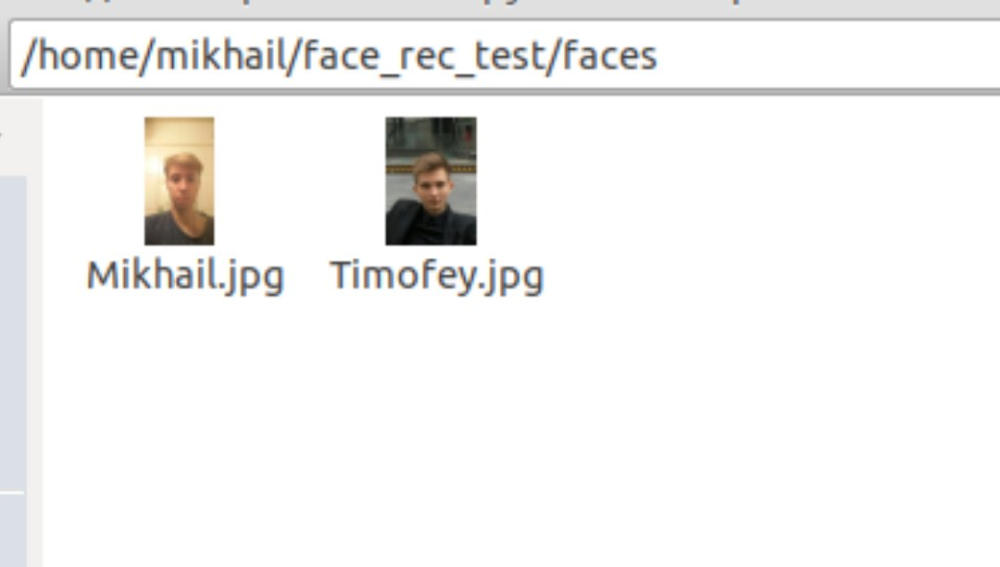
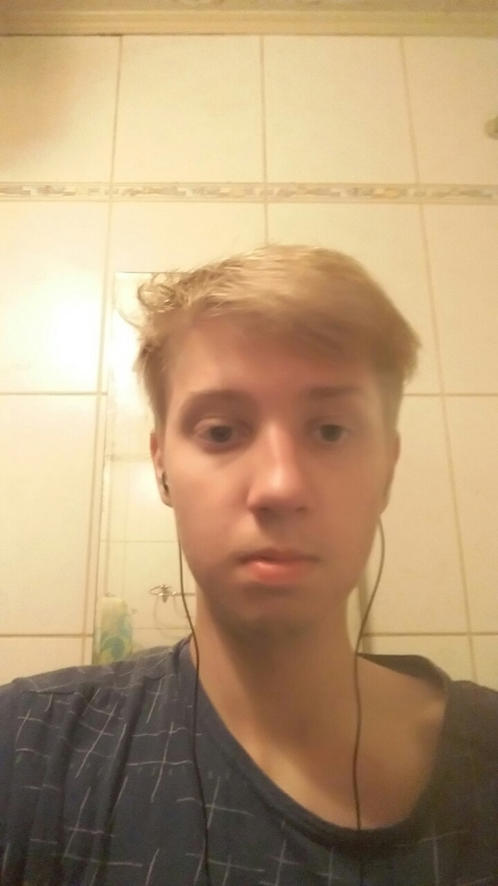
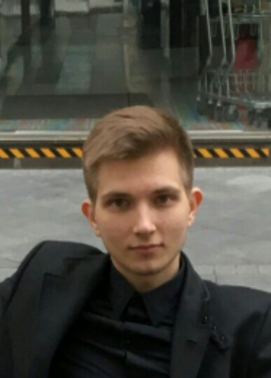

# Face recognition system

## Introduction

Recently, face recognition systems have been getting a wider use, the application scope of this technology is really expansive: from regular selfie drones to police drones. Everywhere it is being integrated into various devices. The recognition process itself is really fascinating, and that's what inspired me to create a project associated with it.  The purpose of my internship project was to create a simple open source system for face recognition with a Clover quadcopter. The program takes images from the quadcopter's camera and processes it on a PC. Therefore, all other instructions are executed on a PC.

## Development

The first task was finding a recognition algorithm. As a solution to the problem, [a ready API for Python](https://github.com/ageitgey/face_recognition) was chosen. This API combines several advantages: recognition speed and accuracy, and ease of use.

## Installation

First, you have to install all the necessary libraries:

```(bash)
pip install face_recognition
pip install opencv-python
```

Then download the script from the repository:

```(bash)
git clone https://github.com/mmkuznecov/face_recognition_from_clever.git
```

## Code explanation

Enable libraries:

```python
import face_recognition
import cv2
import os
import urllib.request
import numpy as np
```

***This part of the code is intended for Python 3. In Python 2.7, enable urllib2 instead of urllib:***

```python
import urllib2
```

Create a list of encodings for images and a list of names:

```python
faces_images=[]
for i in os.listdir('faces/'):
    faces_images.append(face_recognition.load_image_file('faces/'+i))
known_face_encodings=[]
for i in faces_images:
    known_face_encodings.append(face_recognition.face_encodings(i)[0])
known_face_names=[]url
for i in os.listdir('faces/'):
    i=i.split('.')[0]
    known_face_names.append(i)
```

***Addition: all images are stored in folder faces in format name.jpg***







Initialize some variables:

```python
face_locations = []
face_encodings = []
face_names = []
process_this_frame = True
```

Get the image from the server, and convert it to format cv2:

```python
req = urllib.request.urlopen('http://192.168.11.1:8080/snapshot?topic=/main_camera/image_raw')
arr = np.asarray(bytearray(req.read()), dtype=np.uint8)
frame = cv2.imdecode(arr, -1)
```

***For Python 2.7:***

```python
req = urllib2.urlopen('http://192.168.11.1:8080/snapshot?topic=/main_camera/image_raw')
arr = np.asarray(bytearray(req.read()), dtype=np.uint8)
frame = cv2.imdecode(arr, -1)
```

Further explanation of the code is available at GitHub of the used API in the comments to [the next script](https://github.com/ageitgey/face_recognition/blob/master/examples/facerec_from_webcam_faster.py)

## Using

It is enough to connect to "Clover" via Wi-Fi and check whether the video stream from the camera is working correctly.

Then just run the script:

```(bash)
python recog.py
```

And the output:


## Possible difficulties

When the script is started, the following error may pop up:

```python
    known_face_encodings.append(face_recognition.face_encodings(i)[0])
IndexError: list index out of range
```

In this case, try to edit the images in folder faces, perhaps the program cannot recognize faces in the images due to poor quality.

## Using the calibration

To improve recognition accuracy, you can use camera calibration. The calibration module may be installed using [a special package](https://github.com/tinderad/clever_cam_calibration). Instructions for installation and use are available in the [camera calibration article](camera_calibration.md). The program that uses the calibration package is named recog_undist.py

**Code brief explanation:**

Enable installed package:

```python
import clever_cam_calibration.clevercamcalib as ccc
```

Add the following lines:

```python
height_or, width_or, depth_or = frame.shape
```

This way, you will obtain information about image size, where height_or is the height of the initial image in pixels, and width_or is the width of the initial image.
Then correct distortions in the initial image, and get its parameters:

```python
if height_or==240 and width_or==320:
    frame=ccc.get_undistorted_image(frame,ccc.CLEVER_FISHEYE_CAM_320)
elif height_or==480 and width_or==640:
    frame=ccc.get_undistorted_image(frame,ccc.CLEVER_FISHEYE_CAM_640)
else:
    frame=ccc.get_undistorted_image(frame,input("Input your path to the .yaml file: "))
height_unz, width_unz, depth_unz = frame.shape
```

***In this case, we pass argument ccc.CLEVER_FISHEYE_CAM_640, since the resolution of the image in this example, is 640x480; you can also use ccc.CLEVER_FISHEYE_CAM_320 for resolution 320x240, otherwise you will have to send the path to the .yaml calibration file as the second argument.***

Finally, return the image to its initial size:

```python
frame=cv2.resize(frame,(0,0), fx=(width_or/width_unz),fy=(height_or/height_unz))
```

This was, you can significantly improve recognition accuracy since the image processed will not be so badly distorted.


