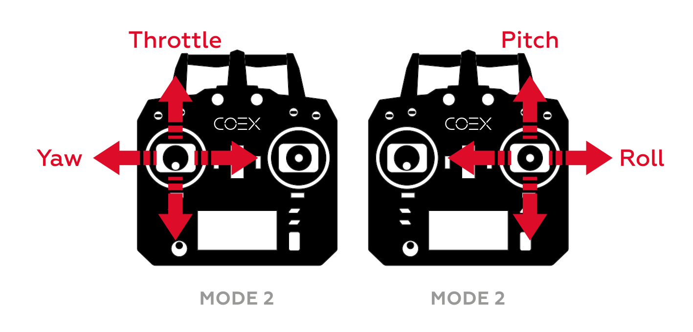
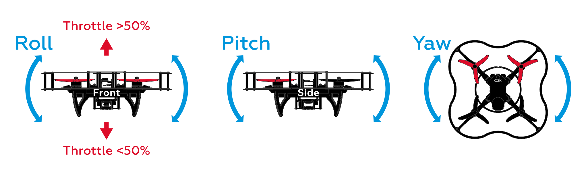
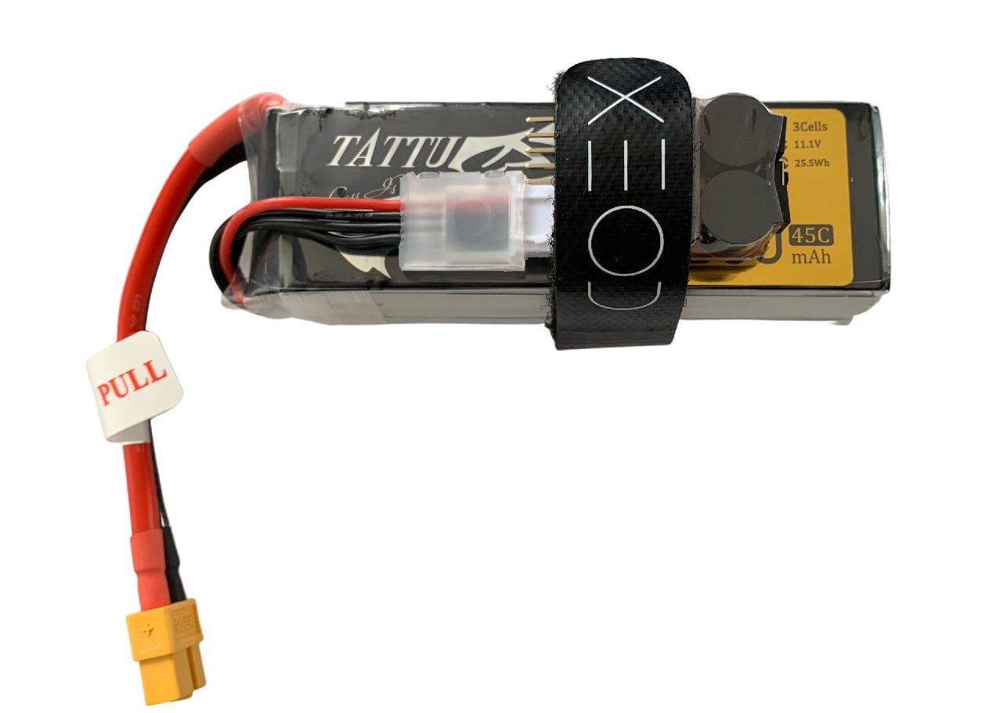
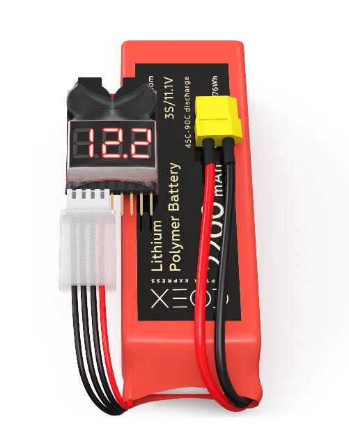
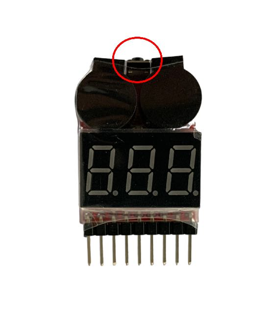
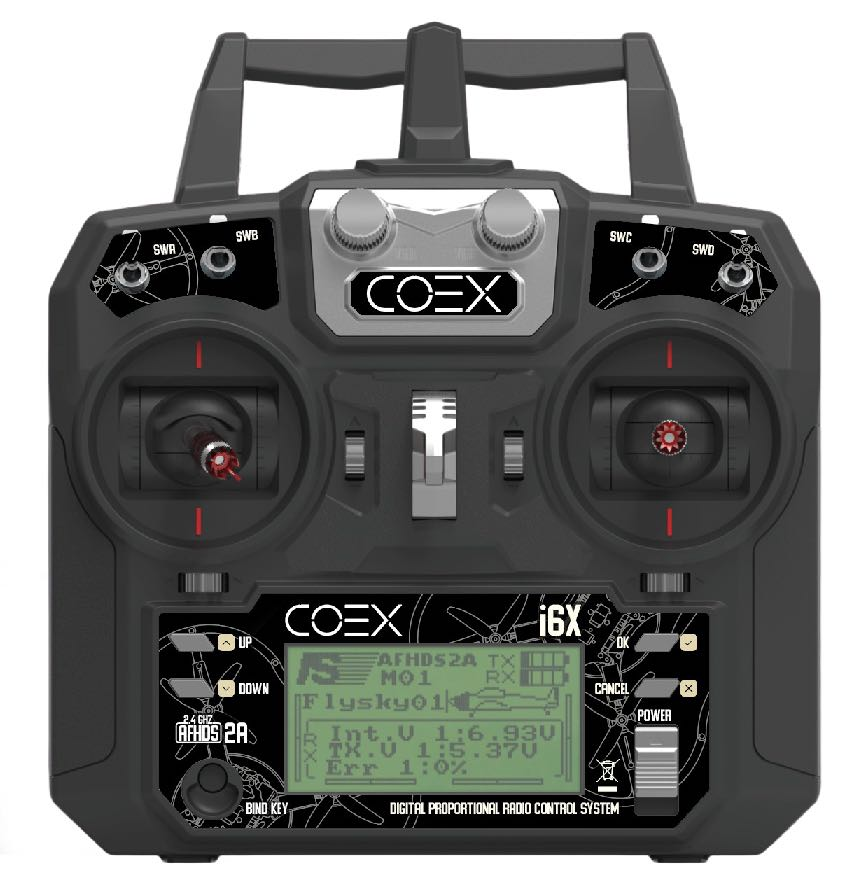

# Flight

This section explains the basics of controlling the quadcopter using radio remote control in different modes (for autonomous flying see "[Programming](programming.md)") section.

## Main features of radio equipment

Before you can launch your drone, you need to understand how the radio remote control ("hardware" in conventional aircraft modeling terminology) works.

The drone is controlled using two sticks on the equipment. By default, the left stick controls throttle and yaw, and the right stick controls roll and pitch. These terms are used for all aircraft, from airplanes to quadcopters.

* Throttle - is responsible for the speed of rotation of the engines.
* Yaw - responsible for turns around the vertical axis (Z), clockwise (when tilted to the right) and counterclockwise (when tilted to the left) arrows.
* Pitch - is responsible for tilting or moving forward / backward.
* Roll - is responsible for tilting or moving left / right.

These descriptions assume the aircraft is with its back to the pilot.

## Flight Modes

Manual flight using the PX4 flight controller can be performed using different flight modes that determine the radio controller stick assignments and other flight characteristics. For a complete list of flight modes, see the article "[Flight modes](modes.md)".

The main manual modes are discussed below.

**STABILIZED** - horizontal position stabilization mode. In this mode, the aircraft will hold the horizon if not controlled. Purpose of sticks:

* Throttle - the average speed of rotation of the motors.
* Yaw - angular velocity around the vertical axis.
* Pitch - the angle of inclination around the transverse axis (forward / backward).
* Roll - the angle of inclination around the longitudinal axis (left / right).

**POSCTL** - position holding mode (requires enabled positioning system). Purpose of sticks:

* Throttle - vertical flight speed.
* Yaw - angular velocity around the vertical axis.
* Pitch is the linear speed of the drone (forward / backward).
* Roll - the linear speed of the drone (left / right).

**ACRO** - mode for controlling the average rotational speed of the motors and angular speeds of the drone. This mode is the most difficult to fly and is most often used by drone racers and 3D piloting shows to perform stunts. Purpose of sticks:

* Throttle - the average speed of rotation of the motors.
* Yaw - angular velocity around the vertical axis.
* Pitch - angular velocity around the transverse axis (forward / backward).
* Roll - angular velocity around the longitudinal axis (left / right).

> **Info** Other flight controllers may have different names for similar flight modes.

## Preparing to fly

### Installing propellers and batteries

1. Install the battery strap.

    

2. Set the propellers according to the [motor direction pattern](#prop_rotation).

    

3. Attach the buzzer and install the battery.

    

        
        
    

### Setting the buzzer

In order not to over-discharge or damage the battery, it is recommended to use a voltage indicator (*buzzer*).

To tune the *buzzer* connect it to the balance connector of your battery. By pressing the button at the base, the minimum voltage on the cells will change. The optimum value for the minimum voltage is *3.5-3.6 V*.

    
    

### Flight readiness states

Before starting the flight, the aircraft must be in the *Armed* state.

* *Armed* state - motors rotate according to throttle stick position, copter is ready to fly.
* *Disarmed* state - motors do not rotate, copter does not respond to throttle stick.

By default, the aircraft is in the *Disarmed* state and switches to it if you do not take off for a long time.

There are several ways to put a copter into the *Armed* state:

* Using the stick - move the left stick down to the right and wait a couple of seconds.

* Using the toggle switch - the Armed / Disarmed states can be set to one of the toggle switches. For more information on setting up, see the article on [flight modes](modes.md).
* With QGC - you can arm your drone programmatically. To do this, click on the inscription *Disarm* in the header and select another state.
* With the help of the program - the copter can enter the *Armed* state if the parameter `auto_arm = True` is specified in the navigation command, such as: navigate, set_position, etc.

### Kill switch

When the *Kill Switch* is activated, no control signals are sent to the motors and the motors stop rotating. This function is used in extreme cases, for example, if you lose control of the aircraft.

> **Caution** Be careful, *Kill Switch* does not put the copter into *Disarmed* state!

Before disabling the *Kill Switch*, make sure the throttle stick is in the down position and the aircraft is in the *Disarmed* state. If the throttle stick is not in the lower position, when the *Kill Switch* is turned off, a signal will be sent to the motors corresponding to the position of the stick at the moment, which will lead to a sharp jerk of the copter.

**Next**: [Exercises to control the copter](flight_exercises.md)
