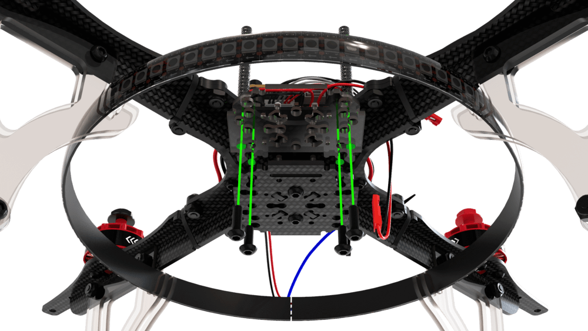
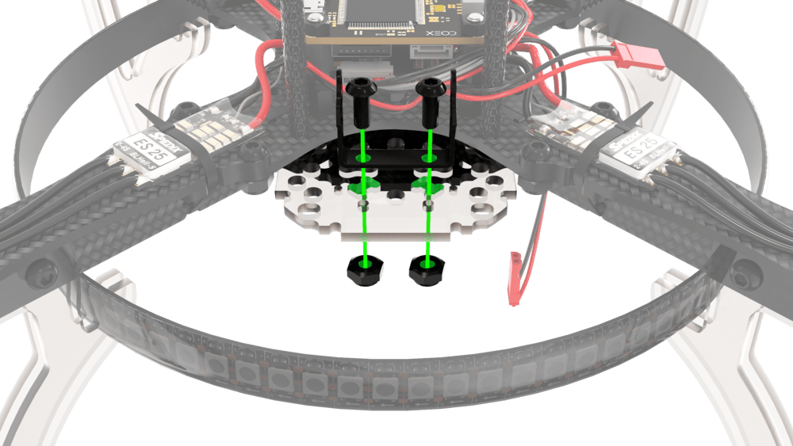
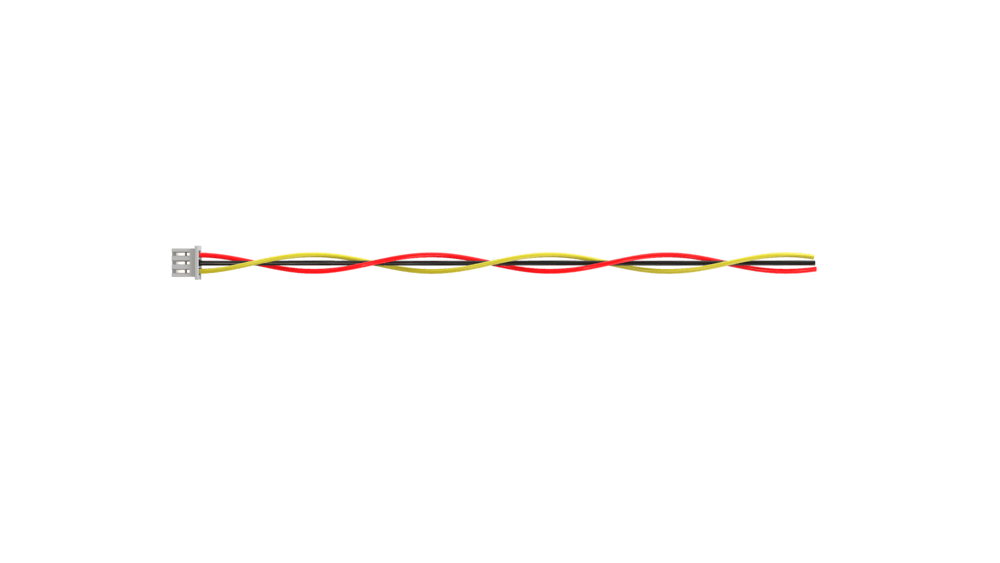
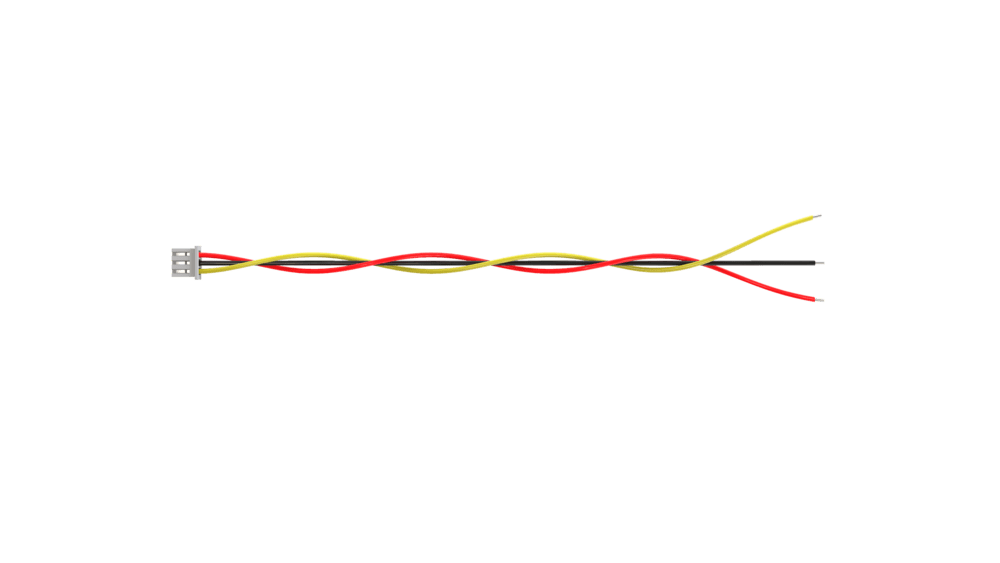
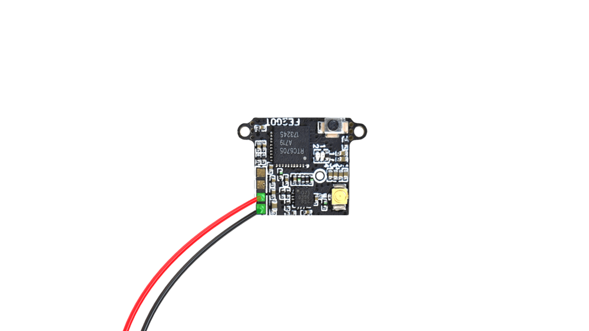
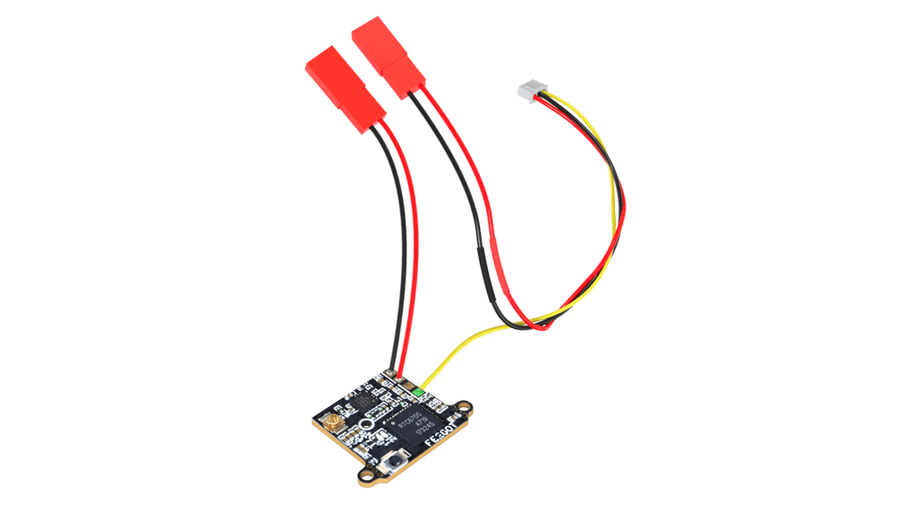
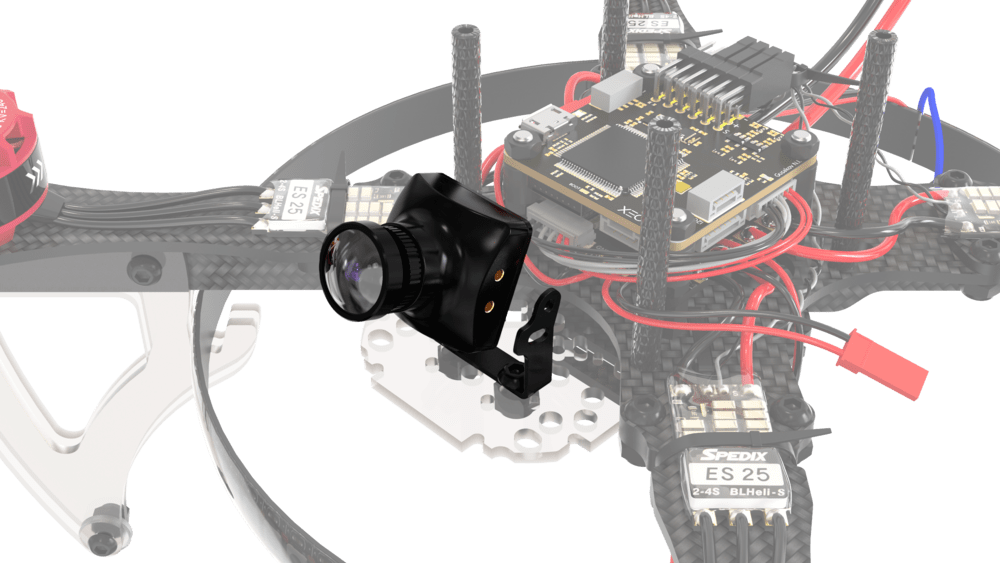
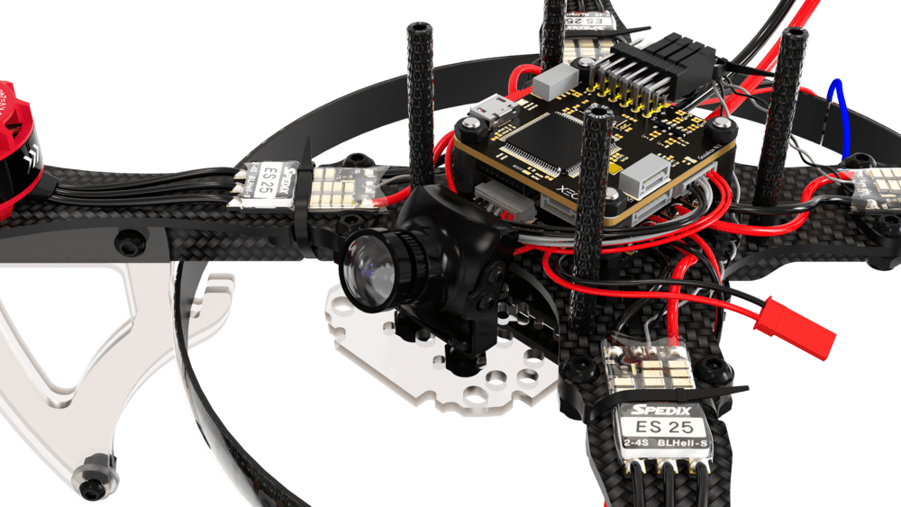
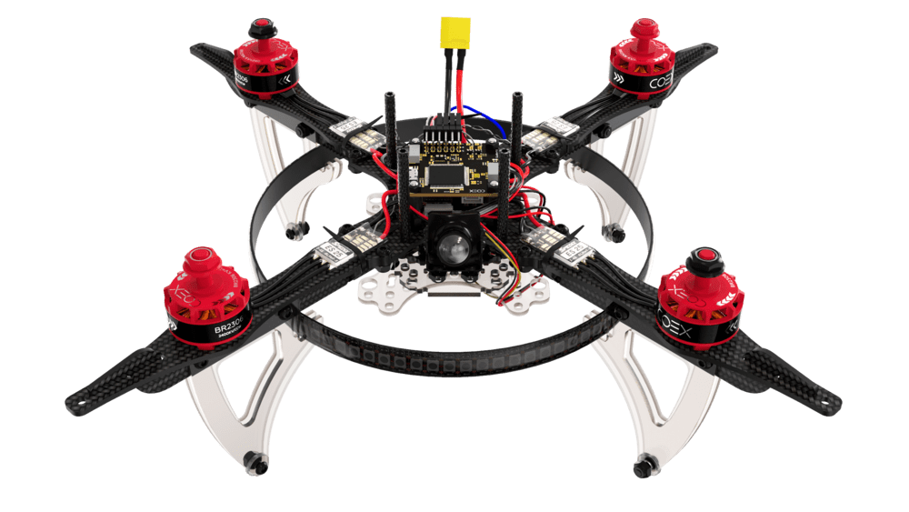
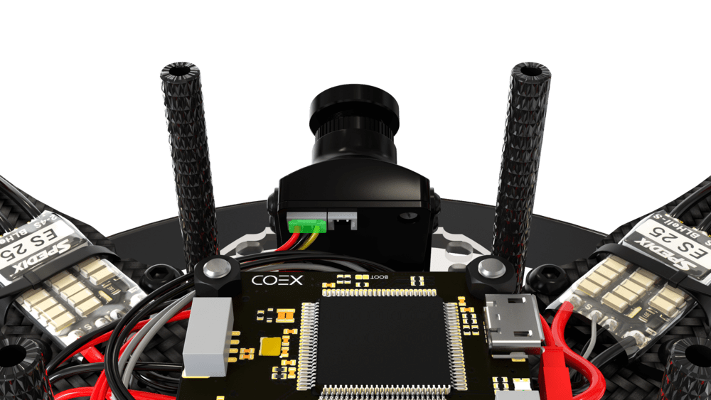

# Installing and configuring FPV equipment

## Preparing and installing the FPV camera and transmitter

1. Install the small mounting deck onto the main frame.

    

        
        
    

2. Install the camera mount bracket into the corresponding holes.

    

        
        
    

3. Cut the three-pin supplied camera cable.

    

        
        
    

4. Tin the wires

    

5. Solder the JST-male connector to the power wires of the camera.

    

        
        
    

    > **Hint** Check what you are wearing shrink tubes before soldering the wires.

6. Solder the JST male connector to the transmitter.

    

        
        
    

7. Solder the yellow camera signal cable to the transmitter.

    

        
        
    

8. Connect the antenna to the transmitter.

    

    > **Caution** If voltage is applied to a transmitter without an antenna, there is a high probability that it will burn out.

9. Place the receiver onto the mounting deck, securing it with ties.

    

10. Place the mounting deck with the receiver on the bottom of the aircraft.

    

11. Place the camera in the bracket and secure it with the 4 attached bolts. The camera should be at an angle of 15°-20° relative to the plane of the aircraft.

    

        
        
    

    

        
        
    

12. Connect the signal cable to the camera.

    

13. Connect the camera's power cable to the power JST soldered to the *BAT+* and *GND* pads on the power distribution board.

14. Connect the transmitter power cable to JST at 5V.

    

## Setting up and connecting FPV goggles

1. Install the two supplied antennas on the glasses.
2. Turn on the glasses by holding the power button for 3-4 seconds.
3. Turn on the aircraft and make sure the transmitter LED is blue.
4. Press the *Auto Search* button on the glasses to automatically search for an available radio channel.
