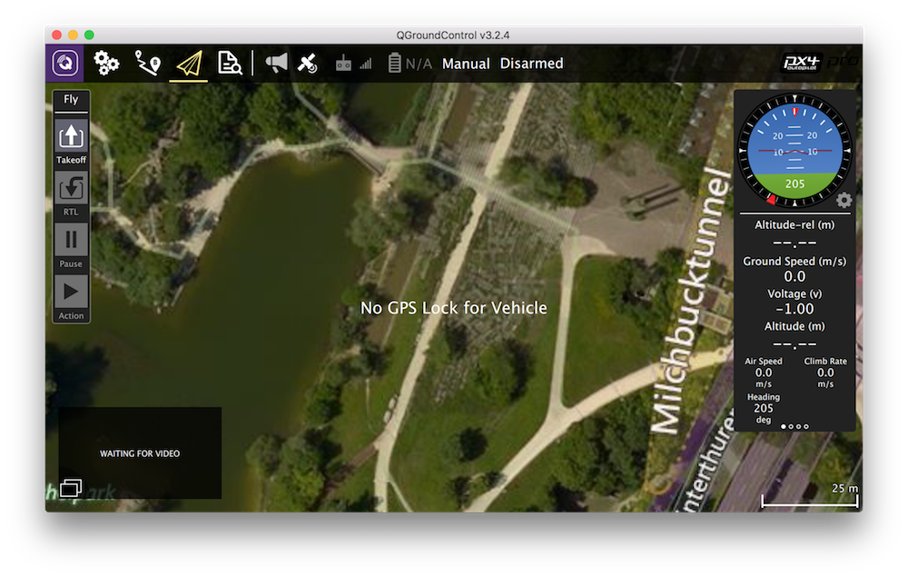

Using QGroundControl via Wi-Fi
===



You can monitor, control, calibrate and configure the flight controller of the quadcopter using QGroundControl via Wi-Fi.
This requires [connecting to Wi-Fi](wifi.md) of the `clover-xxxx` network.

After that, in the Clover launch-file `/home/pi/catkin_ws/src/clover/clover/launch/clover.launch`, choose one of the preconfigured bridge modes.

After editing the launch-file, restart the `clover` service:

```(bash)
sudo systemctl restart clover
```

TCP bridge
---

Change parameter `gcs_bridge` in the launch file:

```xml
<arg name="gcs_bridge" default="tcp"/>
```

Then in the QGroundControl program, choose Application Settings > Comm Links > Add. Create a connection with the following settings:


Then choose the created connection from the list of connections, and click "Connect".

UDP bridge (with automated connection)
---

Change parameter `gcs_bridge` in the launch file:

```xml
<arg name="gcs_bridge" default="udp-b"/>
```

After opening the QGroundControl application, the connection should be established automatically.

UDP bridge (without automated connection)
---

Change parameter `gcs_bridge` in the launch file:

```xml
<arg name="gcs_bridge" default="udp-b"/>
```

Then in the QGroundControl program, choose Application Settings > Comm Links > Add. Create a connection with the following settings:


Then choose the created connection from the list of connections, and click "Connect".

UDP broadcast bridge
---

> **Hint** The feature of the UDP broadcast bridge is the ability to view drone telemetry simultaneously from multiple devices (e.g., a phone and a PC). It is also well suited for devices networking using a router.

Change parameter `gcs_bridge` in the launch file:

```xml
<arg name="gcs_bridge" default="udp-b"/>
```

After opening the QGroundControl application, the connection should be established automatically.

**Next**: [Remote access using SSH](ssh.md)
