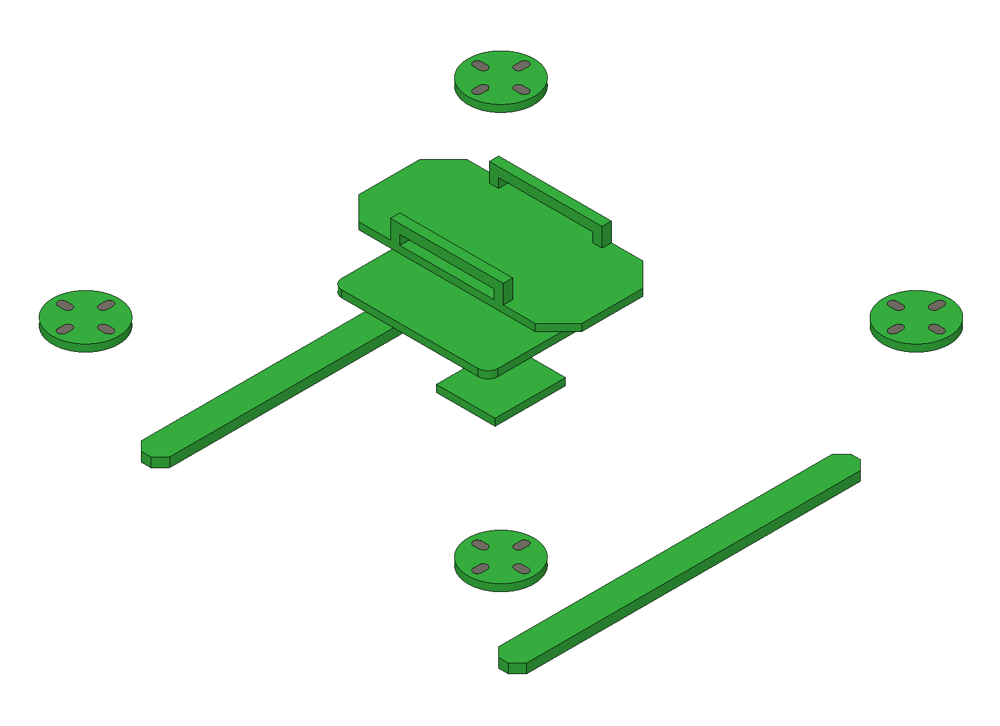
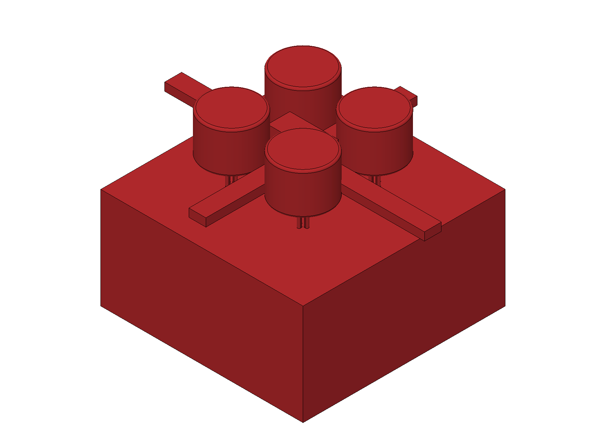
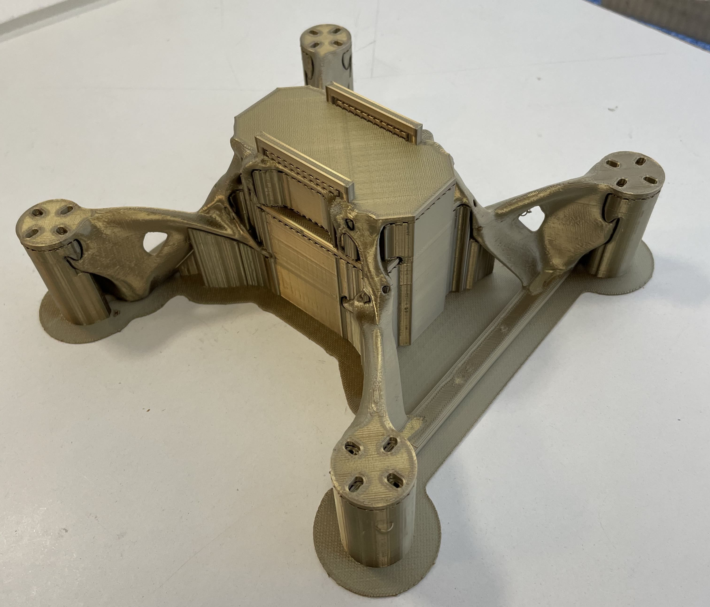
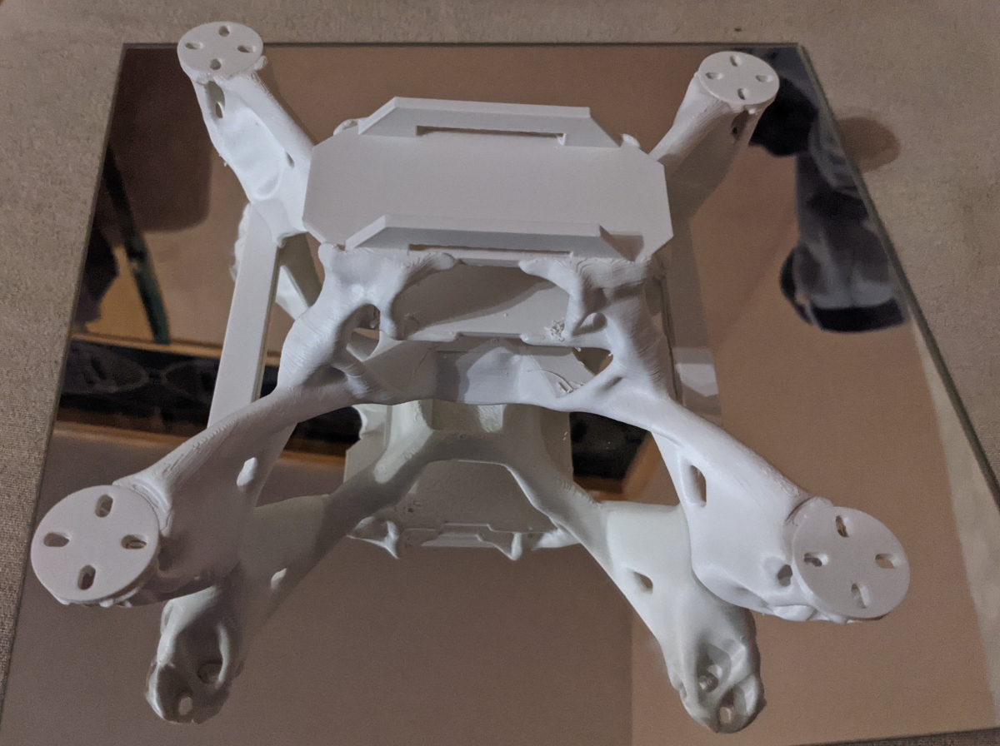
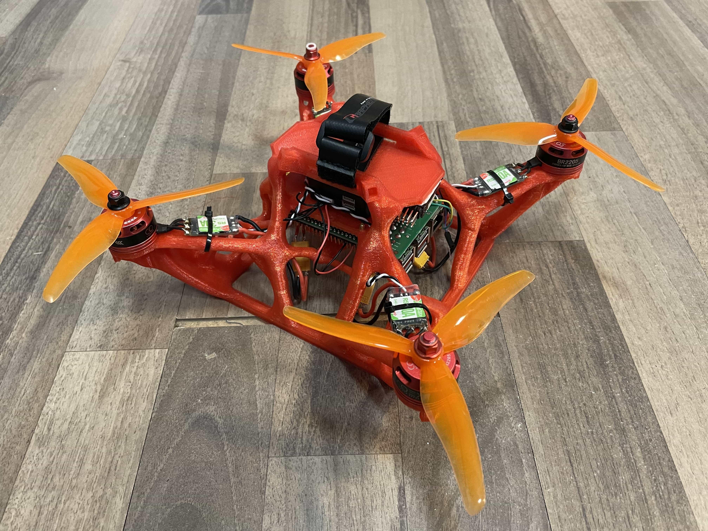

###ADDI Copterhack 2021 Project

<iframe width="640" height="480" src="https://www.youtube.com/embed/EAGNmtpuTDc" frameborder="0" allow="accelerometer; autoplay; encrypted-media; gyroscope; picture-in-picture" allowfullscreen></iframe>
# 3D-printed Generative Design Frame

At the Aachen Drone Development Initiative we aim to develop a new frame for the clover drone by implementing the latest state of the art CAD-Design techniques as well as advanced manufacturing methods.

Three main goals have to be taken into consideration when designing a new frame:
- Decreasing the Weight
- Improving Durability
- Increasing Safety 

For the first stage of the design we will focus on the first two points.

##Software
For designing our drone we use Autodesk Fusion 360. It comes with a generative design feature. This makes it possible to create rule-driven designs. First the preserved geometry is defined. Usually this includes all kinds of mounts like motor mounts, flight controller mounts, RPi mount etc. Then obstacle geometry is defined. This for example includes space for the propellers and the airflow. After that forces are defined. Then Fusion 360 will automatically calculate optimal connections for the aforementioned preserved geometry.

  
   
  

###Prototypes

####Prototype 1
After printing the first version of the frame we discovered the following problems:
- Bad Filament: Layer Adhesion of the Filament was quite bad resulting in a not very rigid model
- Support Structure: The support structure for the frame is very complex and the parameters used in the slicer resulted in it being unable to be removed without destroying the model
- Arm Strength: Some parts of the arms to the motor mounts were very thin, resulting in them breaking easily and removing the support structure resulted in breaking them
To conquer those problems we made several changes. We increased the minimal thickness for the generated structures and generated a new model. We changed the settings in the slicer so that the support structure could be removed easier as well as changed the infill structure. Finally we changed the filament and increased the printing temperature. Further we concluded that printing with a water dissolvable support structure would be optimal, however as of right now we don’t have access to a printer capable of that.

####Prototype 2
This prototype took 48 hours of printing and used 277 grams of filament including 100 grams for the support. Installation of the components is very easy as no other tools than a screwdriver are needed. This prototype was the first to take flight in January 2021. Please see [this](https://youtu.be/M4f8_JmJADM) video.

  
   
   

####Prototype 3
This prototype is even more optimised than the last one. Excluding support the model only weighs 141 grams. For this version we have also developed a prop guard, which weighs around 80 grams. Weight of the drone with the prop guard and a 2200mah battery is under 700 grams. Flight testing in the following videos shows the effectiveness of the prop guard. We also did some drop tests with this model and figured that a drop height of around 1 meter can be sustained. We plan to optimise this while sacrificing a bit of weight in February.

Videos:
- https://youtu.be/uJjnMzz1Nm0 
- https://youtu.be/UdnqIuXV2UI

  
   
  

#### Final Prototype
In this final prototype we have changed the preserved geometry on the bottom to form a rectangle for added stability. We have also changed some of the forces on the points we observed breakings in our previous tests. We have also updated the prop guard to make it more stable and increased the area around the screws, so it would break harder. The frame without the prop guard weighs only 150g making it significantly lighter than the default frame.

###Benefits
We see the following benefits with our design over the traditional clover frame design
- Tools needed for production: only a 3D printer is needed compared to laser cutter, cnc and 3D printer
- Single material reduces supply chain complexity and reduces cost. Filament is cheap and only around 400 grams are needed for the full frame and the prop guard. This should reduce the cost to under $5.
- The unibody design saves weight and much less screws are needed. This also reduces costs.
- Easier adaptability: Anybody can change the frame to their desire and include their own adapters and mounts. It can be printed by any standard sized 3D printer. (Ender-3, Prusa etc.)
- Manual labor reduced: Printing is easy to automate, packing is significantly reduced as less screws need to be counted etc.

###Conclusion
In our work for this years competition we presented a new way to design and manufacture drone frames. By utilizing state of the art methods of CAD programs we are able to optimize the weight and shape of drone frames in a way that for the first time it is feasible to 3D print them. In total we have printed around 10 frames and presented a few of them above and the challenges we faced with them. This iterative process to frame design was only possible due to the fact that only a 3D printer is needed and the filament being very cheap. Due to the open source nature of the project and this report giving a short introduction into generative design, we hope that many people feel inspired to check out this new method of designing and producing drone frames.

###CAD Files
You are welcome to test out these frame yourself and you are free to modify them in any way, shape or form. We would appreciate feedback and encourage submitting your modifications in a pull request so other people can benefit from this open source development.
The CAD Files can be found on our Github Page: https://github.com/Aachen-Drone-Development-Initiative/generative-clover-frame

