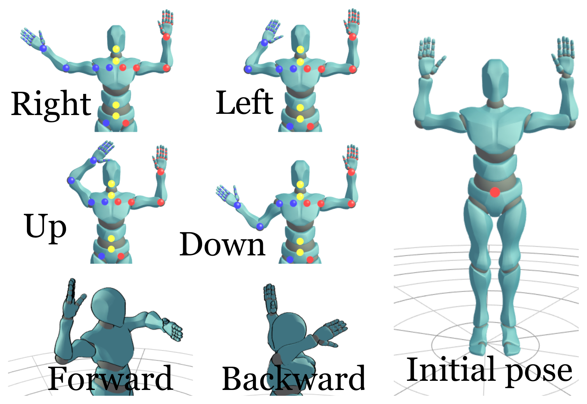

# Human Pose Estimation drone control

## Introduction

Human pose estimation is one of the computer vision applications in order to estimate all the joints and the different poses of the human body through a special camera and a special hardware or process the images from a regular camera by machine learning and deep learning techniques. This project is about controlling the drone through the poses of a person in front of regular camera without needing to an external hardware or hard build dependencies on your computer.

## Demo

<iframe width="770" height="421" src="https://www.youtube.com/embed/ucPONeHg2lk" frameborder="0" allow="accelerometer; autoplay; encrypted-media; gyroscope; picture-in-picture" allowfullscreen></iframe>

<iframe width="853" height="480" src="https://www.youtube.com/embed/EDcTtPLxzoU" frameborder="0" allow="accelerometer; autoplay; encrypted-media; gyroscope; picture-in-picture" allowfullscreen></iframe>

In the demo video, we were using Ubuntu 18.04 and clever4 drone.

## Development

We used posenet from tensorflow.js as our human pose estimation module because it is easier to use, build, fast and compatible with different environments(Hardware and OS). You can find the work of posenet for this project [here](https://github.com/hany606/tfjs-posenet). Websockets were used as communication protocol between the browser and a running server on the drone.

## Architecture

The image below is a visualization of our architecture for the project.


This figure is made from [here](https://www.draw.io/)

## Dependencies

Before you test it you need to install on your laptop:

- Install Nodejs from [here](https://nodejs.org/en/download/). For [Ubuntu installation](https://tecadmin.net/install-latest-nodejs-npm-on-ubuntu/)
- Install Yarn package manager from [here](https://yarnpkg.com/lang/en/docs/install/). [Usual problem](https://github.com/yarnpkg/yarn/issues/3189) while installing and using yarn with Ubuntu.
- Have an experience in manual control on the drone in case of any weird behavior happen.
- Worked before with COEX drones, if this is your first time to work with COEX drones check [this](https://clover.coex.tech/en/).

and you are ready to build and use the required codes.

## Setup & installation

### In your main laptop

#### (It has been tested until now only on Ubuntu 18.04)

- Clone the repo of posenet in your computer or download it if you are using Windows without GitHub

```sh
git clone https://github.com/hany606/tfjs-posenet.git
```

- Do the steps of running and setup as it is described in the README [here](https://github.com/hany606/tfjs-posenet/tree/master/posenet)

### In the Raspberry Pi of the drone (Main controller)

- Access the Raspberry Pi
- [Switch to Client mode](network.md) and ensure that the network has internet connection.

Notice: I have already made a bash script based on that tutorial, it is in COEX-Internship19/helpers/ called .to_client.bash
To run it:

```sh
chmod +x .to_client.bash
./.to_client <NAME_OF_NETWORK> <PASSWORD>
```

- Install the tornado library to make a WebSocket server

```sh
sudo pip install tornado
```

- Clone the main repo on the Raspberry Pi of the drone

```sh
git clone https://github.com/hany606/COEX-Internship19.git
```

- Go to the project directory

```sh
cd COEX-Internship19/projects/Human_pose_estimation_drone_control/
```

- Run the server to test that everything is correct and run the posenet, you should see a lot of data is printed in the terminal (if you are running the human pose estimation code on your main computer, just refresh the page in the browser after running the below command in Raspberry Pi)

```sh
python websocket_server_test.py
```

- Close the server using Ctrl+C
- To run the main file

```sh
python main_drone.py
```

## How to use it

- Run the server first from the Raspberry Pi from the correct directory

```sh
python main_drone.py
```

- Run Human pose estimation module on your laptop with WebSocket by

```sh
yarn websocket
```

Or refresh the page if you already run it.

- You should see the instructions on the screen of the terminal of the Raspberry Pi right now.
- Firstly, you should be visible for the camera and it is better to have a clear background without many details.
- Secondly, you should do initial pose as it is described in the images below.
- You can perform any pose and try to keep it until your drone finish doing this move that is corresponding to the pose.
- After you do the pose return to the initial pose in order to give the drone the command to listen to another pose.
- If you want to stop the program, land the drone and don't return to the initial pose and press Ctrl+C to stop the drone.

## Poses



Animation is created by [this](https://justsketchme.web.app/)

## Notes

- Websockets are used to communicate between the page on the browser that runs posenet and the drone.
- As the model of posenet is already pre-trained and using tensorflow.js. So, it is quite fast and can run on different computers without any problems thanks to yarn, parcel and tensorflow.js, and we have configured the code of posenet to the minimal configuration to not require a lot of computation power.
- This project has been built in 1 week of working, it took a lot of time trying to make openpose and google colab working but unfortunately I had many errors and one I decided to move to posenet everything was pretty easy.
- If you have any comments about the codes to try to improve it, I will be happy if you can contact me through telegram: @hany606 or email: h.hamed.elanwar@gmail.com or do pull requests.
- If you have implemented any of the applications below, or do some improvements, we will be very happy for that.

## Future application

- [Drone wars](https://web.facebook.com/COEXDrones/photos/pcb.1129309377266616/1129308437266710/?type=3&theater): Control the drone during the drones battle using human poses. It requires high speed interaction and more precise control.
- Control a drone that draw graffiti using human poses and draw in real-time.
- Playing with balls like ping pong game with the drones. It may require 3D Human Pose estimation Algorithms.
- Control two drones by your arms and do some task together.

## Acknowledgments

- This project was part of an internship in COEX in July 2019. if you found any bugs or problems, you can contact me through telegram: @hany606 or email: h.hamed.elanwar@gmail.com.
- The above applications were thought by me and my internship supervisor Timofey.

## References

- [Human pose estimation guide](https://blog.nanonets.com/human-pose-estimation-2d-guide/)
- [Clover drones tutorials](https://clover.coex.tech/en/)
- [Posenet GitHub repo](https://github.com/tensorflow/tfjs-models/tree/master/posenet)
- [Posenet meduim article](https://medium.com/tensorflow/real-time-human-pose-estimation-in-the-browser-with-tensorflow-js-7dd0bc881cd5)
- [Tensorflow.js demos](https://www.tensorflow.org/js/demos)
- [Posenet overview](https://www.tensorflow.org/lite/models/pose_estimation/overview)
