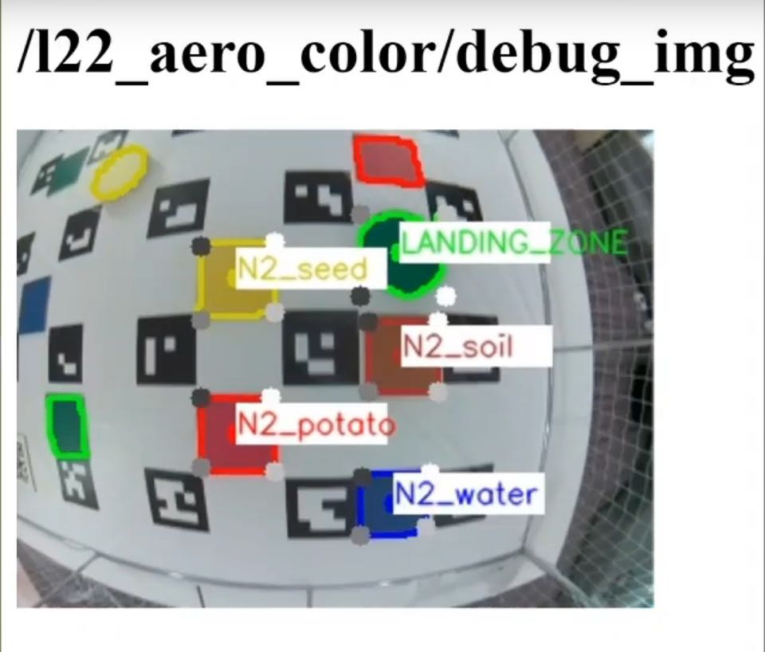
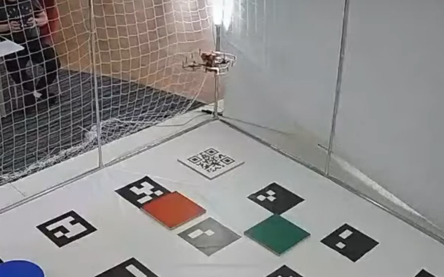

# Innopolis Open 2020 - L22_ÆRO team

## Team

* [Yuryev Vasily](https://vk.com/vasily_0x59).
* [Okoneshnikov Dmitriy](https://vk.com/okoneshdmitriy).

## Final task description

New technologies are being implemented into various sectors of the economy including agricultural industry. Drones or UAV are no exception. Thanks to their usage, assessment of agricultural territories' states and analysis of landscape components became more effective and accessible.


The final task of Innopolis Open 2020 was dedicated to monitoring agricultural territories and consisted of the following elements:

* Takeoff (from QR-code) and landing (onto a small colored marker).
* QR-code recognition.
* Colored objects recognition (Colored markers were used to show "agricultural territories").
* Determination of their coordinates (their locations change).
* Making a report using the gathered data.

## Code

The code is available on GitHub: https://github.com/vas0x59/ior2020_uav_L22_AERO.

## Main program

When implementing the code, in the original concept we used our own message types, multiple nodes, and other ROS stuff. For this you need to create a package and compile it, but due to the specifics of the competition (a single SD card was used for all teams), all the code was merged into a single file. This approach made debugging much more difficult, but running the code on the drone became much easier.

Parts of the program:

1. Takeoff.
2. QR-code recognition.
3. Color markers recognition.
4. Landing.
5. Generating a report and a video.

The final coordinates of markers are automatically grouped and averaged data from the recognition system received for the entire flight. The "Zig-zag" trajectory was chosen to cover the entire territory. The Gazebo simulator is used for debugging.

## Color markers

`l22_aero_vision/src/color_r_c.py`

For image processing and object detection, we used functions from the OpenCV library.

Algorithm:

1. Receiving the image and camera parameters.
2. Building a mask based on a specific color range (in HSV format).
3. Detection of contours of colored objects.
4. Determining the object type, getting the key points of the object in the image.
5. Determining the position of squares and circles using solvePnP based on the actual size of objects and key points in the image ([OpenCV Docs](https://docs.opencv.org/3.4/d9/d0c/group__calib3d.html#ga549c2075fac14829ff4a58bc931c033d)).
6. Sending results to the topics `/l22_aero_color/markers`  and  `/l22_aero_color/circles` (coordinates relative to `main_camera_optical` frame).

During the development, our own message types and a service for changing the detector parameters during the landing were created. (`ColorMarker`, `ColorMarkerArray`, `SetParameters`).

To convert the position of colored objects into `aruco_map` frame TF library was used. ([http://wiki.ros.org/tf](http://wiki.ros.org/tf))

Due to distortions at the edges of the image from the fisheye lens, all the recognized contours located near the edge of the image are ignored. This filter is disabled during landing. The object type is determined using the contour analysis functions  (`approxPolyDP` - number of vertexes; `minAreaRect`, `contourArea` - area of bounding rect / area of the contour; `minAreaRect` - aspect ratio).



Examples of marker recognition:

<iframe width="600" height="360" src="https://www.youtube.com/embed/kCW87RTA838" frameborder="0" allow="accelerometer; autoplay; encrypted-media; gyroscope; picture-in-picture" allowfullscreen></iframe>

## Visualization in RViz

`l22_aero_vision/src/viz.py`

To debug object recognition, a script has been created that visualizes the coordinates of markers in the RViz utility.

<iframe width="560" height="315" src="https://www.youtube.com/embed/6xJ33UD-NfE" frameborder="0" allow="accelerometer; autoplay; encrypted-media; gyroscope; picture-in-picture" allowfullscreen></iframe>

## QR-code



The PyZbar library was used to perform the QR-code recognition. In order to improve the accuracy of QR-code recognition, flights around the QR-code were performed at low altitude.

## Landing

Landing is performed in 3 stages:

1. Flight to the intended landing zone and hovering at an altitude of 1.5 m.
2. Descending to a height of 0.85 m with 3 adjustments to the marker coordinates relative to `aruco_map` frame.
3. Descending for several seconds with adjustments based on the coordinates of the landing marker in `body` coordinate system (since ArUco-markers may no longer be visible), instead of `navigate`,`set_position` is used.

<iframe width="560" height="315" src="https://www.youtube.com/embed/8nVGoWkdYcA" frameborder="0" allow="accelerometer; autoplay; encrypted-media; gyroscope; picture-in-picture" allowfullscreen></iframe>

## Gazebo

Due to limitations of opportunities to test the code on a real drone, we decided to use the Gazebo simulator.

To run the Clover software package in the simulator, you can use [this set of scripts](https://github.com/vas0x59/clever_sim) or [original instruction from PX4](https://dev.px4.io/v1.9.0/en/simulation/ros_interface.html).

For Innopolis Open we have prepared several test scenes.  [ior2020_uav_L22_AERO_sim](https://github.com/vas0x59/ior2020_uav_L22_AERO_sim).

Also, the use of the simulator accelerated the debugging of the full code execution, since the launch was performed with real time factor = 2.5.


During testing, some problems were found (e.g. incorrect position of `aruco_map`) while using distortion in the camera plugin, so the simulator used a Pinhole camera (without any distortions from the lens).

## ROS

Created nodes, topics, messages and services.

### Nodes

* `l22_aero_vision/color_r_c.py` - recognition of colored objects.
* `l22_aero_vision/viz.py` - visualization in RViz
* `l22_aero_code/full_task.py` - main code.

### Topics

* `/l22_aero_color/markers` (`l22_aero_vision/ColorMarkerArray`) - list of rectangular markers.
* `/l22_aero_color/circles` (`l22_aero_vision/ColorMarkerArray`) - list of round markers.
* `/l22_aero_color/debug_img` (`sensor_msgs/Image`) - image for debugging.
* `/qr_debug` (`sensor_msgs/Image`) - image for debugging.

### Messages

#### `ColorMarker`

```
string color
int16 cx_img
int16 cy_img
float32 cx_cam
float32 cy_cam
float32 cz_cam
float32 size1
float32 size2
int16 type
```

#### `ColorMarkerArray`

```
std_msgs/Header header
l22_aero_vision/ColorMarker[] markers
```

### Services

#### `SetParameters`

```
float32 rect_s1
float32 rect_s2
float32 circle_r
int32 obj_s_th
int32 offset_w
int32 offset_h
---
```
