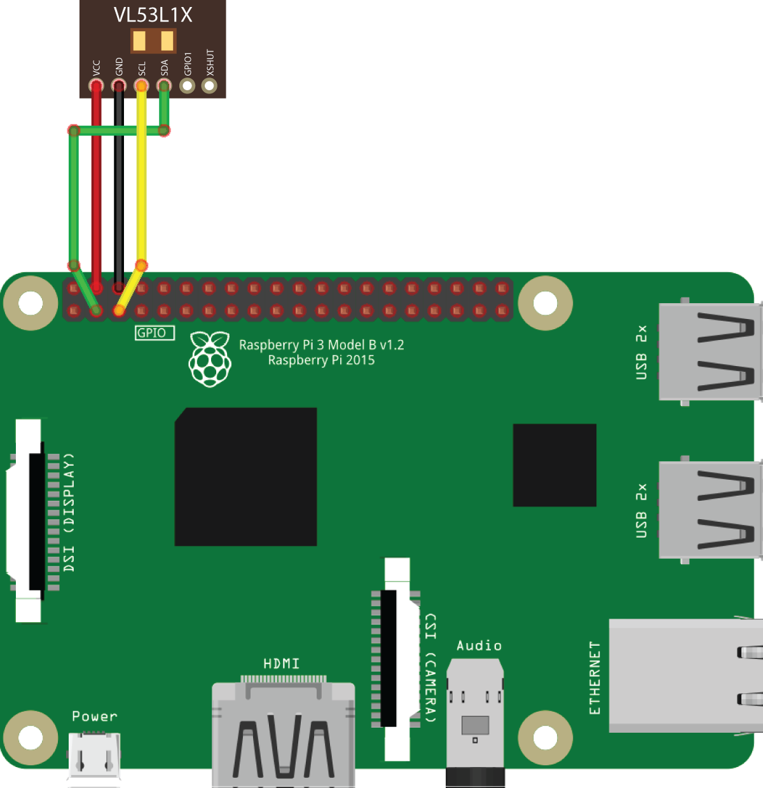
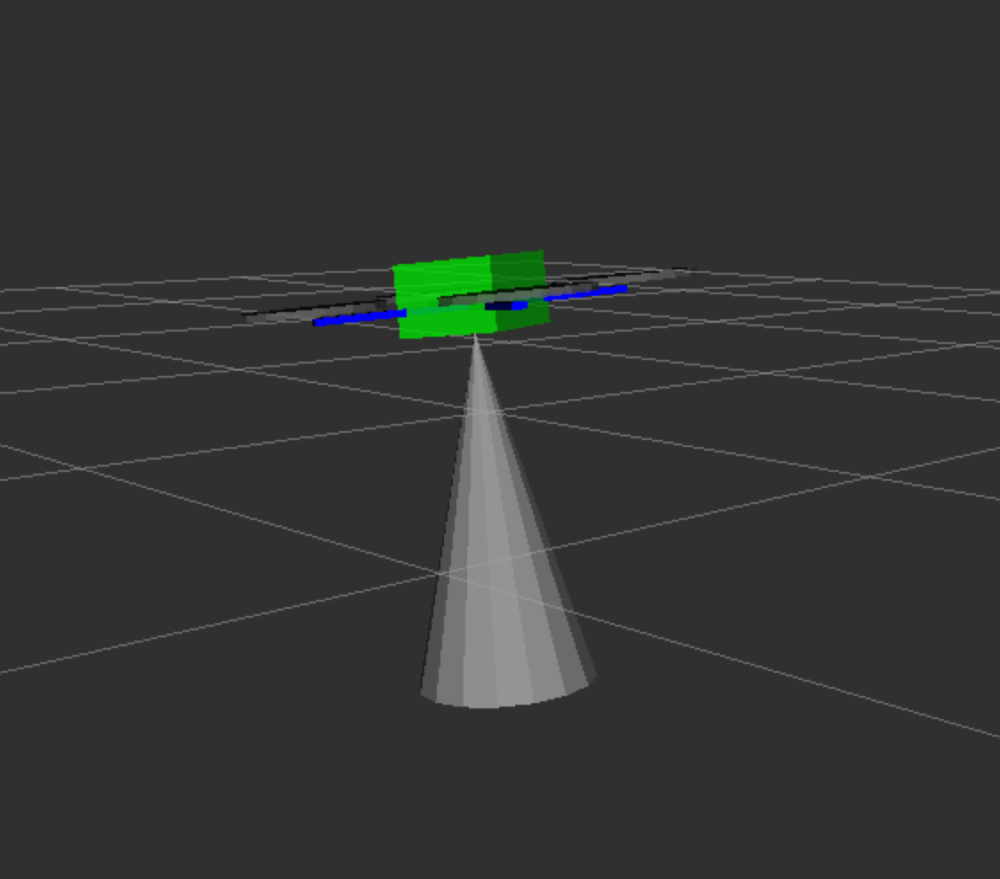

# Working with a laser rangefinder

> **Note** Documentation for the [image](image.md), versions, starting with **0.20**. For older versions refer to [documentation for version **0.19**](https://github.com/CopterExpress/clover/blob/v0.19/docs/en/laser.md).

## VL53L1X Rangefinder

The rangefinder model recommended for Clover is STM VL53L1X. This rangefinder can measure distances from 0 to 4 m while ensuring high measurement accuracy.

The [image for Raspberry Pi](image.md) contains pre-installed corresponding ROS driver.

### Connecting to Raspberry Pi

> **Hint** Before using the rangefinder, please remove the protective film from it.

Connect the rangefinder to the 3V, GND, SCL and SDA pins via the I²C interface:



If the pin marked GND is occupied, you can use any other ground pin (look at the [pinout](https://pinout.xyz) for reference).

> **Hint** You can connect several peripheral devices via the I²C interface simultaneously. Use a parallel connection for that.

### Enabling the rangefinder

[Connect via SSH](ssh.md) and edit file `~/catkin_ws/src/clover/clover/launch/clover.launch` so that the VL53L1X driver is enabled:

```xml
<arg name="rangefinder_vl53l1x" default="true"/>
```

By default, the rangefinder driver sends the data to Pixhawk via the `/rangefinder/range` topic. To view data from the topic, use the following command:

```bash
rostopic echo /rangefinder/range
```

### PX4 settings

> **Hint** We recommend using our [custom PX4 firmware for Clover](firmware.md#modified-firmware-for-clover) for best laser rangefinder support.

PX4 should be properly [configured](px4_parameters.md) to use the rangefinder data.

Set the following parameters when EKF2 is used (`SYS_MC_EST_GROUP` = `ekf2`):

* `EKF2_HGT_MODE` = `2` (Range sensor) – for flights over horizontal floor;
* `EKF2_RNG_AID` = `1` (Range aid enabled) – in other cases.

Set the following parameters when LPE is used (`SYS_MC_EST_GROUP` = `local_position_estimator, attitude_estimator_q`):

* The "pub agl as lpos down" flag should be set in the `LPE_FUSION` parameter – for flights over horizontal floor.

### Receiving data in Python

In order to receive data from the topic, create a subscriber:

```python
import rospy
from sensor_msgs.msg import Range

rospy.init_node('flight')

def range_callback(msg):
    # Process data from the rangefinder
    print('Rangefinder distance:', msg.range)

rospy.Subscriber('rangefinder/range', Range, range_callback)

rospy.spin()
```

Also it's possible to read one rangefinder measurement at a time:

```python
from sensor_msgs.msg import Range

# ...

data = rospy.wait_for_message('rangefinder/range', Range)
```

### Data visualization

You may use rqt_multiplot tool to plot rangefinder data.

rviz may be used for data visualization. To do this, add a topic of the `sensor_msgs/Range` type to visualization:



Read more [about rviz and rqt](rviz.md).

<!--
### Connecting to Pixhawk / Pixracer

Support for rangefinder VL53L1X is not yet implemented in the PX4 firmware (in version *1.8.2*).
-->
