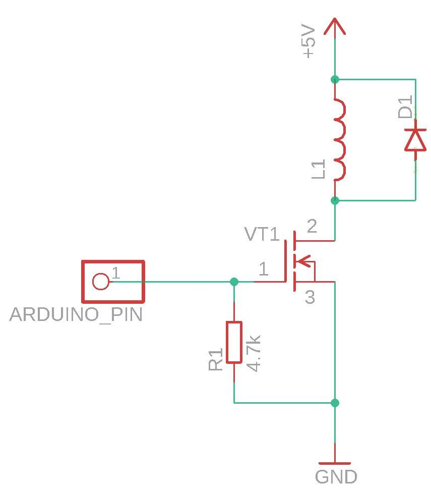
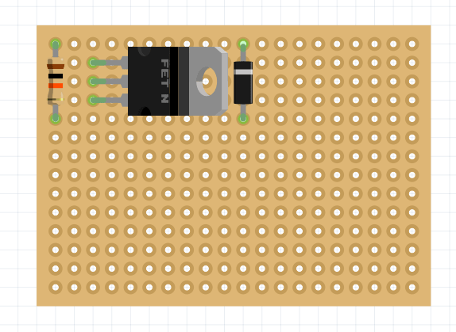
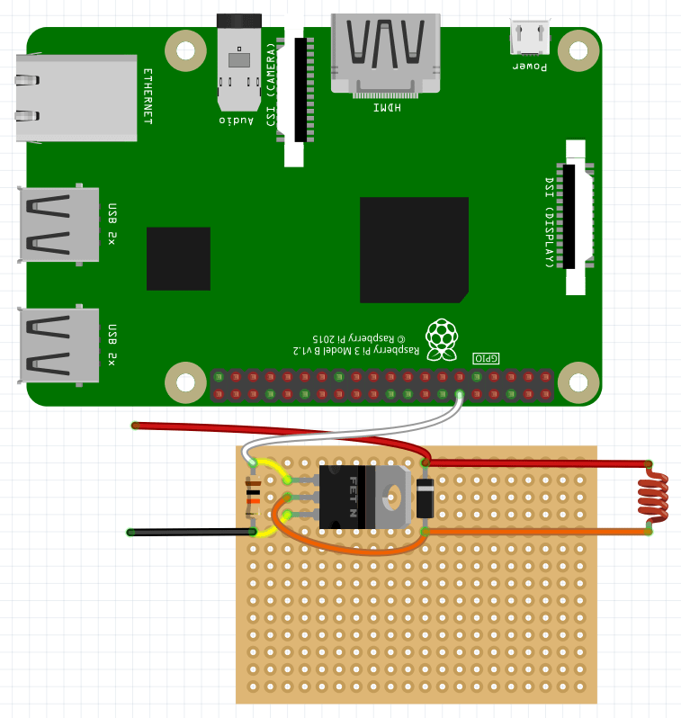
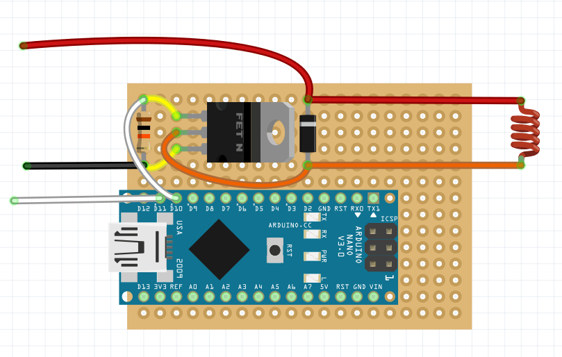

# Assembling and setting up the electromagnetic gripper

The magnetic gripper can be assembled in various ways according to the wiring diagram.



The following is an example of assembling an electromagnetic capture circuit on a breadboard.

> **Info** It is recommended to lay the wiring between the elements on the back side of the board (in the following images, the wiring is done over the diagram for illustrative purpose).

1. Place the Schottky diode, 10K resistor, and transistor on the soldering board.

    

2. Solder the contacts on the other side of the board and bite off the remaining element legs.
3. Connect the pins of the resistor and the two outer legs of the transistor.

    

4. Connect the center leg of the transistor and the leg of the Schottky diode (opposite to the gray marking strip).

    

5. Cut the required amount of magnetic grab wire and solder it to the pins of the Schottky diode.

    

6. Solder the *Dupont* - male wires to the transistor and diode leg (red, black wires), and the *Dupont* - fmale wire to the opposite transistor leg (white wire).

    

## Checking the operation of the electromagnetic gripper

In order to check the operation of the gripper, apply a voltage of 5V to the signal wire. You can use the *Dupont* dad-dad wire for that.


After applying voltage, the magnet should turn on.

## Connecting to Raspberry Pi

Connect the magnetic gripper to a Raspberry Pi for software activation.



An example of the code activating the magnetic gripper can be found [here](gpio.md#connecting-an-electromagnet).

## Connecting to Arduino

Connect the gripper to the Arduino Nano board in order to control it manually.

It is convenient to place it on the same soldering board — insert it into the appropriate holes and solder it from the back to the board.


Then connect the signal output of the circuit to the selected port and solder the *Dupont* female wire to the selected signal port on the board.



## Installation of electromagnetic gripper

1. Install an electromagnet into the center hole on the gripper deck.
2. Use a zip tie to pull the assembled circuit to the back of the deck.
3. Plug the Arduino *D11* signal pin into one of the *AUX* pins on the flight controller.
4. Plug the power wire of the electromagnetic gripper to JST 5V.

## Setting up electromagnetic gripper

To control the magnet through Arduino Nano, use the following code:

```cpp
void setup() {
  pinMode(11, INPUT);
  pinMode(13, OUTPUT);
}

void loop() {
  if (int duration = pulseIn(11, HIGH) > 1200) {
    digitalWrite(13, HIGH);
  } else {
    digitalWrite(13, LOW);
  }
}
```

To monitor the status of the electromagnetic gripper, you can connect the *ws281x* LED strip (included to Clover kit). Connect it to power +5v – 5v, ground GND – GND, and signal wire DIN – Arduino D12.

To control the magnet and monitor it using the LED strip, use the following code:

```cpp
#include <Adafruit_NeoPixel.h>
#define NUMPIXELS 72
#define PIN 12
int pin = 11;
int led = 13;

unsigned long duration;
Adafruit_NeoPixel strip (NUMPIXELS, PIN, NEO_GRB + NEO_KHZ800);

void setup() {
  strip.begin();
  strip.setBrightness(10);
  Serial.begin(9600);
  pinMode(pin, INPUT);
  pinMode(led, OUTPUT);
}

void loop() {
  duration = pulseIn(pin, HIGH);
  Serial.println(duration);
  delay(100);
  if (duration >= 1500) {
    digitalWrite(led, HIGH);
    for (int i = -1; i < NUMPIXELS; i++) {
      strip.setPixelColor(i, strip.Color(255, 0, 0));
      strip.show();
    }
  } else {
    digitalWrite(led, LOW);
    for (int i = -1; i < NUMPIXELS; i++) {
      strip.setPixelColor(i, strip.Color(0, 255, 0));
      strip.show();
    }
  }
}
```
