# Assembling and setting up a mechanical gripper

1. Combine the main gripper plates.

    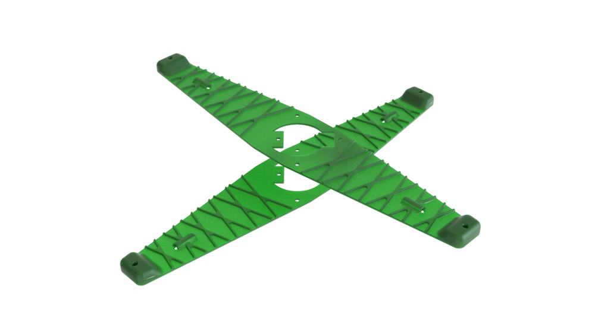

2. Install the servo in the appropriate groove in the center of the plates with the axle gear in the middle.

    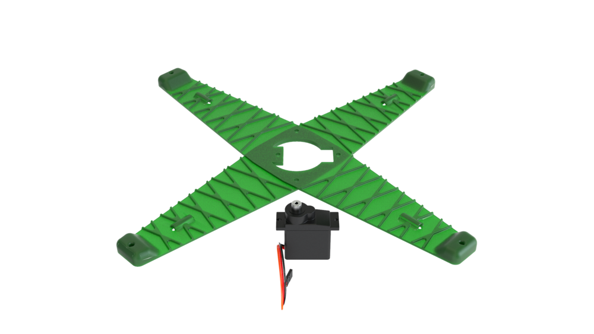

3. Hold down the gripper plates with the small spacers.

    

        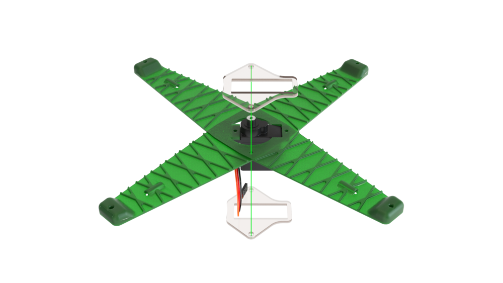
        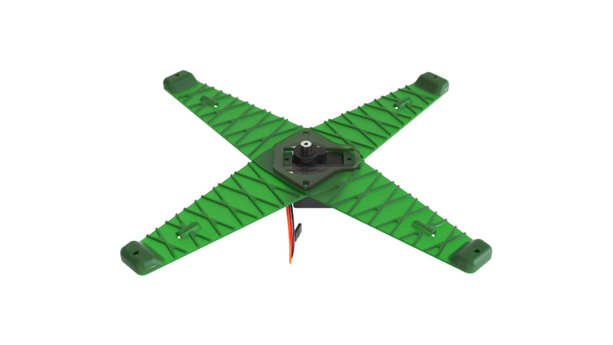
    

4. Install the gripper deck so that the mounting holes in the grapple correspond with the self-tapping holes in the plate.

    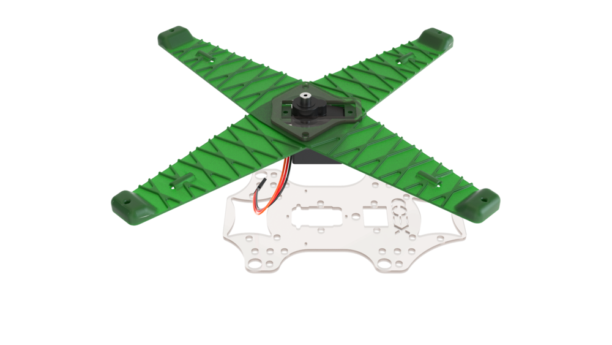

5. Fix the gripper structure with self-tapping screws.

    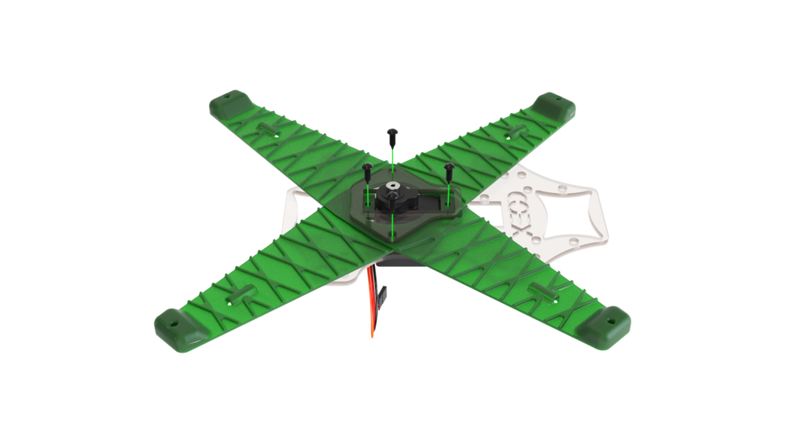

6. Turn the servo gear to the end position.

    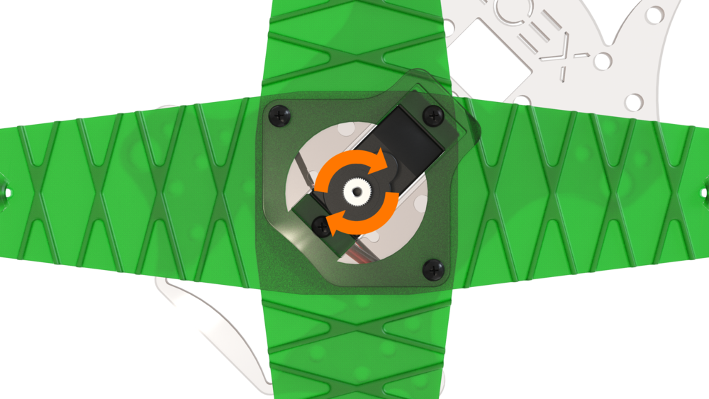

7. Install the cruciform mount onto the gear and secure it using the screw attached to the servo.

    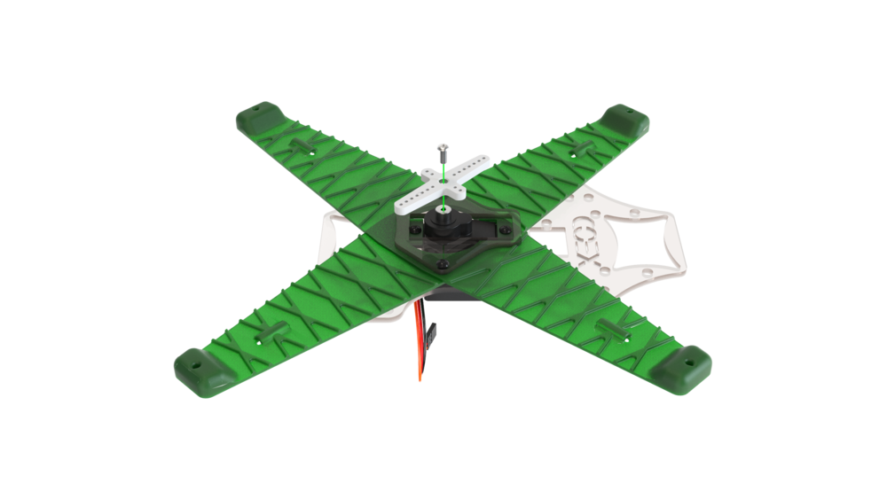

8. Cut the cruciform mount.

    

        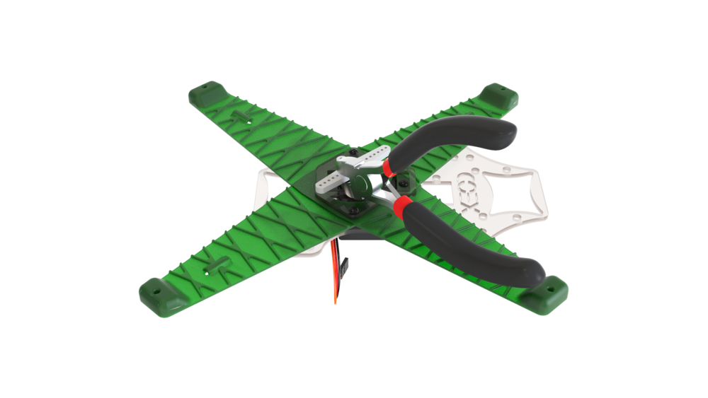
        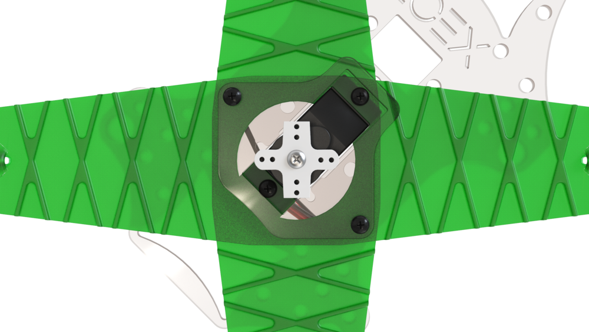
    

9. Tie the servo thread so that there is a 2 to 3 cm margin.

    

        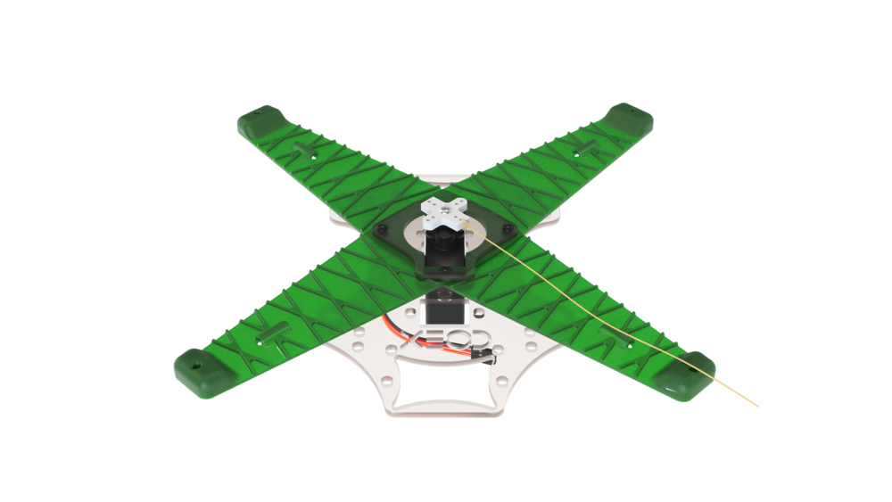
        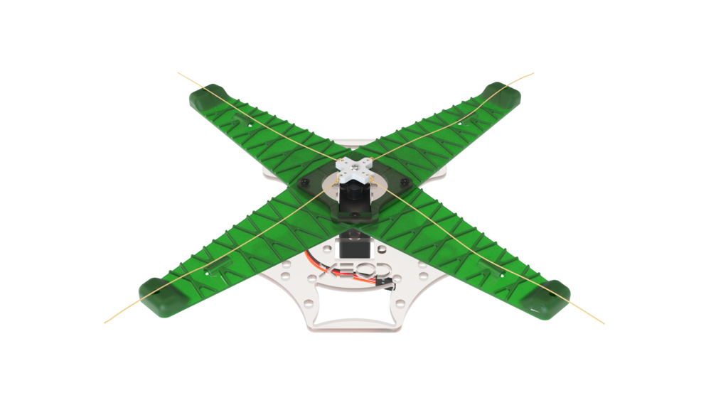
    

10. Thread the servo thread into the corresponding tensioning slots.

    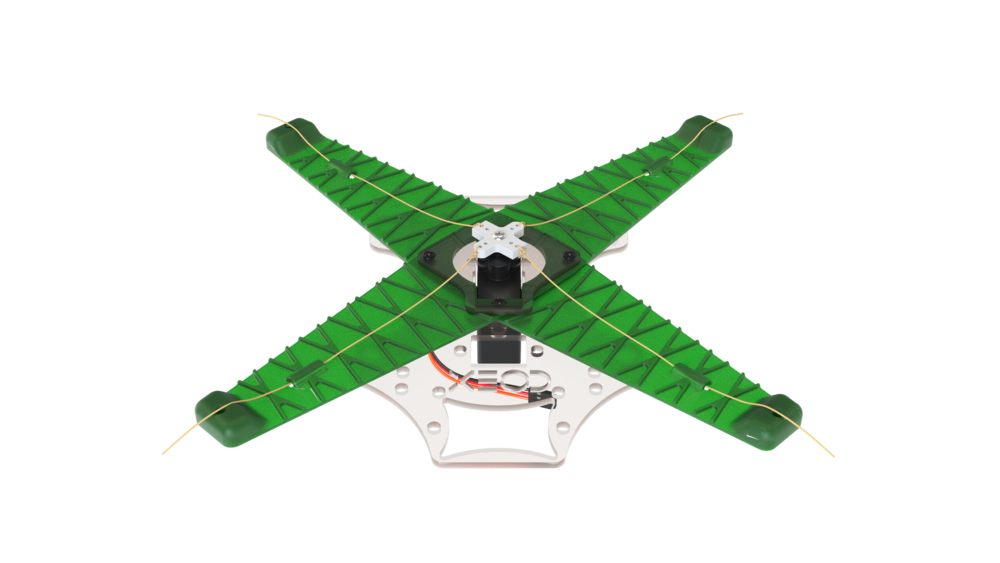

11. Fasten the grip claws with small self-tapping screws so that their angle is 25°–40°.

    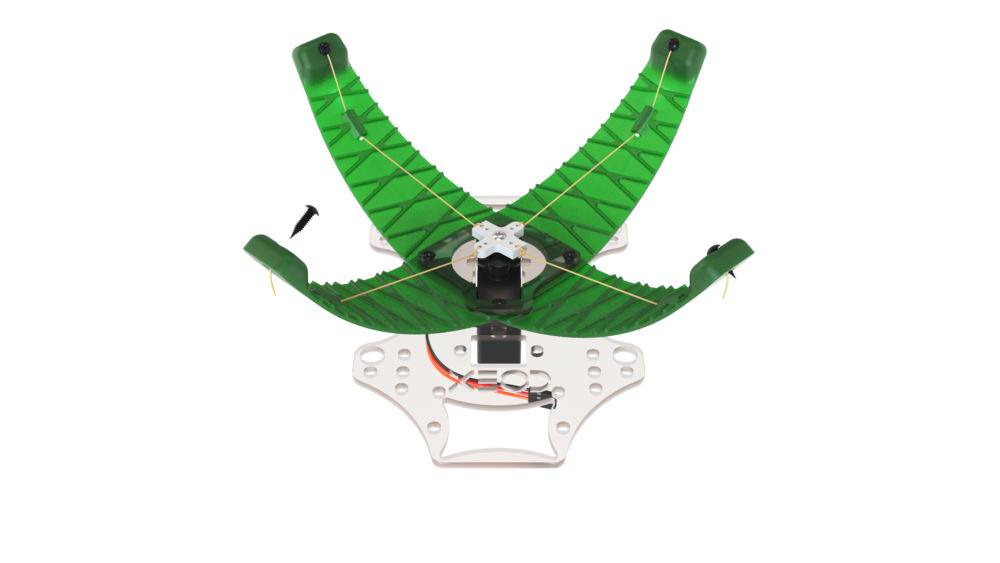

12. Install the assembled grip onto the aircraft from below.

    

        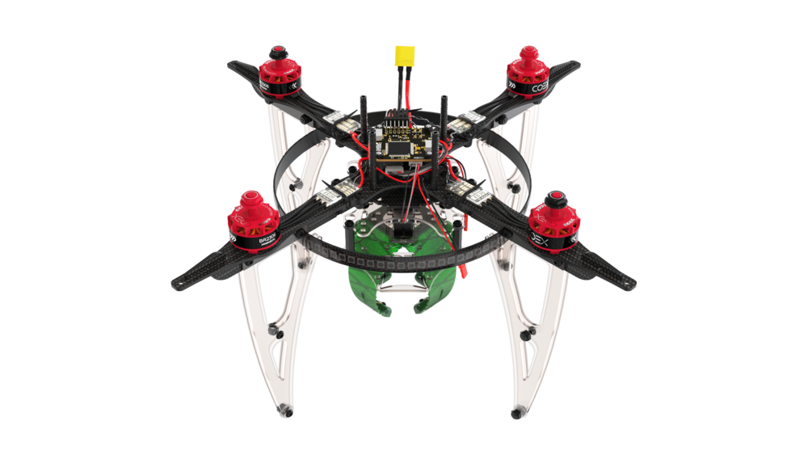
        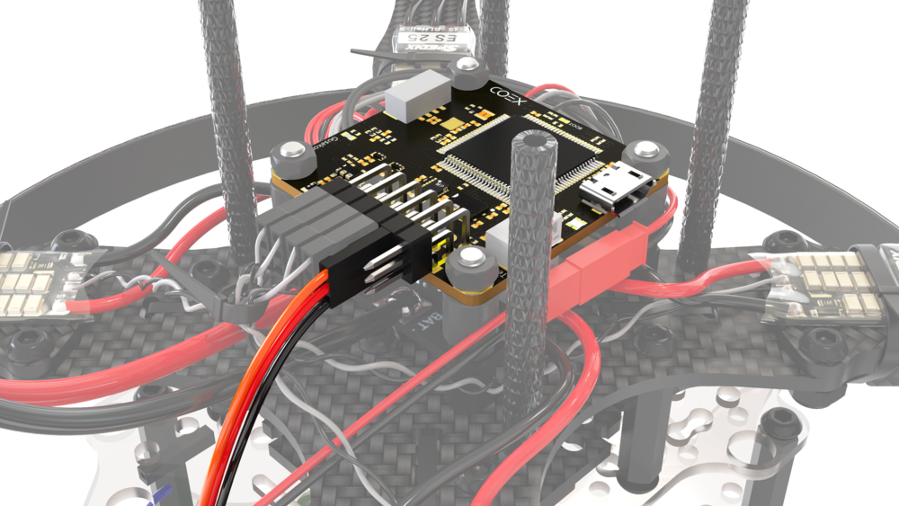
    

13. Insert the servo cable into the *AUX* 1-2 output on the flight controller.

    

14. Go to the *Radio* tab to control capture with the remote control.
15. In the *AUX 1/2 Passthrough RC channel* parameter, select the desired channel.
16. Now, when you switch the toggle switch of the corresponding channel, the capture will be closed or opened.
